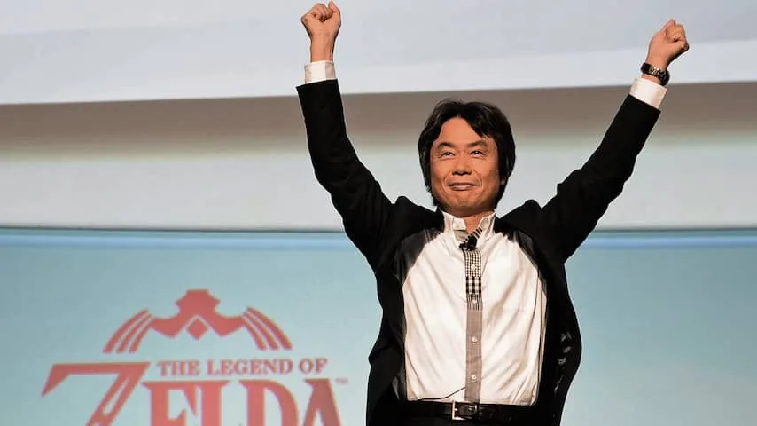

Mario is sinds de jaren '80 opgedoken in meer dan tweehonderd games. De virtuele loodgieter heeft in zijn loopbaan prinsessen gered, kartraces gewonnen, tenniswedstrijden gespeeld en heeft het zelfs af en toe opgenomen tegen personages uit andere gameseries.

> [!NOTE]
> Dit artikel verscheen eerder op [NU.nl](https://www.nu.nl/tech/4124451/30-jaar-super-mario-bros-de-sleutelfiguren-achter-mario.html).

De oorsprong en voortgang van een spelfiguur verloopt echter net iets anders dan de meeste mensen gewend zijn. Een personage uit een boek komt uit de geest van één schrijver en een filmheld wordt vertolkt door een enkele acteur, maar achter Mario schuilen inmiddels meerdere mensen.

Wie zijn er verantwoordelijk voor het succes van Mario en wie hebben hem door de jaren steeds meer kleur gegeven? We kijken naar de sleutelfiguren achter Nintendo's mascotte.

## Shigeru Miyamoto (1981)

Vier jaar voordat de eerste Mario-game zou verschijnen, bracht game-ontwerper Shigeru Miyamoto hem al tot leven. In de game _Donkey Kong_ nam Mario (toen nog 'Jumpman') het in ieder level op tegen Nintendo's reuzenaap, die bovenaan een groot bouwwerk een meisje gevangen hield.

_Shigeru Miyamoto — Beeld: AFP_

Het inmiddels iconische ontwerp van Mario werd uit pure noodzaak samengesteld. Computerhardware was nog niet geavanceerd genoeg om een mond vorm te geven, dus Mario kreeg een snor. Het animeren van haar bleek ook lastig, dus Mario kreeg een pet op. Om er vervolgens voor te zorgen dat zijn armbewegingen duidelijk waren, kreeg de gameheld ook meteen een overall aan.

## Takeshi Tezuka (1985)

Miyamoto wordt vaak genoemd als de vader van Mario, maar bij de eerste 'echte' Mario-game stond er nog een ontwerper aan het roer. In 1985 werkte Miyamoto samen met Takeshi Tezuka aan _Super Mario Bros_, het eerste spel dat de beproefde spelformule gebruikte.

Tezuka is minder prominent aanwezig in de media, maar heeft desalniettemin een gigantische invloed gehad op de ontwikkeling van Mario. Sinds de eerste _Super Mario Bros_ heeft hij een hand gehad in nagenoeg iedere platformgame met Mario in de hoofdrol, waaronder ook _Super Mario World_, _Super Mario 64_ en _Super Mario Sunshine_.

Bij veel van deze titels was Tezuka actief als compagnon van Miyamoto, waardoor de twee evenveel invloed hadden op de ontwikkeling.

## Koji Kondo (1985)

Hoewel hij geen prominent game-ontwerper is, heeft Koji Kondo een belangrijke rol vervuld bij de groei van Mario. Kondo is namelijk sinds de allereerste games verantwoordelijk voor de muziek achter het spel. Hij componeerde in 1985 de muziek voor _Super Mario Bros_, wat hem verantwoordelijk maakt voor ook het meest herkenbare Mario-deuntje ooit.

Sindsdien is Kondo haast niet weg te denken als het over Mario gaat. Hij werkte mee aan _Super Mario Bros 2_, _Super Mario Bros 3_ en heeft nog steeds een hand in de meest recente games, waaronder _Super Mario 3D World_ op de Wii U. Daarnaast maakte Kondo muziek voor nog veel meer bekende Nintendo-games die in de afgelopen 30 jaar zijn verschenen, zoals _The Legend of Zelda_.

## Lou Albano (1989)

Na meerdere succesvolle games leek Mario aan het einde van de jaren '80 niet te stoppen. Er waren inmiddels drie _Super Mario Bros-_games verschenen, waarmee Nintendo zijn imperium binnen de gamesindustrie langzaam op wist te bouwen.

Nintendo wilde van Mario een televisie-icoon maken. Daarom werd besloten om ook een televisieserie te starten. De hoofdrol ging naar de Italiaans-Amerikaanse worstelaar Lou Albano, toen 56 jaar oud.

Albano verkleedde zich iedere aflevering als Mario, om samen met Luigi (Danny Wells) het programma te introduceren. De rest van het programma was geanimeerd. De geacteerde segmenten kregen echter al snel een cultstatus, deels door het frappante openingsnummer.

## Bob Hoskins (1993)

Mario’s uitstapje naar televisie smaakte naar meer. In 1993 verscheen daarom een Hollywoodfilm, waarin Mario en Luigi het opnamen tegen Bowser. De rol van Mario werd vertolkt door Bob Hoskins, een acteur vooral bekend om zijn rollen als gangster.

De Mario-film werd een flop. De makers waren zodanig ver weggestapt van het bronmateriaal van de games, dat er nog maar weinig van Mario te herkennen was. De film maakte 20,9 miljoen dollar aan omzet, wat niet genoeg was om het productiebudget van 48 miljoen dollar te evenaren.

## Charles Martinet (1996)

Misschien wel de grootste stap binnen de Mario-reeks werd gezet in 1996, toen de serie met Super Mario 64 voor het eerst 3D werd gemaakt. Dit maakte Mario ineens menselijker: het personage keek om zich heen, had een aantal gezichtsuitdrukkingen en kreeg ook voor het eerst een stem.

Het stemwerk voor Mario wordt sinds 1996 ingesproken door Charles Martinet, een acteur die sindsdien de stemmen heeft ingesproken voor veel meer Nintendo-personages. Naast Mario is Martinet ook de man achter zijn broer Luigi, Waluigi, Toadsworth en Donkey Kong.

## Yoshiaki Koizumi (2002)

In 2002 kreeg de Japanse spelontwerper Yoshiaki Koizumi veel meer invloed in de Mario-reeks. Hij had daarvoor al geholpen bij de ontwikkeling van bijvoorbeeld _Super Mario 64_, maar met _Super Mario Sunshine_ stond hij samen met Miyamoto en Tezuka aan het roer.

Koizumi luidde een experimentele periode voor Mario in. In _Super Mario Sunshine_ werd bijvoorbeeld een speciaal waterkanon geïntroduceerd, dat ook als jetpack gebruikt kon worden.

Vooral met _Super Mario Galaxy_ wisten Koizumi en zijn collega’s te imponeren. In de game sprong je van planeet naar planeet, waarbij de zwaartekracht vaak anders reageerde.

## Isao Moriyasu (2015)

Isao Moriyasu is meest recente en misschien wel meest onverwachte invloed op Mario. Hij is sinds 2011 actief als ceo voor het Japanse Dena, een gamesbedrijf dat zich voornamelijk richt op de ontwikkeling van mobiele spellen. Nintendo kondigde in 2015 een samenwerking aan met Dena, om samen mobiele games te ontwikkelen.

Dena maakt deze games samen met Nintendo, waardoor ceo Moriyasu ineens een grote invloed heeft op de spellen van één van de bekendste spelfiguren. Hoe dat zich exact vorm zal geven, moet blijken in 2016. Dan verschijnen de eerste mobiele spellen van Nintendo en Dena.
