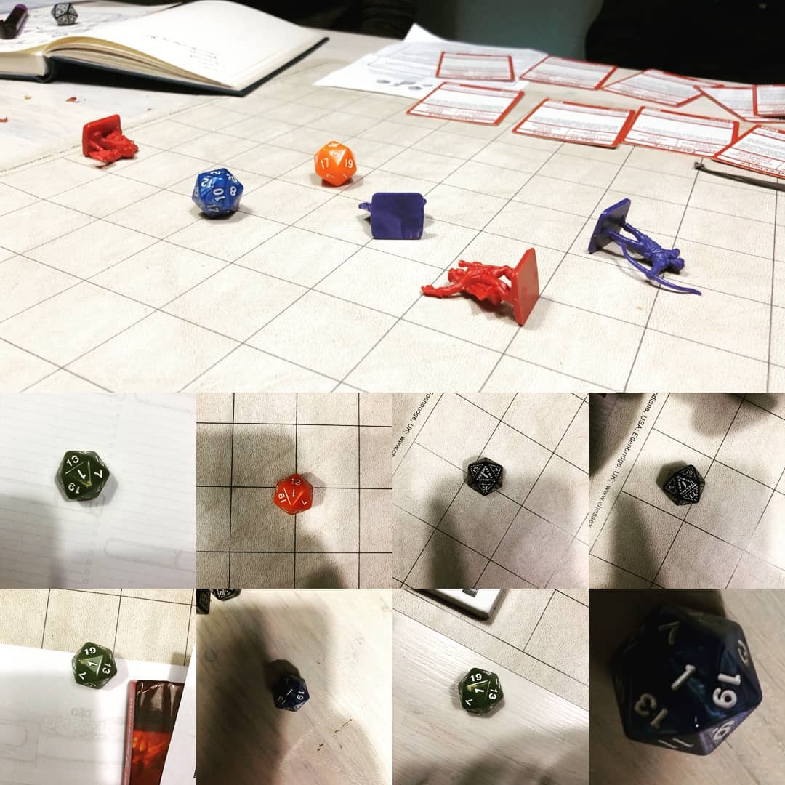

**Eén voor allen, allen voor één.**

Ik kan slecht tegen mijn verlies. Na een paar mislukte baasgevechten leg ik vaak al de controller neer, te gefrustreerd om door te spelen. In de wereld van Dungeons & Dragons, waarin een dobbelsteen bepaalt of je flatert, kijk ik er totaal anders tegenaan.

Eens per maand spreek ik met een groep van zes af om Dungeons & Dragons te spelen. Samen jagen we al een tijdje op een mysterieuze drakencult die dorp na dorp leegrooft om de drakengod Tiamat te behagen.

> [!NOTE]
>
> Dit verhaal verscheen eerder [op Laadscherm](https://laadscherm.nl/zelfs-verliezen-is-leuk-in-dungeons-dragons/).

Dungeons & Dragons is de voorloper van de moderne rpg. Al sinds de jaren ’70 komen mensen samen om de tafel om zelf een fantasy-avontuur bij elkaar te fantaseren. Een Dungeon Master beschrijft een avontuur, waarna de spelers aangeven wat ze precies willen doen.

Je moet voor al je activiteiten een dobbelsteen met twintig zijden gooien. Hoe hoger je rolt, hoe groter de kans op slagen. Een sprong over een ravijn kan hierdoor bijvoorbeeld slagen als je een 18 scoort, of eindigen met twee gebroken benen bij een drie op de dobbelsteen. Een één is het meest rampzalige dat er op je dobbelsteen kan staan. Wie dit rolt, zal bijvoorbeeld per ongeluk uitschieten met een zwaard en een vriend raken, of bij een wandeling struikelen en in een ravijn vallen.

## Eén

Onze missie was tijdens één van de eerste speelsessies simpel: net buiten ons dorp bevond zich een kamp vijanden. Het was aan ons om ze op te sporen, gevangenen te redden en zoveel mogelijk van de vijanden uit te roeien. Hoe beter we dat deden, hoe hoger de beloning.

Tijdens onze tocht kwamen we al snel een kleine groep kobolden en cultleden tegen, die samen een kip aan het spit probeerden te braden. Tegen die tijd wisten we al dat een regelrechte aanval zelden de beste optie is, dus lieten we onze boogschutter er langzaam op afsluipen om het gebied te verkennen.

Dat ging goed, totdat hij voor het eerst een één rolde. De groep kippenbraders kijkt op en zet meteen de aanval in. Omdat onze boogschutter alleen was en de rest van de groep zich buiten gehoorschot bevond, maakte hij dat hij wegkwam. Helaas rolde hij bij die vlucht nog een één, met een struikelpartij als gevolg. De boogschutter draait om, schiet een pijl in de lucht en raakt zichzelf recht in zijn gezicht nadat er nog een één werd gerold.

Hij weet uiteindelijk te ontsnappen, waarna de groep als geheel de strijd aangaat. Een steeds onwaarschijnlijker wordende hoeveelheid énen rolt over het speelbord, waardoor we het gevecht ternauwernood ontsnappen. Onze tovenaar legt het loodje, maar we weten hem op het laatste moment weer tot leven te wekken en besluiten een kamp op te zetten. We hadden een boogschutter uit wiens oog we zijn eigen pijl moesten trekken en ook de rest van de groep kon wel wat rust gebruiken.

De nacht is echter nog maar amper begonnen en we worden wakkergeschud door een verrassingsaanval. We proberen te ontsnappen, maar inmiddels hebben we in één speelsessie maar liefst tien keer achter elkaar een één gerold, op de slechtst mogelijke momenten. Ons team sneuvelt.

Was dit Dark Souls, dan was de tekst ‘YOU DIED’ met grote, rode letters op het scherm verschenen. In Super Meat Boy zou het level snel opnieuw zijn geladen voor nog een poging. Geen van die dingen gebeurde nu. In plaats daarvan vouwde onze Dungeon Master zijn hoofd in zijn handen en was het stil. “Ik moet even bedenken wat er in deze situatie zou gebeuren”, opperde hij, waarna hij van de speeltafel wegliep.

Tien minuten later (en één dag voor onze personages) werden we vastgebonden wakker in een compleet onbekende omgeving. De missie was veranderd: we moesten nu bedenken hoe we in hemelsnaam uit ons gevangenschap moesten ontsnappen.

## Niet game over

Verloopt een digitale game niet zoals je wil, dan is het resultaat bijna altijd hetzelfde: je moet opnieuw beginnen. Het spel verwacht dat je het blijft proberen, totdat je de juiste aanpak hebt gevonden. Bij Dungeons & Dragons verloopt het anders. Je hebt pech en verliest de controle over een situatie – maar ziet vervolgens wat voor gevolgen jouw onfortuinlijke situatie precies heeft. Een goede Dungeon Master bedenkt wat er kan gebeuren en zet het verhaal voort. Er is geen game over-scherm, noch een manier om het nog een keer te proberen.

De kans dat wij zo vaak achter elkaar een één zouden rollen was buitengewoon laag, iets dat onze Dungeon Master met 25 jaar ervaring zelfs nog nooit eerder zag gebeuren. We zijn verslagen en gevangen genomen. Alles wat mis kon gaan, ging ook mis. Maar het is een ervaring die ik nooit meer zou willen inruilen.

We leerden om de één te vrezen. Iedere keer als we lage cijfers op de speeltafel zagen verschijnen, hielden we onze adem in. Maar we wisten ook dat we ons met goed teamwerk wellicht konden redden van het aanstormende noodlot – waardoor ons spel eigenlijk alleen maar spannender, grappiger en meeslepender is geworden.

Dungeons & Dragons beperkt zich tot boeken, papier, dobbelstenen en je eigen inbeeldingsvermogen. Dat laatste zorgt ervoor dat een bizarre situatie zich bijna altijd wel kan ontpoppen tot iets bijzonders – de game heeft immers geen vooraf uitgestippelde route. Dat maakt zo’n ouderwets fantasiespel toch een stuk meeslepender dan de meeste digitale games.
