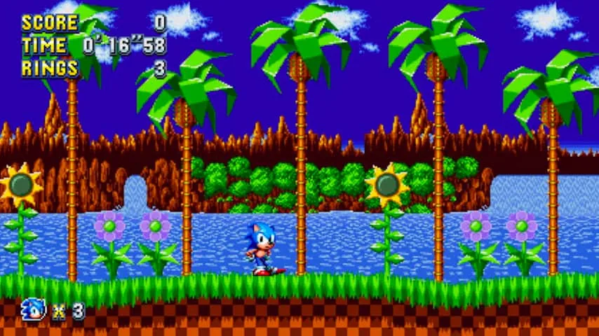
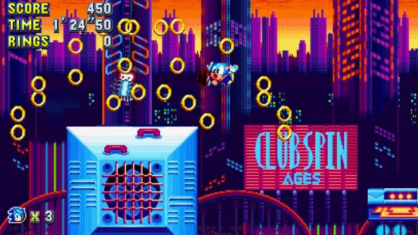

**De oude game-mascotte Sonic keerde deze week terug in de game Sonic Mania, die voor een groot deel door Nederlandse fans is gemaakt. Hoezo mochten zij ineens aan de slag met het oude game-icoon?**

> [!NOTE]
> Dit artikel verscheen eerder op [NU.nl](https://www.nu.nl/games/4885922/achtergrond-dit-zijn-de-nederlanders-die-meewerkten-aan-sonic-mania.html).

In 2017 is Sonic the Hedgehog een wat obscure naam, maar rond de jaren ’90 had de mascotte een goede reputatie. Hij was de grote rivaal van Nintendo’s Super Mario. De blauwe egel had een iets stoerder imago dan Mario, waarmee het Japanse gamebedrijf Sega zijn Mega Drive-spelcomputer aan de man probeerde te krijgen.

Dat lukte. De Mega Drive (in andere landen bekend als de Genesis) ging bijna 30 miljoen keer over de toonbank. Hoewel Nintendo met 50 miljoen Super Nintendo-consoles alsnog marktleider was, maakte dit Sega een grote speler op de gamesmarkt.

Het zorgde ervoor dat miljoenen gamers in de jaren ’90 spellen van Sonic voor hun kiezen kregen. Voor deze mensen was het wat Mario voor velen anderen is. Of wat Lara Croft en Crash Bandicoot waren voor een jongere generatie.

_Sonic Mania — Beeld: Sega_

Ook de Nederlander Michael Balm had een Mega Drive met Sonic in huis staan: "Ik was meer van Sega dan van Nintendo, waardoor ik best wel wat affiniteit heb met Sonic. Ik had thuis ook een zelfgemaakte arcadekast met daarop Sonic 3."

## Nieuwe game uit Nederland

Sega maakt nog steeds Sonic-games, maar met _Sonic Mania_ werd gekozen voor een nieuwe aanpak: het bedrijf benaderde fans van het eerste uur om hen de gelegenheid te geven een eigen vervolg te maken.

Balm was één van de Nederlanders die bij dat project betrokken raakte. "We waren met ons bedrijf Picomy naar de Amerikaanse gamebeurs PAX gevlogen. Daar kwamen we in contact met de ontwikkelstudio PagodaWest Games, waar we meteen een goede klik mee hadden."

"We hielden contact", vertelt Balm. "In 2016 zeiden ze onze hulp nodig te hebben voor een 'iconische game van Sega'. Het was ons toen meteen duidelijk waar het over ging. We zagen een prototype en wisten gelijk dat we wilden meewerken."

Dat terwijl hij nooit de romantische notie had om ooit bij Sega aan een nieuwe Sonic-game te werken. "Ik ben er eigenlijk gewoon maar ingerold."

## Bijna een burnout

Picomy ging samen met PagodaWest aan de slag. Balm offerde zijn weekenden op om de levels van de game te maken. "Die begonnen als remixes van oude klassiekers, maar werden later steeds meer eigen creaties."

"Op dat moment had ik eigenlijk drie banen: mijn vaste werk bij een mediabedrijf, de ene dag dat ik bij Picomy werkte en de weekenden die opgingen aan Sonic. Dat leverde bijna een burnout op."

Picomy was niet de enige Nederlandse naam die aan het project sleutelde. Pixelartiest Paul Veer, bekend van zijn werk voor de Nederlandse indiegamemaker Vlambeer, maakte personages voor het spel.

Balm: "Het is echt indrukwekkend wat hij heeft gedaan. Die personages bewegen met 60 beelden per seconde, wat betekent dat er ontzettend veel werk in zit."

_Sonic Mania — Beeld: Sega_

Daarmee zijn verrassend veel Nederlanders betrokken bij het oude game-icoon. Het Amsterdamse Cook & Becker bracht eerder dit jaar nog een [boek](https://www.candb.com/nl/kunstwerk/2080/sonic-the-hedgehog-25th-anniversary-art-book-standard-hardcover-sega.html) uit, met daarin afbeeldingen en tekeningen van de Sonic-games.

Bij dat boek was Veer overigens ook betrokken, vertelt Cook & Becker’s Arjan Terpstra. "Hij heeft bijvoorbeeld 'screenshots' gemaakt die eigenlijk niet kunnen bestaan, van Sonic 1 en 2. Hij heeft levels helemaal opnieuw nagebouwd." Een vereiste, omdat beelden van oude spelcomputers te laag van kwaliteit zijn om af te drukken.

Veer was op het moment niet bereikbaar voor commentaar. Het is volgens Terpstra in elk geval geen wonder dat hij nauw bij het project was betrokken. "Paul staat bekend als groot Sonic-fan en is één van de beste artiesten die in deze 2D-stijl kan werken."

## Geen fangame

Strikt gezien is _Sonic Mania_ een fangame. Hij is weliswaar gemaakt met toestemming van Sega, maar het volledige ontwikkelteam bestaat uit mensen die niet voor het bedrijf werken en fan zijn van de eerste delen.

Dat vindt Balm na afloop van de ontwikkeling nog steeds bijzonder. "Je hebt vaak wel externe dingen die een gamestudio uitbesteedt aan andere bedrijven, zoals de beelden en het geluid. Maar het daadwerkelijke ontwerp van een game behoort tot de kern. En zelfs daar mochten we aan meewerken."

De ontwerper vindt het wat kort door de bocht om _Sonic Mania_ als een fangame te bestempelen. Het is dan ook een game die het buitengewoon goed doet voor een 'fanproductie.' De recensiescores liggen gemiddeld rond de 8,5 van de 10 punten, terwijl de laatste officiële Sonic-game vooral magere zesjes scoorde. Wat dat betreft doen de fans het beter dan de grootmeesters.

Balm weet nog niet of er een vervolg voor _Sonic Mania_ komt. "Ik hoop van wel." En als hij ooit nog eens een sequel voor een grote gamereeks mag maken, dan hoopt hij misschien eens aan Zelda mee te werken.

_Sonic Mania is voor 20 euro verkrijgbaar op PlayStation 4, Xbox One en Nintendo Switch_
