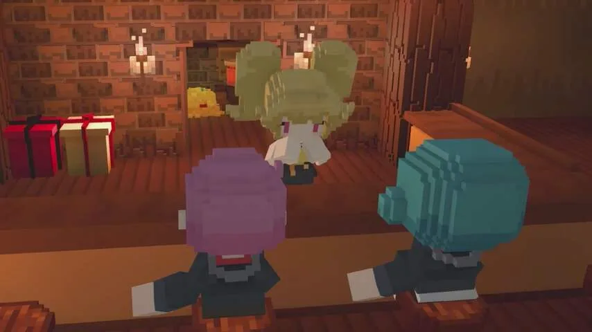
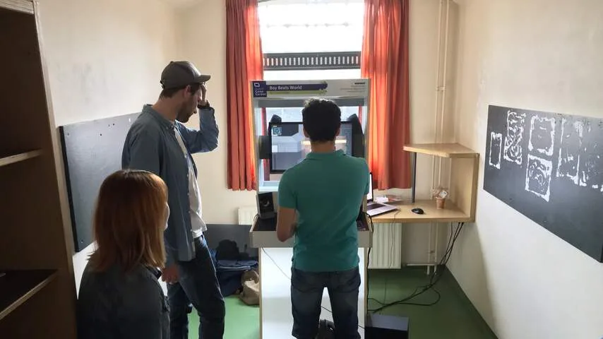

**Op vrijdag vond in Utrecht de gamebeurs INDIGO plaats, waar onafhankelijke spelmakers hun nieuwste titels presenteren. Een riskant carrièrepad, gezien het lastig is om werk te vinden in de Nederlandse game-industrie.**

> [!NOTE]
> Dit artikel verscheen eerder op [NU.nl](https://www.nu.nl/games/4808319/achtergrond-nederlandse-game-industrie-toont-nieuwe-titels-op-indigo.html).

Het [spelfestival](http://www.dutchgamegarden.nl/indigo/main/) vond dit jaar plaats in de Lik, een oude gevangenis in Utrecht. De celdeuren op twee verdiepingen waren opengegooid zodat iedere studio een eigen kamer had om hun game te presenteren.

De oude gymzaal werd ingericht als presentatieruimte voor virtual reality, terwijl in de bibliotheek praatjes werden gehouden door internationale gamebedrijven.

## Jonge ontwikkelaars

In de cellen stonden vooral jonge mensen - vaak studenten die hun afstudeerwerk laten zien, of starters die net klaar waren met school. Ze willen hun eerste passieprojecten gaan uitgeven op online distributieplatformen zoals Steam. Eén van die studenten is Tijmen Tio, die op Indigo zijn tweedimensionale spel _Original Hill Farming_ presenteerde.

Daarmee bereidt Tio zich voor om in een moeilijke industrie te gaan werken. Uit de Dutch Game Monitor 2015, een onderzoek naar de sector, blijkt dat er veel meer mensen afstuderen dan dat er gamesbanen in Nederland zijn. Slechts 30 procent van de afgestudeerden zou de spellenmarkt betreden.

Tio wist ook dat de game-industrie geen vetpot zou zijn, maar is desondanks aan de slag gegaan. Het is zijn passie. "Ik deed eerst een andere studie, maar merkte dat ik in mijn vrije tijd alleen maar bezig was met het maken van spellen."

## Minecraft

Toch zijn er genoeg voorbeelden van succesvolle game-ontwikkelaars in Nederland. Tussen de starters van Indigo staat bijvoorbeeld Bart van der Werf. Hij was eerder medeverantwoordelijk voor _Starbound_, een succesvolle 2D-bouwgame.

"Die ontwikkelaar vormde een vast bedrijf waar ik fulltime in dienst kon komen, maar dat heb ik geweigerd. In plaats daarvan ben ik mijn eigen studio begonnen." Van der Werf werkt inmiddels aan _Staxel_.

_Staxel — Beeld: Plukit_

​

_Staxel_ is visueel vergelijkbaar met spellen zoals _Minecraft_. Het spel bevat een uitgebreid boerderijsysteem en een dorp vol inwoners om mee te praten. Een game die Van der Werf eigenlijk vooral voor zijn kinderen maakt. "Dat is ook wel handig, want je publiek zit gewoon thuis."

Het is vrij duidelijk dat Van der Werf zijn naam in de game-industrie inmiddels heeft gemaakt: "Ik werd ook gevraagd of ik aan de slag wilde bij Mojang, de maker van _Minecraft_. Dat heb ik afgeslagen, omdat mijn familie niet wilde verhuizen."

Gevraagd over hoe lastig het is om een eigen studio in Nederland te beginnen, zegt Van der Werf dat het Nederlandse belastingklimaat slecht is. Bij zijn huidige bedrijf is officieel ook enkel hijzelf in dienst. "Verder werk ik alleen met externe freelancers." Het brengt volgens hem te veel risico met zich mee om iemand vast in dienst te nemen.

_INDIGO — Beeld: NU.nl/Bastiaan Vroegop_

## Twee man

Dat neemt niet weg dat een succesvol Nederlands gamebedrijf snel kan veranderen. Pieter Albers, die met zijn bedrijf Xform het monstervechtspel _Super Man Or Monster_ presenteert op het festival, zag zijn bedrijf ooit krimpen.

"Ik doe dit al dertien jaar", zegt Albers. "We begonnen ooit met webgames, daar kon je toen nog goed geld mee verdienen. Dat veranderde een jaar of drie geleden, nadat plugins zoals Shockwave uit browsers werden gehaald". Inmiddels bestaat Xform uit twee man en heeft Albers geen ambitie om zijn bedrijf te laten groeien. "Het is wel even goed zo."

## Buitenland

Wie zich laat afschrikken door de lastige banenmarkt van Nederland, heeft nog een optie: verhuizen. Dat deed ook Sjoerd de Jong, inmiddels werkzaam bij het grote spelbedrijf Epic Games. "Ik ben alweer vergeten hoe je Nederlands spreekt", grapt hij.

Bij Epic Games sleutelt hij mee aan de Unreal Engine - de motor achter veel van de grootste titels van dit moment. Op Indigo probeerde hij ontwikkelaars tijdens een presentatie te overtuigen om Unreal te gebruiken.

"Ik heb voor een aantal bedrijven gewerkt, maar ik had het hier na een tijd wel gezien", zegt de Jong. Inmiddels heeft hij met zijn vrouw een huis gekocht in Zweden.

## Risico

"In Nederland durft men niet zo snel iets groots te doen. Ze maken vooral kleine 2D-games, omdat ze denken dat ze geen grote 3D-titel kunnen maken met vier of vijf man." Omdat het in Nederland lastig is om failliet te gaan, denkt De Jong dat er minder risico’s worden genomen.

Toch ziet hij wel grote ontwikkelingen op de Nederlandse markt. Want hoewel er volgens hem te veel verschillende opleidingen zijn, is er nu wel eindelijk onderwijs omtrent games. "Toen ik begon had je niet echt opleidingen. Ik heb het mijzelf allemaal moeten aanleren."
