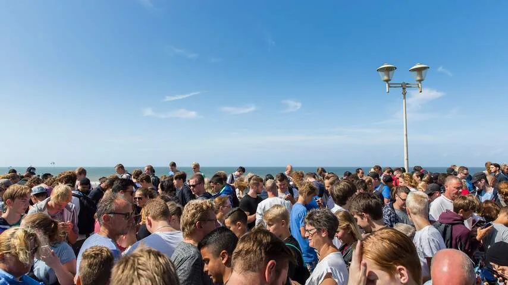
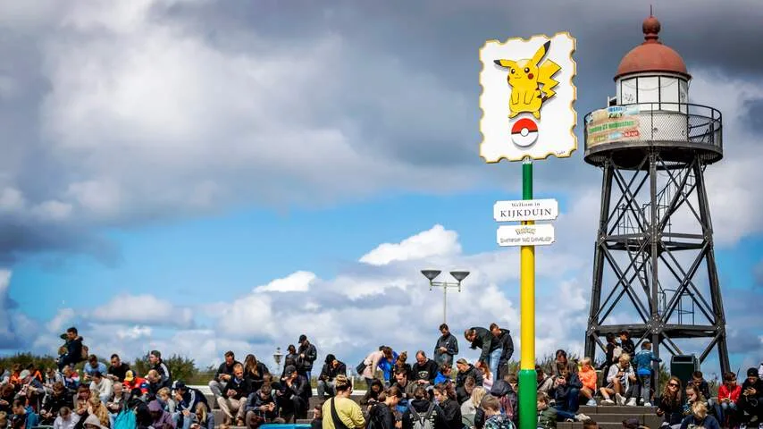
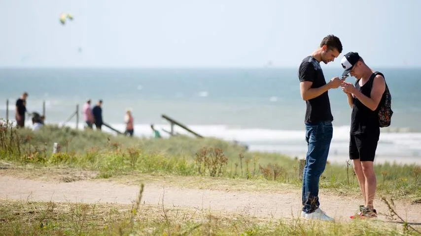

Eigenlijk verscheen _Pokémon Go_ pas op 16 juli in Nederland, maar op 6 juli was het spel al onder andere Nieuw-Zeeland en Australië te downloaden. Veel Nederlanders wisten het spel al via een omweg te downloaden, waardoor de hype tien dagen voor de officiële verschijning al van start ging.

> [!NOTE]
> Dit artikel verscheen eerder op [NU.nl](https://www.nu.nl/games/4819977/achtergrond-pokemon-go-houdt-trouwe-fans-op-eerste-verjaardag.html).

Omdat _Pokémon Go_ in de echte wereld wordt gespeeld, gingen spelers massaal naar plekken toe waar veel monsters gevangen konden worden. Groepen mensen verzamelden zich bij Gyms en Pokéstops, locaties waar kan worden gevochten of spelvoorwerpen beschikbaar zijn.

De game zorgde voor immense drukte in bijvoorbeeld Kijkduin, waar spelers in groten getale op zoek gingen naar nieuwe Pokémon. Dat leidde zelfs tot een rechtszaak, waarmee de gemeente Den Haag de spelmaker wilde dwingen het gebied minder aantrekkelijk te maken voor de gamers.

Inmiddels zijn de groepen Pokémon-spelers minder duidelijk aanwezig in Nederland. Toch is er nog steeds een grote groep mensen die de game geregeld blijft spelen. Uit cijfers van marktonderzoeker App Annie blijkt dat de game in de eerste vijf maanden van het jaar alleen in Nederland al 300.000 dollar (265.000 euro) wist om te zetten. In diezelfde periode was het ook de meest geïnstalleerde Android-game in ons land.

_Achtergrond: Pokémon Go houdt trouwe fans op eerste verjaardag — Beeld: ANP_

_Achtergrond: Pokémon Go houdt trouwe fans op eerste verjaardag — Beeld: ANP_

_Achtergrond: Pokémon Go houdt trouwe fans op eerste verjaardag — Beeld: ANP_

_Achtergrond: Pokémon Go houdt trouwe fans op eerste verjaardag — Beeld: ANP_

## Iedere dag spelen

Skate-instructeur Quincy Renssen is één van de Nederlanders die nog steeds speelt. Hij downloadde de game op 10 juli en start de app nog altijd dagelijks op. Inmiddels is hij level 37, drie levels verwijderd van het hoogst haalbare.

"Ik speel altijd even als ik ergens naartoe ga", zegt Renssen. Dat kan volgens hem vrij makkelijk, omdat hij nooit met de auto reist. "Daarnaast ga ik vier of vijf keer per week een uurtje naar buiten, speciaal om te spelen."

Grafisch ontwerper Milan Swagers begon in september met de game en is sindsdien ook niet gestopt. Ook hij heeft level 37 bereikt. Swagers merkt dat hij door _Pokémon Go_ een stuk meer is gaan bewegen. "Ik sportte over het algemeen al actief, maar ik ben door de game veel meer gaan wandelen. Tijdens een vakantie denk ik ook sneller: 'laat ik even een stukje gaan lopen.'"

## Niet verveeld

De game verveelt de twee spelers eigenlijk nooit. "Soms wacht je op nieuwe updates en speel je iets minder", zegt Renssen. "Maar ik heb geen dag gehad dat ik het niet heb aangeraakt."

Volgens Swagers is dat grotendeels te danken aan de buitenwereld: "Omdat je buiten bent, is het al snel best interessant.” Daarnaast heb je volgens hem altijd wel wat te doen, door bijvoorbeeld een nieuwe Pokémon te vangen of voorwerpen te verzamelen. Omdat het spel buiten wordt gespeeld, heeft Renssen in het afgelopen jaar ook veel vrienden gemaakt. "Ik heb zeker een mannetje of vijftig via _Pokémon Go_ ontmoet."

[Bekijk ingesloten media](https://content.jwplatform.com/players/Yp1gODvA-whqXCOFb.html)

## Gyms

Een recente update voor de game veranderde volledig hoe gyms werken. Monsters die lang op deze virtuele locaties zitten verzamelen nog steeds muntjes voor hun eigenaars, maar die worden pas toebedeeld als de betreffende Pokémon is verslagen. Daarnaast zit er een limiet op het aantal munten dat zo’n wezen op een dag kan vergaren.

De veranderingen zijn een pijnpunt onder fanatieke spelers, waaronder ook Renssen: "Eerder kon je redelijk makkelijk spelmunten verzamelen, waardoor ik een kleine vier maanden goed zat. Maar dat is nu niet meer het geval."

"Het is fijn dat gevechten om gyms nu sneller verlopen", vult Swagers aan. "Maar het is nu de bedoeling dat je binnen acht uur door iemand wordt verslagen. Gebeurt dat niet, dan verdien je die dag geen munten."

## Volgend jaar

Daar staat tegenover dat de nieuwe raids, waarbij spelers samen tegen één monster vechten, goed vallen bij de twee. Swagers, die in het afgelopen jaar weinig spelers heeft ontmoet, maakte hierdoor bijvoorbeeld vaker contact met andere gamers. "In de laatste twee weken heb ik meerdere raids opgepakt met andere mensen. Sinds vorige week zit ik ook in een chatgroep om zulke groepsmomenten te coördineren."

De twee denken dan ook dat ze over een jaar waarschijnlijk nog wel spelen. Dat is volgens Swagers ook niet heel lastig, omdat je niet heel veel hoeft te spelen om een beetje bij te blijven. "En als de maker updates blijft uitbrengen, wordt het steeds weer interessant."

Renssen: "Ik speel al sinds mijn tiende Pokémon-spellen en dit is echt een verbetering van het origineel. Het spel is vooral heel erg gezellig."
