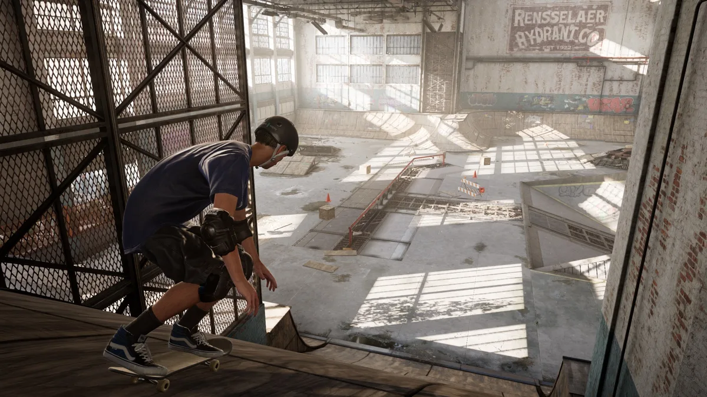

**Vernieuwd ollie-gineel**

> [!NOTE]
> Dit artikel verscheen eerder op [Bright](https://www.bright.nl/nieuws/1126382/activision-kondigt-remasters-tony-hawks-pro-skater-1-en-2-aan.html).

Beide Tony Hawk-games worden vanaf 4 september verkocht in één bundel op PlayStation 4 en Xbox One. Op pc is het spel te downloaden vanuit de Epic Games Store.

De game komt op een goed moment: het is al een tijdje stil rond de reeks. Bovendien verschijnen er steeds minder skateboardspellen.

## Groot succes

De originele Tony Hawk-titels waren vanaf eind jaren '90 een groot succes. Het waren de eerste echt grote skateboardgames, die het zowel onder gamers als skaters buitengewoon goed deden. "Ik vind het geweldig om, naast bestaande fans, een nieuwe generatie skateboarders en gamers te inspireren de sport nog verder te laten groeien", stelt professioneel skateboarder Tony Hawk.

## Crash Bandicoot

De remasters worden gemaakt door Vicarious Visions, dat eerder ook een remake van Crash Bandicoot maakte voor moderne spelcomputers. In de vernieuwde games zitten alle levels en speelbare skateboarders uit het origineel, plus een paar nieuwe gebieden. Meerdere nummers uit de oude games zijn ook weer aanwezig.

Het is in de remake ook mogelijk een eigen skatepark of personage te maken. Die levels kun je nu ook online met anderen delen, of je kunt zelf de populairste creaties downloaden en spelen.

## Demo

De game is vanaf vandaag al te pre-orderen. Wie dat doet, krijgt voor verschijning al toegang tot een demo waarin het oude Warehouse-level gespeeld kan worden.

[Bekijk ingesloten media](https://www.youtube.com/embed/YUgS64yLP7g?autoplay=1&modestbranding=1)

## PlayStation 5 en Xbox Series X komen eraan:

**[Volg Bright op YouTube](https://bit.ly/brighttv) voor meer tech-video's**
