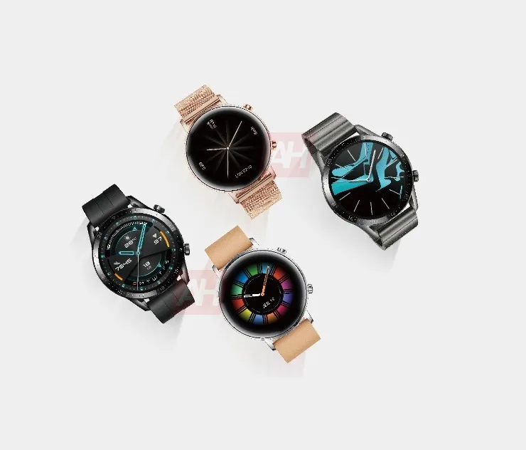
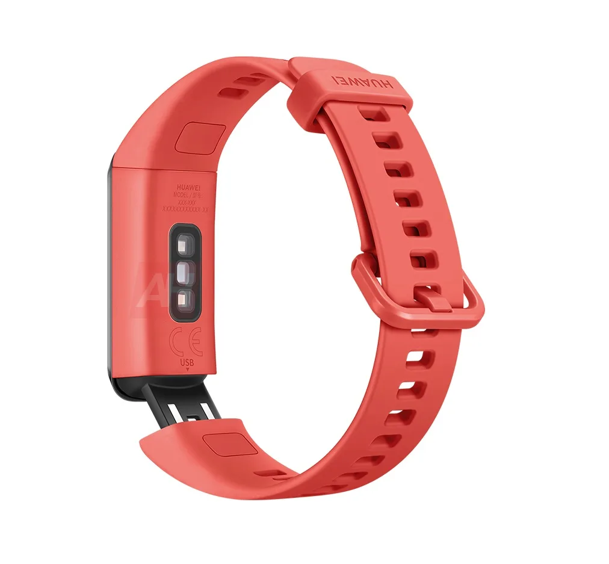
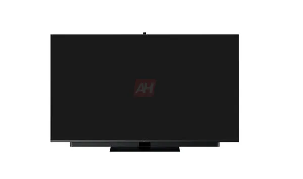
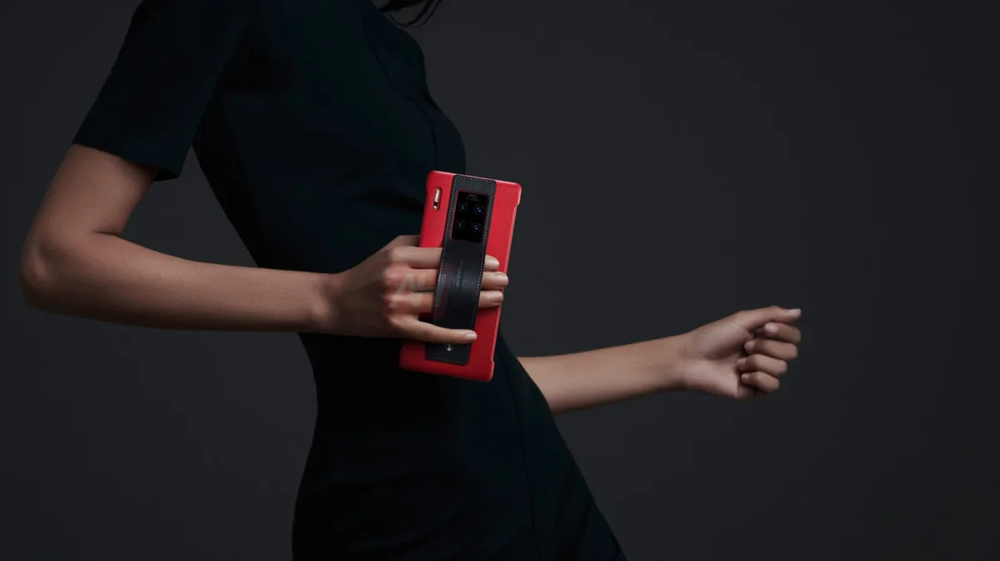

**Huawei TV**

> [!NOTE]
> Dit artikel verscheen eerder op [Bright](https://www.bright.nl/nieuws/1123788/alle-grote-aankondigingen-van-huawei-event-nu-al-gelekt.html).

De plannen voor Huawei's Mate 30 Pro-telefoon lekten eerder al naar buiten, maar nu heeft [Android Headlines](https://www.androidheadlines.com/2019/09/huawei-announcement-2019.html) beelden bemachtigd van een nieuwe smartwatch, fitnesstracker, televisie en tablet die tijdens het evenement ook aan bod komen.

De Huawei Watch GT2 is een opvolger van het horloge dat op het moment wordt verkocht. Dit nieuwe model zou worden geleverd in vier verschillende kleuren en krijgt twee schermgroottes. Het 46 millimeter-scherm lijkt gelijk aan het oude horloge, maar de 42 millimeter-variant is iets kleiner.

Daarnaast zou een nieuwe fitnesstracker met een kleurenscherm en een hartslagsensor worden getoond. Deze wordt niet zoals zijn voorganger draadloos opgeladen, maar heeft een verborgen usb-poort in de armband.

Huawei zou ook de televisiemarkt willen betreden. Dat deed het bedrijf stiekem al eens onder de merknaam Honor, maar nu zou er een officiële Huawei-tv worden gepresenteerd.

De televisie zou draaien op het Huawei-besturingssysteem HarmonyOS. Camera's bovenop de televisie kunnen op commando naar buiten steken. Een ingebouwde soundbar moet een betere geluidskwaliteit bieden dan bij andere tv's.

Huawei presenteerde in juni zijn MediaPad M6-tablet, met een toetsenbordhoes en meegeleverde stylus om te tekenen of schrijven. Volgens de bronnen van Android Headlines zal deze tablet ook voor de westerse markt worden aangekondigd.

Tot slot heeft de site een aantal nieuwe foto's van de Mate 30 Pro bemachtigd. De interessantste is van een nieuw lederen accessoire, waar gebruikers hun vingers in kunnen steken om het apparaat vast te houden.

We hoeven niet lang te wachten totdat we weten of bovenstaande gelekte informatie klopt: op donderdag om 14:00 uur presenteert Huawei zijn nieuwste producten in München, waar wij ook bij aanwezig zijn.

## Tech-oorlog tussen VS en China: is Huawei de pineut?

[Bekijk ingesloten media](https://www.youtube.com/embed/4s?autoplay=1&modestbranding=1)

**[Volg Bright op YouTube](https://bit.ly/brighttv) voor meer tech-video's**
