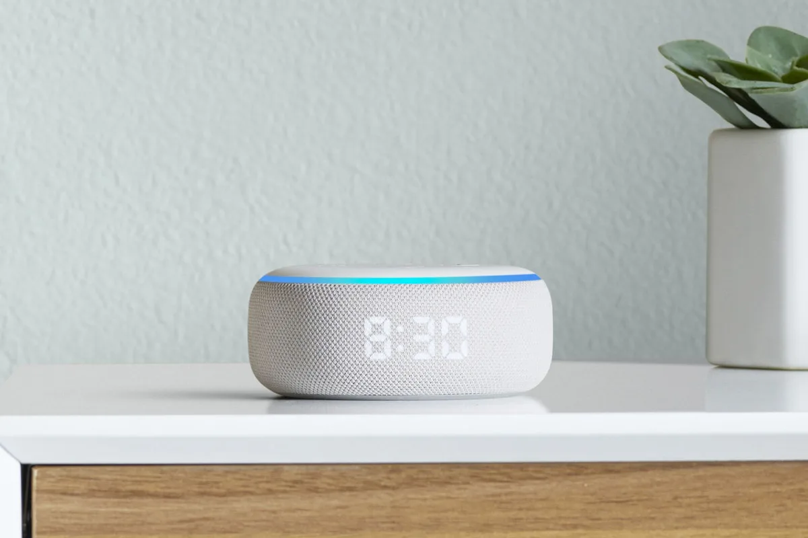

**Nieuwe Echo's**

> [!NOTE]
> Dit artikel verscheen eerder op [Bright](https://www.bright.nl/nieuws/1123867/amazon-onthult-slimme-premiumspeaker-echo-studio.html).

In de Echo Studio zitten drie midrange speakers, een tweeter en een basdriver. Daarnaast ondersteunt hij Dolby Atmos-geluid.  Volgens Amazon past de Echo Studio zijn geluid aan op de kamer. Als je hem middenin de ruimte zet, luistert hij naar de akoestiek om vervolgens de muziek de hele ruimte te laten vullen.

Met de nieuwe premiumspeaker gaat Amazon de concurrentie aan met Google en Apple. Google onthulde eerder zijn duurdere Google Home Max, terwijl Apple met zijn HomePod een duurder alternatief op goede slimme speakers heeft.

De Echo Studio is de duurste Echo-speaker die Amazon ooit heeft verkocht, met een prijskaartje van 200 dollar. Hij is tegelijkertijd echter goedkoper dan de grootste concurrenten.

## Andere nieuwe speakers

Amazon onthulde ook een nieuwe versie van zijn kleine Echo Dot-speaker. De 60 dollar kostende opvolger heeft een ingebouwde klok, zodat hij makkelijker als wekker gebruikt kan worden.

De gewone Amazon Echo heeft ook een opvolger met een stoffen behuizing en verbeterde interne hardware. Dit model zal voor 100 dollar worden verkocht. Een Nederlandse verkoop voor de nieuwe apparaten is nog niet aangekondigd.

De slimme assistent Alexa is volgens Amazon op een aantal fronten verbeterd. Met behulp van kunstmatige intelligentie is het mogelijk de stem natuurlijker te laten klinken.

## Samuel L. Jackson

Daarnaast gaat de webwinkelgigant beroemdheden alternatieve stemmen laten opnemen. De eerste beroemdheid die dit zal doen is Samuel L. Jackson, die tevens een expliciete versie van de stemdienst zal inspreken.

Het is mogelijk om meerdere talen tegelijkertijd te koppelen. Alexa praat dan terug in de taal waarin je haar aanspreekt. De functie is bedoel voor huishoudens waar meerdere talen worden gesproken.

Ook nieuw is een speciale frustratiedetectie. Mopper je naar de stemdienst, dan zal Alexa dit voortaan detecteren en gepast reageren.

## Kijk ook: Sonos Move, eerste draagbare Sonos-speaker

[Bekijk ingesloten media](https://www.youtube.com/embed/z-IV73gZmHs?autoplay=1&modestbranding=1)

**[Volg Bright op YouTube](https://bit.ly/brighttv) voor meer tech-video's**
