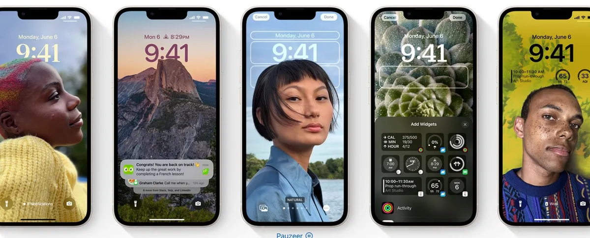
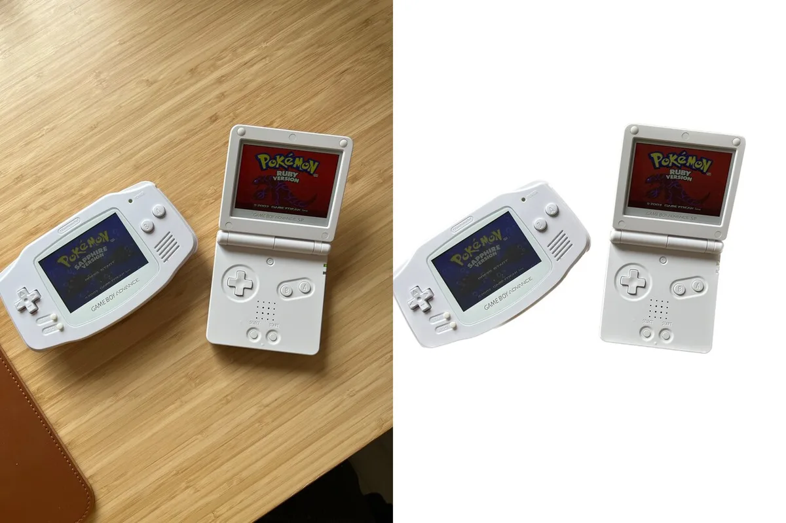
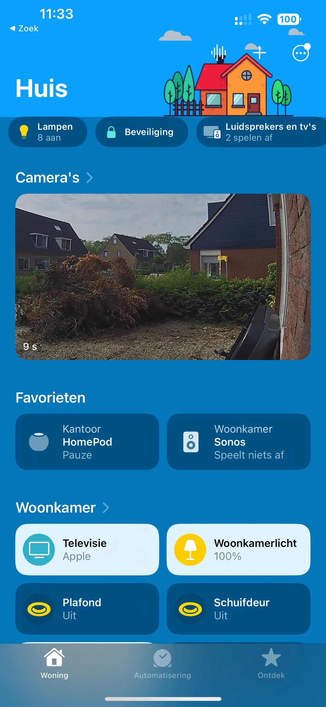

Apple heeft zijn nieuwe, grote software-update iOS 16 voor de iPhone uitgebracht. We zetten op een rij wat voor nieuwe functies je telefoon er allemaal bij heeft gekregen.

> [!NOTE]
> Dit artikel verscheen eerder op [AD](https://www.ad.nl/tech/apple-brengt-ios-16-deze-nieuwe-functies-heeft-je-iphone-nu~a8155920/).

Eens per jaar brengt Apple een grote update uit waarin tal van nieuwe functies aan smartphones worden toegevoegd. Dit jaar is dat iOS 16, dat vooral het ontgrendelscherm van je telefoon onder handen neemt.

Deze nieuwe software-versie is gratis te downloaden, mits je een ondersteunde telefoon hebt. iOS 16 werkt op de volgende telefoons:

iPhone SE (generatie twee of nieuwer)
iPhone 8
iPhone X
iPhone XR
iPhone XS
iPhone 11
iPhone 12
iPhone 13
iPhone 14.

Dat zijn in feite alle iPhones die Apple sinds 2017 op de markt heeft gebracht. Heb je een oudere telefoon? Dan kun je iOS 16 niet downloaden. Wel zal Apple mogelijk nog kleine updates voor je toestel uitbrengen, maar die bevatten hooguit verbeteringen in de achterliggende beveiliging. iPhones uit 2016 of eerder krijgen geen nieuwe functies meer.

De update is vanaf vandaag beschikbaar, al kan het even duren tot je hem goed kunt downloaden. Grote updates worden vaak geleidelijk uitgebracht, om te voorkomen dat servers overbelast raken.

_Een_ [_smartphone met een goede camera_](https://bestgetest.nl/de-beste-midrange-smartphones-tot-500-euro-van-2022?utm_source=ad&utm_medium=tekstlink&utm_term=byo&utm_campaign=redactioneel&utm_content=a8155920)_? De redactie van BestGetest zette de beste modellen op een rij._

## Een compleet nieuw toegangsscherm in iOS 16

Het toegangsscherm van de iPhone was jarenlang grotendeels onveranderd: je had de tijd, daaronder een lijst notificaties en in de linker- en rechterhoek knoppen voor de zaklamp en camera.

Met iOS 16 wordt dit vergrendelscherm van de iPhone voor het eerst écht onder handen genomen. Je kunt het nu helemaal naar eigen smaak aanpassen, door bijvoorbeeld de kleur en het lettertype van de klok aan te passen. Er is ook ruimte voor widgets die simpele app-informatie laten zien, zodat je bijvoorbeeld je volgende agenda-afspraak kunt bekijken.

Je kunt ook meerdere beginschermen op je iPhone maken, waar je met een snelle tik tussen kunt wisselen. Of je hangt ze aan de verschillende focus-opties van je smartphone, zodat je bijvoorbeeld een professionele achtergrond hebt zodra je op kantoor arriveert.

Het beginscherm van iOS 16 is helemaal naar eigen smaak aan te passen. © Apple

## Slimmere notificaties

Notificaties hangen voortaan onderin het scherm, waar je ze makkelijker kunt aantikken op de inmiddels steeds grotere smartphone-schermen. Bij eerdere iOS-versies hingen ze juist bovenin, waardoor je ver met je duim omhoog moest bewegen om ze aan te tikken.

Daarnaast kunnen appmakers nu zogeheten ‘Live Activiteiten’ maken voor het toegangsscherm. Dat zijn een soort grote, interactieve notificaties die constant nieuwe informatie toegespeeld krijgen. Zo zie je bijvoorbeeld op je beginscherm de live-score van een voetbalwedstrijd, zonder dat de app je steeds nieuwe berichten hoeft te sturen.

Handig, maar het duurt nog even tot je dit te zien krijgt: ontwikkelaars mogen pas vanaf later dit jaar zulke Live Activiteiten gaan bouwen voor hun apps.

Met Live Activiteiten zie je op het beginscherm bijvoorbeeld wanneer je taxi er is. © Apple

## Gedeelde fotobibliotheek

Met iOS 16 kun je een slimme, gedeelde fotobibliotheek maken met anderen in je iCloud-familie. Hier verschijnen automatisch foto’s in van mensen die je aanvinkt - zodat bijvoorbeeld alle babyfoto’s automatisch naar je partner en de opa’s en oma’s gaan.

In de gedeelde bibliotheek kan iedereen foto’s bewerken, toevoegen en verwijderen. Alle wijzigingen worden dan voor alle deelnemers gesynchroniseerd.

Overigens heb je hier nog niet meteen wat aan: volgens Apple werkt de gedeelde bibliotheek pas later, vermoedelijk in oktober.

## Objecten uit foto’s kopiëren

De tijd waarin je met een fotobewerker voorzichtig een object uit een foto moet snijden is voorbij: met iOS 16 kun je simpelweg een deel van de foto ingedrukt houden om alleen dit te selecteren. Vervolgens kun je het kopiëren naar een andere app. Je iPhone weet precies waar de randjes zijn en snijdt alleen dat ene gezicht of die ene bal uit een grotere foto.

Dat snelle uitsnijden maakt het doodsimpel om in iOS 16 bijvoorbeeld WhatsApp-stickers te maken van alles dat je op een foto hebt vastgelegd.

In iOS 16 kun je een object ingedrukt houden op een foto (links) zodat je het los kunt knippen (rechts) voor bijvoorbeeld een WhatsApp-sticker) © Bastiaan Vroegop

## Je kunt iMessages achteraf bewerken

Goed nieuws voor iedereen die gek wordt bij het zien van een tikfout: bij Apples Berichten-app kun je achteraf een verzonden iMessage bewerken.

De ontvanger moet dan wel ook op iOS 16 zitten. Hebben ze dat niet, dan stuurt de chatapp bij iedere bewerking een extra bericht - wat wellicht wat irritant is.

## De Woning-app is volledig vernieuwd

Apples smarthome-app heeft in iOS 16 een broodnodig redesign gekregen. Niet langer bestaat deze uit een grote verzameling knoppen voor je slimme lampen, thermostaten en sloten. In plaats daarvan is alles nu netjes op kamer gesorteerd, waar iedere productsoort op een logische plek is gezet.

Dat maakt de app overzichtelijker dan voorheen. Daarnaast staan er nog meer updates gepland, waardoor bijvoorbeeld de onderliggende software sneller werkt. Dat wordt echter pas later door de techreus doorgevoerd.

De Woning-app is vernieuwd. © Bastiaan Vroegop

## De Conditie-app gebruik je nu ook zonder Apple Watch

Apple Watch-bezitters zijn allang bekend met de Conditie-app, waarin je dagelijkse activiteit in een overzichtje wordt gegoten. Die app is vanaf iOS 16 ook te gebruiken zonder de bijbehorende smartwatch, zodat meer mensen hun dagelijks verbrande calorieën kunnen meten.

Voor die mensen wordt de ingebouwde bewegingssensor van de iPhone gebruikt om je stappen te tellen. Daarnaast kun je er ook externe apps aan koppelen om je workouts bij te houden. Het is allemaal vermoedelijk iets minder precies dan met een smartwatch, maar het geeft je wel een aardig idee van hoeveel je beweegt.
