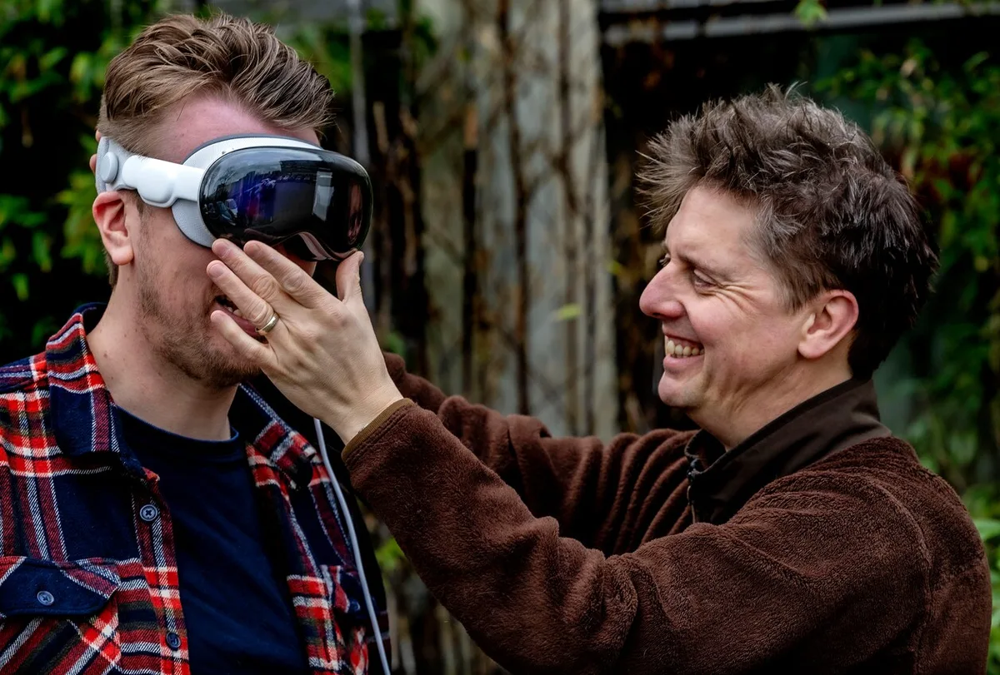

De Apple Vision Pro-bril moet volgens topman Tim Cook de wereld veranderen zoals de computer de wereld veranderde. Techverslaggever Bastiaan Vroegop kon de gadget van 3500 euro alvast uitproberen. Het beeld is waanzinnig mooi, merkte hij. Maar na een tijdje begon hij die extra 600 gram extra op zijn neus wel te voelen.

> [!NOTE]
> Dit artikel verscheen eerder op [AD](https://www.ad.nl/tech/apple-bril-van-3500-euro-veel-beter-dan-goedkopere-concurrent-waanzinnig-mooi-beeld~ad68e65b/).

De eerste keer dat je de Vision Pro opzet, is een vreemde ervaring. In een paar snelle stappen configureer je de bril voor gebruik, waarna ineens de echte wereld in beeld schiet. Het is net echt, al zijn de kleuren en het contrast net ietsje fletser dan wat je eigen ogen zullen zien.

Bovenop dat camerabeeld kan de Vision Pro van alles laten zien. Open de app van een streamingdienst en er verschijnt ineens een gigantisch grote tv in je blikveld. Je kunt dat scherm overal neerzetten, waarna hij ook daar in de ruimte blijft hangen. Je kunt er omheen lopen alsof het een gewone televisie is. Draai aan een knop aan de zijkant van de bril en je kunt de realiteit om je heen langzaam doen verdwijnen, zodat je de film kijkt in bijvoorbeeld een virtuele bioscoopzaal of in een natuurgebied.

De Vision Pro is niet de eerste bril die dit doet: eind vorig jaar bracht Facebook-moederbedrijf de Quest 3 uit, die op dezelfde manier de echte en digitale wereld combineert, en met een prijskaart van 550 euro veel goedkoper is.

Het verschil in kwaliteit is gigantisch. Waar de Quest 3 een uitgewassen beeld met korrelige camera-opnames toont, voelt de Vision Pro alsof het beeld bijna de realiteit weerspiegelt. Bij een film in de Quest 3 verlangden we na een tijd naar onze luxe 4K-televisie, terwijl de Vision Pro voelt alsof hij de beeldkwaliteit van die tv evenaart. Het is kort gezegd een waanzinnig mooi beeld.

## Besturen met je handen en ogen

Je bestuurt de Vision Pro volledig met je handen en ogen. In de headset zitten sensoren die volgen waar je ogen naar kijken, terwijl camera’s aan de buitenkant je vingers tracken. De bril weet naar welk app-icoon of knopje je kijkt, waarna je twee vingers samenknijpt om hier op te drukken. Het is een systeem waarop je moet leren vertrouwen. In het begin voelt het onnatuurlijk dat een apparaat weet waar je precies naar kijkt. Na een tijdje werkt dit echter vlekkeloos.

Die handbesturing komt ook van pas in tal van andere apps. Je kunt simpele games als Fruit Ninja spelen, waarin je met je vingers zo snel mogelijk rondvliegend fruit kapot moet snijden. Of je kunt een 3D-model van een Formule 1-auto met je handen uit elkaar halen, zodat je kunt zien wat er allemaal van binnen zit.

Bastiaan Vroegop. © Pim Ras Fotografie

Veel apps voor de Vision Pro zijn er nog niet. Dat onderstreept ook [Bright.nl](https://bright.nl/)\-hoofdredacteur Erwin van Der Zande: ,,Je hebt geen Netflix, YouTube of Spotify en ook Facebook heeft zijn apps niet uitgebracht. Dat is een flink rijtje dat ontbreekt.”

Een politiek steekspel tussen techgiganten lijkt daar de oorzaak van. Het is voor die bedrijven doodsimpel apps naar de Vision Pro te brengen: ze hoeven enkel een schakelaar om te zetten om hun iPad-app beschikbaar te stellen. Maar steeds meer bedrijven zijn ontevreden met Apples beleid in de App Store, waar hoge commissies worden gevraagd bij iedere aankoop. Door hun software nu weg te houden, geven ze een signaal af.

## Kleine gebreken

Er schuilt een soort magie in de Vision Pro. Nooit werden onze digitale en virtuele levens zo naadloos met elkaar samengesmolten. Andere makers van slimme headsets streefden hiernaar, maar Apple is het dichtstbij gekomen. De prachtige beeldschermen evenaren bijna de realiteit, de oog- en vingerbesturing voelen natuurlijk.

Zodra dat eerste bijzondere moment voorbij is, beginnen de kleine pijnpuntjes op te vallen. Bijvoorbeeld bij de camera’s: die weten inderdaad de wereld perfect vast te leggen, maar dan moet er wel genoeg licht zijn. Is het iets donkerder om je heen, dan ontstaat een ruis zoals je ook op bijvoorbeeld je nachtfoto’s ziet.

Daarnaast is het een 600 gram wegende machine die tegen je gezicht wordt geduwd. Dat gewicht voel je na een tijdje - bij onze test begon de hoofdhuid bovenop zelfs wat verdoofd te voelen. Dit is lang niet zo comfortabel als de bril die je bij een opticien koopt.

## Concurrent voor de iPad

,,Ik denk niet dat dit de telefoon snel zal vervangen”, voorspelt Van Der Zande. ,,Maar de iPad misschien wel. Net als bij de iPad kun je erop werken, maar is vooral het entertainment het leukst.”

De kale prijskaart van 3500 euro begrijpt Van Der Zande wel: ,,Het is echt niet alleen omdat er Apple op staat. Dit is state of the art-technologie.” Maar het is ook duidelijk de eerste generatie van dit product, waarbij Apple nog zoekende is hoe hij nu verbeterd moet worden. Ingewijden bij de techreus verwachten dat het nog drie tot vier upgrades zal duren tot het apparaat helemaal goed en goedkoop genoeg is voor het grote publiek. ,,Dan hebben we misschien wel de Apple Vision Mini of de Air.”

## Nog niet in Nederland

De Apple Vision Pro wordt nog niet in Nederland verkocht. De techreus richt zich eerst op de markt in thuisland Amerika, om de gadget later langzaam naar andere landen uit te rollen. Het zal vermoedelijk nog een jaar duren tot hij in Europa wordt verkocht, maar Erwin van der Zande, hoofdredacteur van techwebsite Bright, heeft de gadget alvast uit de Verenigde Staten geïmporteerd. Een dure grap: ,,De bril zelf kost 3500 euro, maar dan heb je nog belasting, verzendkosten en invoerrechten. Ik haalde er ook de bijbehorende tas en een extra batterij bij, bij elkaar kostte het wel 6000 euro.”
