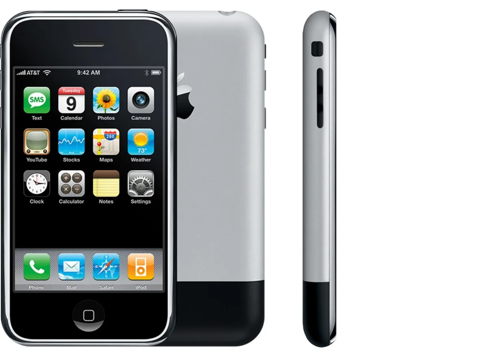
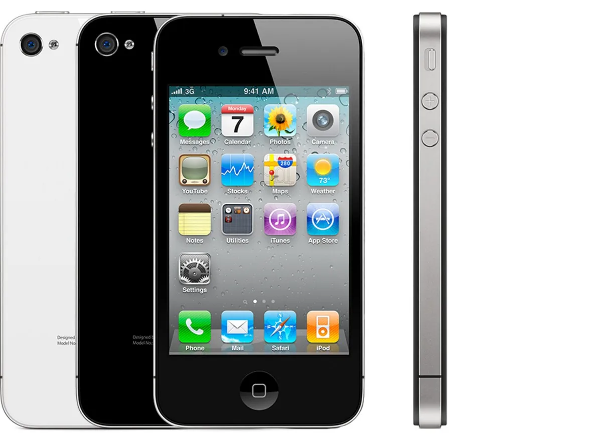
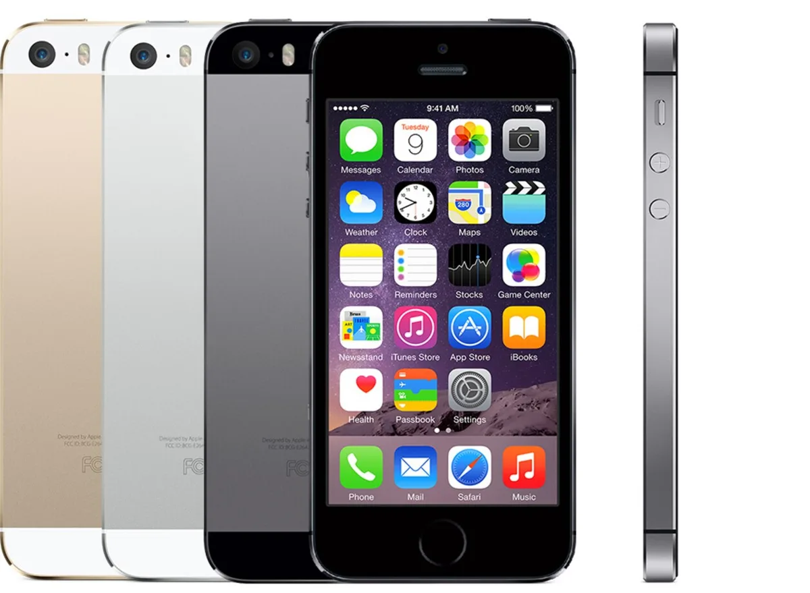
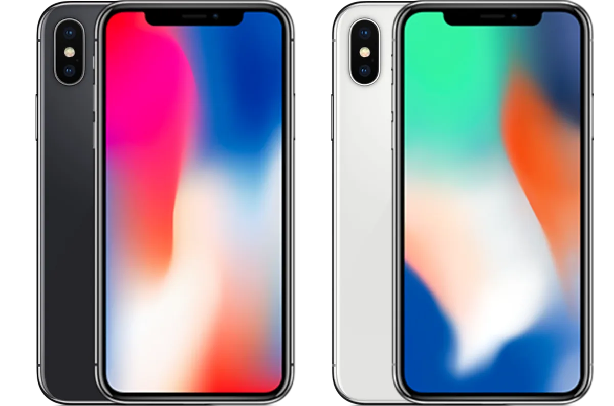

Op woensdag 7 september onthult Apple de nieuwste generatie iPhones. De Apple-smartphone is sinds dit jaar alweer 15 jaar oud, hoe is de telefoon in anderhalf decennium veranderd?

> [!NOTE]
> Dit artikel verscheen eerder op [AD](https://www.ad.nl/tech/apple-gaat-de-iphone-14-onthullen-hoe-is-de-smartphone-afgelopen-15-jaar-veranderd~a57a1112/).

Toenmalig topman Steve Jobs wilde in 2007 drie producten aankondigen: een telefoon, een muziekspeler en een internetapparaat. Toen hij verklapte dat deze drie apparaten eigenlijk één en dezelfde gadget waren, leidde tot luid applaus uit de zaal.

Hoewel er al slimme telefoons met internettoegang waren, was het Apple die bepaalde hoe de moderne smartphone eruit zou zien. Dat merk je ook als je naar foto’s van oude smartphones kijkt. Toestellen van voor 2007 hadden onhandige toetsenbordjes en gekke software, terwijl na 2007 iedereen ook voor een touchscreen met bijbehorende homeknop koos.

_De redactie van BestGetest zette_ [de beste smartphones](https://bestgetest.nl/de-beste-smartphones-van-2022?utm_source=ad&utm_medium=tekstlink&utm_term=byo&utm_campaign=redactioneel&utm_content=iphone15jaar) _op een rij._

## 2007: een iPhone zonder App Store en snel internet

De eerste iPhone is naar moderne maatstaven niet een heel bijzonder apparaat meer. Zo had het toestel geen 3G-internet, waardoor je buiten de deur werd geconfronteerd met zeer langzaam internet. Maar misschien nog wel opmerkelijker is het ontbreken van de App Store: de smartphone kon alleen Apples ingebakken apps draaien. Wilde je buiten Apple om iets doen, dan kon dat hooguit via de webbrowser.

Apple verkocht zijn eerste iPhone ook niet in Nederland. Wie de telefoon hier wilde proberen, moest fors betalen om hem te importeren en hem vervolgens hacken om hem te laten werken met onze telecomnetwerken. De iPhone was in 2007 een hobbydingetje in Nederland, dat pas een jaar later hier echt groot zou worden.

De eerste iPhone had langzaam internet en geen App Store. © Apple

## 2008: de iPhone krijgt apps en 3G

Met de iPhone 3G verkocht Apple eindelijk een smartphone die (voor toen) snel internet ondersteunde, voor het eerst ook in Nederland. De metalen achterkant was omgewisseld voor een plastic variant in de kleuren zwart of wit.

Dit was ook de eerste iPhone waarbij Apple zijn appwinkel introduceerde. Softwaremakers konden eigen applicaties voor de iPhone maken en via de techgigant verkopen. Daar ving Apple een commissie van 30 procent per verkochte app op, waardoor de softwaretak van het bedrijf gigantisch groeide. Het groeide uit tot een miljardenindustrie, waar ook WhatsApp voor het eerst het licht zag.

De meeste iPhone-apps waren toen vooral simpel, zoals een bier-app die je met de bewegingssensor van de telefoon kon bedienen. Zo kon je doen alsof je een glas leegdronk. Of een lichtzwaard uit _Star Wars_ dat geluid maakte als je hem rondzwiepte.

## 2010 en 2011: een iconisch ontwerp en de dood van Steve

In 2009 kreeg de iPhone 3G een iets snellere variant, waarna de volgende echt noemenswaardige upgrade in 2010 kwam. Het ontwerp van de telefoon werd helemaal veranderd, met een metalen band rond het scherm en een glazen achterkant. Het plastic imago van de iPhone was daarmee verleden tijd, maar het vernieuwde design had ook een nadeel: wie de telefoon op een specifieke manier vasthield had ineens geen mobiel bereik meer. Het techbedrijf laste een spoedpresentatie in waarbij werd uitgelegd hoe je de telefoon ‘goed’ moest vasthouden. Het was het eerste echte schandaal rond de iPhone, getiteld _antennagate_.

In 2011 kreeg de iPhone 4 een snellere variant die ook de slimme assistent Siri introduceerde. Een telefoon die een dag voor Steve Jobs zijn overlijden werd onthuld. Bij dit S-model zag Apple de verkopen explosief groeien en leek de smartphone definitief een plek in al onze levens te hebben verworven.

Bij de iPhone 4 stapte Apple af van het plastic imago. Maar het was ook de eerste iPhone die bij een schandaal betrokken was. © Apple

## 2013: eindelijk een vingerafdrukscanner

Grotere schermen, een kleinere aansluitkabel en herontwerpen volgden, waarna Apple in 2013 de volgende grote stap maakte. De iPhone had voortaan een vingerafdrukscanner, zodat je niet altijd meer je pincode hoefde in te tikken.

Ook bracht het bedrijf voor het eerst meerdere nieuwe telefoons tegelijkertijd uit. Naast de snellere iPhone 5S was er ook de iPhone 5C, een iets goedkoper alternatief met een kleurrijke, plastic achterkant. In de jaren daarna zou de techreus steeds weer meerdere variaties van de iPhone uitbrengen, zoals Plus-modellen met grotere schermen. De tijd van één nieuwe iPhone per jaar was voorbij. En ook de tijd van de koptelefoonpoort: deze verdween in 2017 uit de iPhones.

De iPhone 5S kreeg als eerste een vingerafdrukscanner. © Apple

## 2017: het einde van de homeknop

Jarenlang bleef het ontwerp van de iPhone ongeveer hetzelfde: je had een scherm omhuld door dikke randen, met onderop een knop waarmee je weer naar het thuisscherm kon. Concurrenten hadden op hun beurt steeds vaker toestellen met randloze schermen, een voorbeeld dat Apple in 2017 ook volgde. De nieuwe iPhone X had niet langer een thuisknop, maar een beeldscherm dat de volledige voorkant bedekte.

Controversieel was de bovenkant van dat scherm, waar een inkeping zat voor de camera en sensoren voor gezichtsherkenning. Het oogde gek en afwijkend van Android-concurrenten, maar bleek al snel iconisch. Inmiddels apen meerdere concurrenten dit ooit zo bekritiseerde ontwerp na.

Weg was de homeknop met de iPhone X. © Apple

## Op weg naar een compleet poortloze iPhone?

Sinds de iPhone X is de smartphone ieder jaar weer iets verbeterd. Het luxere oledscherm zit sinds de iPhone 12 bijvoorbeeld ook in veel goedkope modellen en inmiddels verkoopt Apple zelfs een mini-variant. Het aantal camera’s achterop is langzaam gestegen naar drie bij de Pro-modellen, met lenzen voor bredere hoeken en om mee te zoomen.

Volgens ingewijden geeft Apple de iPhone dit jaar een kleine update, maar staat grote verandering om de hoek. Er zou een model worden getest dat helemaal geen poorten meer heeft en daarom alleen draadloos kan worden opgeladen. Het moet de smartphone nog beter bestand maken tegen water en stof.

Al kan dit toestel slecht in de smaak vallen bij Europa: nieuwe wetgeving verplicht telefoonfabrikanten hier om een usb-c-aansluiting te bieden, zodat alle smartphones met één kabel opgeladen kunnen worden. Hoe dat uitpakt, ontdekken we vermoedelijk in 2023.
