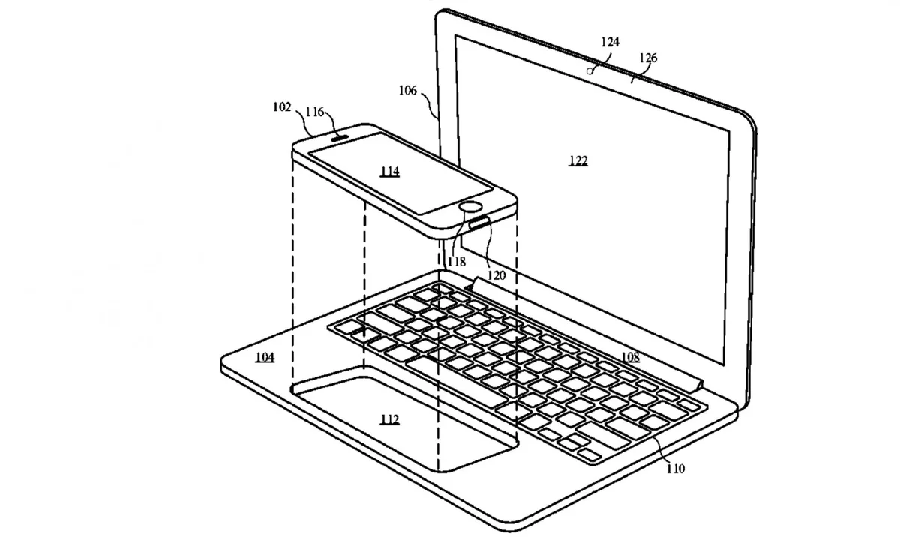

**Vlees noch vis**

> [!NOTE]
> Dit artikel verscheen eerder op [Bright](https://www.bright.nl/nieuws/1125144/apple-onderzocht-macbook-waar-je-iphone-stopt.html).

Dat blijkt uit een patent dat Apple in 2018 [aanvroeg](http://patft.uspto.gov/netacgi/nph-Parser?Sect1=PTO2&Sect2=HITOFF&u=%2Fnetahtml%2FPTO%2Fsearch-adv.htm&r=43&p=1&f=G&l=50&d=PTXT&S1=apple.AANM.&OS=aanm/apple&RS=AANM/apple). Inmiddels is deze aanvraag openbaar gemaakt, waardoor iedereen hem kan inzien.

In de documenten staat een traditionele iPhone die onder het toetsenbord van een laptop kan worden bevestigd. Hierdoor wordt de smartphone met het beeldscherm en toetsenbord verbonden, waardoor hij in feite in een MacBook verandert.

In het laptopgedeelte kan ook extra hardware zitten, zoals een krachtigere processor en meer opslag. Op die manier kan de telefoon worden gebruikt voor intensievere werkzaamheden.

Het patent beschrijft ook andere mogelijkheden. In plaats van dat je een smartphone in de ruimte van de trackpad stopt, zou het ook mogelijk zijn om een iPad in de beeldschermruimte te steken. Hierdoor kan deze tablet ook als laptop worden gebruikt.

## Concurrenten

Het is overigens nog maar de vraag of Apple dit hybride systeem ook echt gaat bouwen. Het techbedrijf legt vaker ideeën vast waar vervolgens niks mee wordt gedaan, omdat het project daarna in de ijskast is beland.

Concurrenten van Apple hebben ook al eens laptops met smartphones gecombineerd. In 2016 testten we al eens een [HP-smartphone](https://www.bright.nl/tests/artikel/3945341/eerste-indruk-hp-smartphone-die-je-als-laptop-kunt-gebruiken) die via een speciale dock als laptop of desktop gebruikt kon worden.

Ook zijn recente Samsung-smartphones met behulp van [DeX](https://www.bright.nl/tests/artikel/3919081/uitpakparty-samsung-dex) als traditionele computer te gebruiken.

[Bekijk ingesloten media](https://www.youtube.com/embed/CD0spup1FZI?autoplay=1&modestbranding=1)

## Review: Nieuwe 16 inch MacBook Pro

**[Volg Bright op YouTube](https://bit.ly/brighttv) voor meer tech-video's**
