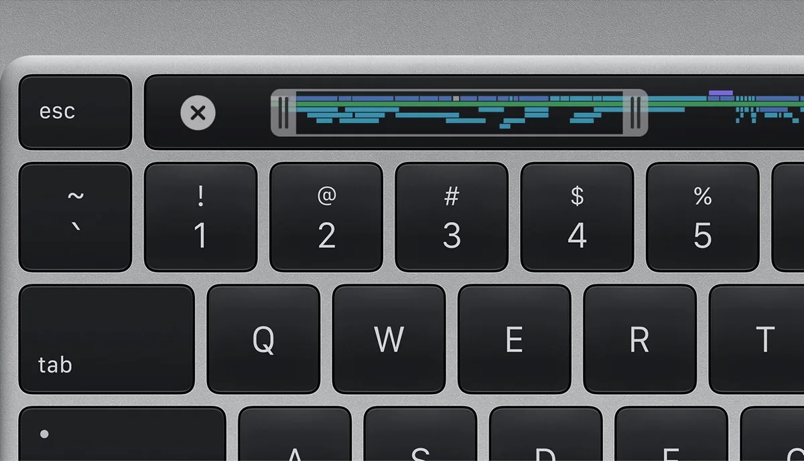

**Betere knoppen**

> [!NOTE]
> Dit artikel verscheen eerder op [Bright](https://www.bright.nl/nieuws/1124403/apple-onthult-16-inch-macbook-met-vernieuwd-toetsenbord.html).

Apple heeft al jaren niet zo'n groot scherm in een MacBook gestopt. Vroeger verkocht het bedrijf een 17 inch-laptop, maar deze wordt al sinds 2012 niet meer aangeboden. De algehele grootte van de nieuwe MacBook is [ongeveer gelijk](https://www.apple.com/nl/macbook-pro-16/) aan de eerdere 15 inch-laptop, wat te danken is aan de dunnere schermranden. Het scherm heeft een resolutie van 3072 bij 1920 pixels.

Het toetsenbord gebruikt een herontworpen versie van het schaarmechanisme dat Apple vroeger in keyboards gebruikte. Knoppen gaan een millimeter diep als je ze indrukt. Het herontwerp is volgens de techreus geïnspireerd door het losse Magic Keyboard dat al langer wordt verkocht.

Daarmee stapt Apple weer weg van het [vlindersysteem](https://www.bright.nl/nieuws/artikel/4764821/apple-gaat-nieuw-probleem-macbook-air-gratis-repareren) dat in recente MacBook-toetsenborden werd gebruikt. Deze knoppen werden de afgelopen jaren veelvuldig [bekritiseerd](https://www.bright.nl/nieuws/artikel/4768346/macbook-air-en-pro-krijgen-weer-normaal-scissor-toetsenbord), onder andere omdat de knoppen makkelijk bleven klemmen als er vuil onder terechtkwam.

## 8TB opslag

In de laptop is een octacore-processor die volgens Apple tot tachtig procent sneller is dan de chips in voorgaande MacBook Pro's. Een vernieuwd koelsysteem zorgt ervoor dat lucht makkelijker door de laptop blaast. Het duurste model wordt geleverd met maximaal 8TB opslag.

De nieuwe MacBook Pro wordt verkocht vanaf 2.699 euro in Nederland. Apple heeft overigens nog niks gezegd over een opvolger van de huidige 13 inch MacBook Pro, die nog steeds het oude toetsenbord gebruikt. Volgens geruchten wordt die in 2020 gepresenteerd.

## De beste laptops voor op school of werk

[Bekijk ingesloten media](https://www.youtube.com/embed/pKBE7ecGrak?autoplay=1&modestbranding=1)

**[Volg Bright op YouTube](https://bit.ly/brighttv) voor meer tech-video's**
