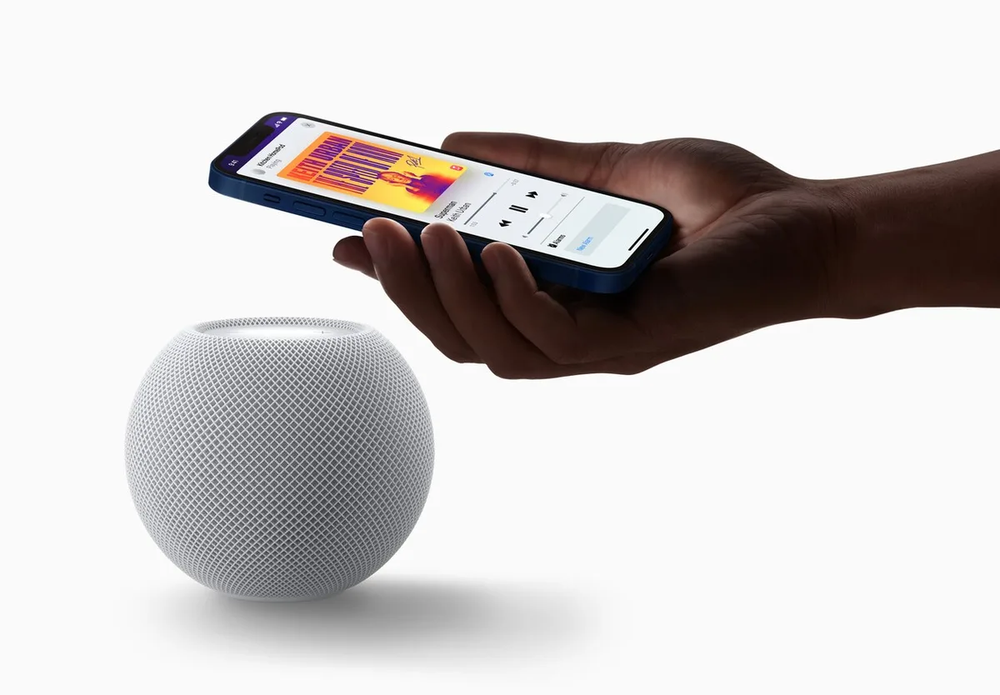

Techreus Apple is eindelijk begonnen met de verkoop van zijn slimme HomePod Mini-luidspreker in Nederland. Met zijn stembediening lijkt hij erg op de al veel langer verkrijgbare Nest Mini van Google, maar er zijn een paar dingen die alleen de Apple-gadget kan. We zetten ze op een rij.

> [!NOTE]
> Dit artikel verscheen eerder op [AD](https://www.ad.nl/tech/apple-start-verkoop-slimme-speaker-in-nederland-vijf-voordelen-en-een-groot-nadeel~a62bba14d/).

De HomePod is een bolvormige luidspreker die groter klinkt dan hij er uitziet. Een ingebouwde chip analyseert je muziek continu om de instellingen aan te passen, wat resulteert in een mooi, vol geluid. Hij was al jarenlang in andere landen te koop, maar is vanaf vandaag ook in Nederland te bestellen.

Goedkoop is ie niet: met de prijs van 109 euro zou je bijna vier van Googles Nest Mini-luidsprekers kunnen kopen. Maar voor wie bij zijn of haar iPhone zweert, biedt de HomePod Mini een paar voordelen die je niet bij de concurrentie vindt.

## Bellen met je HomePod Mini

Met een simpel spraakcommando kun je stemassistent Siri vragen iemand te bellen op de HomePod. De speaker maakt dan verbinding met de iPhone die je gebruikte om hem in te stellen, of legt een verbinding via FaceTime Audio.

Je kunt met Googles concurrerende luidsprekers ook gesprekken voeren, maar dat moet dan via de losse bel-app Duo, die lang niet iedereen gebruikt. De HomePod gebruikt echter je ‘gewone’ telefoonnummer, waarmee iedereen te bereiken is.

Je kunt muziek snel naar de HomePod verplaatsen door je iPhone er boven te houden. © Apple

## Geef een tikje op je HomePod

De HomePod en iPhones hebben speciale apparatuur, waardoor ze weten wanneer je de ene boven de ander houdt. Hierdoor kunnen beide muziek en andere audio aan elkaar doorgeven. Het is een wat snellere, fysieke manier om de afspeellocatie van je tracks te wisselen.

Speel je muziek op je iPhone, dan hoef je de telefoon alleen maar boven de speaker te houden om naadloos hierop verder te spelen. En als je daarna de deur uitgaat en verder wil luisteren op je AirPods, hang je de telefoon er nog eens boven om de tracks daar voort te zetten.

## Geluid afspelen via AirPlay

Apple en Google hebben beide hun eigen protocollen om audio vanaf je telefoon af te spelen op een ander apparaat. Bij de Nest-speakers kun je via Google Cast je telefoongeluid afspelen, terwijl je bij een HomePod Mini hetzelfde kunt doen met AirPlay.

Die AirPlay-ondersteuning is belangrijk voor iPhone-bezitters. Omdat dit een Apple-protocol is, kun je namelijk audio uit nagenoeg iedere app op die manier naar de HomePod verplaatsen. Dat terwijl Google Cast in iPhone-apps moet zijn geïntegreerd om dit goed te gebruiken, wat niet bij iedere app het geval is.

## HomePod Mini werkt met Apple Opdrachten

Apple heeft een vrij uitgebreide iPhone-app genaamd Opdrachten, waarmee je complexe acties zelf kunt programmeren. Zo maak je bijvoorbeeld een iPhone-knop die de lichten uitzet, het slot vergrendelt en een sms’je naar je partner verstuurd om te vertellen dat je weggaat.

Die Opdrachten kun je ook koppelen aan je HomePod-speakers. Zo speel je bijvoorbeeld een geluidje af zodra er een beweging in een kamer wordt gedetecteerd, of wordt de muziek van je favoriete afspeellijst opgestart.

## Gebruiken als speakers voor je Mac of Apple TV

Je kunt de HomePod als bron kiezen voor het geluid van je Mac of Apple TV, zodat je niet langer de ingebouwde speakers van beide hoeft te gebruiken. Dat maakt de HomePod Mini een handig alternatief voor bijvoorbeeld een soundbar. Vooral handig als je er twee hebt, want die kun je in stereomodus verspreid door de kamer zetten.

Die HomePod-verbinding werkt prima bij het afspelen van video’s, maar we merkten wel wat vertraging op als er snelle systeemgeluiden werden afgespeeld. Vooral gamegeluidjes leken een tel of twee later binnen te komen. Dus doe je dit, beperk je dan tot het kijken van films en series.

## Wat niet werkt: Spotify

Bovenstaande voordelen daargelaten, is er wel één punt waar de Google-concurrent mee wint: op een Nest Mini kun je via de stemassistent muziek op Spotify afspelen. Een belangrijk streepje voor, omdat Spotify op het moment marktleider in Nederland is.

Je HomePod kan wel Spotify-muziek afspelen, maar dan moet je het vanaf een iPhone AirPlayen. Je tracks aanzetten met stembediening zit er met Spotify bij de HomePod niet in. Wie per se een HomePod wil voor muziek, moet dus overstappen naar Deezer of Apple Music.
