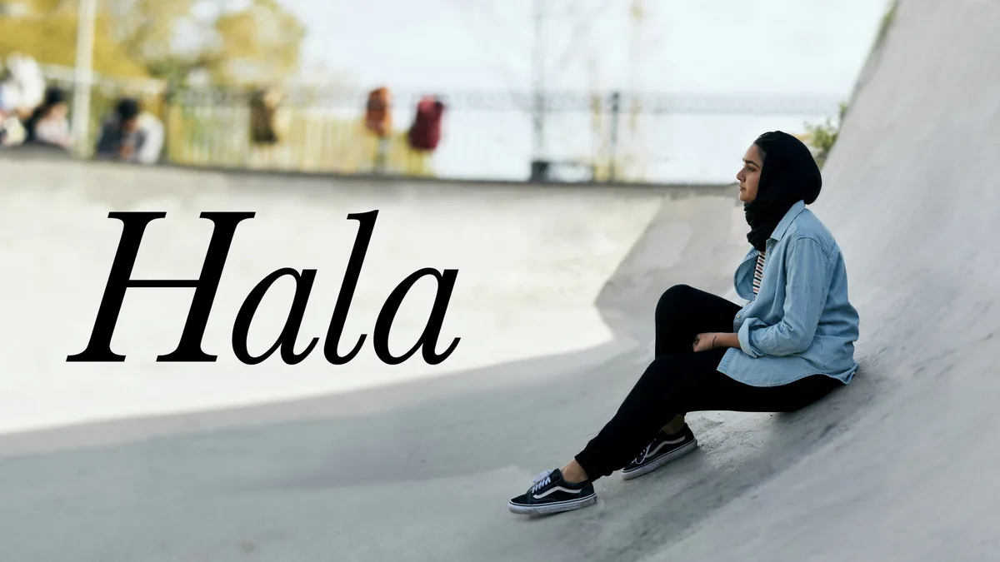
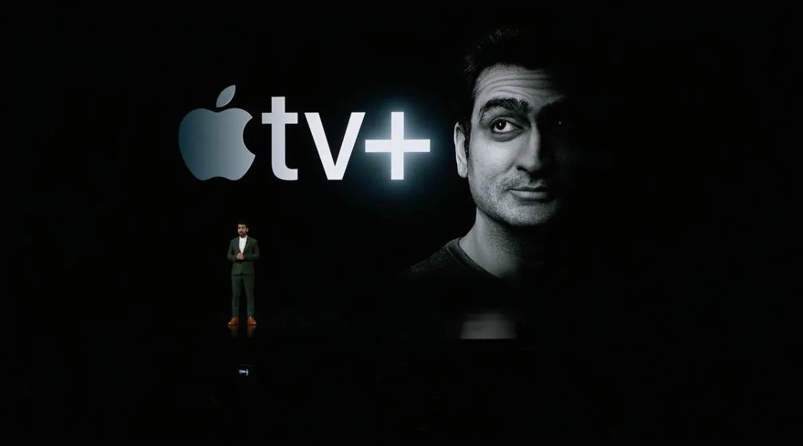
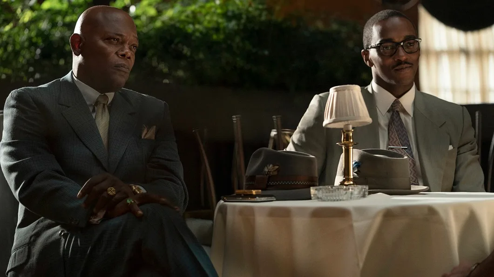

**Overzicht**

> [!NOTE]
> Dit artikel verscheen eerder op [Bright](https://www.bright.nl/nieuws/1124099/apple-tv-series-en-films-disney-netflix-videoland-morning-show-see-korting.html).

[Bekijk ingesloten media](https://www.youtube.com/embed/DBFCTHE-qbc?autoplay=1&modestbranding=1)

## Eerste indruk: Apple TV+

[Apple TV+](https://tv.apple.com/) is vrijdag 1 november wereldwijd van start gegaan. Een abonnement op de streamingdienst kost [5 euro per maand](https://www.bright.nl/nieuws/artikel/4844066/apple-tv-plus-videodienst-streamingdienst-prijs-arcade-games) of 50 euro per jaar. Apple TV+ is een week lang gratis te proberen. Heb je dit jaar een nieuwe iPhone, iPad, Mac of Apple TV gekocht? Dan krijg je daar een gratis jaarabonnement op Apple TV+ bij.

Hieronder lees je over de series en films op de Apple-streamingdienst. Het is nog niet bekend of er veel extra titels aan het assortiment worden toegevoegd. Apple zei eerder de nadruk te willen leggen op kwaliteit in plaats van kwantiteit.

[Bekijk ingesloten media](https://www.youtube.com/embed/eA7D4_qU9jo?autoplay=1&modestbranding=1)

## The Morning Show

**Type:** Serie   **

Genre:** Drama

Jennifer Aniston, Reese Witherspoon en Steve Carell spelen in deze serie over een redactie bij een groot ochtendprogramma. Nadat één van de presentatoren wordt ontslagen om aantijgingen, begint ook de loopbaan van zijn collega te ontsporen. De cast van de serie zit vol notabele comedy-acteurs, maar The Morning Show is allesbehalve een grappige serie: Apple belooft een dramaserie die een rauw kijkje naar de werkverhoudingen tussen mannen en vrouwen moet bieden.

[Bekijk ingesloten media](https://www.youtube.com/embed/7Rg0y7NT1gU?autoplay=1&modestbranding=1)

## See

**Type:** Serie   **

Genre:** Drama/Sci-fi

Volgens Apple wordt See "[even episch als Game of Thrones](https://www.bright.nl/nieuws/artikel/4885326/apple-tv-serie-see-wordt-net-zo-episch-als-game-thrones)". De serie speelt zich honderden jaren in de toekomst af, in een tijd dat de gehele mensheid blind is geworden. Tot opeens de kinderen van Baba Voss (Jason Momoa) geboren worden en perfect om zich heen kunnen kijken. See wil een uitgebreide dystopie neerzetten en heeft een cast vol met blinde en slechtziende acteurs.

[Bekijk ingesloten media](https://www.youtube.com/embed/_GtV9V0dBgw?autoplay=1&modestbranding=1)

## Dickinson

**Type:** Serie  **

Genre:** Comedy

In comedyserie Dickinson volgen we aspirerend schrijver Emily Dickinson (Hailee Steinfeld) in de 19e eeuw terwijl ze volwassen wordt. De serie is gebaseerd op de gelijknamige dichter die van 1830 tot en met 1886 leefde in de Verenigde Staten - en laat volgens Apple zien waarom ze een onverwachte held is voor hedendaagse millennials.

[Bekijk ingesloten media](https://www.youtube.com/embed/N3RjayAF0b4?autoplay=1&modestbranding=1)

## For All Mankind

**Type:** Serie  **

Genre:** Drama

Wat als de Russen eerder op de maan waren geland en de Verenigde Staten sindsdien nog steeds verder in de ruimte probeert te komen? Dat is het idee achter For All Mankind, dat daarmee de grote ruimterace tussen de grootmachten onder de loep neemt.

[Bekijk ingesloten media](https://www.youtube.com/embed/U9xMsmXvG04?autoplay=1&modestbranding=1)

## Helpsters

**Type:** Serie  **

Genre:** Kinderen

Deze serie ziet er niet alleen uit als Sesamstraat: hij is ook van de makers van Sesamstraat. Helpsters is Apples grote serie voor de jongste kijkers, vol met liedjes en raadsels.

[Bekijk ingesloten media](https://www.youtube.com/embed/yAQhiWNWHSw?autoplay=1&modestbranding=1)

## Snoopy in Space

**Type:** Serie   **

Genre:** Kinderen

Tekenfilmhond Snoopy zal ook op Apple TV+ debuteren, in een serie van twaalf korte afleveringen waarin hij de ruimte ingaat met NASA. Naast Snoopy zullen ook Charlie Brown en de andere Peanuts-kinderen in de serie zitten.

[Bekijk ingesloten media](https://www.youtube.com/embed/FyHYMozXc4A?autoplay=1&modestbranding=1)

## Ghostwriter

**Type:** Serie   **

Genre:** Kinderen

Ghostwriter is voor iets oudere kinderen bedoeld. Een spook in een bibliotheek duikt boeken in om fictieve personages naar de echte wereld te drijven, waar een groep kinderen ze moet tegenhouden.

[Bekijk ingesloten media](https://www.youtube.com/embed/e8TsCQmngFk?autoplay=1&modestbranding=1)

## The Elephant Queen

**Type:** Documentaire

Deze documentaire volgt de olifant Athena, die al jaren haar familie begeleidt in Oost-Afrika. De makers van deze film hebben 25 jaar lang in de bossen geleefd om zich voor te bereiden. De documentaire vliegt al langer de wereld rond om op festivals vertoond te worden, maar zal bij Apple TV+ voor het eerst voor iedereen te zien zijn.

## Later dit jaar beschikbaar

Onderstaande series zijn nog niet op dag één te bekijken, maar verschijnen wel in november of december op Apple TV+.

[Bekijk ingesloten media](https://www.youtube.com/embed/P8oCI9cOc2w?autoplay=1&modestbranding=1)

## Servant

**Type:** Serie   **

Genre:** Drama   **

Beschikbaar op:** 28 november 2019

M. Night Shyamalan's psychologische thriller verschijnt aan het einde van november op Apple TV+. In de serie volgen we een rouwend stel dat net hun kind heeft begraven, waarbij iets mysterieus het huis binnenkomt. Details over de serie zijn tot nu toe schaars.

[Bekijk ingesloten media](https://www.youtube.com/embed/HjGm7JUc04E?autoplay=1&modestbranding=1)

## Truth Be Told:

**Type:** Serie   **

Genre:** Drama   **

Beschikbaar op:** 6 december 2019

Podcaster Poppy Parnell had een grote, nationale podcast over een moordzaak, die ertoe leidde dat een man de cel in moest. Later stuit ze echter op bewijs dat de veroordeelde man vrijpleit. Deze serie is gebaseerd op een gelijknamig boek over de hype rond true-crime-podcasts.

## "Binnenkort verkrijgbaar"

Nog niet alle producties voor Apple TV+ hebben een datum. Sommige titels zijn wel al aangekondigd, maar is het nog niet bekend wanneer ze beschikbaar zijn.

[Bekijk ingesloten media](https://www.youtube.com/embed/8PdJvXfw76k?autoplay=1&modestbranding=1)

## Oprah

**Type:** Serie   **

Genre:** Talkshow   **

Beschikbaar op:** n.n.b.

De geroemde talkshowhost is terug, maar ditmaal om op Apple TV+ een wereldwijde boekenclub te starten. Kijkers kunnen meelezen en nieuwe afleveringen kijken om up-to-date te blijven. Veel details over de nieuwe serie zijn nog niet bekend en hij zal ook niet meteen op 1 november van start gaan.

## Hala

**Type:** Film   **

Genre:** Drama   **

Beschikbaar op:** n.n.b.

De 17-jarige Hala wordt verliefd op een klasgenoot, waardoor ze twijfels begint te krijgen over haar conservatieve Islamitische opvoeding. Tegelijkertijd is ze bang dat haar familie ten onder gaat aan haar relatie.

## Little America

**Type:** Serie   **

Genre:** Waargebeurde verhalen   **

Beschikbaar op:** n.n.b.

Een verfilming van waargebeurde verhalen van Amerikaanse immigranten in Epic Magazine, die de menselijke kant van asielzoekers en immigratie moeten laten zien. Gemaakt door onder andere de makers van The Office, The Big Sick, Masters of None en andere recente comedyseries.

## The Banker

**Type:** Film   **

Genre:** Drama   **

Beschikbaar op:** n.n.b.

Gebaseerd op het waargebeurde verhaal van twee zakenmannen die zwarte Amerikanen hielpen om hun bedrijven te starten in de racistische jaren '60. Ze leiden een witte man op om te poseren als het gezicht van hun organisatie, terwijl ze zelf doen alsof ze een conciërge en chauffeur zijn.

[Bekijk ingesloten media](https://www.youtube.com/embed/cyOMZJZYttc?autoplay=1&modestbranding=1)

## Little Voice

Type: Serie
**Genre:** Romantiek/Comedy/Drama   **

Beschikbaar op:** n.n.b.

Een met muziek gevulde serie over het vinden van je eigen stem in de jaren '20. Muziek wordt gemaakt door Sara Bareilles, die ook bekend is van Waitress. Daarnaast wordt de serie geproduceerd door het bedrijf van J.J. Abrams (Star Wars: The Force Awakens), Sara Bareilles en Jessie Nelson (I Am Sam).

**Meer tech-video's? Abonneer je op het [Bright YouTube-kanaal](https://bit.ly/brighttv).**
