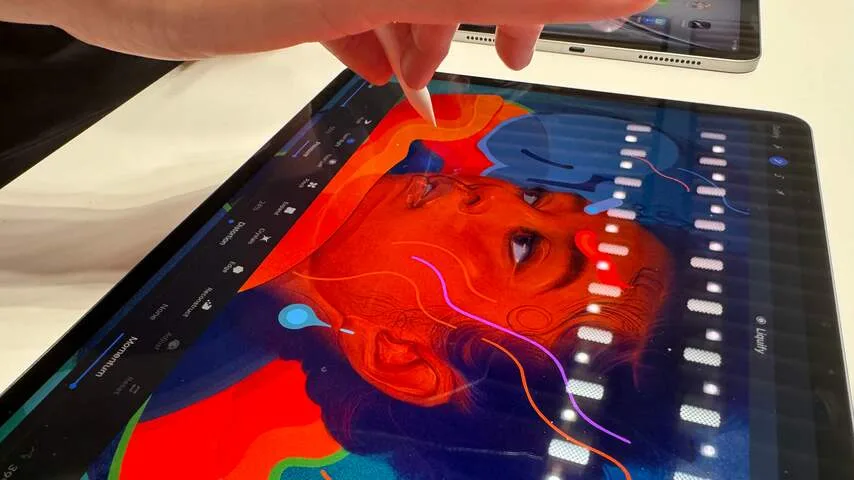
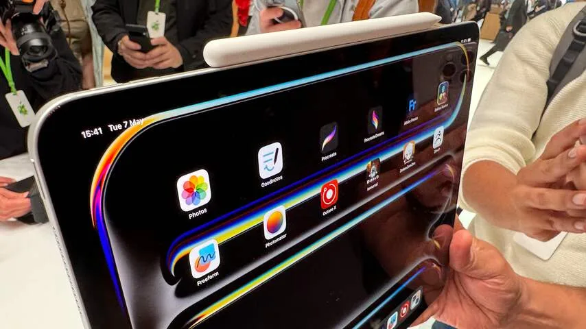

**Kort na de presentatie van twee nieuwe iPads konden we de nieuwe tablets alvast onder handen nemen. Daarbij werd vooral één ding duidelijk: Apple ziet de iPad vooral als een apparaat om dingen op te maken.**

> [!NOTE]
> Dit artikel verscheen eerder op [NU.nl](https://www.nu.nl/tech/6311993/apples-nieuwe-tablets-zijn-duidelijk-bedoeld-voor-makers.html).

De iPad Air heeft na twee jaar een nieuwe versie, met als meest kenmerkende verschil een tweede, grotere variant. Daarnaast is de iPad Pro voorzien van een mooier OLED-scherm en snellere M4-processor. De Pro is ook dunner geworden en weegt 443 gram - waardoor zelfs het grootste model tussen twee vingers vast te houden is.

Het meest kenmerkende is een accessoire voor beide tablets: de Apple Pencil Pro. Deze herziene versie van Apples bekende pennetje heeft extra sensoren die zien wanneer je er in knijpt, waardoor je een extra menu met opties kunt openen. Een motortje bovenin zorgt dat je deze interactie ook kunt 'voelen'.

_Apples nieuwe tablets zijn duidelijk bedoeld voor makers — Beeld: Bastiaan Vroegop_

Ook kun je de pen tussen je vingers rollen. Zo draai je bijvoorbeeld een kwast voor een ander soort penseelstreek, of roteer je een object dat je net hebt geselecteerd. Een kleine vernieuwing, maar het is tegelijkertijd hetgeen waar Apple ooit groot mee werd: ze maken een fysieke beweging uit de echte wereld op natuurlijke wijze digitaal.

## Oled-scherm (binnen) mooi

Uiteraard is er nog veel meer mee gebeurd: het nieuwe OLED-scherm van de iPad Pro’s zag er bij onze eerste tests buitengewoon goed uit, met een contrastwaarde die we nooit eerder in een iPad zagen.

Apple belooft een hoge piekhelderheid die ook bij daglicht goed af te lezen is, maar de ruimte waar wij konden testen was vrij donker. Het is dus nog onduidelijk of het bedrijf die belofte waarmaakt.

_Apples nieuwe tablets zijn duidelijk bedoeld voor makers — Beeld: Bastiaan Vroegop_

De iPad Pro heeft bovendien een M4-chip, de nieuwste generatie die het bedrijf nog niet aan zijn Macs heeft toegevoegd. Maar het zijn de nieuwe interacties van de Apple Pencil Pro die het meeste bijblijven: ze laten zien hoe je de tablets op nieuwe manieren kunt gebruiken.

## iPads om iets op te maken

Althans, als je de iPad gebruikt om te illustreren. Het snel wisselen tussen penseelstreken en andere teken-opties is niet heel relevant als je hooguit af en toe een notitie met de pen krabbelt. Apple richt zich met de Apple Pencil Pro duidelijk op mensen die de tablet professioneel gebruiken.

Dat geldt voor alle noemenswaardige aankondigingen tijdens het evenement. De processorkracht van de M4 is vast indrukwekkend, maar komt pas tot zijn recht als je bijvoorbeeld video’s bewerkt op de tablet. Wie vooral een filmpje op Netflix streamt zal vermoedelijk geen groot verschil merken.

Apple leek afgelopen jaren zoekende te zijn naar een publiek voor de iPad. Jaren terug lag de focus even op onderwijs, maar met het stranden van iPad-scholen is de aandacht hierop verdwenen.

Een enkelvoudig doel had de tablet niet, hij werd vermarkt als streaming-machine, Facebook-browser of tekengadget. Met de onthulling van de nieuwe iPads lijkt het bedrijf duidelijk kant te kiezen: de iPad Air en Pro zijn bedoeld om dingen op te maken.

## Duurder

Wil je een simpele tablet, dan kun je altijd de goedkoopste iPad halen die ietwat in prijs is gedaald. Dat is overigens ook de enige prijsdaler: de iPad Pro is met zijn nieuwe versie 150 euro duurder geworden, de Air steeg 20 euro in prijs.
