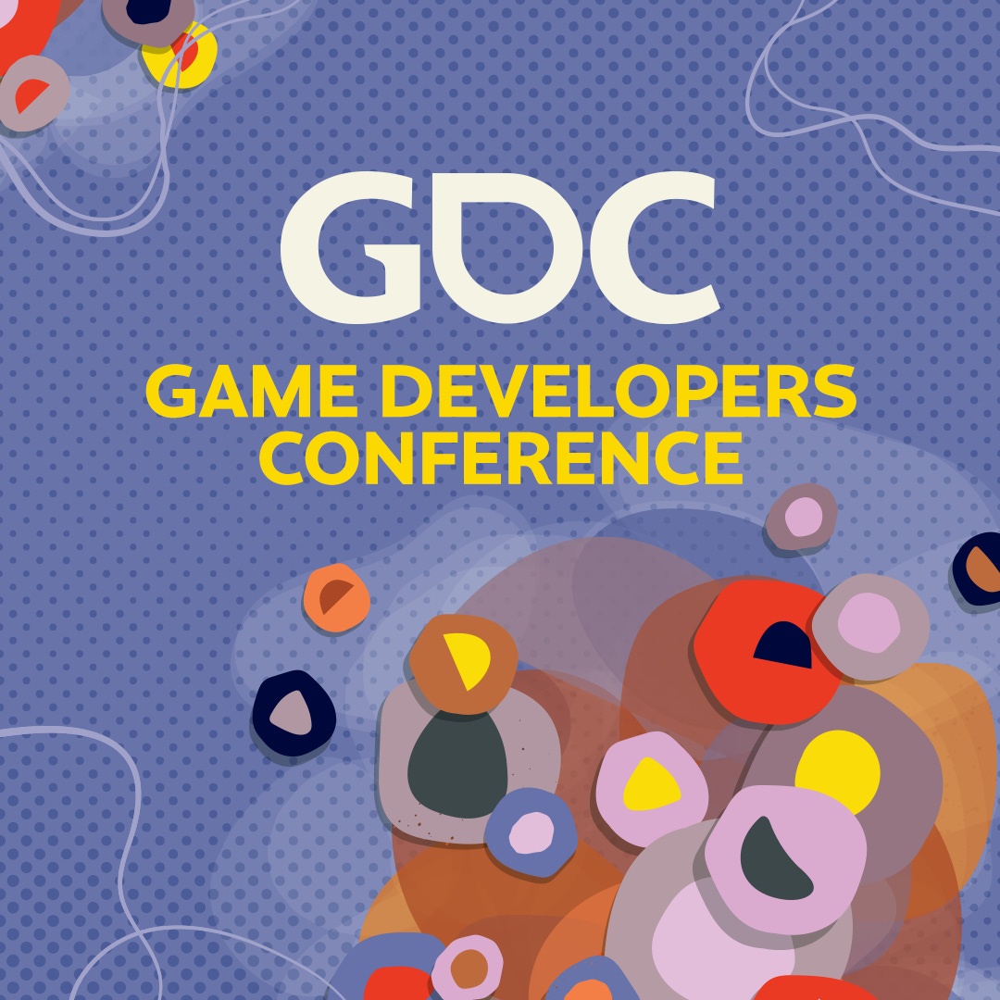

Het is een week waarin nerveus naar kunstmatige intelligentie wordt gekeken. De nieuwe AI GPT-4 kan in een handomdraai hele games afleveren zonder dat er een ontwikkelaar aan te pas komt, terwijl vergelijkbare technologie wordt gebruikt om de overleden gaming-YouTuber Totalbiscuit op morbide wijze weer tot leven te brengen en dingen te laten zeggen die hij wellicht helemaal niet vond.

Verder blikken we deze week alvast een beetje vooruit op de Game Developer Conference (GDC), waar een langlopende panel over diversiteit is geschrapt.

Deze editie van Gamepraat telt 1.438 woorden en neemt zeven minuten van je tijd in beslag. Vind je hem leuk? Abonneer dan hieronder of tip hem bij je vrienden of familie. Dat helpt mij ontzettend. We trappen af!

[Subscribe now](#/portal/signup)

## GPT-4 maakt in enkele minuten volledige games

-   Een nieuwe versie van OpenAI's kunstmatige intelligentie kan razendsnel games maken.
-   Dat bleek al enkele uren nadat de software werd geïntroduceerd.
-   Het is nerveusmakend voor gamemakers - want hoe groot is de kans dat hun werk door een AI wordt overgenomen?

Afgelopen nacht introduceerde OpenAI de nieuwste versie van zijn kunstmatige intelligentie GPT. Het idee is nog hetzelfde als eerder: de software is getraind met een gigantische hoeveelheid data van het internet, waardoor hij alles voor je kan maken waar je om vraagt. Zo kun je bijvoorbeeld een foto van een servet met daarop een simpel getekende website laten zien en de opdracht geven hier een echte pagina van te maken, waarna GPT-4 een volledige website voor je bouwt.

Slechts enkele uren na de introductie van GPT-4 waren al de eerste games door de AI gebouwd. Een voormalig Facebook-ontwerper maakte een _Pong_\-kloon binnen een minuut, terwijl iemand anders binnen twintig minuten een _Snake_\-variant bouwde. _Connect4_ was ook zomaar nagemaakt. Alle drie draaien in Javascript, maar de makers hoefden niks van die programmeertaal te weten.

> Can GPT-4 code an entire game for you? Yes, yes it can.
>
> Here's how I recreated a Snake game that runs in your browser using Chat GPT-4 and @Replit, with ZERO knowledge of Javascript all in less than 20 mins 🧵
>
> — Ammaar Reshi (@ammaar) [9:27 PM ∙ Mar 14, 2023](https://twitter.com/ammaar/status/1635754631228952576?ref=gamepraat.nl)

> I don’t care that it’s not AGI, GPT-4 is an incredible and transformative technology.
>
> I recreated the game of Pong in under 60 seconds.
> It was my first try.
>
> Things will never be the same. #gpt4
>
> — Pietro Schirano (@skirano) [8:14 PM ∙ Mar 14, 2023](https://twitter.com/skirano/status/1635736107949195278?ref=gamepraat.nl)

> @LinusEkenstam I just did it with connect 4. First try no errors. It’s going to be an incredible next generation of media
>
> — Fire Keeper (@firekeeping) [11:44 PM ∙ Mar 14, 2023](https://twitter.com/firekeeping/status/1635789118239023106?ref=gamepraat.nl)

De spelletjes zijn simpel in aard gen grotendeels gebaseerd op bestaand werk. Het zal vast nog even duren totdat grote, complexe producties net zo makkelijk door een AI geproduceerd kunnen worden. Maar net als in andere beroepsvelden lijkt het een teken aan de wand. Kunstenaars maken zich zorgen dat illustraties gemaakt door een AI ze op termijn vervangen, terwijl journalisten vrezen voor de implicaties van teksten geschreven door ChatGPT.

De aard van games maakt dit extra spannend. Het gros van de gemaakte spellen is iteratief. Een nieuwe shooter vindt het wiel meestal niet opnieuw uit, maar bouwt voort op wat genregenoten hebben gedaan en voegt daar wat aan toe. Maar juist dat zou een AI goed kunnen: de software leert zijn kunsten door naar bestaande werken te kijken. Het betekent dat GPT prima een variant van _Snake_, Pong of _Connect4_ kan maken, maar worstelt met iets unieks zoals bijvoorbeeld _Fez_.

## Overleden Totalbiscuit wordt nagedaan door AI

-   Video's van de overleden YouTuber Totalbiscuit worden gebruikt om een AI te trainen zijn stem na te doen.
-   Op die manier maken ze video's met politieke commentaren.
-   Zijn weduwe overweegt al zijn video's offline te halen om verder misbruik te voorkomen.

YouTuber John 'Totalbiscuit' Bain overleed in 2018. Hij was toen één van de meest invloedrijke videomakers op de website, met ook een luide stem in de Gamergate-discussie van die tijd. Hoewel hij al vijf jaar lang geen video's meer kon maken, vind je op bijvoorbeeld Reddit nog steeds een groep fans die vaak terugblikt op zijn werk.

Al die video's zijn ook ideaal om een AI te trainen. Zodra die software weet hoe die stem nagedaan kan worden, hoef je alleen nog maar een tekst in te voeren om hem die te laten uitspreken. Volgens Bains weduwe Genna wordt die software misbruikt om video's te maken waarin haar overleden man zogenaamd politiek commentaar geeft.

> Today was fun. Being faced with making a choice of scrubbing all of my late husband’s lifetime of content from the internet. Apparently people think it’s okay to use his library to train voice AIs to promote their social commentary and political views. 🫤
>
> — Genna Bain ♡ (@GennaBain) [12:02 AM ∙ Mar 8, 2023](https://twitter.com/GennaBain/status/1633256919061221378?ref=gamepraat.nl)

Ik weet niet of je dit tegenhoudt door zijn kanaal te verwijderen: het werk van Bain staat inmiddels ook op andere kanalen en is geheid gedownload door zowel fans als kwaadwillenden. Het internet vergeet niet zomaar iets, wat verwijderen buitengewoon lastig maakt.

Zelf vind ik dit overigens een spannend idee. Bij Gamebites en Spelkost vind je honderden uren van mijn stemgeluid, waardoor software op dezelfde manier getraind kan worden om mij na te doen. Combineer dat met een deepfake op basis van oude videoreviews en je kunt mij in theorie volledig repliceren.

Al brengt zo ook een soort onsterfelijkheid: deze technologie gaat alleen maar beter en makkelijker te gebruiken worden. Ooit zal een kunstmatige intelligentie mijn oude artikelen en berichten op sociale media kunnen analyseren, om te doorgronden hoe ik in elkaar zat. Dan kunnen mijn achterkleinkinderen misschien wel met een druk op de knop praten met een versie van mij.

## Geen diversiteitspanel op GDC

-   Volgende week begint de Game Developer Conference (GDC), de belangrijkste conferentie voor spelontwikkelaars.
-   Het langlopende panel #1ReasonToBe, over diversiteit in de industrie, komt dit jaar niet terug.
-   Oud-organisator Rami Ismail is boos - volgens hem is het onderwerp nog steeds heel belangrijk, maar wil de organisatie geld besparen.

Zelf ben ik nooit op GDC, maar ik kreeg online vaak wel geluiden mee van het #1ReasonToBe-panel. Gasten uit verscheidene minderheden kwamen daarbij samen, om te vertellen hoe zij in de hedendaagse industrie staan. Het was altijd een goed kijkje naar hoe discriminatie en diversiteit een rol konden spelen achter de schermen bij grote gamebedrijven.

Het panel werd jarenlang georganiseerd door Nederlandse gamemaker Rami Ismail, die een tijdje zijn eigen geld investeerde. Later besloot GDC het evenement zelf te financieren. Rami besloot na zijn panel in 2019 ermee te stoppen en gaf het stokje aan Laia Bee uit Uruguay.

Vervolgens gooide corona roet in het eten: GDC vond tijdenlang niet op dezelfde manier plaats. Volgende week is weer de eerste 'echte' editie van de conferentie, waarbij het diversiteitspanel is geschrapt. Volgens de organisatie is het evenement in 2023 niet meer van belang.

> But I guess GDC saw an opportunity: COVID put a break on things, and Laia doesn't have the same reach if they pissed her off.
>
> So they killed #1reasontobe. Almost everyone who'd been involved in it wrote letters. The answer was relentless: GDC sees no need for it anymore.
>
> — Rami Ismail (رامي) (@tha\_rami) [1:48 PM ∙ Mar 13, 2023](https://twitter.com/tha_rami/status/1635276688270704642?ref=gamepraat.nl)

Wat er precies achter de schermen speelt blijft de vraag. Rami vermoedt dat GDC het evenement pas nu durft te schrappen, omdat er niet langer een bekende persoon voor verantwoordelijk is. Daar zou een bittere ironie achter schuilen: omdat Bee onbekend en ondervertegenwoordigd is, zou haar panel slachtoffer worden van de discriminatie waar discussies daarbinnen altijd over gingen.

Het zou ook een simpele geldkwestie kunnen zijn, omdat mensen van over de hele wereld ingevlogen moeten worden. Al zou je hopen dat een evenement met tickets van 6.000 euro wel een geldpotje heeft.

Ongeacht de reden: het is buitengewoon jammer. Hopelijk komt er mettertijd een vergelijkbare panel, zodat minderheden binnen de gamesector zich weer kunnen laten horen.

## Verder interessant deze week

-   De laatste weken van de **eShop op de Nintendo 3DS** zijn aangebroken. Veel uitgevers hebben hun games daarom flink afgeprijsd, zodat je ze nog snel kunt kopen en downloaden.
-   De tv-serie van **The Last of Us** heeft zijn eerste seizoen afgerond! Het is grappig hoe traditionele media zoals [The New York Times](https://www.nytimes.com/2023/03/12/arts/television/the-last-of-us-recap-season-1-episode-9.html?ref=gamepraat.nl) nu ineens het einde discussiëren, zoals gamers tien jaar geleden ook deden.
-   _Starfield_ is uitgesteld naar september. Ik vraag me af: is dat puur omdat de game meer tijd nodig heeft, of wil Microsoft zich nederig opstellen zolang toezichthouders de overname van Activision-Blizzard onderzoeken? Een gigahit uitbrengen helpt immers niet als wordt gevreesd dat je een te grote speler wordt.

[Subscribe now](#/portal/signup)
