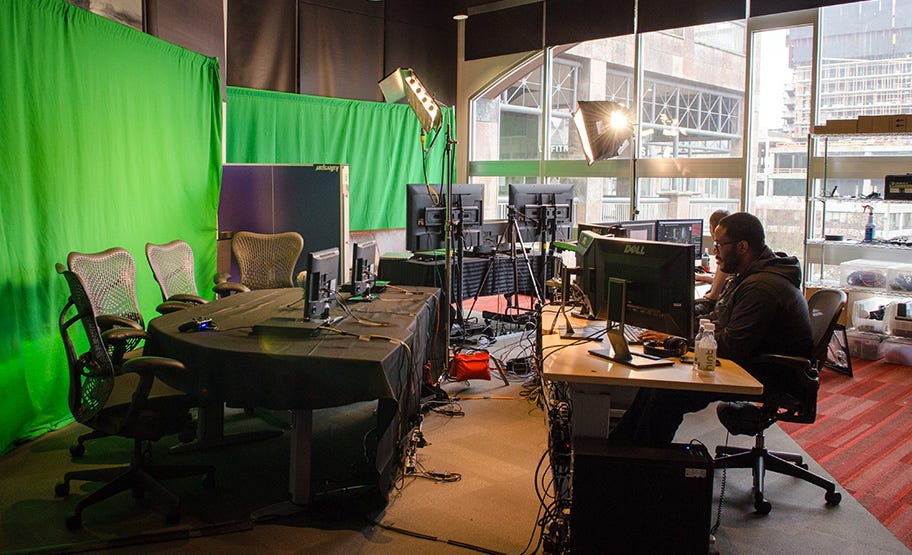

Het is de week van de grote Zelda-expositie in Groningen. Een paar dagen terug hebben we de laatste stukken geplaatst, waarna ik geïnterviewd werd door allerlei media - voor het eerst dat ik als journalist eens aan de andere kant van zo'n gesprek zat. Op zaterdag gaan de deuren bij Forum Groningen officieel open. Mocht je van plan zijn te gaan, ik ben er zelf op de zaterdag. Wellicht gezellig!

Verder deze week: het is een geweldig jaar voor games, maar een verschrikkelijk jaar voor gamemakers. Hun toekomst is door de vele ontslagrondes namelijk onzekerder dan ooit.

[Subscribe](#/portal/signup)

## De geschiedenis van Zelda in Groningen

Excuus voor de zelfpromotie deze week, de Zelda-expositie spookt veel door mijn hoofd. Afgelopen zomer kreeg ik een belletje van (inmiddels voormalig) collega-journalist Arjan Terpstra. Hij stelde jarenlang game-exposities samen voor Forum Groningen, maar kon nu als schrijver voor een groot gamebedrijf aan de slag. Of ik zijn rol bij Forum wellicht wilde overnemen. Stiekem was ik al jaren jaloers op zijn klus daar, dus de keuze was snel gemaakt.

Voor wie deze editie pas inhaakt even de feiten op een rij:

-   **Forum is een culturele instelling in Groningen, met bovenin de tentoonstelling Storyworld.** Deze gaat over verhaalvertelling in de breedste vorm: in strips en animatiefilms, maar ook games. Er is een grote vaste collectie, met daarnaast één grote ruimte waarin steeds iets nieuws wordt geëxposeerd.
-   **Daar vind je van 4 november tot en met eind februari een expositie over The Legend of Zelda.** Met de collectie probeer ik te duiden hoe Zelda met de jaren is veranderd, hoe de serie samenhangt en wat de invloed precies is geweest.
-   **Ook hebben we nog de nodige evenementen gepland.** Aan het einde van de kerstvakantie komt Willem Hilhorst van Beeld en Geluid bijvoorbeeld vertellen over de CDI-Zelda's, en later volgt een speedrun van een recordhouder in A Link to the Past.

Forum is één van de weinige plekken die zo'n serieus podium geeft aan gaming. De exposities zijn nooit belerend ingestoken: er wordt van uitgegaan dat games net zo serieus genomen kunnen worden als films, muziek, strips, boeken en andere media. Het was onwijs leuk om met die insteek een expositie te mogen samenstellen - ik heb nu al zin in de volgende game-editie.

## Het is een slecht jaar voor gamemakers

Het gaat vaak over hoe belachelijk goed dit gamejaar is. Met games als _Tears of the Kingdom, Baldur's Gate 3, Cocoon, Diablo 4, Sea of Stars_ en _Spider-Man 2_ is er buitengewoon veel verschenen dat universeel goed wordt ontvangen. Dat maakt het des te vreemder dat de makers van die games juist dit jaar een onzeker bestaan leiden.

Deze week zette _Destiny 2_\-maker Bungie een flink deel van zijn personeel op straat. De honderd ontslagen medewerkers waren zo'n acht procent van het bedrijf. Zelfs de componist van de game, geroemd om de soundtracks van Destiny en Halo, moet nieuw werk gaan zoeken.

We kunnen het best hebben over de staat van Bungie zelf. _Destiny 2_ lijkt te krimpen qua populariteit en het is lastig zo'n grootse game als (semi-)onafhankelijke studio te bouwen.

Maar als we inzoomen op Bungie, missen we denk ik het grotere plaatje: het gaat dit jaar overal zo. Hieronder een kleine greep uit gamemakers die personeel moesten ontslaan:

-   Bungie
-   Epic Games
-   Niantic
-   Electronic Arts
-   Unity
-   Media Molecule
-   Zen Studios
-   BeamDog
-   Ubisoft
-   Telltale Games
-   Volition
-   BioWare
-   CD Projekt Red
-   Antimatter
-   Ten Square
-   Innogames
-   Amazon Game Studios
-   GameLoft

Uit een overzicht van [VideoGameLayoffs.com](https://videogamelayoffs.com/?ref=gamepraat.nl) blijkt dat dit jaar 6.000 banen bij gamebedrijven zijn verloren. Hoe dat komt? Dat is lastig om een eenduidig antwoord op te geven, maar mogelijk zien we hier nog steeds de gevolgen van de coronapandemie.

Ja, de zwaarte van de pandemie ligt gelukkig al enige tijd achter ons. Maar games zijn complexe producties die jaren in beslag nemen om te maken: spellen die tijdens de pandemie werden ontwikkeld, verschijnen dit jaar soms pas. De verkopen van die titels hebben nu pas gevolgen voor de boeken van al die bedrijven. Na de pandemie zijn we bovendien in een kostencrisis terechtgekomen, die ook gamebedrijven zullen voelen.

Bij sommige bedrijven speelt uiteraard andere gekkigheid. Embracer kocht het ene bedrijf na de ander, waarna ze besloten van alles ineens weer af te stoten. Het zorgde voor bovengemiddeld veel onzekerheid in de gamesector.

Het einde lijkt hoe dan ook nog niet in zicht. We naderen de feestdagen, een periode waarin gamemakers hopen hun gemaakte investeringen weer terug te verdienen. Lukt dat onvoldoende? Dan staan er geheid weer banen op de tocht.

## Verder interessant deze week

-   Ik heb Alan Wake 2 nog niet gespeeld, maar hoor veel goede dingen. [Deze review van Gamer.nl-collega Ron Vorstermans](https://gamer.nl/reviews/games/playstation/alan-wake-2-is-met-geen-ander-spel-te-vergelijken/?ref=gamepraat.nl) is het lezen waard.
-   Dit weekend is na jaren afwezigheid weer ouderwets een BlizzCon! Erg benieuwd wat er wordt aangekondigd.
-   [Deze clip](https://twitter.com/NintendoNL/status/1720368974360134058?ref=gamepraat.nl) laat de Nederlandse stem van Wario goed horen. Geinig.
-   De nieuwe MMORPG van World of Warcraft-veteraan Greg 'Ghostcrawler' Street is (soort van) [aangekondigd](http://www.fantasticpixelcastle.com/?ref=gamepraat.nl). Details volgen nog.

Tot de volgende!

[Subscribe now](#/portal/signup)
