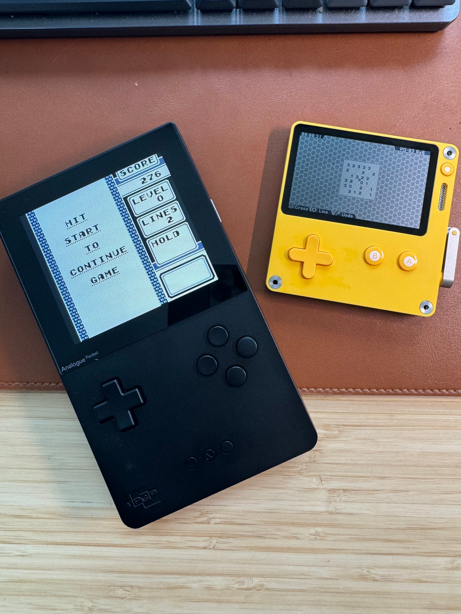
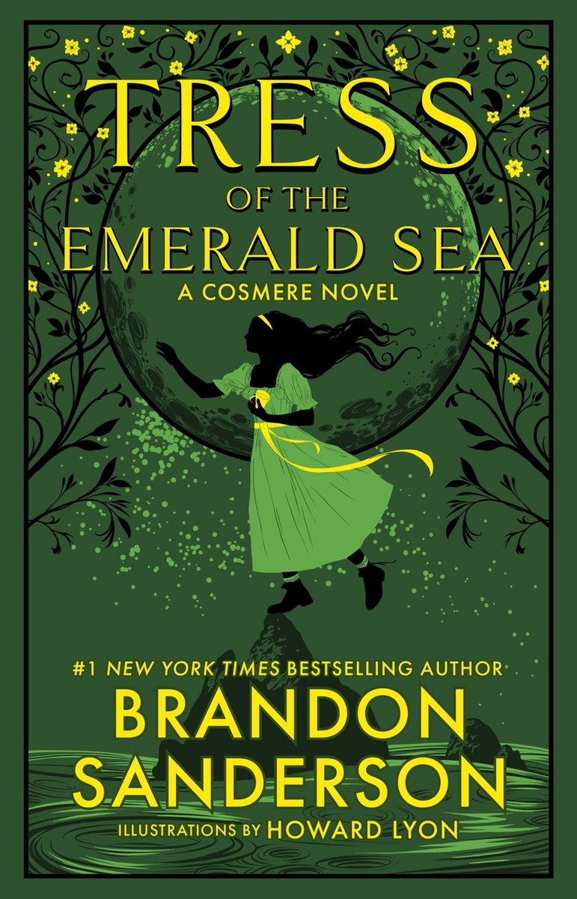
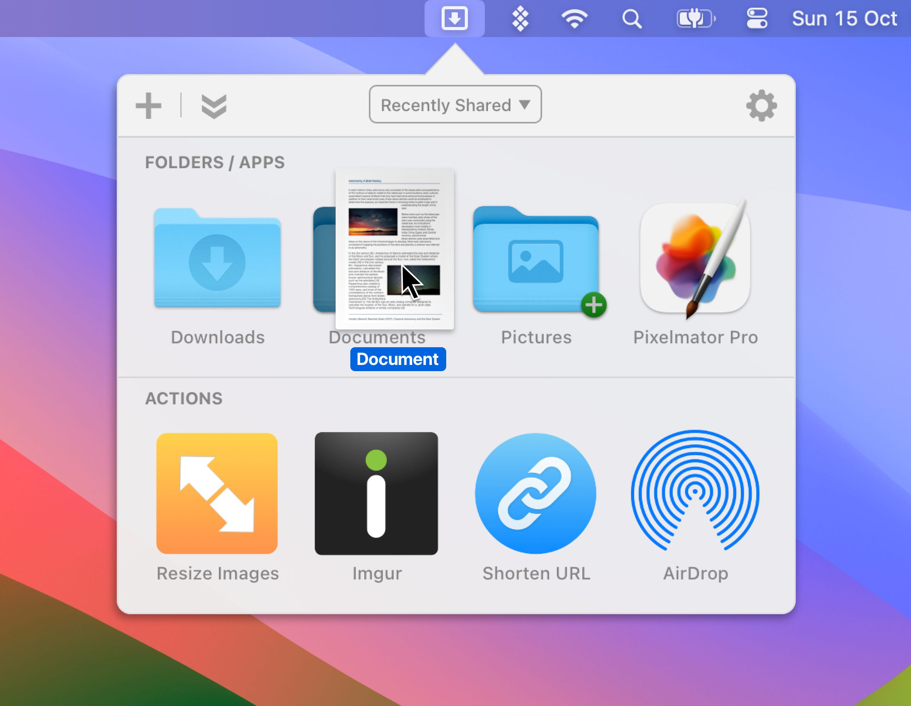
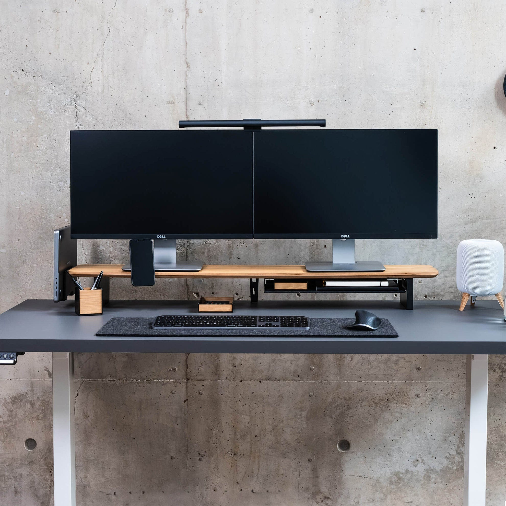
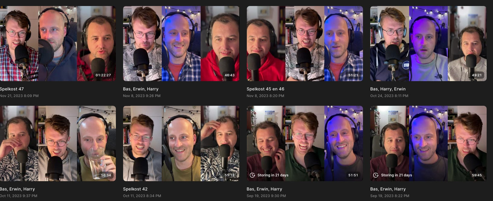

Nog de beste wensen! Net als velen hier sluit ik het jaar graag af met een overzicht van mijn favoriete dingen van de afgelopen periode. Ik probeer het breed op te pakken: hier vind je dus dingen die ik dit jaar heb ontdekt en ben gaan gebruiken, niet per se zaken die ook dit jaar zijn verschenen.

## De beste game: The Legend of Zelda: Tears of the Kingdom

Dit is denk ik één van de beste games ooit gemaakt. Een spel dat onwijs lastige concepten vanzelfsprekend maakt, waardoor zowel doorgewinterde gamers als nieuwkomers er honderden uren in kunnen verliezen. [Voor Gamer.nl schreef ik deze week waarom na veel gesteggel Zelda toch boven Baldur’s Gate 3 staat voor mij](https://gamer.nl/achtergrond/opinie/favorieten-van-de-redactie/zelda-tears-of-the-kingdom-is-een-meesterwerk-dat-zelfs-baldur-s-gate-3-ontstijgt/?ref=gamepraat.nl).

[Subscribe](#/portal/signup)

Mijn overige vier favorieten besprak ik eerder [in de Spelkost-podcast](https://spelko.st/050-onze-favoriete-games-van-2023/?ref=gamepraat.nl)! Dat zijn dus _Baldur’s Gate 3_, _Super Mario Bros. Wonder_, _Octopath Traveler 2_ en _Final Fantasy XVI_.

[Bekijk ingesloten media](https://www.youtube-nocookie.com/embed/sOWjNCndofQ?rel=0&autoplay=0&showinfo=0&enablejsapi=0)

## De beste hardware: Analogue Pocket

De Analogue Pocket is er al een tijdje, maar dit jaar bemachtigde ik eindelijk mijn exemplaar. Het is de Ferrari onder de Game Boys. Achterop zit een ouderwetse cartridge-slot voor Game Boy-, Game Boy Color- en Game Boy Advance-games, maar voorop vind je een veel groter scherm met hogere resolutie en een backlight. Je hoeft dus niet onder een lamp te zitten om oude games te spelen! Speciale filters zorgen dat dit scherm er net zo uitziet als vroeger, dus met scanlijnen, pixelgrids en wat meer uitgewassen kleuren.

Met zogeheten cores kun je ook andere systemen draaien. Het stikt online al van de emulatie-handhelds, maar de Pocket is mijn favoriet door de zeer accurate werkwijze. Dit is geen software-emulatie, maar een zogeheten FPGA-console. Het verschil daartussen is zeg maar als het verschil tussen een CD-speler en platenspeler.

Op de tweede plek trouwens de Meta Quest 3, de bril die mij weer geïnteresseerd kreeg in virtual reality. [Een uitgebreide review van mijn hand vind je op Gamer.nl](https://gamer.nl/reviews/hardware/overige-pc/review-meta-quest-3-maakt-vr-comfortabeler-mooier-en-veel-toegankelijker/?ref=gamepraat.nl). En rechts op de foto tevens de toffe Playdate, een handheld voor specifiek indiegames. Met een hendeltje.

## De beste film: Dungeons & Dragons: Honor Among Thieves

Ik kijk slechts een paar films per jaar omdat ik er weinig aan toekom. Toch heb ik de Dungeons & Dragons-film tweemaal achter elkaar gezien omdat ik hem zo onwijs leuk vond.

_Honor Among Thieves_ vat denk ik de band tussen een Dungeons & Dragons-groep perfect samen. Bij sommige dialogen kun je perfect voorstellen hoe vier aangeschoten nerds met elkaar aan tafel zitten te improviseren - en na wat goede geworpen dobbelstenen er nog in slagen ook.

[Bekijk ingesloten media](https://www.youtube-nocookie.com/embed/IiMinixSXII?rel=0&autoplay=0&showinfo=0&enablejsapi=0)

## De beste serie: Doctor Who

Jaren geleden was ik verdwaald aan het zappen op kerstavond en stuitte ik bij de BBC op een aflevering van _Doctor Who_. Ik had geen gids bij de hand en had geen idee waar ik naar keek - een superleuke manier om die gekke Britse serie in te duiken. Die eerste aflevering was met David Tennant, die sindsdien altijd 'mijn' Doctor is gebleven.

De drie _Doctor Who_\-specials dit jaar waren daarom een hoogtepunt. Wederom met Tennant in de hoofdrol, die geleidelijk de nieuwe Doctor introduceert en de volgende serie aftrapt. Drie afleveringen die precies doen wat ik altijd tof vond aan _Doctor Who_, wat helaas ontbrak bij de seizoenen van Jodie Whitaker.

The Last of Us was ook een uitmuntend goede serie, maar ik blij een sci-fi-nerd. Telt het als ik _The Last of Us_ wegserveer omdat ik die serie eigenlijk al in 2022 keek door het review-embargo?

[Bekijk ingesloten media](https://www.youtube-nocookie.com/embed/oi9N39FppbI?rel=0&autoplay=0&showinfo=0&enablejsapi=0)

## Het beste boek: Tress of the Emerald Sea

Ik zeg je eerlijk, ik ben een saaie lezer: afgelopen jaren las ik haast exclusief de boeken van Brandon Sanderson, die inmiddels een uitgebreid fantasy-universum heeft gebouwd. Dit jaar bracht hij vier nieuwe boeken uit via Kickstarter die hij in het geheim had geschreven.

Tress of the Emerald Sea is mijn favoriet van de nieuwe boeken die ik dit jaar gelezen heb. Het gaat over een eilandmeisje die op pad gaat haar ontvoerde vriendin te redden op een gekke planeet, waar boten op gevaarlijke pollen varen. Anders dan bij andere Sanderson-boeken is dat dit boek wordt verteld door Hoid, een terugkerend personage met snerende persoonlijkheid. Dat voegt onwijs veel toe.

## De beste Mac-app: Dropzone

De Mac-app waar ik dit jaar het meeste aan had was Dropzone. Daarmee kan ik een bestand zoals een afbeelding naar de menubalk slepen om hem bijvoorbeeld snel te converteren naar een png of jpg, of om hem te AirDroppen naar mijn iPhone.

Dropzone is gratis en heeft optionele premiumfuncties die ik tot dusver niet mis.

## Het beste meubel: Balolo Setup Cockpit

Niet lachen, maar ik ga een monitorverhoger tippen. De [Setup Cockpit van Balolo](https://www.balolo.de/en/products/setup-cockpit-large?tw_source=ig&tw_adid=23856214544480432&campaign_id=23856214544620432&ad_id=23856214544480432&variant=39735791812683&ref=gamepraat.nl) zet je beeldscherm iets hoger op je bureau, maar het bijzondere zit aan de onderzijde. Daar zitten allerlei schroefdraden waar je hun bijbehorende accessoires op kunt schroeven.

Op die manier heb ik een iPad-houder vlak onder mn monitor, een MagSafe-lader voor de iPhone ernaast en een speciale plank waar m’n MacBook op rust. Er zijn ook docks voor bijvoorbeeld een Elgato Stream Deck (die ik nu wil???) of je Apple Watch. Ruimt prima op.

## Beste webdienst: Riverside

Jarenlang namen we Gamebites en later Spelkost op via Zencastr. Een handige site waarbij je tijdens het online bellen lokaal audiobestanden opneemt, zodat je ze later onder elkaar kunt plakken voor de beste kwaliteit. Helaas werkte dat vaker niet dan wel: foutmeldingen en mislukte opnames waren aan de orde van de dag.

Niets daarvan merken we bij Riverside, waar we sinds dit jaar bij opnemen. Zelfs bij een harde crash waarbij alles verloren leek, waren alle bestanden via een omweg nog te redden. Voeg daar de handige AI-tool aan toe waarmee onze video’s automatisch worden gemonteerd en je hebt een zeer fijne site voor podcastmakers.

## Mijn favoriete producties dit jaar

Dit jaar ging ik weer freelancen! Een terugblik op de producties waar ik zelf het meest trots op ben:

-   Ik maakte met Alexander Klöpping bij Podimo twee podcastafleveringen over games. [Eén over de blinde Sven](https://podcasts.apple.com/nl/podcast/deze-gamekampioen-is-blind/id1683537308?i=1000618694281&ref=gamepraat.nl) die uitmuntend goed is in Street Fighter en een tweede [over hoe het Nederlandse Chronicles of Spellborn een Warcraft-killer moest worden](https://podcasts.apple.com/nl/podcast/hoe-nederlanders-bijna-een-blockbuster-maakten/id1683537308?i=1000626274166&ref=gamepraat.nl) en bizarre richtingen opging.
-   Power Unlimited werd dit jaar 30 jaar oud. Ik mocht voor de gelegenheid een [koffietafelboek voor ze maken](https://pu.nl/artikelen/nieuws/het-pu-30-jaar-collectieboek/?ref=gamepraat.nl) over de belangrijkste games van de afgelopen drie decennia.
-   Bij Forum in Groningen ben ik begonnen als game-expert. Het eerste resultaat: een [expositie over The Legend of Zelda](https://www.storyworld.nl/nl/storyworld-spotlight/nu-te-zien-the-legend-of-zelda?ref=gamepraat.nl), die nog een maand of twee te bezichtigen is.
-   Onze gamepodcast [Spelkost](https://spelko.st/?ref=gamepraat.nl) heeft sinds dit jaar ook een [video-editie](https://www.youtube.com/@spelkost?ref=gamepraat.nl)! Met campy sitcom-intro en alles.
-   Ik zat in de jury van de [Dutch Media Week Awards](https://www.dutchmediaweek.nl/?ref=gamepraat.nl), waarbij we de meest impactvolle mediamaker van het jaar hebben geselecteerd.
-   Voor AD [sprak ik met Tim Cook](https://www.ad.nl/binnenland/apple-baas-tim-cook-op-bezoek-bij-jumbo-visma-wielrennen-kijken-wordt-verbazingwekkend~a4842ab5/235715581/?ref=gamepraat.nl), CEO van Apple.
-   En nog een paar andere dingen waar ik hopelijk snel over mag praten!

## Gamepraat steunen? Dat kan nu ook op Petje Af

Je kunt Gamepraat al langer steunen met een betaald abonnement via Substack, maar ik hoor steeds vaker dat mensen graag een vrijblijvender alternatief willen. [Daarom heb ik een Petje Af-account gemaakt](https://petjeaf.com/gamepraat?ref=gamepraat.nl). Daarop kun je een eenmalige donatie doen om te helpen de nieuwsbrief in leven te houden.

Dit alles is uiteraard helemaal optioneel, aan de nieuwsbrief verandert nu niks. Maar alle beetjes helpen ontzettend, dus dank als je ervoor kiest mij te steunen!

Volgend jaar gaan we weer verder met de reguliere nieuwsbrief. Fijne jaarwisseling en tot dan!

[Subscribe](#/portal/signup)
