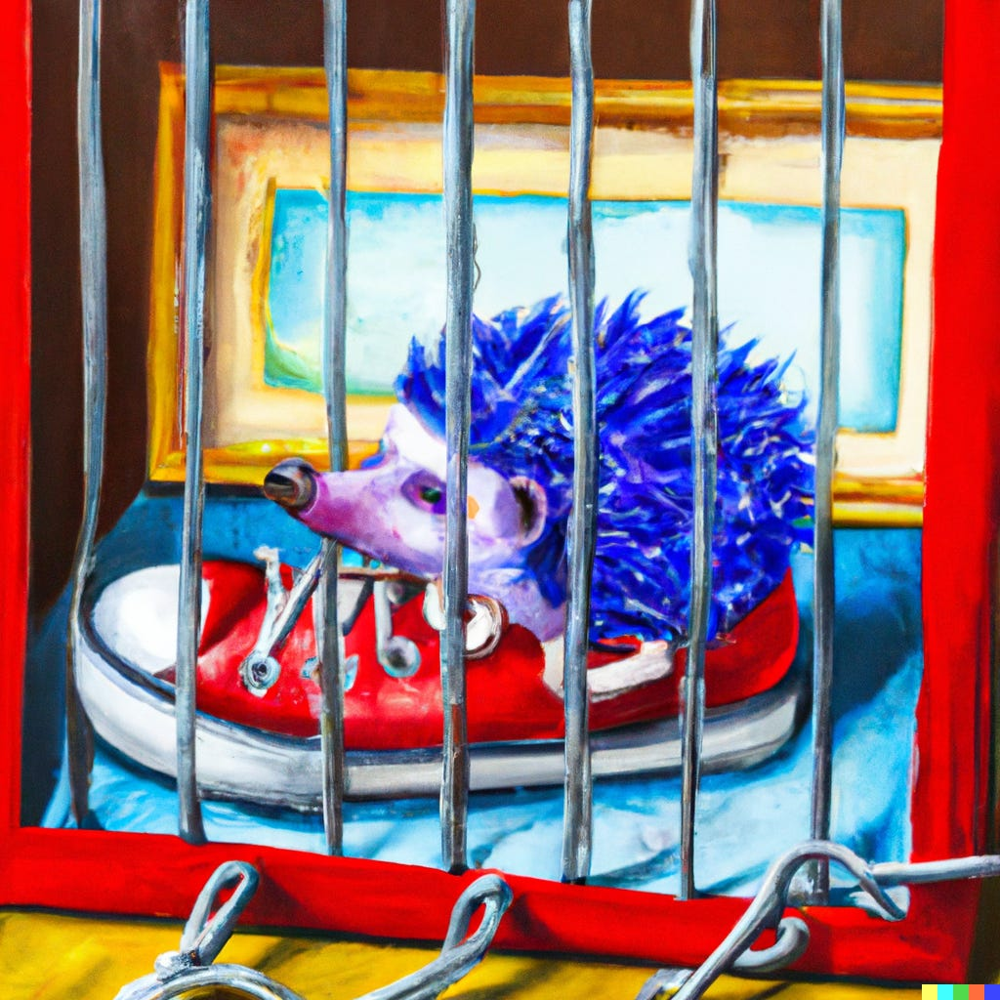
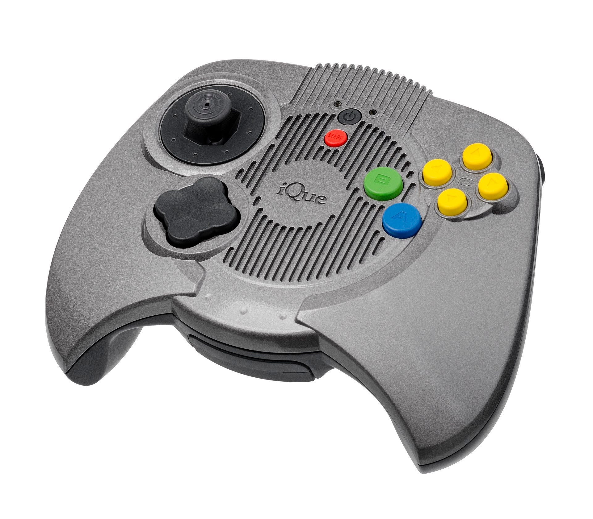
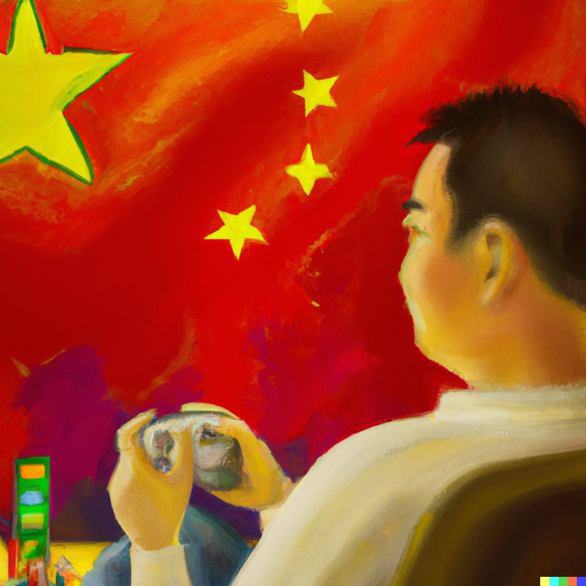

Gefeliciteerd met het uitspelen van 2022, en leuk dat je de eerste editie van Gamepraat van 2023 leest. We kunnen nu zeggen dat we technisch gezien twee kalenderjaren bezig zijn!

Vlak voor het einde van het jaar tikten we de honderd abonnees aan, en het blijft een feestje om iedere week de nieuwsbrief te vullen. Ik ben benieuwd: vind je het fijn dat deze nieuwsbrief wekelijks eenmalig verschijnt en het belangrijkste nieuws bundelt, of zou je hem liever opgesplitst verspreid over de week ontvangen? Laat het me weten door terug te mailen of hieronder te reageren.

Deze week hebben we het onder andere over de bedenker van _Sonic the Hedgehog_, die na twee eerdere arrestaties officieel voor de rechter moet verschijnen. En over emulatieland China, dat nu weer langzaam de poorten voor gamemakers openzet.

Als jij de nieuwsbrief ook leuk vindt, dan help je me ontzettend als je hem ook eens tips bij een gamende vriend of familielid, dan kunnen we samen vrolijk blijven groeien. Deze editie is 2.315 woorden en kost je circa. 11 minuten om te lezen. We trappen af!

[Subscribe now](#/portal/signup)

## Na twee arrestaties komt de maker van Sonic voor de rechter

-   De bedenker van Sonic the Hedgehog is [aangeklaagd](https://www.nintendolife.com/news/2022/12/yuji-naka-has-now-been-formally-indicted-over-insider-trading-offenses?ref=gamepraat.nl) in Japan.
-   Hij wordt verdacht van handelen met voorkennis, bij zijn toenmalige werkgever Square Enix.
-   Eind vorig jaar werd hij om diezelfde reden al tweemaal gearresteerd.

Games zijn grote, complexe producties waarbij het lastig is alles toe te schrijven aan één auteur, maar juist in Japan gebeurt dat vaak. Dat komt deels door hoe oud het gamevak daar is: titels die nu legendarisch zijn, werden in een tijd gemaakt waarin games niet door teams van honderden mensen werden gebouwd. Waarbij een enkeling een veel grotere rol vervulde.

Dat is waarom bijvoorbeeld Shigeru Miyamoto met _Mario_ en _Zelda_ zo'n grote beroemdheid is geworden. En van hetzelfde was sprake toen Yuji Naka in de jaren '90 bij Sega begon en aan de wieg stond van _Sonic the Hedgehog_. Hij was de geestelijk vader van Mario's grote, coolere concurrent die Nintendo moest decimeren.

#### Kwakkelende reputatie van Naka

Waar Miyamoto's reputatie ongeschonden bleef, kwakkelde die van Naka in de afgelopen jaren. Latere Sonic-games werden steeds slechter ontvangen en mettertijd stortte hij zich op minder prominente games. Zijn laatste spel _Balan Wonderworld_ was een grote klap voor zijn loopbaan, met een Metacritic-score van 37 van de 100. Hij werd als hoge baas bij uitgever Square Enix ontslagen.

Zijn reputatie bereikt mogelijk een dieptepunt nu hij voor de rechter is gedaagd. Hij werd eerder al tweemaal gearresteerd voor handelen met voorkennis, omdat hij handelde in aandelen terwijl hij wist dat zijn werkgever Square Enix met gamestudio's ging samenwerken. Met de aanklacht wordt die zaak nu formeel uitgevochten voor de rechter.

_Illustratie gegenereerd met kunstmatige intelligentie Dall-E._

Eén keer zou hij aandelen hebben gekocht bij ontwikkelaar Aiming, wetende dat Square Enix hen zou vragen de game Dragon Quest Tact te maken. Dit trucje herhaalde hij naar verluidt nog eens met de ontwikkelaar van Final Fantasy VII: The First Soldier, waar hij 144,7 miljoen yen (1 miljoen euro) in investeerde.

Of de aanklacht standhoudt moet nog blijken. De kans op een celstraf is ook klein: volgens [Bloomberg Law](https://news.bloomberglaw.com/securities-law/insider-trading-enforcement-in-japan-1?ref=gamepraat.nl) wordt in dergelijke zaken hooguit een geldboete en een taakstraf uitgedeeld.

Het is fascinerend dat dit speelt bij iemand als Naka. Hij was deel van een soort illuminati: de groep ontwerpers die in de jaren '90 gaming op de kaart hebben gezet, waardoor het kon uitgroeien tot wat het nu is. Het is alsof de Beatles decennia na hun hoogtepunt ineens allemaal worden verdacht van schimmige zaken. Het zal niet alleen impact hebben op de reputatie van Naka, maar ook op die van Japanse spelontwerpers in het algemeen.

#### Van Mega Man naar NFT's

Hetzelfde gebeurde eerder bij Keiji Inafune, hoewel niet zo sensationeel als bij Naka. Hij was met _Mega Man_ in de jaren ‘80 en ‘90 het genie achter een steeds groter wordende franchise (al verkochten de games naar moderne standaarden amper). Uiteindelijk verliet hij zijn uitgever Capcom om via crowdfunding games te gaan maken.

Zijn eerste game, een spirituele opvolger van Mega Man, was een flop. De game die daarna volgde ook. Het werd duidelijk dat Inafune op de schouders stond van een capabel team, en dat alleen zijn aanwezigheid niet genoeg was om een project tot een succes te brengen. Uit zijn andere grote Mega Man-opvolger werd bij voorhand de stekker getrokken. De laatste keer dat ik over Inafune hoorde, was hij betrokken bij een schimmig NFT-project.

## Microsoft heeft nu de grootste gamevakbond van de VS

-   Driehonderd gametesters bij het Amerikaanse ZeniMax Studios hebben na een stemronde formeel een vakbond gevormd. De testers werken bij Arkane, Bethesda en id Studios.
-   Het is de grootste vakbond bij een Amerikaans gamebedrijf.
-   Amerikaanse gamestudio's hebben zelden vakbonden, maar in afgelopen jaren worden er steeds meer opgezet.
-   Moederbedrijf Microsoft heeft de vakbond meteen erkend, nadat een onafhankelijke partij de stemmen had geverifieerd.
-   Met die goedkeuring wil Microsoft misschien wel de marktwaakhond paaien, die eerder naar de rechter stapte om de overname van Activision Blizzard tegen te gaan.

Werken in de Verenigde Staten is geen pretje. Word je ontslagen, dan sta je in veel gevallen bijna direct op straat. Een WW heeft het land wel, maar hoeveel je uitbetaald krijgt varieert per staat. In het beste geval ontvang je 855 dollar per week, maar in Mississippi ontvang je wekelijks [slechts 235 dollar](https://singlemotherguide.com/unemployment-insurance/?ref=gamepraat.nl). Veel te weinig om je verloren salaris op te vangen.

Veel arbeidsvoorwaarden zijn ook ten nadele van personeel. Ze hebben een beperkt aantal ziektedagen, kunnen weinig betaald vrij nemen en worden soms ook geacht over te werken, waarbij de compensatie daarvoor kan wisselen. Al dat maakt het buitengewoon onaantrekkelijk om in de Verenigde Staten bij een gamestudio te werken, en waarom vakbonden daar als paddestoelen uit de grond schieten.

> A group of about 300 QA workers at ZeniMax (Bethesda) have voted to form a new union — particularly noteworthy that Microsoft recognized the union without a fight, in contrast to Activision Blizzard, which has fought union efforts as much as it can. Next up: contract negotiations
>
> — Jason Schreier (@jasonschreier) [6:04 PM ∙ Jan 3, 2023](https://twitter.com/jasonschreier/status/1610336276271751170?ref=gamepraat.nl)

Niet iedere werkgever is daar even blij mee. Activision-Blizzard werd meermaals verzet van 'union busting', oftewel 'vakbond-breken', toen daar vergelijkbare initiatieven waren. Zo kreeg personeel alleen een loonsverhoging als ze niet lid waren van een vakbond, een lokkertje om mensen weg te houden van de organisaties.

#### Microsoft stelt zich mak op om de Activision-deal door te pushen

Microsoft probeert op het moment Activision-Blizzard te kopen, en zei in een bericht gericht aan de marktwaakhond zich neutraal tegen vakbonden op te stellen. Een poging om goede intenties te laten zien: de techreus profileerde zich als een fair bedrijf, bereid om de rechten van personeel serieus te nemen.

Dat is waarschijnlijk waarom de vorming van de grote ZeniMax Studios-vakbond zo snel werd geaccepteerd. Niet alleen is dit een dochterbedrijf van Microsoft, maar het is ook nog eens de grootste gamestudio die het bedrijf heeft gekocht totdat de Activision-deal wordt goedgekeurd. Het bedrijf voegt hier woord bij daad. Het moet bewijzen dat Microsoft zijn personeel best de ruimte geeft voor zulke vakbonden.

Overigens heb ik tot op heden nog nooit over een gamevakbond in Nederland gehoord, en ik vraag me af hoe dat kan. Voelen we ons hier genoeg beschermd door het arbeidsrecht, of is onze industrie te klein om de noodzaak te voelen een vuist te maken naar werkgevers?

## China laat weer games toe, maar het blijft spannend

-   De Chinese gametoezichthouder heeft 44 licenties uitgedeeld om nieuwe games in het land uit te mogen geven.
-   Het is voor het eerst in anderhalf jaar dat het land weer nieuwe games toelaat.
-   China is één van de grootste potentiële gamesmarkten, maar het grillige beleid maakt het lastig om daar spellen uit te brengen.

Al een jaar of twintig kom je af en toe het verhaal tegen dat "gamen verboden is" in China. Helemaal waar is dat niet, al kwam het daar lange tijd wel op neer: de import van elektronica en entertainment werd streng gereguleerd, wat het nagenoeg onmogelijk maakte om games en spelcomputers het land binnen te krijgen.

Nintendo omzeilde die wetgeving in 2003 door samen met het Chinese iQue een variant van de Nintendo 64 te maken die voldeed aan de strenge wetgeving van het land. Omdat dit strikt gezien een console van een Chinees bedrijf was, mocht hij daarom worden verkocht. Maar: naast dat soort dingetjes was China grotendeels een niemandsland voor gamebedrijven.

[_Afbeelding via Wikipedia_](https://en.wikipedia.org/wiki/IQue_Player?ref=gamepraat.nl)_._

#### Chinees gamebeleid in 2015 versoepeld, toen weer op slot

In 2015 werd het Chinese gamesbeleid eindelijk versoepeld. Spellen konden weer in het land worden uitgebracht, mits ze door een Chinese toezichthouder werden gekeurd. Die moet kijken of de inhoud van een game strookt met de waarden van de overheid.

Diezelfde toezichthouder ging in augustus 2021 weer op slot en keurde geen enkele game meer goed. In april 2022 kwam het proces weer op gang, maar toen werden alleen games van Chinese ontwikkelaars goedgekeurd. Sinds afgelopen week worden ook weer licenties uitgedeeld aan buitenlandse studio's, wat bij 44 games is gebeurd.

In de lijst met voor China goedgekeurde games staan een paar grote titels, zoals Pokémon Unite en Valorant. Bij allebei die games heeft het Chinese techbedrijf een vinger in de pap: Pokémon Unite werd door Tencent gemaakt in opdracht van The Pokémon Company, terwijl Valorant werd ontwikkeld door Riot Games, een bedrijf in handen van het bedrijf.

#### Samenwerken met Tencent is spannend

Je zou denken dat China's invloed daarmee merkbaar is op welke games worden gemaakt. Westerse bedrijven slaan graag de handen ineen met Tencent, om samen iets te bouwen dat in potentie snel op de Chinese markt wordt toegelaten. Een markt die bestaat uit meer mensen dan Europa en de VS bij elkaar.

Maar er is een keerzijde. Omdat Tencent een Chinees bedrijf is, kan de overheid zich potentieel bemoeien met wat het bedrijf doet. Dat was een paar jaar terug een grote angst bij techbedrijf Huawei. Zij leveren apparatuur voor telecommasten, maar door hun Chinese thuisbasis zou de overheid kunnen aankloppen om via hun apparatuur mobiele telefoons massaal af te luisteren. Vergelijkbare zorgen zijn er het Chinese TikTok, dat gebruikt kan worden om westerse gebruikers te bespioneren of beïnvloeden.

_Illustratie gegenereerd met kunstmatige intelligentie Dall-E._

#### Tencent heeft het moeilijk in China

In de praktijk lijkt Tencent echter een lastige relatie te hebben met de lokale toezichthouder. Hoewel lokale games alweer sinds april worden goedgekeurd, kreeg het bedrijf pas afgelopen november goedkeuring om een game uit te brengen. De oprichter van Tencent [zei onlangs](https://www.reuters.com/technology/tencent-chief-blasts-managers-fiery-townhall-sources-2022-12-23/?ref=gamepraat.nl) te vrezen dat slechts een klein aantal van hun games in de komende periode toegelaten zal worden tot de markt.

Games blijven een soort speelbal voor internationale betrekkingen. Bij de nu goedgekeurde lijst zitten bijvoorbeeld zeven titels gemaakt in Zuid-Korea. Sinds 2017 was alle media gemaakt in dat land verboden, wegens een conflict over de plaatsing van een Amerikaans raketschild. En zo blijft het toch spannend om games in China uit te brengen. Zit je in een land dat politiek in een conflict terecht komt met China? Dan kun je zomaar 1,4 miljard potentiële klanten kwijtraken.

#### Door jaren aan strenge regels maakt China nu toffe handhelds

In de jaren voor 2015 werden in China wel games gespeeld, maar meestal ging het daarbij om illegaal gedownloade titels. Veel gamers daar hebben daarom een voorliefde voor emulatie, en omdat het opzetten van techproductiebedrijven big business is in China, zijn veel van die inmiddels volwassen gamers startups begonnen om speciale retro-handhelds te maken. Die zijn populair in China, maar via sites als Aliexpress ook in het westen te halen.

Tien jaar terug was de kwaliteit van die apparaatjes ondermaats, maar ze worden steeds mooier en krachtiger. De [Miyoo Mini](https://nl.aliexpress.com/item/1005003611677275.html?ref=gamepraat.nl) is bijvoorbeeld een mini-handheld met een 2,8 inch-scherm die je voor 70 euro kunt kopen. Moet je wel geluk hebben, want hij is net zo lastig verkrijgbaar als de PlayStation 5. De [Anbernic RG35XX](https://anbernic.com/products/rg35xx?ref=gamepraat.nl) doet ongeveer hetzelfde maar is een slagje groter en een tientje goedkoper. Ben je bereid het dubbele te betalen, dan kun je op een [Retroid Pocket 3+](https://www.goretroid.com/products/retroid-pocket-3-handheld-retro-gaming-system-1?ref=gamepraat.nl) zelfs GameCube-games spelen. Beide handhelds hebben nostalgische kleuropties waardoor ze op een Super Nintendo of Game Boy lijken.

Zulke handhelds zijn voor mij een gigantische rabbithole geworden - later deze week mag ik er over komen meepraten in de [All in the Game-podcast](https://www.bnr.nl/podcast/all-in-the-game?ref=gamepraat.nl) van BNR ([thanks Joe!](https://twitter.com/joevanburik?ref=gamepraat.nl)). Onderstaande video geeft een goed beeld van welke modellen in 2022 het beste waren en wat ze zoal kunnen:

[Bekijk ingesloten media](https://www.youtube-nocookie.com/embed/hqAM3INcLeA?start=740s&rel=0&autoplay=0&showinfo=0&enablejsapi=0)

Overigens, hoe gaaf ze ook zijn: juridisch is emulatie altijd een heikel punt. Je mag een oude game best emuleren, maar een rommetje van je favoriete spel gratis van een site trekken is illegaal. Ook in Nederland. Daar [had ik het vorig jaar eens over](https://www.ad.nl/games/deze-chinese-zakspelcomputer-speelt-alle-games-uit-je-jeugd-vlekkeloos-maar-is-dat-legaal~af57bae9/?ref=gamepraat.nl) met gamejurist René Otto voor AD.

## Dingen die ik deze week tof vond

-   **Vampire Survivors** blijft mijn go-to game, vooral op drukke momenten. Want hoewel een potje een half uur duurt, hoef je niet door tussenfilmpjes en andere filler heen te werken voordat je aan de slag kunt. Dat werkt voor mij drempelverlagend.
-   Ik heb al mijn gekochte audioboeken gedownload en verzameld op mijn eigen mediaserver, waar ik ze met iPhone-app **Prologue** kan luisteren. Een beetje gedoe, maar nu staan de boeken die op allerlei verschillende platformen heb gekocht op één plek.
-   Ik heb op de valreep [**mijn**](https://vroe.gop/favoriete-games-2022/?ref=gamepraat.nl) [**favoriete games van 2022**](https://vroe.gop/favoriete-games-2022/?ref=gamepraat.nl) nog even op een rij gezet.
-   Collega Len Maessen (NRC, AD) is toevallig tegelijkertijd een gamenieuwsbrief begonnen. [Je vindt hem hier!](https://met-beide-benen-in-gameland.beehiiv.com/subscribe?ref=gamepraat.nl)
-   Komende zondag begint [**Games Done Quick**](https://gamesdonequick.com/?ref=gamepraat.nl), een speedrun-marathon die twee keer per jaar voor het goede doel wordt georganiseerd. Ook leuk om te kijken als je zelf totaal geen speedrunner bent, want een team commentatoren legt precies uit wat voor gekkigheid nodig is om een game zo snel te spelen.

Tot volgende week!

[Subscribe now](#/portal/signup)
