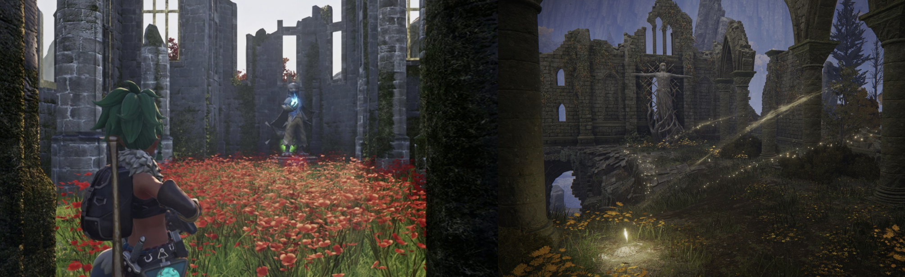
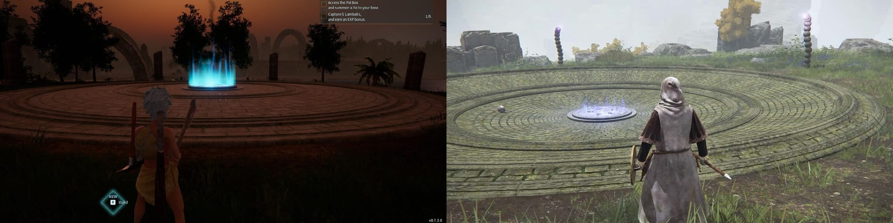

Op het moment van schrijven wordt Palworld door 1,7 miljoen mensen tegelijkertijd gespeeld op Steam. Het maakt de game populairder dan Counter-Strike 2, Dota 2, PUBG en Apex Legends bij elkaar opgeteld, vier games die een week geleden nog constant bovenaan de lijst stonden.

Het maakt één ding duidelijk: hoewel critici zich uitspreken over het mogelijke plagiaat van de game, maakt het spelers niet veel uit.

Bovenstaande cijfers zijn alleen die van Steam. De game is ook op Game Pass beschikbaar voor Xbox en pc, en heeft met alle platformen bij elkaar opgeteld meer dan 8 miljoen spelers bereikt in zijn eerste zes dagen. Dat zijn buitengewone cijfers.

> [#Palworld](https://twitter.com/hashtag/Palworld?src=hash&ref_src=twsrc%5Etfw&ref=gamepraat.nl) has sold over 8 million copies in less than 6 days!
>
> Thank you very much!!
>
> As stated previously, we continue to work at full-speed on addressing bugs and issues!
> Thanks for your support [pic.twitter.com/4PLB1J4CYH](https://t.co/4PLB1J4CYH?ref=gamepraat.nl)
>
> — Palworld (@Palworld\_EN) [January 25, 2024](https://twitter.com/Palworld_EN/status/1750350702000607389?ref_src=twsrc%5Etfw&ref=gamepraat.nl)

Deze week duiken we in wat er bij Palworld aan de hand is - want is al het jatwerk ook echt uitzonderlijk? En we hebben het over de meest recente ontslaggolf bij Activision-Blizzard, waarmee we afstevenen op een recordaantal ontslagen in 2024.

Deze editie van Gamepraat telt 1.163 woorden en neemt X minuten van je tijd in beslag. Vind je dit leuk om te lezen? Neem een betaald abonnement, doneer eenmalig iets [op Petje Af](https://petjeaf.com/gamepraat?ref=gamepraat.nl) of stuur de nieuwsbrief door naar een vriend! Dat helpt allemaal ontzettend.

## Niet alles in Palworld is gejat

Palworld werd voor introductie al gekscherend 'Pokémon met pistolen' genoemd, maar na verschijning bleek pas hoeveel de monsters uit de game op pokémon lijken. [Het voelt als plagiaat](https://gamer.nl/achtergrond/opinie/columns/palworlds-jatwerk-van-pokemon-is-niet-oke/?ref=gamepraat.nl): ontwerpen zijn nagenoeg identiek, met hier en daar een kleine aanpassing om te zorgen dat ze niet helemaal hetzelfde zijn. The Pokémon Company zei recent de game [te gaan onderzoeken](https://corporate.pokemon.co.jp/media/news/detail/335.html?ref=gamepraat.nl), om juridisch in te grijpen als blijkt dat hun auteursrecht wordt geschonden.

> I went through the entire 111 list of Pals in Palworld to see what seems like a Pokémon rip off compared to not, because I’ve seen a lot of people talk about it but no full comprehensive list. Here’s what I found (it’s a lot) 🧵 [pic.twitter.com/EPSpBvC9hD](https://t.co/EPSpBvC9hD?ref=gamepraat.nl)
>
> — Cecilia Fae 🍂 (@CeciliaFae) [January 21, 2024](https://twitter.com/CeciliaFae/status/1749183059877085396?ref_src=twsrc%5Etfw&ref=gamepraat.nl)

Het heeft geleid tot veel (terechte) kritiek op sociale media. Maar net als bij iedere discussie op zulke platformen blijft deze doorgroeien en zijn we op een punt gekomen dat minder vanzelfsprekende onderdelen als jatwerk worden bestempeld. Een vervallen kerk en cirkelvormig plein zouden bijvoorbeeld afkomstig zijn uit Elden Ring, zoals in de afbeeldingen hieronder geïllustreerd:

Ze lijken inderdaad aardig op elkaar. Maar die met bloemen gevulde kerk zagen we ook al een paar decennia terug [in Final Fantasy VII](https://finalfantasy.fandom.com/wiki/Sector_5_slums_church?ref=gamepraat.nl), terwijl cirkelvormige pleinen al jaren de toegewezen gevechtsarena’s zijn in actiegames omdat ze met hun ontwerp je nooit in een hoek duwen. Japanse ontwikkelaars zijn gefascineerd door ruïnes van westerse religies, wat je naast Elden Ring ook terugziet in andere Souls-games en heel veel JRPG’s.

Die gelijkenissen lijken bij Palworld sneller aan bod te komen omdat de game op andere vlakken zo regelrecht van zijn concurrenten steelt. Dat gaat tot de UI aan toe, waarbij de meter voor je lichaamstemperatuur rechtstreeks uit Breath of the Wild afkomstig lijkt.

Laten we niet vergeten dat gameontwikkeling is gebouwd op iteratie. Al generaties lang nemen ontwikkelaars elementen van elkaars games over om iets te maken dat net anders aanvoelt. De originaliteit zit vooral in hoe met die elementen iets nieuws wordt neergezet. Pokémon pakte ooit elementen van Dragon Quest en bouwde daar iets nieuws mee, Halo is uiteindelijk ook 'maar' Doom met goede controller-besturing. Iets dat Palworld nu eigenlijk ook doet: de combinatie van Pokémon en survivalgames als Ark resulteert in een game die we anders spelen dan zijn inspiratiebronnen.

Dat maakt Palworld op één vlak een game als iedere andere - die door zijn plagiaat een vieze nasmaak heeft. Hopelijk voegen toekomstige updates meer originele monsters toe, zodat je tijdens het spelen niet continu aan het ongemak rond Pokémon wordt herinnerd.

## We gaan richting een recordaantal ontslagen

Microsoft heeft na de overname van Activision-Blizzard zijn gamedivisie gereorganiseerd. Daarbij zijn [1.900 banen geschrapt](https://www.cnbc.com/2024/01/25/microsoft-lays-off-1900-workers-nearly-9percent-of-gaming-division-after-activision-blizzard-acquisition.html?ref=gamepraat.nl), waaronder bij het team dat binnen Blizzard werkte aan een [nieuwe survivalgame](https://www.theverge.com/2024/1/25/24050297/blizzard-survival-game-cancelled-layoffs?ref=gamepraat.nl). Microsofts gamingtak telde 22.000 banen, wat betekent dat ongeveer 8 procent is ontslagen.

Deze reorganisatie is naar verwachting: de overname van Activision-Blizzard is recent afgerond, waardoor Microsoft nu kon kijken hoe de gamemaker in Xbox gevoegd kan worden. De twee bedrijven hadden vermoedelijk veel overlap, zoals dubbele HR-afdelingen die nu worden gefuseerd. Het werk dat vroeger door twee mensen werd gedaan, zal nu soms worden teruggebracht naar één persoon.

Je kunt dat gebruiken om de overname te rechtvaardigen, maar er is ook een cynischer beeld te schetsen: met de overname van Activision-Blizzard consolideert de game-industrie nog meer, en we zien nu dat daarbij altijd banen verdwijnen. Microsofts overname zorgt ervoor dat er netto minder werk is in de gamesector.

Tel je de Activision-Blizzard-ontslagen op bij eerdere reorganisaties, dan zijn in 2024 5.600 gamemensen hun baan kwijtgeraakt. Dat blijkt uit analyse van [VideoGameLayoffs.com](https://videogamelayoffs.com/?ref=gamepraat.nl). Dat is meer dan de helft van alle ontslagen in 2023, toen 10.500 banen verloren raakten.

Gamemaker Rami Ismail merkte afgelopen week iets op. Toen in 2023 mensen werden ontslagen, stond Twitter vol met bedrijven die vacatures bij de getroffenen aanboden. Het leek er op dat gedupeerden via sociale media snel een nieuwe plek konden vinden.

> The most horrifying thing about these layoffs was back when 2023 "hit" every layoff tweet was full with replies from people representing other studios hiring.
>
> Now that 2023 "continues", there are barely other studios left. They're gone too, or can't hire now.
>
> — Rami Ismail / رامي (@tha\_rami) [January 23, 2024](https://twitter.com/tha_rami/status/1749758081695621561?ref_src=twsrc%5Etfw&ref=gamepraat.nl)

Die berichten zijn in 2024 zo goed als verdwenen. De bedrijven die banen aanboden, lijken zelf ook te zijn getroffen. er lijkt simpelweg minder werk in de game-industrie te zijn.

## Elders geschreven

-   Voor Power Unlimited speelde ik Palworld [voor een hands-on](https://pu.nl/artikelen/feature/palworld-pc-gespeeld-vol-met-jatwerk-maar-bevat-een-geweldig-idee/?ref=gamepraat.nl).
-   Hierboven al genoemd, maar [op Gamer.nl mijn column over het plagiaat in Palworld](https://gamer.nl/achtergrond/opinie/columns/palworlds-jatwerk-van-pokemon-is-niet-oke/?ref=gamepraat.nl).
-   Het nieuwe Like A Dragon: Infinite Wealth is een fantastische jrpg over ongewone zaken zoals veertigersdilemma’s. [Mijn review staat op NRC](https://www.nrc.nl/nieuws/2024/01/23/nieuwe-like-a-dragon-game-balanceert-drama-en-lolligheid-precies-goed-a4187846?ref=gamepraat.nl).
-   Techgerelateerd, maar gamemakers gaan het er komende weken geheid veel over hebben: Apple staat nu andere App Stores toe op iPhones. De manier waarop is alleen geniepig: apps met meer dan 1 miljoen downloads per jaar betalen per extra download 50 cent. Dat kan gigantisch hoog oplopen bij vooral gratis apps en games. [De feiten zette ik bij Bright op rij](https://www.bright.nl/nieuws/1176114/apple-breekt-ios-open-andere-app-stores-straks-ook-toegestaan.html?ref=gamepraat.nl).
-   Voor Bright testte ik ook de [Gamesir Galileo G8](https://www.bright.nl/nieuws/1176110/de-gamesir-galileo-g8-is-de-beste-gamecontroller-voor-je-smartphone.html?ref=gamepraat.nl), de beste gamecontroller die ik ooit bij een smartphone gebruikte.

## Verder interessant deze week

-   Vier medewerkers van het Van Gogh-museum [zijn ontslagen wegens wangedrag](https://www.parool.nl/amsterdam/vier-medewerkers-van-gogh-museum-weg-na-wangedrag-bij-pokemonexpo~be629fc7/?ref=gamepraat.nl). Het museum opende afgelopen jaar een Pokémon-expositie waarbij een hoop mis lijkt te gaan.
-   De Nintendo Switch 2 zou een [scherm van 8 inch](https://www.bloomberg.com/news/articles/2024-01-26/switch-2-nintendo-s-next-gen-console-to-have-8-inch-lcd-screen-omdia-says?ref=gamepraat.nl) krijgen (groter dan een Steam Deck!). Opmerkelijk: het wordt veel LCD in plaats van OLED. Een goede manier om de kosten laag te houden, vermoedelijk.
-   Rock Band 4 krijgt [geen DLC meer](https://www.harmonixmusic.com/blog/an-update-on-rock-band-4-dlc?ref=gamepraat.nl). De studio heeft maar liefst acht jaar lang wekelijks nieuwe muziek uitgebracht.
-   Het reviewteam van IGN deed een [Ask Me Anything op Reddit](https://www.reddit.com/r/Games/comments/19elz64/we_are_igns_game_reviews_editors_ama/?ref=gamepraat.nl). Leuk om te lezen - en je krijgt in de reacties echt het id ee dat sentiment rond IGN veel positiever is dan een paar jaar geleden.
-   Op Aftermath een [goed artikel van Gita Jackson](https://aftermath.site/blog-video-games-daily-grind-kotaku-labor?ref=gamepraat.nl), en hoe zwaar haar werk bij Kotaku was. Er was continue druk om content te blijven pompen en zelfs in je vrije tijd bezig te zijn. Bij het lezen kreeg ik erg veel flashbacks naar mijn eerste werk, waarbij we ook constant de contentmachine moesten blijven voeren.
-   Pastelroze JoyCons!

> With the release of [#PrincessPeachShowtime](https://twitter.com/hashtag/PrincessPeachShowtime?src=hash&ref_src=twsrc%5Etfw&ref=gamepraat.nl) on March 22, a set of pastel pink Nintendo Switch Joy-Con controllers will be available at select retailers and [#MyNintendoStore](https://twitter.com/hashtag/MyNintendoStore?src=hash&ref_src=twsrc%5Etfw&ref=gamepraat.nl) for a limited time! [pic.twitter.com/NIzpvS2iom](https://t.co/NIzpvS2iom?ref=gamepraat.nl)
>
> — Nintendo of America (@NintendoAmerica) [January 23, 2024](https://twitter.com/NintendoAmerica/status/1749796140545909112?ref_src=twsrc%5Etfw&ref=gamepraat.nl)

Tot volgende week!
