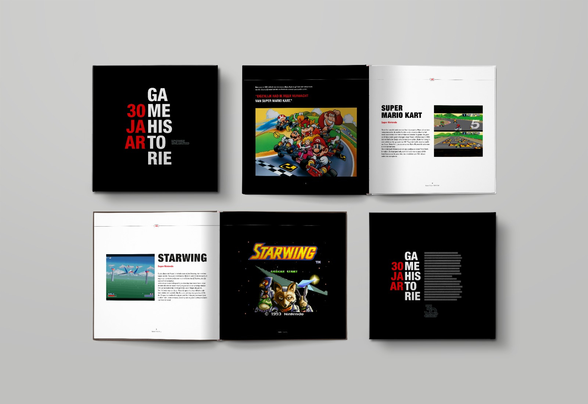

Verstopt tussen andere beleidsplannen stond een week geleden iets interessants: Nederland kijkt naar nieuwe wetgeving die lootboxen aan banden legt. Een goed initiatief, maar er is een grote kans dat die wet te laat komt en meer kwaad dan goed zal doen.

Excuus voor de wat late nieuwsbrief! Het was een voor mij drukke en verder nieuwsluwe week, dus vandaar dat hij eens op maandagmiddag verschijnt. Deze editie van Gamepraat telt 1.185 woorden en neemt zes minuten van je tijd in beslag - we trappen af.

[Subscribe](#/portal/signup)

## Schrijven van '30 jaar Gamehistorie is begonnen'

Een paar weken terug vertelde ik al over het koffietafelboek dat ik samen met Power Unlimited maak. Daarin blikken we terug op de belangrijkste en interessantste games, consoles en ontwikkelaars van de afgelopen drie decennia. Toen hadden we nog een aantal pre-orders nodig voordat ik kon beginnen met schrijven, maar inmiddels is er goed nieuws: we zijn officieel gestart met de productie!

Er is een raamwerk voor het boek, een selectie aan onderwerpen en de eerste teksten zijn geschreven. Eén van de ontwerpers stuurde onderstaand beelden die een idee geven van hoe het er straks uitziet:

🥰

We mikken op een verkoopstart later dit jaar, rond het jubileum van Power Unlimited in oktober. Dan is er ook een expositie in Beeld en Geluid. [Bestellen kan nog hier!](https://shop.reshiftstore.nl/products/pre-order-het-pu-30-jaar-collectieboek?ref=gamepraat.nl)

## Komt de lootboxwet te laat?

Het was eind juni makkelijk om de overheidsplannen tegen lootboxen te missen. In een [persbericht](https://www.rijksoverheid.nl/actueel/nieuws/2023/06/29/consumentenagenda-minister-adriaansens-aanpak-deurverkoop-eenvoudig-online-opzeggen?ref=gamepraat.nl) over plannen tegen deurverkoop stond ergens onderin de volgende passage verstopt:

> _De Europese Commissie heeft - mede door inzet van Nederland - onlangs in de hele EU de digitale consumentenbescherming verbeterd. Bijvoorbeeld door onveilige producten op online platforms te weren, consumenten recht te geven op updates en een verbod op nepbeoordelingen in te stellen. Nu is het zaak om deze regels actueel te houden en te laten inspelen op snelle digitale ontwikkelingen, iets wat de Europese Commissie wil doen.
>
> Daarom gaat Nederland in de EU in ieder geval inzetten op aanvullende regels rondom zogenoemde in-app en in-game aankopen. Gebruikers waaronder kinderen krijgen in spellen op hun telefoon, gameconsole of computer regelmatig actief de mogelijkheid aangeboden om tegen betaling verder te komen in een spelletje of meer mogelijkheden van een app te ontsluiten. **Wat het kabinet betreft komt er in ieder geval een verbod op ‘lootboxes’. Dit zijn virtuele schatkistjes in games waarbij een gebruiker niet weet wat hij voor een aankoop terugkrijgt als beloning**._

Deze wet zat er al aan te komen. De Nederlandse Kansspelautoriteit (KSa) probeerde enkele jaren terug het gebruik van lootboxen in games aan banden te leggen, door ze te verbieden in spellen waar de beloning uit een lootbox monetaire waarde heeft. Met andere woorden: als je in een lootbox iets kunt vinden dat je daarna kan doorverkopen voor meer geld, dan mocht dat volgens de KSa niet. Dat lijkt namelijk teveel op een fruitmachine, waar je geld in kunt gooien in de hoop je investering terug te verdienen en winst te maken.

Er is een reden waarom de KSa zo selectief was in wat wel of niet qua lootboxen mocht. Er was geen wet specifiek tegen lootboxen, waardoor de waakhond op zoek moest naar spellen die in strijd zijn met de algemene wet op de kansspelen. Games die teveel lijken op fruitmachines zouden eigenlijk online kansspelen zijn, vallen onder die wet en kunnen daardoor aan banden worden gelegd. Een online kansspel was op dat moment nog verboden, wat betekent dat die games niet verkocht zouden worden. Per 2021 zouden de games wel in de winkels mogen liggen, want toen ging de nieuwe wet op de online kansspelen in. Maar dan was wel een vergunning nodig en moesten spelers onder de 18 jaar worden geweerd.

### Rechtszaak tegen FIFA

Het leidde tot maatregelen tegen een handvol games. Namen werden nooit genoemd, maar snel bleek het ondermeer om _FIFA_ te gaan. Spelers konden kaarten verkocht in _FIFA Ultimate Team_ doorverkopen, wat niet mocht volgens de KSa.

Uitgever EA stapte naar de rechtbank om zich te verzetten tegen het verbod en kreeg daarin gelijk: volgens de rechter kan de game onder huidige wetgeving niet worden verboden. Wil Nederland lootboxen aan banden leggen, dan is daar nieuwe wetgeving voor nodig.

### Een wet kan nog jaren duren

Die wet komt er nu, maar het is de vraag hoe snel. Ter illustratie: de wens voor een lootboxwet werd een jaar geleden uitgesproken, waarna nu pas de intentie is uitgesproken die ook te gaan maken. Nu volgt een periode waarin de tekst voor die wet wordt bepaald. Commissies delen hun expertise, politici gaan in discussie over mogelijke amendementen. Op die manier wordt gesteggeld over hoe de wet het beste ingevuld kan worden.

Daarna zal de Tweede Kamer over de wet stemmen. De kans is groot dat dit langer zal duren dan verwacht, gezien de regering is gevallen en we in november naar de stembussen gaan. Is er gestemd? Dan zal de wet naar de Eerste Kamer gaan, die zich er ook over moet buigen.

We zagen hetzelfde gebeuren bij de Wet op de online kansspelen, waar in 2016 over werd gesproken. Uiteindelijk zou het drie jaar duren tot de wet werd aangenomen, waarna hij in 2021 pas van kracht was. Vijf jaar na de eerste gesprekken.

### Games stappen al van lootboxen af

In de tussentijd kan er al een hoop veranderd zijn. Je ziet op dit moment al dat veel uitgevers wegstappen van lootboxen. Wereldwijd grijpen toezichthouders in, waardoor lootboxgames minder interessant worden. In onder andere _Fortnite_ zie je daarom nu een Battle Pass, een freemium-systeem dat niet afhankelijk is van willekeur en andere gokprincipes.

Het betekent dat de lootboxwet misschien wel te laat komt. Tegen de tijd dat deze in Nederland is aangenomen en in werking treedt, is het aantal lootboxgames wellicht afgenomen tot een verwaarloosbaar aantal. En is er tegen die tijd misschien een ander gamesysteem om te reguleren, waar weer nieuwe wetgeving voor moet worden voorgesteld. Maar dan begint het lange wachten opnieuw.

Het (toekomstige) kabinet zou dit kunnen voorkomen door de nieuwe lootboxwet ruim op te stellen, maar dat brengt een tweede risico met zich mee. De wet zou bijvoorbeeld gamers kunnen beschermen tegen alle spellen met willekeur, maar daar zou dan bijvoorbeeld ook een rpg met drop-percentages voor nieuwe gear onder vallen. Voor je het weet heb je een verbod op games die niks te maken hebben met gokverslaving.

Het is een lastige lijn om te bewandelen.

## Verder interessant deze week

-   Er is een **Steam Sale** gaande. Verreweg het interessantst is de korting op de [Steam Deck](https://store.steampowered.com/steamdeck?ref=gamepraat.nl), die je nog tot en met de 13e koopt met 20 procent korting.

-   De **celstraf voor Sonic-maker Yuji Naka** is voorwaardelijk. Daarnaast moet hij een boete betalen van omgerekend 1,1 miljoen euro. Hij handelde met voorkennis bij uitgever Square Enix, om zo flink geld te verdienen.

-   **De overname van Activision door Microsoft heeft een naderende deadline**, maar de rechter moet zich nog uitspreken in de zaak tussen Microsoft en Amerikaanse handelswaakhond FTC. Vermoedelijk wordt uitstel voor de deal verleend, zodat na de uitspraak ook nog ruimte is voor een beroep.

-   In **Baldur's Gate 3** kun je seks hebben met een beer.

    [Bekijk ingesloten media](https://www.youtube-nocookie.com/embed/0gYvnwGlihY?rel=0&autoplay=0&showinfo=0&enablejsapi=0)

[Subscribe now](#/portal/signup)
