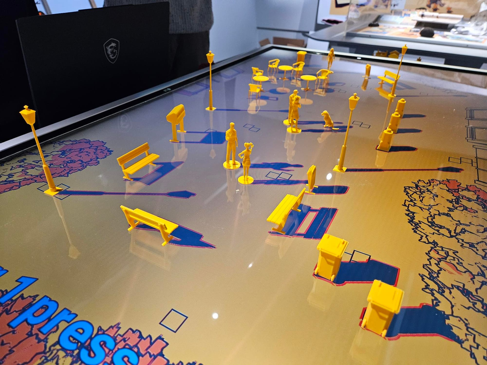

Afgelopen maanden heb ik druk gesleuteld aan een expositie over de Friese indiegame _SCHiM_, die sinds afgelopen weekend te bezoeken is in Forum Groningen. Het is de [tweede keer](/artikelen/deze-week-begint-de-zelda-expositie) dat ik zo'n tentoonstelling in elkaar mocht zetten - en de eerste voor een indiegame, waardoor ik veel directer met de makers kon praten. Het leidde niet alleen tot een uniek kijkje in de ontwikkeling van de Friese hitgame, maar ook in een totaal nieuw spel speciaal ontwikkeld voor de expositieruimte.

_Deze editie van Gamepraat telt **951** woorden en neemt vier minuten van je tijd in beslag. Vind je dit leuk om te lezen? Stuur de nieuwsbrief door naar een vriend! Dat helpt al ontzettend._

Nederlandse games die een wereldhit worden zijn relatief zeldzaam - en de kans is nog kleiner dat zo'n game uit het noorden van ons land komt. De meeste Nederlandse spellen worden ontwikkeld in de Randstad, rond Utrecht of Amsterdam. Van de 25 games die later dit jaar op gamebeurs Indigo te spelen zijn, komen slechts drie uit de noordelijke provincies. Dat heeft allerlei oorzaken: van de jarenlange aanwezigheid van de (inmiddels gesloten) Dutch Game Garden in Utrecht tot de locatie van grote ontwikkelstudio's zoals Guerrilla en Abstraction in grote steden, waardoor ontwikkeltalent daar blijft kleven.

Ondanks die trends is _SCHiM_ ontwikkeld door Friezen Ewoud van der Werf en Nils Slijkerman. Ik vind dat mateloos interessant: het daar minder aanwezige ontwikkelklimaat zorgt dat hun game bij uitstek anders is geworden. Waar Game Garden-bedrijven omringd zijn door collega's uit de game-industrie, zit SCHiM's ontwikkelstudio Extra Nice aan de gracht van Leeuwarden bij totaal andere bedrijven.

## Het Nederlandse SCHiM en Franse Clair Obscur

Wellicht is dat onbewust ook de reden waarom _SCHiM_ extreem Hollands aanvoelt. Nils en Ewoud waren bij de ontwikkeling niet omringd met alleen maar gamemakers met een internationale bril op, maar kwamen wellicht ook in aanraking met mensen met een andere, vaak toch wat Nederlandsere blik op de wereld. Een groep mensen die geheid aanslaat op de Nederlandse architectuur die de gamelevels domineert. Het waren ook deze omgevingen die collega's bij Forum nieuwsgierig maakten toen ik deze expositie bij ze voorstelde.

Dat Nederlandse toontje zie je zelden in Nederlandse games. Je zou aan _Horizon_ iets Nederlands kunnen toeschrijven door het soms woeste water in de spelwereld, maar dan ben je echt bewust op zoek naar een vage suggestie van onze cultuur. Spellen van indiecollectief Sokpop hebben tussen de regels door een Nederlands gevoel, maar dat is lastig te definiëren. _SCHiM_ is op zijn beurt expliciet afkomstig uit ons land, met zijn Hollandse treinstations, zijn grachtenpanden en het beeld van Us Mem uit Leeuwarden.

Het maakt de game makkelijk te vergelijken met het recent verschenen Clair Obscur: Expedition 33, een Franse game die ook ongegeneerd Frans aanvoelt. In NRC Handelsblad schreef ik afgelopen week [het volgende](https://www.nrc.nl/nieuws/2025/05/05/het-prachtige-clair-obscur-is-misschien-wel-de-meest-franse-game-ooit-gemaakt-a4892140?ref=gamepraat.nl):

"Op sommige fronten is dat expliciet: één van de eerste bazen waar Gustav tegen kan vechten is een mimespeler, die hem na overwinning beloont met een nieuwe outfit bestaande uit beret, rood-wit shirt en omgebonden doek - een stokbrood ontbreekt nog net. Op dramatische momenten wordt in de game niet gescholden met Engelse krachttermen, maar met 'merde' en 'putain'."

Ik vind het geweldig. Jarenlang zijn games zo internationaal mogelijk qua insteek geweest - in een poging de vooral aanwezige Amerikaanse consument te bereiken. Iets waardoor we dreigden onze eigen smoel kwijt te raken. Onze sector heeft meer spellen met een eigen identiteit nodig.

## Onze eigen game

De expositie gaat over _SCHiM_ in de breedste zin: van hoe de game is ontwikkeld tot aan hoe de shaders werken. Waar ik persoonlijk misschien wel het meest enthousiast over ben is de game die Nils en Ewoud daarnaast voor ons hebben gemaakt. Een combinatie van een liggend scherm en 3D-geprinte silhouetten hebben we met een mix van analoge en digitale objecten iets unieks neergezet. Ook leuk is dat dit ook de eerste multiplayerversie is van _SCHiM_.

De expositie van SCHiM loopt nog tot en met 31 augustus in Storyworld bij Forum Groningen.

## Verder interessant deze week

-   Afgelopen weekend konden fans in Zaandam de Switch 2 uitproberen. Inhoudelijk kon je er hetzelfde zien als bij de personthulling in april, daarom had ik ditmaal mijn zesjarige zoontje meegenomen. _Mario Kart World_ had hij vooraf het meeste zin in, maar _Donkey Kong Bananza_ was achteraf de grote favoriet.
-   Grand Theft Auto VI is uitgesteld naar 2026. Een beetje zoals verwacht, maar het heeft grote gevolgen voor de game-industrie, omdat iedereen probeert een gelijktijdige verkoop met de megagame uit de weg te gaan. Jason Schreier heeft daar op [Bloomberg](https://www.bloomberg.com/news/newsletters/2025-05-09/-grand-theft-auto-vi-delay-is-impacting-every-game-company?ref=gamepraat.nl) een uitstekende analyse over.

[Bekijk ingesloten media](https://www.youtube.com/embed/sQEGy86F2gE?feature=oembed)

-   Nintendo dreigt spelcomputers van klanten [onbruikbaar te maken](https://www.gamefile.news/p/nintendo-emulation-hacking-brick-warning-terms-of-service?ref=gamepraat.nl) als ze deze proberen te modificeren of illegaal verworven games spelen. Een opmerkelijke strategie waarmee Nintendo indirect ook tornt aan het consumentenrecht. Bij smartphones durfde Apple nooit zulke maatregelen te nemen tegen jailbreakers.
-   Een update voor Zelda 64 Recompiled maakt het dodelijk simpel om de game met moderne extraatjes zoals dual stick controls en HD texture packs te spelen. Onderstaande video van Nerrel legt uit hoe:

[Bekijk ingesloten media](https://www.youtube.com/embed/NtSDwwZqJ5A?feature=oembed)

-   Het blijven zware tijden in de game-industrie. Na de sluiting van Gamer.nl en Eurogamer Benelux is nu ook [Polygon verkocht aan een nieuw bedrijf](https://kotaku.com/polygon-sold-vox-media-valnet-layoffs-digital-gaming-1851778655?ref=gamepraat.nl) dat het gros van het personeel heeft ontslagen. Giant Bomb stond ook op losse schroeven, maar is inmiddels [verkocht aan de originele redactie](https://about.fandom.com/news/fandom-sells-giant-bomb-to-independent-creators?ref=gamepraat.nl).

Tot volgende keer!
