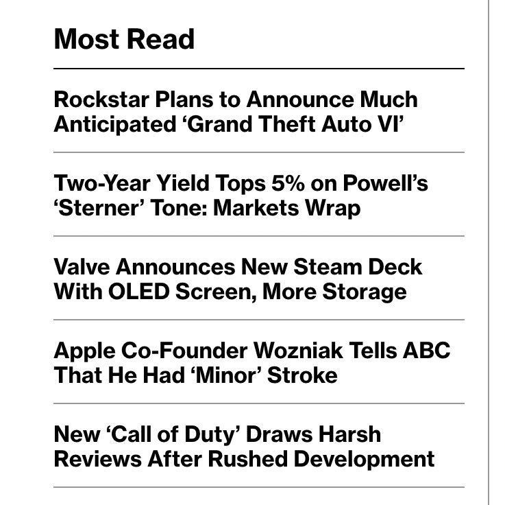
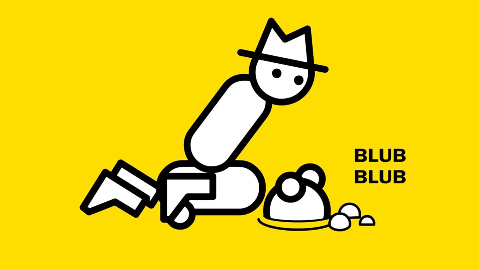
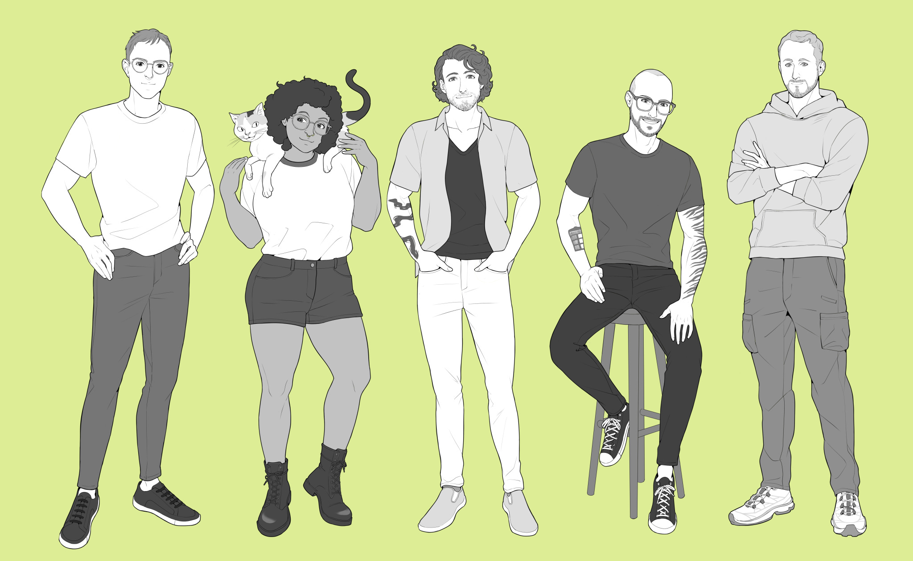
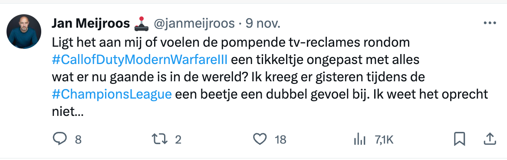

Het was een bewogen week voor gamejournalisten. Er was slechts één knullig besluit van een uitgever voor nodig om het geroemde Escapist Magazine de nek om te draaien, waarna redacteuren besloten voor zichzelf te beginnen - in dezelfde week dat oud-Kotaku-journalisten hun eigen website introduceerden. Kunnen zij het tij keren in een jaar waarin gamesites vooral worden gekort en gesloten?

Verder deze week: _Modern Warfare III_ verscheen, maar heeft een zure nasmaak tijdens het Israëlisch-Palestijns conflict. Het wordt tijd om oorlog serieuzer te behandelen, zoals we ook bij films en boeken doen.

[Subscribe](#/portal/signup)

## Gamejournalisten hebben het moeilijk, maar gamejournalistiek is in trek

Onderstaande gaat veel over tegenslagen bij grote gamesmedia. Het zijn barre tijden voor fulltime gamejournalisten, die steeds vaker door hun uitgevers op straat worden gezet. Maar voordat we daar in duiken, wil ik één interessant punt van de afgelopen week eerst uitlichten.

Want wat bleek: hoewel gamejournalisten op de tocht staan, zijn verhalen erover buitengewoon veel in trek. Nieuwsportaal Bloomberg, wereldwijd leverancier van zakelijk nieuws, zag in de afgelopen week op drie plekken in de top vijf best gelezen stukken een artikel over games staan ([via Jason Schreier](https://twitter.com/jasonschreier/status/1722959862307475737?ref=gamepraat.nl)):

Er is dus geen gebrek aan interesse in gamejournalistiek, maar een gebrek aan inzicht in hoe je het laat werken.

## Ontsnapt van Escapist Magazine

Het leek allemaal snel te gebeuren: begin afgelopen week vertelde Escapist-hoofdredacteur Nick Calandra [dat hij was ontslagen](https://twitter.com/nickjcal/status/1721640314203464045?ref=gamepraat.nl) omdat de site 'niet de gezette doelen had behaald' - doelen waarvan Calandra zei nooit iets te hebben gehoord. De gamejournalist weigerde een ontslagregeling en wilde ook geen geheimhoudingsverklaring tekenen.

Wat volgde was een fantastische blijk van solidariteit: het gehele videoteam van Escapist nam ontslag, zodat ze samen met hun oud-hoofdredacteur iets nieuws konden beginnen. Ooh Yahtzee Croshaw vertrok bij de site. Een doodsvonnis: een groot deel van het verkeer dat Escapist genereerde kwam via Croshaw's beroemde reviewreeks [Zero Punctuation](https://www.escapistmagazine.com/category/zero-punctuation/?ref=gamepraat.nl).

[Second Wind](https://t.co/QstDBGXugU?ref=gamepraat.nl), het nieuwe platform van de vertrekkende redacteuren, doet het na een paar dagen al buitengewoon goed. Een paar statistieken:

-   158.000 abonnees op YouTube
-   18.500 volgers op X (voorheen Twitter)
-   3.106 leden op Patreon die bij elkaar 4.177 euro per maand betalen
-   Meer dan 30.000 leden op Discord

Calandra voorspelt op zijn Discord dat de site deze week zijn intern gestelde doelen al zal halen, nog voordat ze veel hebben geproduceerd.

## De nasleep van Kotaku's Aftermath

In dezelfde week werd ook de nieuwe gameblog [Aftermath](https://aftermath.site/?ref=gamepraat.nl) geïntroduceerd. Een initiatief van oud-Kotaku-redacteuren Nathan Grayson, Gita Jackson, Riley MacLeod en Luke Plunkett, samen met freelancers Chris Person en Alex Jaffe. Het is de club die Kotaku jarenlang vulde, maar met de jaren is ontslagen of zelf vertrok.

Het gaat namelijk niet lekker met Kotaku. In 2019 werd de site overgenomen door het nieuwe mediaconcern G/O Media, nadat een groep investeerders de site samen met andere oud-Gawker-websites had overgenomen. Sindsdien is de site langzamerhand getransformeerd in een contentfabriek. De gekke blogposts over Twitch-streamers, snacks en gamecultuur zijn omgeruild voor lijstjes met de beste games en algemene reviews, geschreven door een steeds jongere en dus goedkopere redactie. De ziel is er uit.

Aftermath belooft al dat te doen herleven. En net als Second Wind is ook deze website in handen van de makers zelf: er zit geen grote uitgever tussen die doelen stelt en mensen makkelijk op straat kan zetten, iets dat afgelopen jaar veel gebeurde op gameredacties. Ook het verdienmodel is sympathieker. Bij Aftermath word je niet getorpedeerd met advertenties, maar betaal je een maandelijks abonnement om alles te kunnen lezen. 7 dollar per maand, of 10 als je ook in hun Discord wil en reacties wil plaatsen.

Lang niet iedere oud-Kotaku-lezer zal bereid zijn maandelijks te betalen voor een gamesite, maar de harde kern die dit soort verhalen waardeert wel - en hopelijk zijn dat er genoeg om dit staande te houden. Ok duim dat Aftermath en Second Wind in de succesverhalen veranderen die de gamejournalistiek nu hard nodig heeft.

## Call of Duty en de Gaza-strook

Collega-gamejournalist Jan Meijroos tweette afgelopen week over het ongemak dat hij voelt bij het nieuwe _Call of Duty: Modern Warfare III_. De game voelt voor hem ongepast, in een periode dat hetzelfde soort oorlogsgeweld door ondermeer de Gaza-strook heendendert en gigantisch veel mensen het leven kost.

Dat gevoel bekruipt mij ook al een tijdje - en is één van de redenen waarom ik collega-journalist Len Maessen afgelopen jaar vroeg om voor AD een verhaal te maken over [hoe moslims Call of Duty ervaren](https://www.ad.nl/games/kritiek-op-hoe-call-of-duty-met-moslims-omgaat-er-lag-een-kapotgescheurde-koran-in-een-plas-bloed-op-de-grond~a3fa94ee/?ref=gamepraat.nl). De Amerikaanse oorlogspropaganda in de games komt bij hun immers totaal anders binnen: hun thuisland in puin, brandende Korans op straat, het is niet mals om allemaal te zien.

Bovendien vraag ik me af of we dit soort oorlogsverheerlijking niet voorbij moeten groeien bij games. Het past bij het imago van gaming in de jaren '90, toen vooral pubers lekker wilden knallen, maar staat haaks op hoe andere media hetzelfde onderwerp benaderen. Er zijn wel films en boeken over oorlog, maar vaak gaan ze over trauma en verdriet. _Call of Duty_ gaat hooguit over hoe cool soldaten zijn.

Ik verwijs vaak naar _Spec Ops: The Line_ als een oorlogsshooter die het anders kan aanpakken - die game ging over de gruwelen van oorlogsmisdaden. Maar Spec Ops is inmiddels elf jaar oud en er zijn weinig recente voorbeelden die net zo goed zijn. Misschien is het tijd voor _Call of Duty_ om in zulke materie te duiken, maar de kans is klein dat dit gebeurt. De games worden deels gefinancierd door militaire instanties, die liever niet door hun eigen investeringen worden bekritiseerd.

## Verder interessant deze week

-   GTA6 wordt in december [dan toch echt getoond](https://www.rockstargames.com/newswire/article/4kok877a13aa32/a-message-from-rockstar-games?ref=gamepraat.nl).
-   Oké, één techding in plaats van gaming: ik was afgelopen week in Parijs. Apple heeft daar een geheim lab, waar ze voor het eerst over spreken en een kleine groep journalisten mocht komen kijken. [Ik schreef voor AD over hoe ze met speciale lasers chips proberen te manipuleren om zo hun beveiliging te verbeteren](https://www.ad.nl/economie/hier-proberen-apple-hackers-de-iphone-te-kraken-met-speciale-lasers-een-kijkje-in-het-geheime-labaa9ba4fc/?ref=gamepraat.nl).
-   Analogue maakt al jaren een bijzondere kloon van de originele Game Boy, die tot op hardwareniveau hetzelfde functioneert. Duur is ie wel, met een prijs van 250 dollar plus 60 dollar verzending naar Nederland. Een nieuwe concurrent van Funnyplaying belooft betaalbaarder te worden: die werkt met dezelfde technologie, maar kost bij elkaar slechts 69 dollar.

[Bekijk ingesloten media](https://www.youtube-nocookie.com/embed/Cesh5OAL4uk?rel=0&autoplay=0&showinfo=0&enablejsapi=0)

-   Netflix [voegt een lading indie-games toe](https://www.polygon.com/23949285/netflix-games-2024-trailers-reveals?ref=gamepraat.nl) aan zijn app, waaronder één van mijn favorieten Hades.
-   Ik ben mezelf al dagenlang aan het vertellen dat ik de [oled-versie van de Steam Deck](https://www.steamdeck.com/nl/oled?ref=gamepraat.nl) ECHT niet nodig heb, want ik heb al het lcd-model. Benieuwd of ik dat weet vol te houden.
-   De nieuwe game van de maker van Night in the Woods is geannuleerd en de ontwikkelstudio sluit de deuren, wegens [gezondheidsredenen van de maker](https://www.eurogamer.net/night-in-the-woods-co-creators-revenant-hill-cancelled-amid-serious-health-issues?ref=gamepraat.nl).
-   Netflix heeft het vertrek van Henry Cavill bij The Witcher slim opgelost: de volgende Witcher-productie wordt geanimeerd, met de stemacteur van de games in de hoofdrol.

[Bekijk ingesloten media](https://www.youtube-nocookie.com/embed/Y7ZgJCl62sA?rel=0&autoplay=0&showinfo=0&enablejsapi=0)

Tot volgende keer!

[Subscribe now](#/portal/signup)
