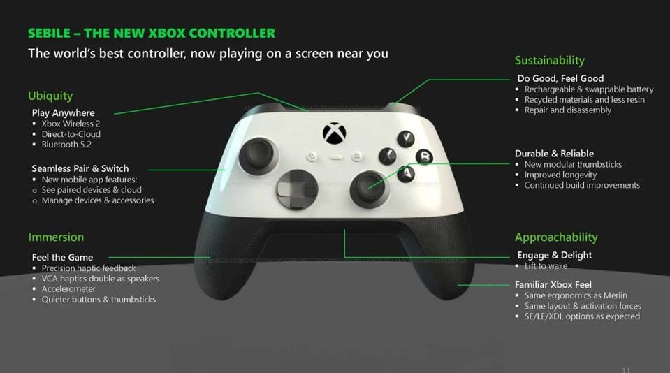
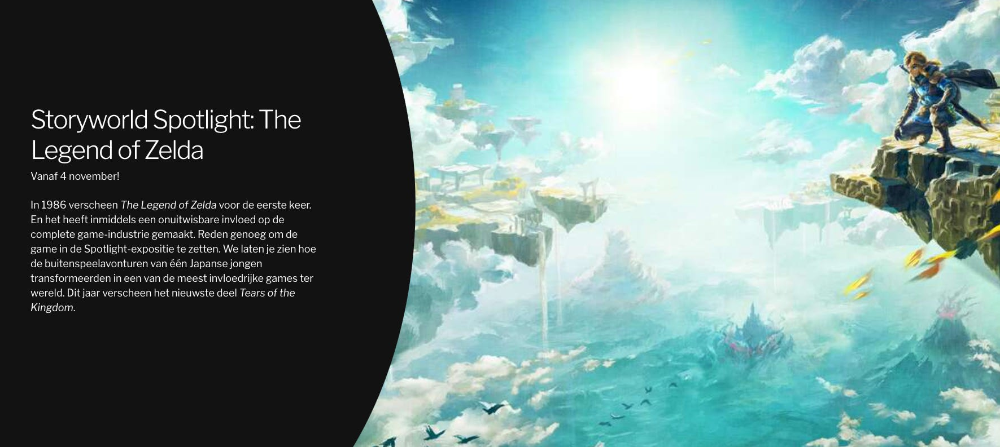
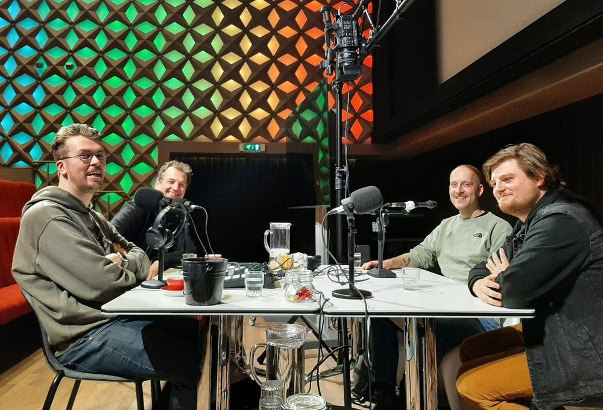

Hoe zou de Microsoft-medewerker die per ongeluk het volledige Xbox-tienjarenplan lekte zich vandaag voelen? Door een verkeerd formuliertje wisten we ineens hoe de volgende Xbox er uit komt te zien en welke onaangekondigde games op de planning staan.

We duiken dieper in dat lek en waarom je er ondanks de betrouwbare afkomst je toch niet alles moet geloven. Daarnaast hebben we het over de Zelda-expositie in Forum, de eerste Spelkost-aflevering met publiek en de nagenoeg laatste stap voordat Microsoft de overname van Activision-Blizzard mag afronden. We trappen af.

[Subscribe](#/portal/signup)

## Alle Xbox-plannen liggen op straat

Een flinke flater bij Microsoft deze week. Bij het indienen van documenten bij de Amerikaanse marktwaakhond werd per ongeluk een verkeerd formulier gebruikt, waardoor geheime informatie ineens openbaar werd. Daar stond onder andere het volgende in:

-   Microsoft heeft plannen voor vernieuwde versies van de huidige generatie consoles, waaronder een cilindervormige Xbox Series X.
-   Phil Spencer sprak intern over de mogelijkheid Nintendo of Valve over te nemen. Al is onduidelijk hoe concreet daar echt aan werd gewerkt.
-   Een nieuwe Xbox-controller verbindt rechtstreeks met de cloud, zodat je minder latency hebt bij gamestreaming.
-   Geplande remakes voor _Fallout 3_ en _The Elder Scrolls IV: Oblivion_.
-   Een next-gen update voor _Red Dead Redemption 2_
-   Een cloudconsole en gaminghandheld.
-   _Dishonored 3._
-   Een nieuwe _DOOM_.
-   _Ghostwire Tokyo 2_.
-   Apps voor cloudstreaming op smart-tv's.
-   De volgende generatie Xbox in 2028.

Daarmee lijkt de strategie van Microsoft tot en met 2030 op straat te liggen, maar reken er niet op dat al het bovenstaande ook echt zal gebeuren. Xbox-topman schreef op X (voorheen Twitter) dat de plannen [sindsdien veranderd zijn](https://twitter.com/XboxP3/status/1704233222752571842?ref=gamepraat.nl).

Dat klinkt als PR-praat, maar de documenten lijken dat ook indirect te bevestigen. Zo staat vermeld dat _Starfield_ al jaren terug moest verschijnen en _The Elder Scrolls VI_ in 2024 komt, wat doet vermoeden dat veel van de informatie jaren oud is. Als het plan in 2018 is opgesteld, dan was er nog geen rekening gehouden met de coronacrisis - die met zijn chiptekorten hardwareplannen van ieder bedrijf overhoop heeft gegooid.

Al vermoed ik dat die nieuwe Xboxen er sowieso komen, al is het maar omdat er al uitgebreide specificaties en illustraties te zien waren.

## Ik werk aan een Zelda-expositie

Als freelancer heb ik dit jaar best wat dingen gedaan die normaal nooit op m'n pad waren gekomen.

Ik heb twee [onderzoekspodcasts](https://podimo.com/nl/shows/goed-verhaal?ref=gamepraat.nl) gemaakt, een [koffietafelboek](https://pu.nl/boek/?ref=gamepraat.nl) geschreven. Schreef ineens voor tijdschriften waar ik thuis mee ben opgegroeid. En deze zomer kwam er nog een heel bijzondere klus bij: ik mag een expositie samenstellen bij Forum Groningen.

Forum is één van de weinige culturele instellingen in Nederland die videogames echt serieus neemt. Ze plaatsen het medium op dezelfde lat als films, theater, muziek en boeken. Bovenin het gebouw vind je [Storyworld](https://www.storyworld.nl/?ref=gamepraat.nl), een expositie gericht op verhaalvertelling in iedere mogelijke vorm. Een expositie die we vanaf 4 november wijden aan _The Legend of Zelda_.

Heel veel dank aan Jan-Willem de Vries die me daarin bijstaat - het is de eerste keer als samensteller, dus er is nog best wat te leren. Aan Laura Langendijk die mijn bedenksels als vormgever tof in beeld brengt. En uiteraard aan Arjan Terpstra, die jarenlang de game-exposities van Forum samenstelde en mij naar voren schoof als zijn opvolger daar.

Eerlijk: het is best spannend om af te wachten wat jullie op 4 november vinden. Maar ik hoop dat jullie een kijkje komen nemen.

## Spelkost met publiek!

_We namen al eens op in Beeld en Geluid, toen nog zonder publiek._

Op 4 oktober nemen Harry Hol, Erwin Vogelaar en ik onze gamepodcast Spelkost voor het eerst live met een publiek op. De uitzending is gratis bij te wonen in Beeld en Geluid in Hilversum, waar dan ook de Dutch Media Week plaatsvindt. Je kunt die dag dus ook de Dutch Game Day en de uitreiking van de Dutch Game Awards op dezelfde locatie bezoeken.

[Bekijk ingesloten media](https://open.spotify.com/embed/episode/5uZlKzXLQtTZ1bYvFznelr)

We beginnen om 15:30 uur met opnemen, dus het kan handig zijn om rond 15:00 uur te arriveren als je wil komen luisteren.

## Britse waakhond schoorvoetend akkoord met overname Activision

Een laatst kink in de kabel bij Microsofts overname van Activision-Blizzard is opgelost: de Britse marktwaakhond CMA is akkoord met de koop. Eerder lag de CMA nog voor de deal, maar ze hebben geen bezwaren meer nu ze het aangepaste voorstel hebben ingezien.

De Britse waakhond stond aardig onder druk. Omdat Europa en de Verenigde Staten de koop wilden laten doorgaan, bestond er een kans dat het bedrijf simpelweg de Britse markt zou overslaan om zich te richten op de rest van de wereld. Volgens geruchten zou Microsoft een rechtszaak met de Amerikaanse waakhond zelfs hebben uitgelokt om op deze manier druk op de CMA op te voeren.

De goedkeuring van de CMA is nog niet definitief: het is een uitspraak die vooruitloopt op hun uiteindelijke besluit. Maar zo'n uitspraak is bijna altijd identiek aan wat er besloten wordt, dus reken er maar op dat het nu allemaal op rolletjes blijft lopen.

Toch nog een lichtpuntje voor Microsoft in deze lekweek.

## Verder interessant deze week

-   Je kunt bij Nintendo voortaan wachtwoordloos inloggen met een passkey.
-   Cyberpunk 2077 is bezig met een comeback. De nieuwe DLC krijgt goede cijfers en ook de grote 2.0-update voor de basisgame wordt goed ontvangen.
-   Kleine kanttekening wel: recensenten werd verboden om zelf opgenomen beeldmateriaal van de game in videoreviews te gebruiken. Een kwalijke manier waarop ontwikkelaar CD Projekt de vrijheid van testers inperkt.

Tot volgende week!
