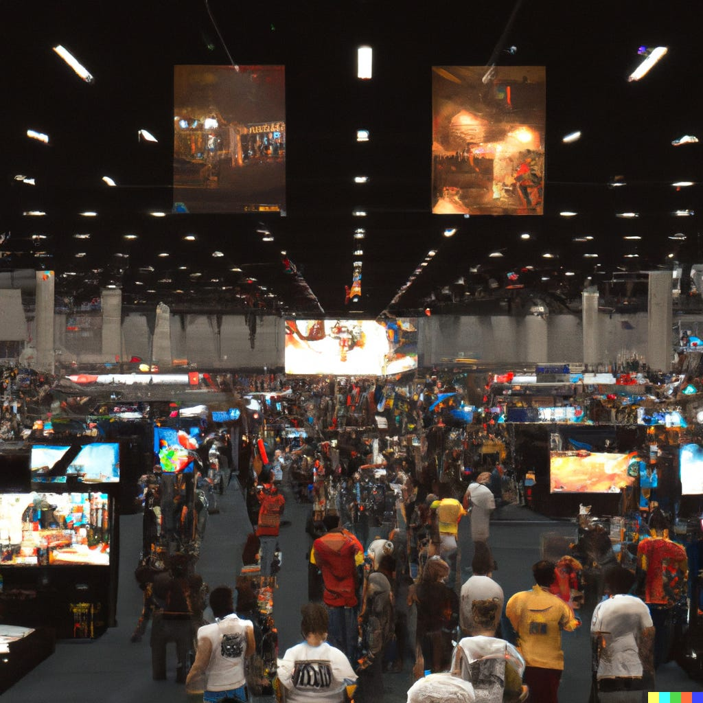

Ieder jaar neem ik me voor op te blijven voor de grote persconferenties rond E3-tijd. En ieder jaar heb ik de volgende ochtend spijt, omdat ik met mijn brakke kop het net zo goed tijdens het ontbijt had kunnen terugkijken. De E3 dreigt dit jaar - na jaren uitstel - uit elkaar te vallen, maar stiekem denk ik dat die jaarlijkse opblijftraditie nog wel intact blijft.

Verder deze week: een verrassingshit van Microsoft, dat met _Hi-Fi Rush_ laat zien hoe Game Pass gebruikt kan worden voor obscuurdere, creatieve games. En in MMORPG _Final Fantasy XIV_ is een soort digitaal dopingschandaal gaande. Deze editie van de nieuwsbrief is 1.780 woorden lang en neemt ongeveer negen minuten van je tijd in beslag. We trappen af!

[Subscribe now](#/portal/signup)

## E3 wordt uitgehold - maar ach

-   Ingewijden vertellen [aan IGN](https://www.ign.com/articles/xbox-nintendo-sony-skipping-e3-2023?ref=gamepraat.nl) dat Microsoft, Sony en Nintendo dit jaar alle drie gamebeurs E3 overslaan.
-   Microsoft zal tijdens E3 zelf iets organiseren.
-   Dit jaar zou E3 weer 'echt' terugkeren, maar zonder de grote consolemakers is dat lastig.

Jarenlang was E3 de belangrijkste gamebeurs op aarde. Het was waar de grootste games voor het jaar werden onthuld, nieuwe spelcomputers werden getoond en naar elkaar werd gesneerd tijdens persconferenties, waarna pers de beursvloer op kon om games alvast te testen.

Het coronavirus heeft dat verpest. De beurs kon jarenlang niet doorgaan, oud-journalist Geoff Keighley startte een [eigen online evenement](https://www.summergamefest.com/?ref=gamepraat.nl) en gamebedrijven realiseerden dat ze zelf ook prima een digitale presentatie kunnen opzetten. Dat laatste is ideaal gebleken: Sony kon ineens een persmomentje plannen op een moment dat Microsoft en Nintendo niks organiseerden, zodat ze de volledige media-aandacht pakten. En omdat ze niet afhankelijk waren van de hands-on-locaties op E3 zelf, hoefde dat niet vlak voor de beurs plaats te vinden.

Dat is waarschijnlijk waarom Nintendo, Sony en Microsoft niet meer terugkeren naar E3. Daarmee volgen ze een trend die stiekem ook al langer gaande was: EA was ook al een tijd niet op E3 te vinden, maar organiseert een eigen evenement rond dezelfde periode. Journalisten kunnen dan een half uurtje met een taxi naar een locatie in Hollywood rijden, waar alleen de spellen van EA te zien zijn.

_Illustratie gegenereerd door kunstmatige intelligentie DALL-E._

### Lang Leve E3

Voor gamers is weinig zo leuk als speculeren over de E3. Het is ons jaarlijkse toernooitje: wie komt het beste uit de verf, welke persconferentie was het ongemakkelijkst? Het is daarbij ook makkelijk om een hard oordeel te vellen over het ontbreken van de grote consoleboeren deze zomer. Het is alsof een rits landen ineens niet meer meedoet aan het WK voetbal: wat is het toernooi dan nog waard?

Maar tegelijkertijd is het iets waar wij Nederlanders - die zelden op de beursvloer rondlopen - niks van merken. E3 bestaat ieder jaar uit twee onderdelen. Eerst zijn er de persconferenties, waarna de beursvloer opengaat voor één-op-één-sessies en hands-ons voor journalisten. Volg je E3 vanuit Nederland, dan krijg je die persconferenties mee via livestreams, waarna je online de hands-ons van de pers leest of kijkt.

Maar dat zal grotendeels onveranderd blijven, zelfs als de grote drie niet naar E3 gaan. Microsoft heeft al beloofd tijdens E3 iets te organiseren - vermoedelijk is dat een persconferentie in dezelfde weken. Nintendo heeft in het verleden vaak een Direct gelivestreamd tijdens E3, zelfs als ze niet groots op de beurs stonden. Sony zou ook hetzelfde kunnen doen, al was het bedrijf afgelopen jaar doodstil rond E3-tijd.

Tegelijkertijd zullen er officiële E3-evenementen van kleinere bedrijven worden gestreamd en zal Keighley's show ook rond die periode worden georganiseerd. En die hands-ons worden individueel door bedrijven uitgestald bij de pers, waarschijnlijk zelfs tijdens de E3-week omdat ze dan ‘toch in de buurt zijn’.

De strekking blijft daarmee dus min of meer hetzelfde: ook deze zomer kijken we naar alle grote game-presentaties van bedrijven, met als grootste verschil dat ze niet het naampje 'E3' dragen. Dat is jammer voor de organisatie achter E3, maar qua nieuwsvoorziening maakt het niet zoveel uit.

## Hi-Fi Rush bewijst waar Game Pass goed voor is

-   Tijdens een persconferentie kondigde Microsoft de game Hi-Fi Rush aan, die ook meteen via Game Pass te downloaden was.
-   Het spel is gemaakt door de studio van Shinji Mikami, bekend van onder andere _Resident Evil_ en _The Evil Within_.

Het nieuwe _Hi-Fi Rush_ voelt als een ode aan oude games voor de Dreamcast en GameCube. Personages lijken regelrecht uit een jaren '90-cartoon gerukt, met neon-gekleurde, rebelse kleren met een cel-shading-stijltje daar bovenop. Het gros van de game bestaat uit springen en vechten door een handjevol levels. Dat voelt haast zen: je hoeft alleen maar de hoofdroute te volgen en wat te rammen, in een tijd dat veel andere games bestaan uit allerlei bovenop elkaar geplakte complexe systemen.

[Bekijk ingesloten media](https://www.youtube-nocookie.com/embed/pgd4aU56Kig?rel=0&autoplay=0&showinfo=0&enablejsapi=0)

Alles in de game beweegt op maat van de muziek - tot de voetstappen van de hoofdpersoon aan toe. Vecht je op die maat, dan krijg je extra punten. Ook die focus op ritme doet denken aan lang vervlogen tijden, toen spellen als _Donkey Konga_, _Dance Dance Revolution_ en _Guitar Hero_ de overtoon hadden.

_Hi-Fi Rush_ is duidelijk gemaakt als tussendoortje op Game Pass: een spel dat iedere abonnee deze weken speelt en het over heeft, in een tijd dat er weinig echt grote releases zijn. Het is tegelijkertijd een game die een groot bedrijf als Microsoft niet zomaar zou maken als hij alleen los verkocht werd, want hoeveel mensen zouden een obscure homage naar oude cel-shaded-games echt kopen? Het is een intrigerend idee: wat als kleinere games zonder winstgarantie wel naar Game Pass komen, omdat het voor Microsoft de waarde van het platform genoeg verhoogt? Misschien gaat Microsoft meer, kleinere games maken die normaliter niet voorbij de pitchfase komen.

### Mikami of Mika-nie?

Overigens nog een klein zijstraatje: [op Twitter](https://twitter.com/simonzijlemans/status/1618348915967037444?ref=gamepraat.nl) ging het nog even over de rol van Shinji Mikami, wiens studio deze game heeft gemaakt. Want kun je dit wel een 'echte' Mikami-productie noemen? Qua stijl lijkt het totaal niet op zijn horror-voorgangers, en tijdens de presentatie wees hij ook naar John Johanas als de geestelijk vader van het project.

Het is dan makkelijk om Johanas als de bedenker te zien. De credits onderschrijven dat ook: Johanas is regisseur, terwijl Mikami producent is. Maar tegelijkertijd is dat exact de rolverdeling bij ook _The Evil Within 2_, een game die door iedereen wél als 'echte' Mikami-productie wordt gezien.

Waarschijnlijk wordt bij horrorgames vooral benadrukt dat Mikami betrokken is, omdat het goede PR is. Net zoals hoe Konami graag benadrukte dat sommige games van Hideo Kojima waren. In de praktijk is het maken van een game op deze schaal immers een teamactiviteit, waarbij je niet zomaar één auteur kunt aanwijzen.

## Digitaal dopingschandaal in Final Fantasy XIV

-   _Final Fantasy XIV_ heeft een nieuwe, zeer moeilijke raid gekregen in een recente update.
-   De beste spelers racen nu om te zien wie die raid als eerste kan uitspelen.
-   Eén groep had de winst geclaimd, maar nu blijkt dat zij gebruikmaakten van externe software om de game makkelijker te maken.
-   Producent Naoki Yoshida heeft het valsspelen veroordeeld.

Wie de endgame van _Final Fantasy XIV_ bereikt, komt al snel bij de raids terecht. In groepen van acht probeer je een paar keer per week de lastigste bazen te verslaan, om zo de sterkste uitrusting te krijgen. Eén fout van één speler en je moet waarschijnlijk opnieuw beginnen, waardoor het bevechten van een raidbaas voelt als het leren van een soort dans.

Het is een systeem dat in games als _World of Warcraft_ al jarenlang succesvol blijkt, en naarmate _Final Fantasy XIV_ groter wordt, groeit ook de groep raiders. Teams met de allerbeste spelers racen tegen elkaar om als eerste de nieuwe raids uit te spelen, wat ditmaal gebeurt bij de nieuwe Ultimate-raid getiteld 'The Omega Protocol'.

Een Japanse groep claimde de overwinning. De race leek voorbij, totdat Twitter-gebruikers in de overwinnings-screenshot opmerkten dat de camera wel érg ver was uitgezoomd. Dat is in de game onmogelijk en kan alleen als je externe plug-ins installeert. Die plug-in op zichzelf is vrij onschuldig, maar de aanwezigheid hiervan impliceert dat de spelers misschien ook andere, indringendere software gebruiken.

[Bekijk ingesloten media](https://www.youtube-nocookie.com/embed/nnkIninQIrQ?rel=0&autoplay=0&showinfo=0&enablejsapi=0)

Andere MMORPG's ondersteunen doorgaans zulke extra software, bijvoorbeeld om de interface mee aan te passen of een DPS-meter mee te draaien, zodat je kan zien wie de meeste schade doet. Zulke middelen zijn essentieel voor professionele raiders, maar in _Final Fantasy XIV_ zijn ze verboden. De ontwikkelaar vreest dat ze negatief gedrag in de hand werken. Want als je een DPS-meter hebt, hoe groot is dan de kans dat je andere, slechte spelers gaat bekritiseren om hun prestaties?

Veel raiders gebruiken alsnog zulke software maar houden het stil. Mensen worden zelden geschorst om het gebruik hiervan - enkel als je het kenbaar maakt en er negatief naar handelt, wil Square Enix wel eens ingrijpen. Maar het zorgt bij de raid-race voor een gekke situatie: omdat plug-ins verboden zijn, wordt het gezien als een soort digitale doping.

De blogpost van hoofdproducent Yoshida is in elk geval kritisch. Dat merk je alleen al aan de [in rood gemarkeerde passages](https://na.finalfantasyxiv.com/lodestone/topics/detail/436dce7bd078c914009957f2221c13e6a5cb497d?ref=gamepraat.nl), die lezen alsof ze van een teleurgestelde schooldocent komen. "Toen andere gevallen van oneerlijk spel werden ontdekt in eerdere raids, hebben we mensen gestraft", schrijft hij. "Als we een onderzoek starten en dit weer zo blijkt, dan zullen we dit niet over het hoofd zien".

De speler die de overwinning claimde heeft op Twitter inmiddels sorry gezegd, zoals ook een wielrenner betrapt op doping dat zou doen: “Onze oprechte excuses voor de overlast en onze excuses voor het ongemak. Ik ben zojuist in de game gestraft. We zullen ervoor waken dat dit in de toekomst niet meer gebeurt.”

> お騒がせしている件について深くお詫び申し上げます
>
> 各方面多大なるご迷惑をおかけしたことに対して、謝罪いたします
>
> 先ほどゲーム内で処罰を受けました
>
> 今後はこのようなことが二度と起こらないように気を付けてまいります
>
> — Sherry Vermouth (@DearGrimm) [7:38 PM ∙ Jan 31, 2023](https://twitter.com/DearGrimm/status/1620506886935310336?ref=gamepraat.nl)

## Ook interessant deze week

-   Een tijdje terug had ik het over de [geheime kamer in](/artikelen/een-geheime-kamer-vol-woedende-gameontwikkelaars) [**Sports Story**](/artikelen/een-geheime-kamer-vol-woedende-gameontwikkelaars), waarin ontwikkelaars hun beklaag deden over de werkomstandigheden bij een ontwikkelstudio die érg veel op die van hunzelf leek. In een patch is die kamer nu aangepast en is iedere kritiek verwijderd.
-   De nominaties voor de GDC Awards [zijn bekend](https://gamechoiceawards.com/?ref=gamepraat.nl), en het Nederlandse **Horizon: Forbidden West** ding mee naar drie prijzen: Best Audio, Best Technology en Best Visual Art.
-   Aflevering drie van **The Last of Us** is wat mij betreft de beste in de serie. Sinds afgelopen maandag is ie te streamen bij HBO.
-   Afgelopen zomer zat **Hollow Knight: Silksong** in een Microsoft-presentatie van games die 'het komende jaar' moeten verschijnen. Ik heb snel even gerekend: het duurt nog 131 dagen tot die vage deadline. Hier kom ik vast nog een paar keer op terug.
-   De Nederlandse Kansspelautoriteit heeft een boete van 400.000 opgelegd bij goksite **JOI Gaming**. Zij hadden advertenties gericht op jongvolwassenen geplaatst, wat in Nederland verboden is.

[Subscribe](#/portal/signup)
