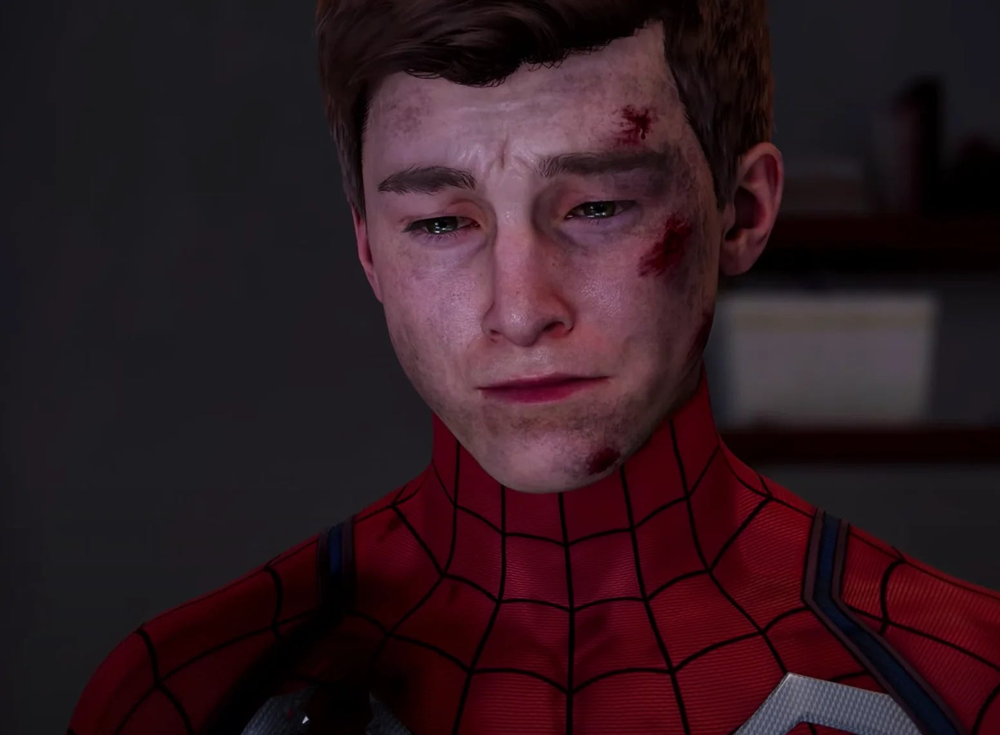

Eerder vandaag kondigde de programmamanager van de Dutch Media Week aan dat hij vertrekt bij Beeld & Geluid: het museum 'wil niet langer een leidende rol in het project'. Daarmee lijken ook de Dutch Game Awards op losse schroeven te staan, maar geen nood: ik heb goed nieuws.

Verder deze week een gigalek bij Sony-studio Insomniac, waardoor plannen voor de komende jaren op straat kwamen te liggen. Een interessant inkijkje voor gamers, maar het gaat ten koste van ontzettend veel - waaronder goede journalistiek.

[Subscribe](#/portal/signup)

## Het komt goed met de Dutch Game Awards

Al sinds 2016 organiseerde Herman Dummer de Dutch Media Week Awards, wat hij sinds 2018 deed bij Beeld & Geluid. Er zijn weinig mensen zo herkenbaar als Herman, met zijn immer oranje trui. Met de Dutch Media Week had hij een grootschalig media-evenement op touw gezet, met voor de gamesector het hoogtepunt op de daarbij behorende Dutch Game Day. Overdag gaven experts presentaties over hun tijd bij gamebedrijven, waarna in de avond de Dutch Game Awards werden georganiseerd _(kleine disclaimer: ik zat tweemaal in de jury en ben dus zijdelings betrokken geweest_).

"Recent heeft Beeld & Geluid aangegeven geen leidende rol meer te willen hebben in het totale project Dutch Media Week; in ieder geval voor het professional-gedeelte (op maandag t/m vrijdag)", las deze week een verklaring van Herman en Beeld & Geluid. De komende periode moet blijken hoe het project zal worden ingevuld. Herman gaat het museum verlaten.

Daarmee leken de gamegerelateerde evenementen tijdens de Dutch Media Week ook in gevaar, maar voor de Dutch Game Awards hoeven we volgens organisator Martine Spaans niet te vrezen: "de Dutch Media Week gaat gewoon door en de awards ook. Beeld & Geluid blijft nauw betrokken bij de organisatie en zal vooral de focus op de publieksprogrammering hebben. Voor het professionele gedeelte van de week is Beeld & Geluid partner."

Het is dus nog steeds aannemelijk dat de Dutch Game Awards volgend jaar weer in oktober worden uitgereikt. "Al moet ik ze in een kippenschuur organiseren, de awards gaan sowieso door", grapt Spaans.

## Het giga-lek van Insomniac is slecht nieuws

Het is het grootste gamelek van het jaar: alle plannen van studio Insomniac tot aan 2030 [liggen op straat](https://gamer.nl/nieuws/playstation/ps5/hackers-lekken-info-en-beelden-van-wolverine-en-toekomstige-insomniac-games/?ref=gamepraat.nl). In het databestand staan de namen van meerdere nieuwe games en zelfs een speelbare build van het eerder aangekondigde Wolverine. De laatste keer dat we zo’n gigantisch lek zagen was bij _Grand Theft Auto VI_, dat in 2022 op straat kwam te liggen met vroege beelden.

Het is makkelijk om enthousiast te worden van dit soort leaks. Je ontdekt het bestaan van allerlei toffe nieuwe games, in dit geval grotendeels gebaseerd op allerlei Marvel-franchises waar je geheid al fan van bent. Het is een kijkje in de keuken van een gamebedrijf dat normaal gesproken zeer gesloten en geheimzinnig is.

Dit zaakje stinkt alleen op meerdere fronten. Insomniac werd eerder getroffen door een grootschalige ransomware-aanval waarbij al die gegevens werden gestolen. De hackers beloofden de gestolen data voor zichzelf te houden als er twee miljoen dollar aan losgeld werd betaald. Gezien het lek nu is gepubliceerd, lijkt het er op dat Insomniac dat niet heeft gedaan - al zijn er soms hackers die zelfs na een betaling publiceren.

In totaal is meer dan een terabyte gestolen en nu gepubliceerd. Naast nog onaangekondigde games staan in de databundel ook persoonsgegevens van personeel, die door het lek kwetsbaarder worden voor identiteitsfraude en latere hackaanvallen. Dit lek ging over de ruggen van ontzettend veel medewerkers bij de studio.

Ik ben altijd op zoek naar ingangen bij grote bedrijven. Dit soort studio’s zijn berucht om hun geheimzinnigheid en als gamejournalist schrijf ik graag over iets anders dan wat door PR-afdelingen wordt voorgelegd. Feitelijk gebeurde dat bij dit lek: Sony en Insomniac wilden niet dat al deze informatie op straat kwam te liggen.

Tegelijkertijd is de journalistieke waarde van dit lek verwaarloosbaar te noemen. Het is leuk om te horen dat er nieuwe games aankomen, maar het zijn uiteindelijk 'maar' games. De wereld wordt er niet beter of slechter door omdat we nu weten dat deze titels in ontwikkeling staan.

Het lek maakt het lastiger om belangrijkere verhalen straks te publiceren. Gamestudio’s grijpen deze gelegenheid aan om de riemen nog strakker te trekken, personeel wordt op het hart gedrukt dat ze écht niet met de pers mogen praten. De kans dat een klokkenluider mij nu gaat mailen om slechte werkomstandigheden of een misbruikzaak te melden is weer iets kleiner geworden.

## Verder interessant deze week

-   Een update voor Sea of Stars [verwijdert een NPC](https://noisypixel.net/sea-of-stars-patch-removes-the-completionist/?ref=gamepraat.nl) gebaseerd op YouTuber Jirard 'The Completionist' Khalil. Hij zat in de game omdat hij het team veelvuldig had gesteund, maar staat nu centraal in een groot schandaal. Uit onderzoek bleek dat goede doelen in zijn naam nooit het ingezamelde geld hadden gedoneerd.

-   Ook details over de nieuwe Suicide Squad-game [lekten naar buiten](https://www.polygon.com/24006808/rocksteady-suicide-squad-kill-justice-league-leaks-plot?ref=gamepraat.nl).

-   NRC-collega Len Maessen en ik hebben voor de krant [de beste games van 2023](https://www.nrc.nl/nieuws/2023/12/18/de-10-beste-games-van-2023-volgens-nrc-a4184440?ref=gamepraat.nl) op een rij gezet.

-   James McCaffrey is overleden. Hij deed de stem van actieheld Max Payne en speelde ook de directeur van het mysterieuze bedrijf in Control.

-   Asgard’s Wrath 2 is de eerste VR-game die ooit [een 10 kreeg van IGN](https://www.ign.com/games/asgards-wrath-2?ref=gamepraat.nl). Ik speelde hem dit weekend (niet voor IGN!) en ben tot nu toe ook erg onder de indruk.

-   Over toffe games gesproken: Granblue Rising Versus is op de valreep één van de tofste fighters van 2023.

    [Bekijk ingesloten media](https://www.youtube-nocookie.com/embed/s29FXZuYMWU?rel=0&autoplay=0&showinfo=0&enablejsapi=0)

Volgende week kom ik nog even terug met mijn favoriete games van 2023, waarna ik het nieuwe jaar ga vieren. Tot dan!

[Subscribe now](#/portal/signup)
