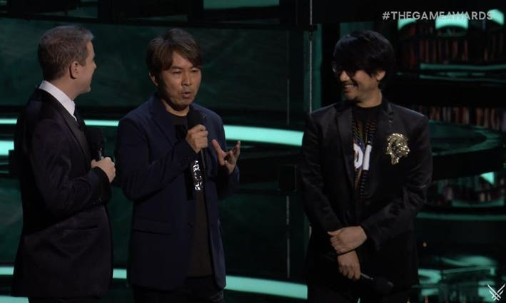
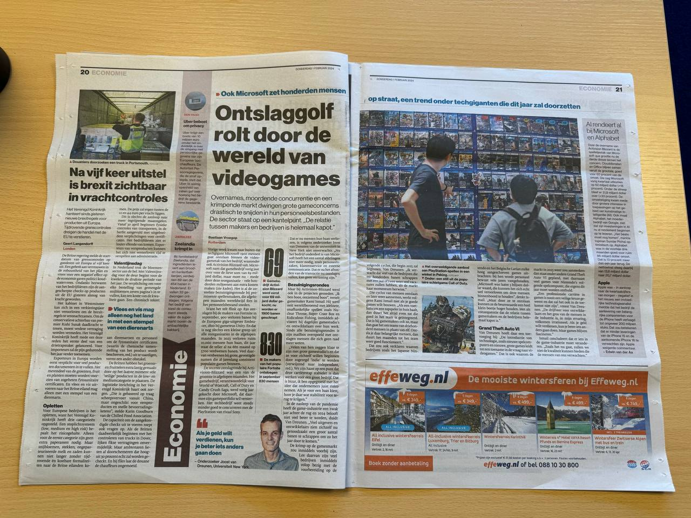

Deze week kondigde Sony wederom grote plannen voor het komende gamejaar aan - met als grote klapper een presentatie van Metal Gear-bedenker Hideo Kojima. De constante optredens tijdens perspresentaties deze ontwerper beginnen echter een beetje gênant te voelen.

_Deze editie van Gamepraat telt 887 woorden en neemt vijf minuten van je tijd in beslag. Vind je dit leuk om te lezen? Neem een betaald abonnement, doneer eenmalig iets_ [_op Petje Af_](https://petjeaf.com/gamepraat?ref=gamepraat.nl) _of stuur de nieuwsbrief door naar een vriend! Dat helpt allemaal ontzettend._

Begrijp me niet verkeerd: Hideo Kojima is een geweldige gamesmaker, de Quentin Tarantino en Stephen King van ons medium. _Death Stranding_ was een bijzondere game, één waar ik nog minstens eens per week eens aan terugdenk. Ik wil niet zeggen dat Kojima de schijnwerpers niet verdient.

Het begint er alleen op te lijken dat grote evenementen niet echt meer andere notabele ontwerpers hebben om te bellen. Het is Kojima wat de klok slaat: of je nou zit te kijken naar de State of Play van Sony of het Game Awards-feest van Geoff Keighley.

Hij heeft wellicht ook de perfecte mix tussen goede games en een artistieke persoonlijkheid. Hij komt uit Japan, moederland van de huidige game-industrie, maar maakt titels met een internationale appeal. Hij is het toppunt van de succesvolle excentriekeling. Maar door alleen hem op te voeren, ontstaat het beeld dat hij de enige is.

Misschien is dat ook wel een beetje zo. Eerder deze week sprak ik met gameontwerper Rami Ismail voor een artikel in Algemeen Dagblad over de huidige ontslaggolf in de game-industrie. Hij vertelde dat die constante ontslagen de kwaliteit van games in de weg staan: mensen moeten vele jaren bij een studio zitten en deel van het meubilair worden, willen ze de ervaring en synergie vinden waarmee ze een écht goede game kunnen bouwen.

En daar is in het huidige ontslagklimaat niet echt plek voor. Tussen 2009 en 2024 was het moeilijk om je positie als creatieve AAA-ontwerper te verwerven, na het maken van één game stond je weer op straat. Tegelijkertijd zijn in het westen veel notabelen opgestapt die in het straatje passen: de BioWare-dokters zijn al jaren geleden bierbrouwers geworden, de bekende Blizzard-ontwerpers zijn bijna allemaal met een gouden handdruk vertrokken.

Misschien moeten we het constante opbellen van Kojima daarom zien als een waarschuwing: onze industrie heeft te weinig Kojima’s, ontwerpers die decennialang al iets geks maken op gigantisch hoog nieau. Het is tijd dat we er daar meer van krijgen.

## Verder op State of Play

Om nog even praktisch in de State of Play te duiken, wat mij betreft de hoogtepunten:

### Death Stranding 2

[Bekijk ingesloten media](https://www.youtube.com/embed/6cs-A1rNvEE?feature=oembed)

De zagen de eerste serieuze trailer van Death Stranding 2, met al zijn Kojima-achtige gekkigheid. De ontwerper beloofde daarnaast weer een stealth-game in de sfeer van Metal Gear te gaan maken.

### Helldivers 2

[Bekijk ingesloten media](https://www.youtube.com/embed/vXddWD88jeI?feature=oembed)

Ik zeg je eerlijk, Helldivers 2 was mij voorbij gegaan. Maar de meest recente beelden laten een aardige, lootachtige shooter zien.

### Stellar Blade

[Bekijk ingesloten media](https://www.youtube.com/embed/0G7W730RGrI?feature=oembed)

Stellar Blade voelt erg als games uit het oude Xbox en PS2-tijdperk. Kan alsnog best een guilty pleasure-game worden.

### Sonic X Shadow Generations

[Bekijk ingesloten media](https://www.youtube.com/embed/y_ksWd_a_AQ?feature=oembed)

Ik trap altijd weer in de Sonic-cyclus. Dus ook ik hoop dat dit goed wordt, om dit najaar bedrogen uit te komen.

### Dave the Diver

[Bekijk ingesloten media](https://www.youtube.com/embed/_W4yV5xn0bE?feature=oembed)

De gekste collab.

### V Rising

[Bekijk ingesloten media](https://www.youtube.com/embed/660Te_MZ0MA?feature=oembed)

Een toffe survival game op Steam die ik was vergeten. Leuk dat hij dit jaar ook naar de PS5 komt.

### Judas

[Bekijk ingesloten media](https://www.youtube.com/embed/T5_r-un--bA?feature=oembed)

De nieuwe game van BioShock-maker Ken Levine, waarmee de maker ditmaal zijn maatschappijkritiek lijkt te richten op sociale media.

### Metro Awakening

[Bekijk ingesloten media](https://www.youtube.com/embed/R3-77MKew0s?feature=oembed)

Een nieuwe Metro-game, voor VR, gemaakt door het Nederlandse Vertigo Games!

### Rise of the Ronin

[Bekijk ingesloten media](https://www.youtube.com/embed/JydfazusHfI?feature=oembed)

Na deze trailer had ik voor het eerst pas een concreet idee wat Rise of the Ronin precies moet worden.

## Elders geschreven deze week

-   Al maandenlang woedt er een ontslaggolf door de game-industrie. Ik schreef bij AD in de krant een uiteenzetting van wat er gebeurt en waarom - met dank aan Rami Ismail en Joost van Dreunen voor hun analyses.

-   Ook [interviewde ik Sarah Verhoeven](https://www.ad.nl/tech/sarah-verdient-haar-brood-met-gamen-maar-heb-er-geen-fijn-gevoel-bij-als-kijkers-met-geld-strooien~a20b774a/?ref=gamepraat.nl), Twitch-streamer en tweemaal de winnaar van de prijs voor beste vrouwelijke streamer in Nederland. Over hoe zij omgaat met de vooroordelen dat alleen mannen gamen en hoe ze eigenlijk geen fan is van termen zoals 'gamer girl'.

## Verder interessant

-   Volgens geruchten produceert Nintendo [10 miljoen exemplaren van de Switch 2](https://www.bloomberg.com/news/articles/2024-01-31/nintendo-s-record-gain-tested-in-wait-for-switch-2-tech-watch?ref=gamepraat.nl). De huidige Switch werd in zijn eerste jaar ruim 13 miljoen keer verkocht. Nintendo verwacht dus minder te verkopen, of wil de console pas laat in het financiële jaar uitbrengen.
-   Embracer heeft de stekker uit een [nieuwe Deus Ex-game](https://www.bloomberg.com/news/articles/2024-01-29/embracer-group-cancels-deus-ex-video-game?ref=gamepraat.nl) getrokken.
-   Square Enix heeft de studio achter I Am Setsuna [opgeslokt](https://www.gematsu.com/2024/01/square-enix-absorbs-tokyo-rpg-factory?ref=gamepraat.nl). Wie van jullie denkt nu "ik dacht dat die studio al van Square was"?
-   Doom draait op alles - en nu dus ook [op e-coli-bacteriën](https://bsky.app/profile/toadsanime.bsky.social/post/3kk7n43ubrb2e?ref=gamepraat.nl).
-   Spec Ops: The Line, een shooter die een psychologisch en serieus oorlogsverhaal neerzette, is [uit online winkels gehaald](https://twitter.com/Wario64/status/1752100767589347450?ref=gamepraat.nl). Vermoedelijk omdat er veel gelicenseerde muziek in zat.
-   Klein persoonlijk nieuwtje: vanaf deze week werk ik vanuit een kantoor buitenshuis! Een Gamepraat-logo voor aan de muur is al onderweg.

Tot volgende week!
