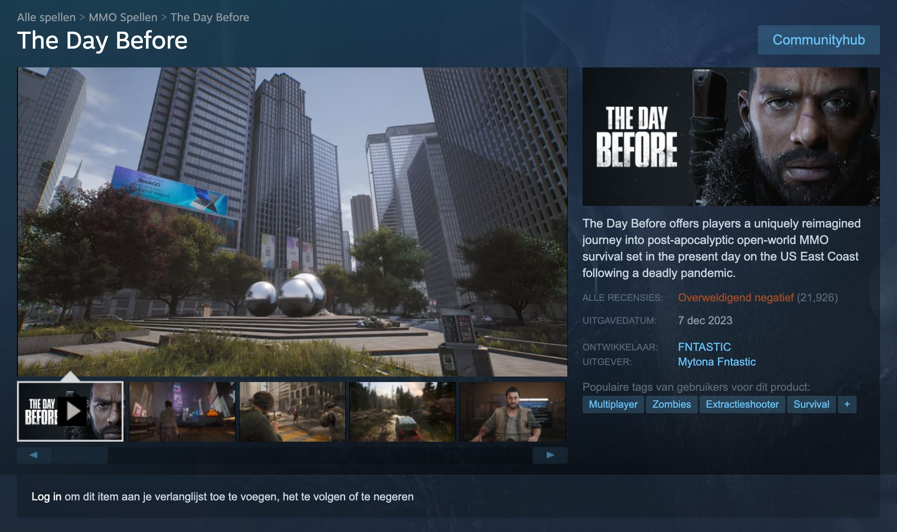
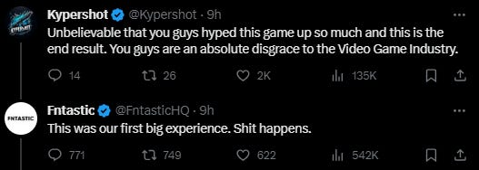

Sociale media stonden deze week vol door een interview van de Volkskrant met Power Unlimited-hoofdredacteur Wouter Brugge. Was Power Unlimited vroeger seksistisch, en hoe staat het er nu voor?

Daar hebben we het deze week over. Maar ook over de gigantische flop van The Day Before, de meest geanticipeerde game op Steam ooit. En over een geweldige remaster van één van mijn favoriete Zelda-games.

[Subscribe](#/portal/signup)

## Heel de gamesector was seksistisch, inmiddels weten we beter

Afgelopen weekend [publiceerde de Volkskrant](https://www.volkskrant.nl/a-b70a79f7?ref=gamepraat.nl) een uitgebreid interview met Power Unlimited-hoofdredacteur Wouter Brugge, die eerder in het blad excuses aanbood voor het seksisme dat eerder bij het blad speelde. Hij benadrukt daar zelf ook actief aan te hebben meegedaan, maar tot inkeer te zijn gekomen.

Het is denk ik een belangrijke terugblik op hoe gamesmedia vroeger in elkaar zaten. Oud-eindredacteur Ed Wiggemans vertelde onlangs in een podcast hoe bij oprichting van het blad niet werd gezocht naar goede schrijvers, maar jongens met een grote bek uit de Amsterdamse hiphop-scene. Dat zorgde voor een leuk schreeuwerige toon, die later meegroeide met de wereldwijde gamesector. Het is grotendeels de succesformule van Power Unlimited geweest: je las het blad om zijn gekkigheid en leuke stunts, niet per se voor journalistieke analyses.

[Bekijk ingesloten media](https://www.youtube-nocookie.com/embed/9REnT4RN448?rel=0&autoplay=0&showinfo=0&enablejsapi=0)

Het is ook logisch dat daar groeipijnen bij bestonden. De game-industrie was eind jaren ’90 en begin jaren ’00 niet bepaald vrouwvriendelijk. Lara Croft was met haar gigantische cup de enige prominente vrouwelijke gameheld, op beurzen als E3 stikte het van de boothbabes en werden bij conferenties er vaak strippers bij gehaald. Zet daar een luide groep jongens op om grapjes te maken, en er kan al snel wat seksistisch gedol ontstaan.

Ik denk niet dat redacteuren uit die tijd keiharde seksisten waren, maar de impact van hun schrijfwerk was groot. Een seksistische passage kan als grap bedoeld zijn, maar heeft snel een impliciete ondertoon. Voor een vrouw die het las, stond er dat ze niet bij de club hoorden. In plaats daarvan waren ze de clou van andermans grappen. Toen Wouter zijn eerste column plaatste, verschenen meerdere berichten van vrouwelijke gamers die waren afgeketst op Power Unlimited in die tijd.

Power Unlimited is met de jaren gelukkig meegegroeid en een stuk geëmancipeerder geworden. De onderbroekenlol is nog aanwezig, maar het gaat niet meer ten koste van minderheden. Meerdere hoofdredacteuren hebben er werk van gemaakt vrouwen bij de redactie te voegen: Jan Meijroos haalde bijvoorbeeld Alie Sierkstra in huis, onder het beleid van Wouter kwamen daar Laura Jenny en Rogina Hassan bij. Het grote merendeel is alsnog man, maar dat is nu nog logisch: door de vroegere mannencultuur zijn naar mijn idee relatief weinig vrouwen gamejournalist geworden. Hopelijk komt daar in de komende jaren verandering in.

Een excuses voor dat oude seksisme lijkt mij in elk geval gepast. Nee, Wouter was niet de volle dertig jaar bij Power Unlimited betrokken. En in 2023 is er veel minder sprake van. Maar door als hoofdredacteur excuses aan te bieden, doe je dat namens het instituut dat je vertegenwoordigt. Je erkent dat het ooit is gebeurd - erkenning die veel vrouwelijke gamers vast kunnen gebruiken.

## The Day Before verdween een paar dagen na launch

Jarenlang werd er uitgekeken naar Steam-game [The Day Before](https://store.steampowered.com/app/1372880/The_Day_Before/?ref=gamepraat.nl), een post-apocalyptische zombieshooter met MMO-trekjes en uitgebreide dialogen. Nog nooit was een game zo vaak gewishlist op Steam, vroege video’s beloofden een fenomenale game.

De uiteindelijk game leek totaal niet op wat er ooit was getoond. Het was kortgezegd troep, vol met gratis assets en zonder goed doordachte systemen. Spelers lieten massaal negatieve recensies achter en zeiden zich bedrogen te voelen. Een paar dagen later kondigde de ontwikkelaar aan de studio te sluiten omdat het 'financieel niet haalbaar was' om alles draaiend te houden.

De studio beloofde al het verdiende geld te gebruiken om schuldeisers terug te betalen. Het is de vraag hoeveel ze dat nog kunnen doen: onlangs bleek dat pakweg de helft van alle klanten hun geld had teruggevraagd.

Een paar dagen later is de gesloten studio er trouwens laconiek over. "Shit happens", schreven ze op Twitter.

## Deze Link’s Awakening-remaster is geweldig (en verdwijnt binnen de kortste keren)

Ik ben dol op pc-ports van oude Zelda-games. Fans slaagden er in de broncode van [Ocarina of Time](https://www.shipofharkinian.com/?ref=gamepraat.nl) en [A Link to the Past](https://arstechnica.com/gaming/2023/02/link-to-the-past-reverse-engineered-pc-port-improves-all-the-right-things/?ref=gamepraat.nl) te reverse-engineeren, zodat ze nieuwe versies konden bouwen met ondersteuning voor 60 frames per seconde en widescreen-monitors. De nieuwste toevoeging in deze categorie is een remaster van Game Boy-game [Link’s Awakening](https://linksawakeningdxhd.itch.io/links-awakening-dx-hd?ref=gamepraat.nl).

De tofste gimmick hierbij is de camera, die je zo ver kunt uitzoomen als je wil. De Game Boy heeft een klein, vierkant scherm, maar op pc kun je op een breedbeeld-display alle ruimtes daar omheen ook zien. Zoom je verder uit, dan kun je zelfs het gehele eiland bekijken.

[Bekijk ingesloten media](https://www.youtube-nocookie.com/embed/WRKIJ7GErcI?rel=0&autoplay=0&showinfo=0&enablejsapi=0)

De game heeft ook andere leuke perks, zoals nieuwe lichteffecten en ondersteuning voor maximaal 120 frames per seconde. Ik vermoed overigens dat Nintendo’s advocaten hem snel van het internet laten halen: andere ports hadden complexe installatie-methodes waarbij je jouw originele ROM-bestand moest rippen voor alle benodigde assets, maar Link’s Awakening is een volledig zelfstandige game. Vol met materiaal dat vast auteursrechtelijk is beschermd.

## Verder interessant deze week

-   [Nintendo](https://year-in-review.nintendo.com/nl-nl/?ref=gamepraat.nl), [PlayStation](https://wrapup.playstation.com/nl-nl?ref=gamepraat.nl) en [Xbox](https://www.xbox.com/en-US/2023recap?ref=gamepraat.nl) hebben Spotify Wrapped-achtige site dit jaar, waarop je jouw gamegedrag van het jaar kunt zien.

-   Veel gedoe om Twitch deze week, dat niet weet of ze topless streams moesten verbieden. [Aftermath heeft een goede analyse](https://aftermath.site/on-twitch-the-goalposts-will-never-stop-moving?ref=gamepraat.nl).

-   De GOTY-aflevering van [Spelkost](https://spelko.st/?ref=gamepraat.nl) verschijnt volgende week! We hebben hem op locatie opgenomen, maar hebben nog wat leuke ideetjes die extra tijd vereisen.

-   Het is wat laat om nog een uitgebreide Game Awards-analyse te doen, maar jemig, wat heb ik zin in Monster Hunter Wilds.

    [Bekijk ingesloten media](https://www.youtube-nocookie.com/embed/jQdFe0Wiugw?rel=0&autoplay=0&showinfo=0&enablejsapi=0)

Tot volgende week!
