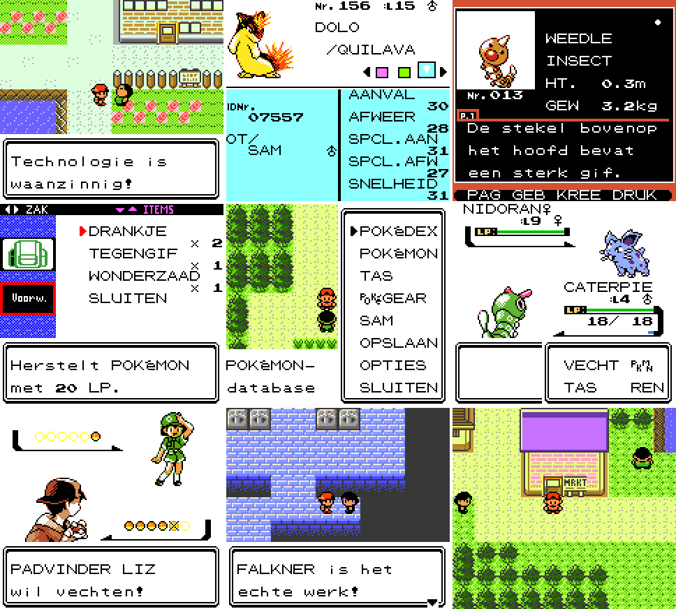
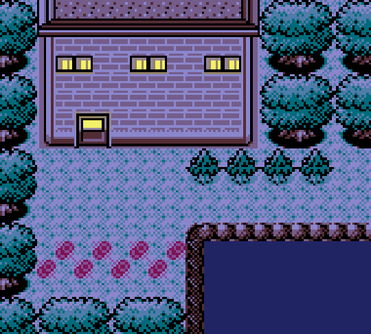
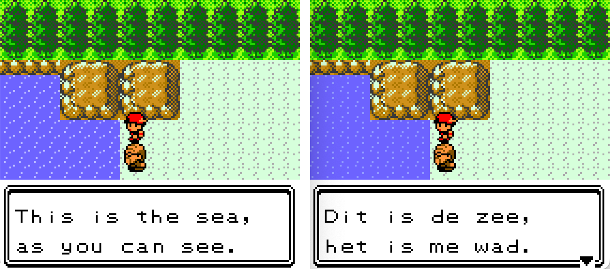
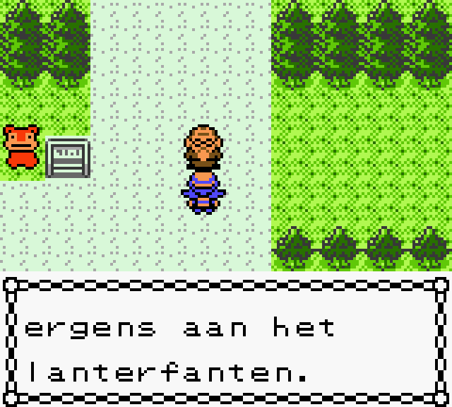
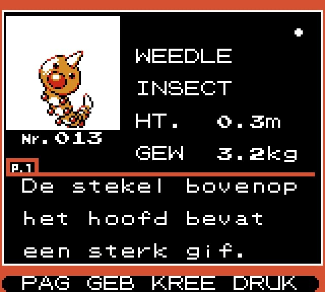
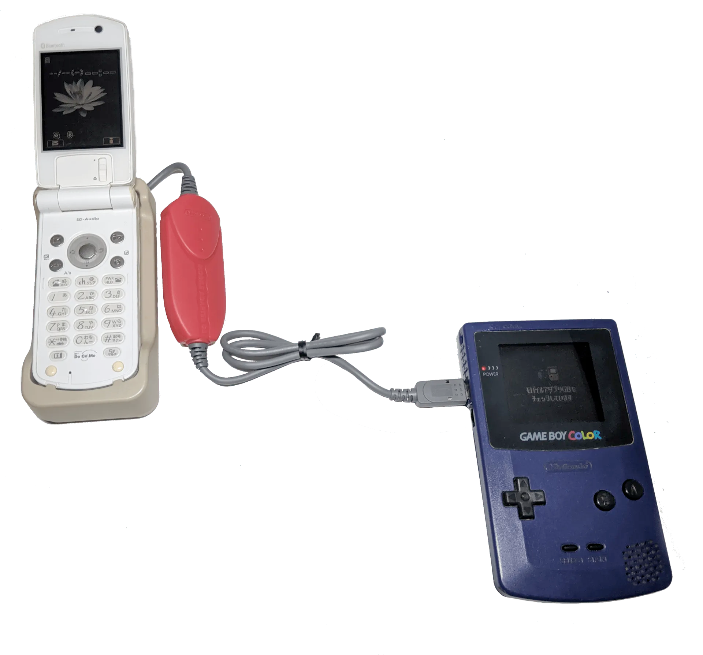
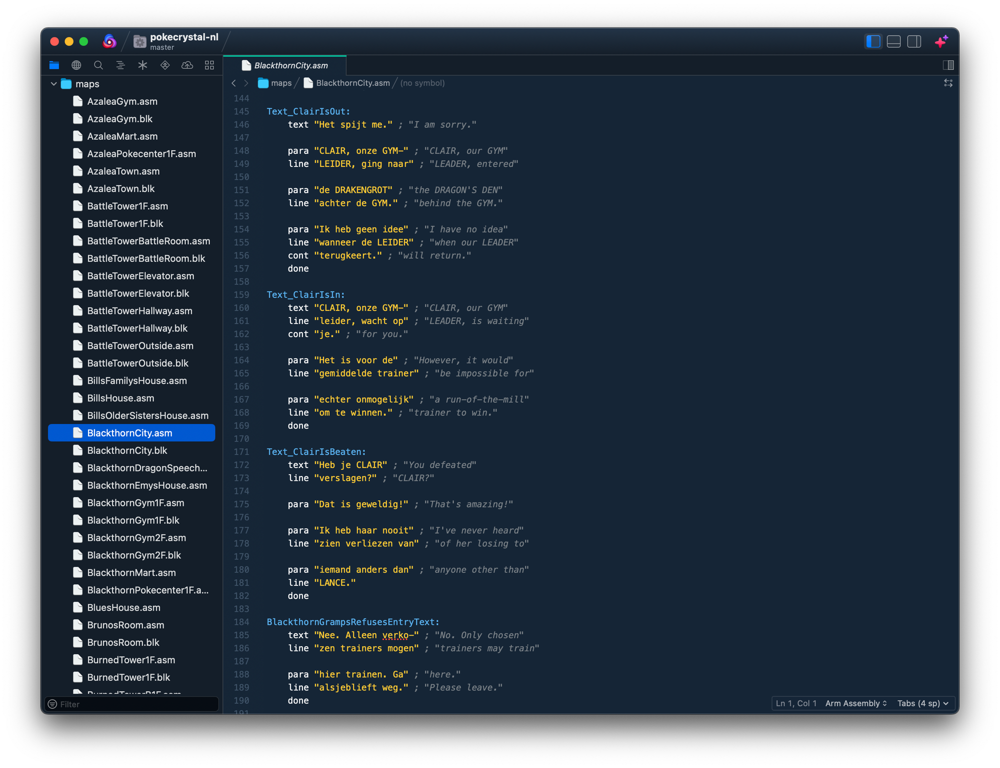

Toen mijn oudste zoon steeds meer interesse in games kreeg, had ik een stille droom: wat als hij, zodra hij een beetje kan lezen, zijn tanden in Pokémon zou zetten? Pokémon Blue was één van de belangrijkste games uit mijn jeugd, en de manier waarop hij de kleinste uithoekjes van Mario en Kirby uitpluist deed me vermoeden dat een grote monsterverzamelgame perfect bij hem zou passen.

Toch was het niet zo simpel. Van alle Nintendo-gelieerde games, is Pokémon één van de enige die nog nooit naar het Nederlands is vertaald. En juist die Nederlandse taal was nog een must voor hem: het lezen en schrijven gaat steeds beter, maar Engels heeft hij nog steeds niet onder de knie. Dat is vast een kwestie van tijd, maar in een opwelling besloot ik het onredelijke te doen: ik wilde een Pokémon-game geheel naar het Nederlands vertalen. De keuze viel daarbij op Crystal, gezien dat mijn persoonlijk favoriete generatie is.

_Deze editie van Gamepraat telt 1.768 woorden en neemt acht minuten van je tijd in beslag. Vind je dit leuk om te lezen? Stuur de nieuwsbrief door naar een vriend! Dat helpt al ontzettend._

Dat is gelukt! Samen met programmeur William (die niet uit Nederland komt, maar zo juist de taal hoopt te leren), [Eline](https://cohop.games/?ref=gamepraat.nl), Randolf en [Calvin](https://bsky.app/profile/calvinfoe.bsky.social?ref=gamepraat.nl) heb ik 24.000 regels aan tekst vertaald, geredigeerd, nog eens geredigeerd en daarna bij een reeks playtests langsgelopen. [Je kunt het patchbestand downloaden op onze Github](https://github.com/wfowler1/pokecrystal-nl/releases?ref=gamepraat.nl). Deze patch kun je dan toepassen op een (uiteraard legaal verworven) ROM. Die kun je krijgen door bijvoorbeeld je cartridge te dumpen met een apparaat zoals de GB Operator, of door je kopie gekocht in de 3DS eShop naar je pc te kopiëren.

In deze extra ingelaste Gamepraat (sorry voor de spam!) wilde ik even een paar leuke dingetjes bespreken die opvielen tijdens het lokaliseren. Want geloof mij: je leert een game past écht kennen als je iedere regel tekst driemaal hebt gelezen en de achterliggende code hebt uitgeplozen.

Pokémon Kristal.

## Het Eikenwoud

Hoewel de games nooit eerder in het Nederlands zijn gelokaliseerd, zijn veel andere Pokémon-media dat wel. We wilden bij ons project daarom zo dicht mogelijk zitten op hoe het elders is aangepakt. Stadsnamen zijn daarom bijvoorbeeld nog 'gewoon' Engels, omdat Ash en zijn vrienden het in de anime ook spreken over Pallet Town en Viridian City. Wel moesten we op zoek naar namen voor andere locaties, zoals Lake of Rage (Meer van Razernij) en de Power Plant (Energiecentrale).

Ilex Forest was een leuke, waarbij ineens duidelijk werd hoe de Engelse makers zich in een bocht moesten wringen. Een Ilex is eigenlijk een hulstplant die je in het bos ziet groeien. De naam 'Ilex-woud' zou dan logisch en kloppend zijn, maar toen stuitten we ineens op de vertalingen elders. Het originele Japans is ウバメの森, ofwel 'Ubame Forest', waarbij wordt verwezen naar een bepaald soort eikenboom. Een vertaling waar andere edities van Pokémon Crystal veel dichter op zitten. In het Duits heet het bos bijvoorbeeld het 'Steineichenwald', ofwel het 'steeneikenwoud'. Het Franse 'Bois aux Chênes' is letterlijk het 'eikenbos'.

Overigens: hulde voor [Bulbapedia](https://bulbapedia.bulbagarden.net/wiki/Main_Page?ref=gamepraat.nl), dat voor nagenoeg alles in Pokémon een overzicht heeft van de namen in andere talen.

Het Eikenwoud.

Waarom heet het in de Engelse game dan niet 'Oak Forest'? Waarschijnlijk heeft een zeker personage daar mee te maken. Want als je ook professor Oak tegenkomt, hoe groot is dan de kans dat je denkt dat het bos van hem is?

Voor ons was dat in elk geval geen probleem. Naast stadsnamen hebben ook personages nog hun Engelse naam - en is er geen professor Eik die het verwarrend maakt.

## Ettertjes, het wad en lanterfanten

Vertalen is vaak specifiek werk, maar op andere momenten vergt het enige creativiteit. Waar kies je bijvoorbeeld voor als Team Rocket-leden de trainer uitschelden? Wij zijn uiteindelijk gegaan voor 'ettertje', de go-to-sneer van Team Rocket tegen Ash in de serie.

Vrij vroeg in de game zit een woordgrapje waar ik zelf ook best blij mee ben:

Het is me wad.

En dan is er nog het uitstekende woord 'lanterfanten', dat we hebben gebruikt voor een trainer die volgens de tekst 'goofing off' was.

Lanterfanten!

## Meters en kilo's

De Pokédex in onze lokalisatie gebruikt het metrieke stelsel, wat betekent dat je ziet staan hoeveel kilo een Pokémon weegt en hoeveel centimeter hij groot is. Je hoeft dus niet als bij de Engelstalige editie uit te rekenen hoeveel voet en ponden nou zijn in centimeters en grammen.

Meters en kilo's!

Dat is grotendeels te danken aan onze programmeur William. Hij spotte dat de Franse en Duitse versies van de game ook het metrieke stelsel gebruiken, waarna hij de code daarvan kon porten naar ons project. Hierdoor hangt het systeem ook goed aan bepaalde aanvallen die er afhankelijk zijn - zoals 'Geoworp' (Seismic Toss) dat zijn schade baseert op het gewicht van een Pokémon.

## Van dik naar lui

Pokémon Crystal is inmiddels 25 jaar oud. En hoewel de games gericht waren op kinderen, zit er hier en daar dialoog in dat anno 2025 niet meer zo snel geaccepteerd wordt. We hebben geprobeerd dat soort teksten te lokaliseren op een manier die dicht bij de originele intentie blijft, maar geen gekke stereotypen overbrengt. Gymtrainer Chuck wordt bijvoorbeeld dik genoemd, wat wij hebben herschreven zodat haar zorgen meer over zijn luiheid gaan:

-   Engels: "My husband lost to you, so he needs to train harder. That's good, since he was getting a little chubby."
-   "Mijn man heeft van je verloren, dus hij moet harder trainen. Dat is goed, want hij werd een beetje lui."

## Stalkende bellers

De trainer kan tijdens het spelen ook worden gebeld door andere trainers. Bij het lokaliseren valt dan op hoe, ahum, compleet gestoord ze zijn. Eén trainer belt je bijvoorbeeld om alle details over zijn grote idool Bill te vertellen, waarbij hij zelfs heeft gespot dat zijn zus niet kan knipogen.

Onderstaande tekstjes zijn op zichzelf geinig, maar als je ze onder elkaar leest? Een teken van een psychopaat.

-   "Wist je dat…? BILL's jongere zus kan kennelijk niet knipogen."
-   "Wist je dat…? BILL zou melk haten en het niet kunnen drinken."
-   "Wist je dat…? Kennelijk is BILL niet heel goed in vechten."
-   "Wist je dat…? BILL lijkt de dame van de BLOEMENWINKEL leuk te vinden."

## Pokémon zijn dingen

Misschien wel de grootste gewenning bij het lokaliseren was hoe er naar Pokémon wordt verwezen. Als je de anime mag geloven, zijn Pokémon je beste vrienden en op iedere manier gelijkwaardig aan de mensen die je kent. In de games is dat duidelijk anders: er wordt stelselmatig naar ze verwezen als 'het' die letterlijk in de gokhal worden verkocht.

We hebben er uiteindelijk voor gekozen die vorm te volgen, om zo dicht op de bron te blijven als mogelijk. Toch is hier en daar gekozen voor een andere zinsvorm om de nadruk wat minder te leggen op de het-vorm, omdat het vreemd aanvoelt. Neem bijvoorbeeld deze Pokédex-entry van Aipom:

-   Engels: "It uses its tail to hang on to tree branches. It uses its momentum to swing from one branch to another."
-   Nederlands: "Gebruikt de staart om aan takken te hangen. Slingert met momentum van tak naar tak."

## Ruilsysteem voor mobiele telefoons verborgen in code

In 2001 verkocht Nintendo de Mobile Adapter GB. Dit apparaatje maakte het mogelijk om je Pokémon te ruilen met behulp van je mobiele telefoon, zodat je kon verbinden met vrienden aan de andere kant van het land. Uiteindelijk werd de Mobile Adapter alleen in Japan verkocht, waardoor wij er nooit gebruik van konden maken.

De Mobile Adapter GB

In de code van Crystal zit deze functionaliteit wel ingebakken. En dat niet alleen: zelfs alle teksten waren gelokaliseerd naar het Engels, waarmee voorbereid werd op een mogelijke verkoop van het accessoire in het westen. Wij hebben ze voor de lol ook maar vertaald. De kans is nagenoeg nihil dat je er ooit op zult stuiten, maar zo zijn we mooi volledig.

## Disassemblies zijn fenomenaal

William, Eline, Randolf en Calvin hebben bizar veel werk verzet bij dit project, maar de mannen en vrouwen van [pret](https://github.com/pret/pokecrystal?ref=gamepraat.nl) zijn daarnaast de grotendeels ongeprezen helden. Deze club heeft het originele Pokémon Crystal regel voor regel herschreven, waardoor nu een broncode bestaat die de gehele game geheel doorzoekbaar maakt.

Zo konden we de code lokaliseren, dankzij de disassembly van Pret.

Voor een vertaalproject als deze is dat onmisbaar. Waar vroegere fanvertalingen in de lastig te definiëren hex-code van een ROM-bestand moest graven, hadden wij mapjes met netjes uitgelijnde bestanden waar de teksten van ieder gebied in te vinden zijn. Dit soort zogeheten disassemblies zijn ook waarom er inmiddels veel totaal nieuwe Pokémon-games in de vorm van romhacks bestaan: ze brengen in kaart hoe het spel werkt en maken het makkelijker dat te manipuleren. Het is fenomenaal.

## Die verdomde 18 karakters

De Game Boy heeft maar een beperkte hoeveelheid ruimte, wat bij lokalisatie genadeloos hard kadert wat je kunt doen. Iedere regel tekst mag namelijk bestaan uit niet meer dan 18 tekens tekst. Minder als in die regel de naam van de trainer of een Pokémon genoemd wordt.

Je moet dus niet alleen een goede vertaling vinden: je moet ook zien hoe die binnen die krappe tekstvelden past, bij voorkeur binnen exact dezelfde hoeveelheid regels als bij het Engels. Zit je er één teken boven, dan glitcht de gehele game totdat je een nieuw dialoog start.

Een foutje is niemand vreemd, maar gelukkig hadden wij Will's programmeerkennis. Hij bouwde voor ons een speciaal stuk software dat iedere vertaalde regel langsliep. Was er één te lang, dan sloeg de app alarm en konden we terug om de fout te corrigeren. Hierdoor zijn we er zeker van dat geen enkele tekst te lang is geworden.

## Veel plezier!

Het afgelopen jaar was buitengewoon bijzonder. Wat begon als een idee dat stiekem voelde alsof het na een maand zou stranden, heeft na meer dan 24.000 regels tekst eindelijk zijn einde bereikt. Het was een geweldige periode vol gekke taalgrapjes tijdens het schrijven en redigeren.

Hopelijk hebben jullie net zoveel plezier tijdens het spelen! Stuit je op gekke dingetjes of wil je er gewoon met ons over kletsen, haak dan vooral in [bij de Discord](https://discord.gg/WkBX2Hqqgh?ref=gamepraat.nl) die we hebben gemaakt voor het project. En mocht er later nog een Nederlandse lokalisatie volgen, dan zul je het daar als eerste lezen.

Volgende keer ben ik terug met een reguliere Gamepraat. Tot dan!
