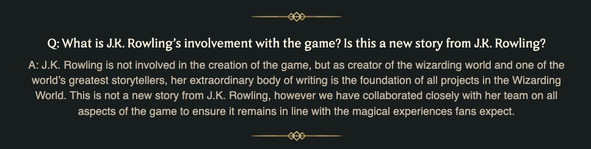
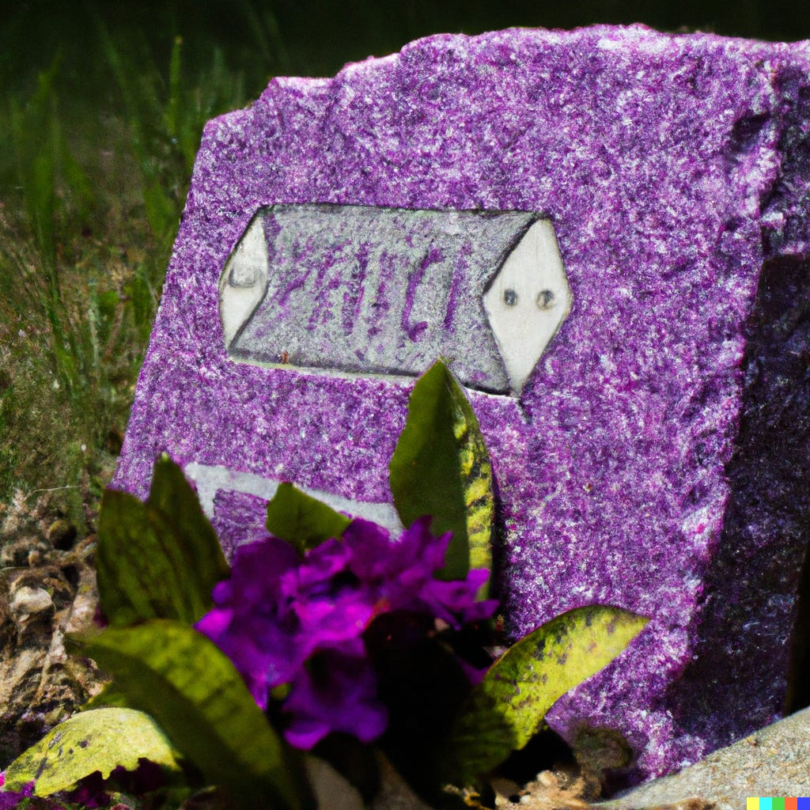

Is het verantwoord om de game van een problematische auteur te recenseren, zodat die er mogelijk geld aan verdient? En zo ja, moet je in de recensie dan wel of niet de uitspraken van die auteur behandelen? Die vragen speelden internationaal een grote rol deze week bij het verschijnen van de Harry Potter-game _Hogwarts Legacy_.

Verder werd voor het eerst een Grammy uitgereikt voor een gamesoundtrack, werden _Fortnite_\-achtige games doodverklaard en bleek de acteur van de beste aflevering van The Last of Us verslaafd te zijn aan _Banjo Kazooie_.

Deze editie van de nieuwsbrief telt 1.558 woorden en neemt zo'n acht minuten van je tijd in beslag. Vind je 'm vet? Abonneer hieronder, of tip hem bij je vrienden of familie. Helpt mij enorm. We trappen af!

[Subscribe now](#/portal/signup)

## Hogwarts Legacy scoort goed, maar wat moet je met Rowling?

-   De nieuwe Harry Potter-game Hogwarts Legacy verschijnt deze week.
-   De eerste recensies zijn vooral positief, met een gemiddelde score van ruim een 8,5.
-   Media wereldwijd worstelen met de vraag hoe ze de game moeten behandelen - want hoe ga je om met de transfobe acties van auteur J.K. Rowling?

Het was even spannend of Avalanche Studios een grote sandboxgame als _Hogwarts Legacy_ kon maken, want tot op heden hadden ze vooral ervaring met kleinere Disney-licentietitels. Als je naar de eerste recensies kijkt, heeft het bedrijf zich echter meer dan bewezen. Wereldwijd scoort de game gemiddeld een 8,5 op Metacritic, en onderstaande scores werden uitgedeeld door Nederlandse recensenten:

-   [NU.nl](https://www.nu.nl/reviews/6250059/review-hogwarts-legacy-is-net-zo-sfeervol-als-de-harry-potter-films.html?ref=gamepraat.nl): 3,5 van 5 sterren (Wc-eend-alert, deze heb ik getikt)
-   [NRC Handelsblad](https://www.nrc.nl/nieuws/2023/02/06/hogwarts-legacy-richt-zich-op-de-nostalgische-millennial-die-zich-weinig-aantrekt-van-de-jk-rowling-controverse-a4156281?ref=gamepraat.nl): 3 van 5 sterren
-   [IGN Benelux](https://nl.ign.com/hogwarts-legacy/141984/review/hogwarts-legacy-review-moderne-nostalgie?ref=gamepraat.nl): 9/10
-   [PlaySense](https://playsense.nl/529538/review-hogwarts-legacy/?ref=gamepraat.nl): 9/10
-   [Gamer.nl](https://gamer.nlhttps//gamer.nl/artikelen/review/hogwarts-legacy-biedt-precies-waar-harry-potter-fans-op-hopen/?ref=gamepraat.nl): 8,5/10
-   [Eurogamer Benelux](https://www.eurogamer.nl/hogwarts-legacy-review-een-grotendeels-betoverende-ervaring?ref=gamepraat.nl): 'Aanrader'
-   [Power Unlimited](https://pu.nl/artikelen/review/hogwarts-legacy-review-ps5-zelfs-dreuzels-gaan-hiervan-houden/?ref=gamepraat.nl): 8,4/10

Voorafgaand aan het recensie-embargo woedde veel discussie over hoe je deze game moet behandelen. Hij is gebaseerd op het werk van Harry Potter-auteur J.K. Rowling, die na eerdere transfobe opmerkingen nu ook campagnevoert tegen transrechten in Schotland. Daar wil ze een wet tegenhouden die het makkelijk maakt het geslacht op je paspoort te wijzigen.

Op de [website](https://www.hogwartslegacy.com/en-us/faq?ref=gamepraat.nl) van _Hogwarts Legacy_ staat dat Rowling niet betrokken was bij de ontwikkeling van het spel, en dat was ook snel duidelijk toen ik speelde. De character creator is ontworpen zodat je vrij bent een transpersonage te maken en later in het spel zit ook een transgender-personage. Maar omdat het spel is gebaseerd op Rowlings fictieve wereld, verdient ze waarschijnlijk mee aan de verkoop.

Populair gamesforum [Resetera](https://www.resetera.com/threads/concerning-hogwarts-legacy-and-jk-rowling.678517/?ref=gamepraat.nl) zei daarom discussies over de game te weren. Daarnaast hebben Polygon en Gamespot geen recensies geplaatst toen het embargo verliep - bij Gamespot verscheen in plaats daarvan [een artikel](https://www.gamespot.com/articles/how-to-help-trans-people-by-donating-to-charity/1100-6511097/?ref=gamepraat.nl) over hoe je transgenders kunt bijstaan door aan goede doelen te doneren.

Sites die wel recensies schreven, deden wisselend melding van Rowlings transfobie, om gamers te helpen beslissen of ze de positief gerecenseerde game nog willen kopen. Anderen deden juist geen melding, omdat ze vonden dat de recensie zich alleen op het losse product hoort te richten.

[Bekijk ingesloten media](https://www.youtube-nocookie.com/embed/BtyBjOW8sGY?rel=0&autoplay=0&showinfo=0&enablejsapi=0)

Zelf heb ik kort verwezen naar de Rowling-kwestie. Deels om lezers te informeren, maar ook omdat een recensie wat mij betreft niet in een vacuüm hoort te bestaan. Je recenseert het product, maar ook de situatie er omheen. Al is dat een makkelijk standpunt om in te nemen als je voor een breed, mainstream publiek schrijft, waar je vaak schrijft voor mensen die het product nog niet kennen.

Ik denk dat het volledig doodzwijgen van de game uiteindelijk weinig impact heeft. Dik twintig jaar geleden kon zoiets, omdat mensen alleen één of twee kranten of tijdschriften lazen en dus niks meekregen. Maar inmiddels lezen we alles online en zullen geïnteresseerden het dan wel tegenkomen bij een concurrerend medium. Een medium dat wellicht geen kritische kanttekening geeft, die ze wel bij jou hadden kunnen lezen.

## Nee, Fortnite nadoen is geen pad naar succes

-   Deze week werd de stekker getrokken uit drie live-service-games.
-   De strategie achter deze game was geïnspireerd door Fortnite.
-   De laatste tijd stranden steeds vaker zulke Fortnite-achtige games.

Gamehypes gaan vaak in golven: een spel blijkt mateloos populair, waarna de ene na de andere ontwikkelaar probeert dat succes te repliceren. Dat zagen we begin deze eeuw bijvoorbeeld toen _World of Warcraft_ een hit werd en MMO-studio's als paddestoelen uit de grond sprongen. Geen van deze games wist ooit het succes van de grondlegger te evenaren en vaak moesten ze na een paar jaar de deuren weer sluiten.

Diezelfde golf begon een paar jaar terug met _Fortnite_ en we zien nu een steeds grotere groep concurrenten stranden. Deze week was extra gek omdat drie van zulke games tegelijkertijd hun einde aankondigden: [_Knockout City_](https://www.knockoutcity.com/updates/knockout-city-special-announcement?ref=gamepraat.nl), [_Rumbleverse_](https://twitter.com/RumbleSupport/status/1620554164651675655?ref=gamepraat.nl) en [_Apex Legends Mobile_](https://twitter.com/PlayApexMobile/status/1620528112126533645?ref=gamepraat.nl). Een paar weken terug werd ook [_Final Fantasy VII: The First Soldier_](https://twitter.com/FFVII_FS_EN/status/1613078801537458178?ref=gamepraat.nl) doodverklaard, enkele maanden nadat het spel was verschenen.

_Illustratie gemaakt door de kunstmatige intelligentie Dall-E._

_Knockout City_ en _Rumbleverse_ speelden anders dan _Fortnite_, maar hadden een vergelijkbaar verdienmodel en leunden ook op de wat cartoony stijl van de populaire shooter. Websites van beide games voelden aan alsof ze van spin-offs voor _Fortnite_ bedoeld waren. _Apex_ en _Final Fantasy_ waren op hun beurt wel battle-royale-games, maar dan met hun eigen franchise en twist. Maar dat alleen is niet genoeg om een service-game draaiende te houden, blijkt steeds vaker.

Vermoedelijk zien we de komende jaren nog meer projecten op deze manier stranden, totdat de volgende grote hype de markt in zijn greep krijgt. Laat het alsjeblieft niet crypto zijn.

## Voor het eerst won een gamesoundtrack een Grammy

-   Voor het eerst werd er een Grammy uitgereikt voor de beste soundtrack in een game.
-   De prijs ging dit jaar naar Assassin's Creed Valhalla-dlc Dawn of Ragnarok.

Het is fantastisch dat er nu ook een Grammy wordt uitgereikt aan de beste gamesoundtrack van het jaar. Het zorgt ervoor dat een stukje van games serieus wordt genomen op een plek die normaliter niet over gaming gaat, waardoor mensen in de muzieksector ieder jaar weer geconfronteerd zullen worden met dat er mooie dingen in onze industrie worden gemaakt.

De uitreiking van de eerste prijs was op zijn beurt ook best grappig - want uiteraard wist de presentator van een niet-game-evenement niet hoe hij de naam van een game gewoon moest uitspreken:

> Ik kan niet meer: deze Grammy-uitreiker kan Assassin’s Creed Valhalla niet uitspreken
>
> — Jacco (@jacco00) [5:53 AM ∙ Feb 6, 2023](https://twitter.com/jacco00/status/1622473496914698240?ref=gamepraat.nl)

De nieuwe Grammy-categorie heeft denk ik nog wat werk nodig. Dit jaar waren de volgende games genomineerd, waarbij ik bij het gros niemand over de kennelijk goede muziek heb gehoord:

-   _Aliens: Fireteam Elite_
-   _Assassin's Creed Valhalla: Dawn Of Ragnarok_
-   _Call Of Duty®: Vanguard_
-   _Marvel's Guardians Of The Galaxy_
-   _Old World_

Het lijkt alsof er slechts heel selectief is gekeken naar wat gesuggereerde muziek, waarbij de echt noemenswaardige soundtracks totaal over het hoofd zijn gezien. Bij The Game Awards waren _A Plague Tale_, _Elden Ring,_ _God of War Ragnarok_, _Metal_ en _Xenoblade Chronicles 3_ genomineerd, allemaal games waarbij een muziekprijs logischer voelt dan bij bovenstaande titels.

Laten we kijken hoe het volgend jaar gaat.

## Het ging door Nick Offerman weer even over gameverslaving

Aflevering drie van The Last of Us staat inmiddels te boek als één van de beste tv-momenten van de afgelopen jaren. En terecht! Het is ook mijn absolute hoogtepunt in het hele seizoen.

Door al het gejubel was de acteur van Bill, Nick Offerman, te gast bij de Amerikaanse late-night-show van Jimmy Kimmel om kort te babbelen over de serie. Al snel werd gevraagd of hij een gamer was, waarna hij terugblikte op zijn korte _Banjo Kazooie_\-verslaving:

[Bekijk ingesloten media](https://www.youtube-nocookie.com/embed/Unh3kan_tFc?rel=0&autoplay=0&showinfo=0&enablejsapi=0)

Altijd spannend, als dit gebeurt. Gesprekken over games bij mainstream-tv gaan al snel over geweld of verslaving, vooral als er een oudere redactie achter het programma schuilgaat. Die benaderen games als het medium van hun kinderen die ze moesten beteugelen, in plaats van een creatieve uiting.

In dit geval begint Offerman zelf over hoe verslavend de game was - en eigenlijk loopt het allemaal ook wel prima. Hij legt het bij zichzelf neer en vertelt hoe hij niet kan omgaan met de constante dopemine-kicks van een goede game.

Maar hoe hij afsluit staat tegen. Offerman zei:

> Then it’s over and you’re like ‘yes I won’, and I immediately wondered what I had done with my life.

Voelt een gekeken film of serie dan ook als verloren tijd? Is alles dat we investeren in creatieve media inherent een verspilling?

We gaan als gamesmedia trouwens ook raar om met zulke onderwerpen. Recensenten die een game goed willen noemen, benadrukken vaak dat hij 'lekker verslavend' is. Het is binnen gamesmedia haast een positieve term, een synoniem voor dat het spel je blijft boeien. Je mede-gamers snappen dat, maar ik vraag me af hoe dat overkomt op anderen die op zulke artikelen stuiten.

## Ook interessant deze week

-   Een groep fans heeft **The Legend of Zelda: A Link to the Past** [geport](https://github.com/xander-haj/zelda3?ref=gamepraat.nl) naar de pc, waardoor de game met kortere laadtijden en in breedbeeld gespeeld kan worden. Het is misschien wel de beste manier om het oude spel te herbeleven. Om hem te spelen moet je wel zelf een rom inladen, volgens de makers zorgt dit ervoor dat geen code of assets van Nintendo wordt gebruikt en het project legaal is. Vermoedelijk denken de juristen van Nintendo hier anders over.
-   Dagenlang maakte een kunstmatige intelligentie fictieve afleveringen van de sitcom **Seinfeld**, die werden gestreamd op gamesite Twitch. Uiteindelijk werd de AI [geschorst](https://www.twitch.tv/watchmeforever?ref=gamepraat.nl) wegens een transfobe opmerking.
-   Vanavond is er eindelijk weer een **Nintendo Direct**, om 23:00 uur Nederlandse tijd.

[Subscribe now](#/portal/signup)
