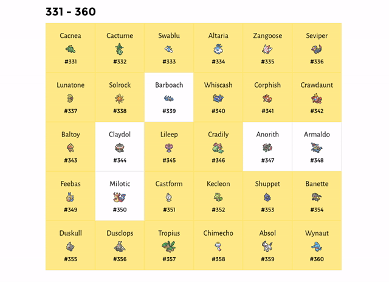

Vaste lezers weten het inmiddels vast al: iedere maand probeer ik 120 pokémon te vangen, om zo voor het verschijnen van Pokémon Sun & Moon de collectie tot dusver compleet te hebben. Dat ging al twee maanden best aardig - en nu blijk ik beter op weg te zijn dan verwacht.

> [!NOTE]
>
> Dit artikel verscheen eerder op [Gamer.nl](https://gamer.nl/artikelen/achtergrond/pokemon-update-3-razen-door-ruby/?ref=gamepraat.nl).

Ik heb altijd een vast patroon bij het vangen van mijn pokémon. Iedere maand probeer ik een box te vullen, waar er in totaal 30 in passen. Daarbij ga ik de lijst af op basis van Pokédexnummer, waardoor ik in de eerste week bijvoorbeeld de eerste 30 pokémon uit Red, Blue en Yellow ving. In mijn derde maand was ik dus toe aan pokémon nummer 241 tot en met 360.

Het vangen van pokémon is echter niet zo zwart-wit. Soms ben ik op zoek naar een specifiek monstertje, maar kom ik tegelijkertijd allerlei anderen tegen die ook nog niet in mijn verzameling zaten. Daarnaast had ik de nodige beesten al gevangen toen ik de games Pokémon Y en Omega Ruby uitspeelde. Sommige boxen zitten dus al wat voller, waardoor ik er in de praktijk minder hoef te vangen in bepaalde weken. Tegelijkertijd vang ik er soms meer, simpelweg omdat ik nieuwe exemplaren tijdens een zoektocht aantref.

## **Een beetje voor**

Hoe goed ik er ècht voor stond wist ik dus niet - dus dat heb ik deze maand eens uitgezocht. Op de website [Pokédex Tracker](https://pokedextracker.com/u/bas?ref=gamepraat.nl) heb ik alles in m'n boxen aangevinkt, waarna de website precies aangaf hoe ver m'n avontuur nou was. Wat blijkt: ik ben zo te zien al een stukkie verder dan ik in eerste instantie had gedacht. Met bovenstaande link kun je overigens live mijn voortgang volgen, zodat je weet hoe deze artikelreeks er op een specifiek moment van de maand ervoor staat.

Volgens Pokédex Tracker heb ik op het moment van schrijven 67,5 procent van alle bestaande pokémon in mijn bezit. Ik zit dus al ruim op tweederde. Dat ik al zo ruim op weg ben is een verrassing - deze maand was het doel om tot en met Pokédexnummer 360 te vangen, waardoor ik dacht op de helft te komen van de pakweg 720 pokémon die in de games zitten.

## **En een beetje achter**

Hoewel ik beter op weg ben dan ik eerst had gedacht, ben ik er deze maand stiekem niet helemaal in geslaagd om mijn deadline te halen. Op het moment heb ik Barboach, Claydol, Anorith, Armaldo en Milotic nog niet in mijn bezit. Porygon2 zit ook nog niet in mijn collectie, al voelt die als een formaliteit - ik hoef alleen even een Porygon met een speciaal voorwerp heen en weer te ruilen. Het betekent echter dat ik er afgelopen maand zes te weinig heb gevangen. Stiekem was het daardoor een verdraaid slechte maand, omdat ik door een verrekening afgelopen maand 20 pokémon teveel had gevangen. Ik zat toen op de 260, in plaats van de op de benodigde 240.

Dat is niet aan een hoge moeilijkheidsgraad te wijten, maar aan m'n afgelopen maand. De E3 en de aanschaf van een puppy zorgden ervoor dat de 3DS maar weinig aangezet kon worden. Vervelend, maar het is even niet anders. De komende maand probeer ik om die kleine achterstand alsnog in te halen.

## **Routinewerk**

Eén ding begon afgelopen maand wel op te vallen: iedere generatie pokémon lijkt dezelfde routine te volgen. Eerst zijn er uiteraard de starterpokémon - beestjes die je alleen aan het begin van het spel kunt krijgen. Die moet je dus fokken en ruilen met andere spelers om de collectie compleet te krijgen.

Daarna komen de makkelijkst te bemachtigen pokémon, die op een laag level evolueren. Die set heb je snel bij elkaar, maar daarna wordt het af en toe lastiger. Later in de lijst staan de pokémon die op een speciale manier evolueren, waardoor je soms bijzondere sprongen moet maken. De pokémon die in Gold en Silver werden geïntroduceerd, moeten bijvoorbeeld soms een bepaald geluksniveau bereiken voordat ze willen evolueren.

Iets later in de generatie krijg je de pokémon die een hoger level nodig hebben om te evolueren, gevolgd door de legendarische wezens. Die laatste categorie is alleen op zeer specifieke manieren te vangen, vaak door speciale plekken in de wereld te bezoeken.

Inmiddels zit ik al vrij diep in alle pokémon uit Ruby en Sapphire - de derde generatie die The Pokémon Company introduceerde. Het betekent dat ik die routine al drie keer heb meegemaakt en dat ik ook steeds beter weet waar ik rekening mee moet houden. Een voorbeeldje: komende week ga ik achter veel legendarische pokémon aan, waarbij ik allemaal moet opzoeken hoe ik ze bemachtig. De week erna zijn de starters aan de beurt, waarbij ik het fokwerk goed moet coördineren. Daarna wordt het gelukkig een beetje makkelijker, omdat de simpele evoluties als volgende aan de beurt zijn.
