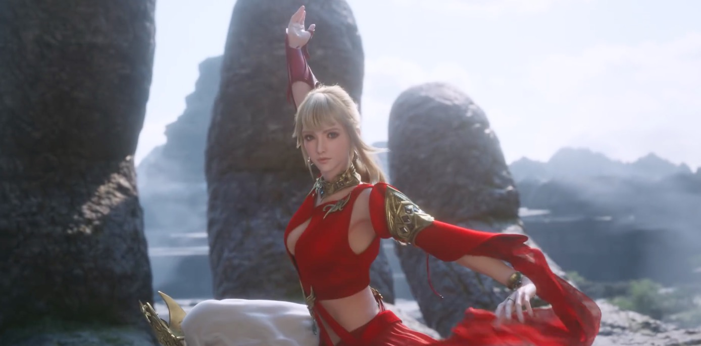
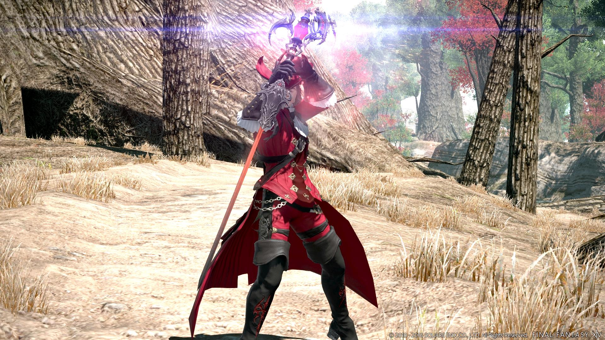
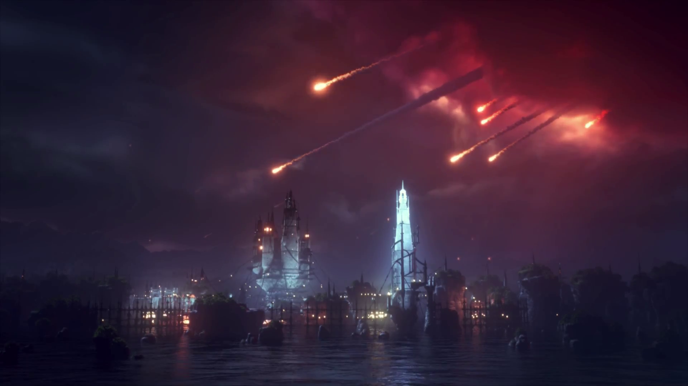
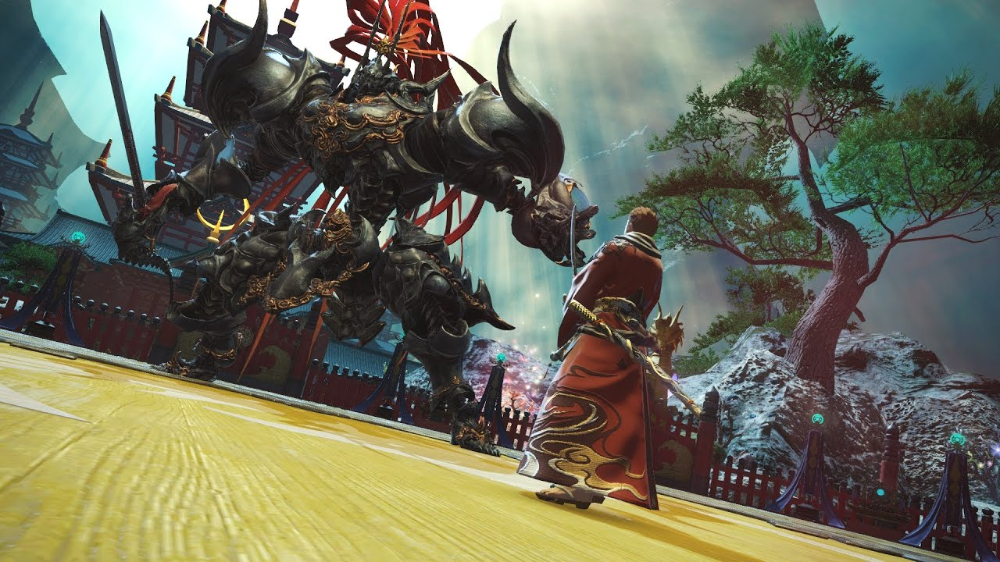
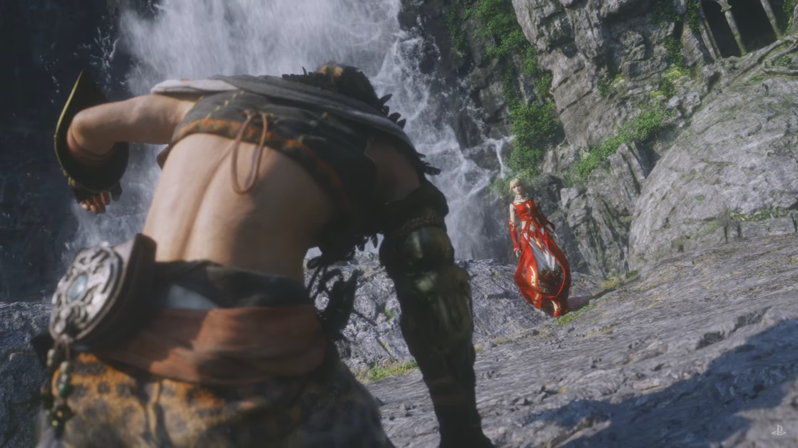

Final Fantasy 14 is inmiddels een van de grootste comebackverhalen uit de mmo-wereld. De ooit geflopte game werd door een nieuwe productiebaas compleet opnieuw ontwikkeld, om vervolgens een van de weinige succesvolle mmorpg’s met een abonnement te worden. Sinds die reboot weet het spel alweer vier jaar spelers geboeid te houden. En nu zijn we toegekomen aan het tweede uitbreidingspakket.

> [!NOTE]
>
> Deze preview verscheen eerder op [Insidegamer](https://inside.gamer.nl/128020-final-fantasy-14-stormblood-preview-gooit-de-game-weer-overhoop/?ref=gamepraat.nl).

In Stormblood trekken spelers oostwaarts, naar de stadsstaten Doma en Ala Mhigo. Beide zijn al jarenlang bezet door een imperialistisch keizerrijk en het is aan ons om daar een einde aan te maken. Trouwe spelers zal dat bekend in de oren klinken, want het verhaal van de game hint al sinds het begin naar beide locaties.

Zowel Doma als Ala Mhigo zijn duidelijk door Azië geïnspireerd. De stad Kugane, waar je geregeld naartoe zult teleporteren, doet bijvoorbeeld denken aan de grote tempels in het Japanse Nara. Het sneeuwlandschap van uitbreidingspakket Heavensward is omgeruild voor bamboe en gekrulde bomen, terwijl de soundtrack vol zit met oriëntale snaarinstrumenten.

Binnen het verhaal van FF14 zijn Doma en Ala Mhigo de thuissteden van de Ninja en Monk, twee professies die al langer in de game zitten. Daarnaast heeft Square Enix nog eens twee speelbare klassen toegevoegd: de Samurai en de Red Mage. Beide zijn DPS-klassen, wat betekent dat ze voornamelijk bedoeld zijn om schade aan te richten. Daarbij gebruikt de Samurai een katana en oplaadaanvallen, terwijl de Red Mage wisselt tussen magie en fysieke aanvallen.

## Samurai

Tijdens een hands-on-sessie van acht uur konden we zowel met de nieuwe als oude klassen spelen op het nieuwe maximumlevel van 70. Daarbij was een nieuwe kerker speelbaar en hadden we toegang tot speciale poppen om alle nieuwe vaardigheden op te botvieren. De eerste professie die we daarbij hebben uitgetest was de Samurai, die qua speelstijl misschien wel het meeste deed denken aan de Ninja.

Deze klasse doet drie dingen tegelijk. In eerste instantie gaat hij door een standaard aanvalsrotatie heen, waarbij hij harde klappen uitvoert en met debuffs de weerstand van tegenstanders verlaagt. Tegelijkertijd is aan de zijkant van het scherm een speciale interface, met daarin drie iconen. De iconen lichten op door specifieke aanvallen te gebruiken, waarna je een speciale oplaadaanval gebruikt om extra schade te doen. Wat voor aanval daarbij wordt opgeladen, hangt af van de hoeveelheid opgelichte iconen. Bij één icoon doe je een bepaalde hoeveelheid schade over een langere periode. Heb je er twee? Dan raak je alle tegenstanders voor je met een fikse klap. En bij alle drie geef je een gigantisch harde tik aan één vijand.

Onder de drie iconen staat ook nog eens een energiebalk in de vorm van een zwaard, die langzaam vult naarmate je vecht. De energie in deze balk is nodig om specifieke aanvallen uit te voeren, iets dat je vaak zo snel mogelijk moet doen. Een volle balk kan immers niet nog voller raken, waardoor je in feite energie verspilt door hem niet te spenderen.

Samurai heeft de potentie om gigantisch veel schade te doen. Bij wat korte tests slaagden wij er in om tienduizenden levenspunten er in een korte tijd af te snijden. Dat geeft een geweldig gevoel van voldoening – al helemaal als je tegelijkertijd je aanvalsrotatie in stand weet te houden.

## Red Mage

De nieuwe Red Mage heeft wat minder brute kracht, maar voelt op zijn beurt juist flexibel. Bij deze klasse moet je twee energiebalken vullen door bepaalde spreuken te gebruiken. De ene spreuk vult de zwarte balk, terwijl de ander witte energie geeft. Zijn beide balken gevuld? Dan spring je naar voren om met je rapier een paar rake klappen uit te voeren, waarna je weer naar achteren springt om weer met magie te werpen.

Iedere tweede spreuk die de Red Mage gebruikt, heeft geen oplaadtijd. Het zorgt ervoor dat je razendsnel aanvallen kunt uitvoeren waarvoor je anders een dikke vijf seconden moet stilstaan. Tegelijkertijd kunnen deze spreuken allemaal weer speciale aanvallen bruikbaar maken, waardoor je in feite aan het jongleren bent. Een voorbeeld: je doet eerst een openingsspreuk, waarna je een langzame spreuk er direct uit gooit. Dat stelt je in staat om een daaraan gekoppelde speciale aanval te gebruiken, waarna je nog eens zo’n langzame vaardigheid gebruikt. Dat allemaal terwijl je steeds kiest uit twee types aanvallen, want beide balkjes moeten worden opgevuld.

We moesten het langst wennen aan de Red Mage, maar na een uur spelen waren we verkocht. Dit is een klasse die je totaal anders laat nadenken dan bij andere mmorpg-archetypen, die ook nog eens in onverwachte situaties ontzettend handig kan zijn. Door een beetje misbruik te maken van de instant-aanvallen van Red Mage, kun je in zeer korte tijd bijvoorbeeld een team dode spelers tot leven wekken. Iets dat professionele raiders wel eens het leven kan redden.

[Bekijk ingesloten media](https://gfycat.com/ifr/InbornAppropriateDwarfrabbit)

**En de rest**
Zo’n beetje iedere speler van Final Fantasy 14 moet met Stormblood opnieuw leren om met zijn of haar klasse te spelen. Square Enix heeft namelijk alle bestaande professies onder handen genomen, waardoor ze allemaal iets anders spelen. Dat heeft deels te maken met de komst van een nieuw interfacesysteem. Iedere klasse heeft speciale balken of andere interface-elementen, die bepalen hoe ze vechten. Een Machinist heeft bijvoorbeeld een hittemeter, die aangeeft wanneer een pistool aan zijn limiet zit.

Voor de nieuwe metermechanics hebben een hoop andere vaardigheden plaats moeten maken. Sommige klassen zijn minder complex gemaakt, waardoor je niet langer vijf verschillende buffs of debuffs in de gaten hoeft te houden. Enerzijds is dat een in potentie goede ontwikkeling. Hierdoor draait iedere klasse om een uniek spelmechaniek, in plaats van het managen van kleine metertjes.

We merkten alleen dat de game tegelijkertijd wel heel simpel kon zijn. Neem bijvoorbeeld de Ninja, die ineens de helft minder te doen heeft. Deze klasse heeft in plaats daarvan een speciale meter voor extra sterke aanvallen, maar het uitvoeren hiervan vereist niet echt veel vaardigheid. Het resultaat: bij onze speelsessie voelde de Ninja een beetje saai ten opzichte van de Heavensward-versie.

Niet iedere klasse die we speelden voelde zodanig versimpeld dat we verveeld raakten. Het is ook lastig om nu al in te schatten hoe iedere speler getroffen zal zijn door de veranderingen. Een ding weten we in elk geval zeker: Final Fantasy 14 zal nooit meer hetzelfde spelen zodra Stormblood uitkomt.

## Voorlopige conclusie

De nieuwe klassen in Stormblood hebben ons enthousiast gemaakt. Toen we naar het evenement gingen, hadden we ons voorgenomen om bij onze oude professies te zweren. Nu we echter een paar uur gespeeld hebben, is het moeilijk om de Red Mage en Samurai links te laten liggen. Voeg daar de gigantische gameplayveranderingen voor bestaande personages aan toe en je hebt een van de meer gedurfde mmo-uitbreidingen van de afgelopen tijd. Square Enix gaat Final Fantasy 14 wéér compleet veranderen. En wij hebben er vertrouwen in.

[Bekijk ingesloten media](https://www.youtube.com/embed/mW7R7QM5X18)
