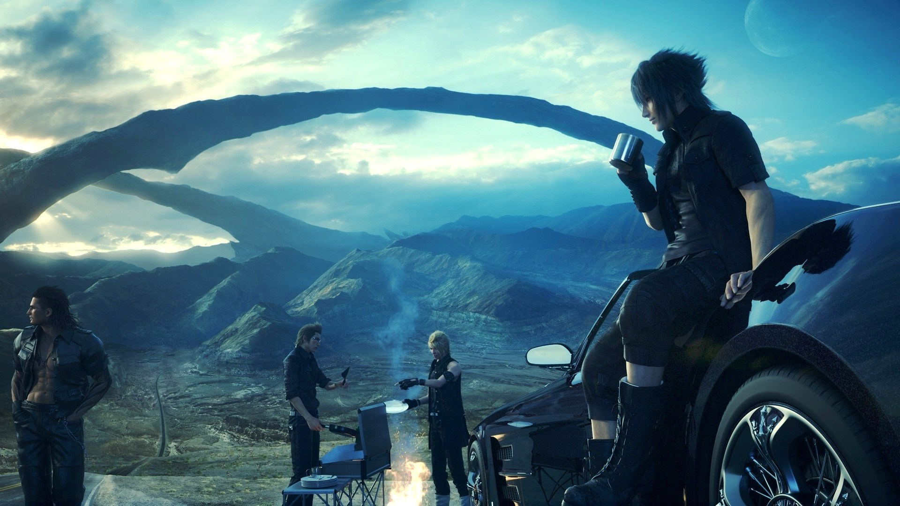
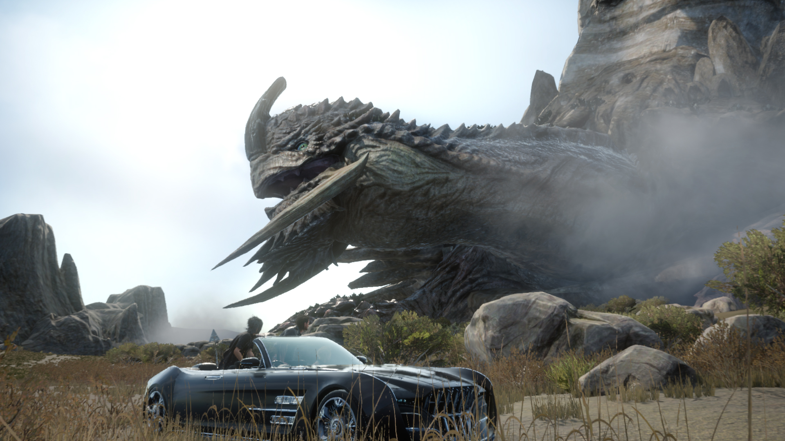
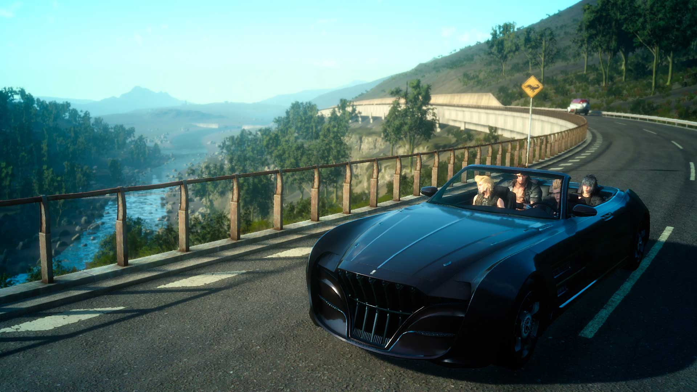
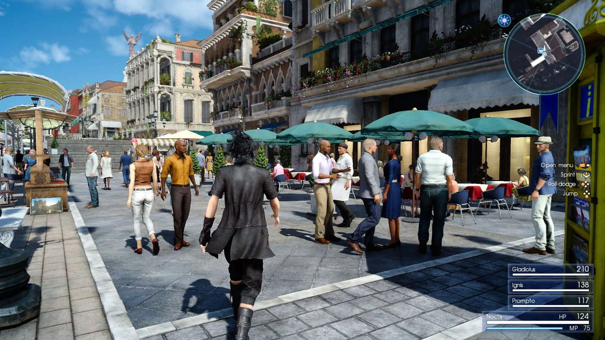

Negen jaar was er voor nodig om Final Fantasy XV op de markt te krijgen. In die tijd is de game door meerdere ontwikkeltrajecten en zelfs namen gegaan – het spel stond eerst immers bekend van Final Fantasy Versus XIII. Best spannend, want games zoals Duke Nukem Forever hebben ons geleerd dat zo’n ‘ontwikkelhel’ zelden goed afloopt. Het is dan ook een klein wonder dat we zo ontzettend verslingerd zijn aan de nieuwste Final Fantasy.

> [!NOTE]
>
> Deze review verscheen eerder op [Insidegamer](https://inside.gamer.nl/125844-final-fantasy-xv-review-de-geweldige-koortsdroom-van-een-12-jarige/?ref=gamepraat.nl).

Het verhaal in het kort: je bent prins Noctis en gaat samen met drie lijfwachten/vrienden op pad om met je liefje te trouwen. Dat doe je in een dure bolide, waarmee je door een open spelwereld reist. Het duurt echter niet lang totdat de shit in jouw land flink aan is en je als voortvluchtige moet proberen je land alsnog te redden.

Het verhaal achter Final Fantasy XV is voer voor een typische jrpg, maar de uitwerking van het spel doet veel meer denken aan totaal andere genres. Neem bijvoorbeeld de open spelwereld en bijbehorende auto, die doen denken aan Velen en het paard van Geralt in The Witcher 3.

Of het snelle actiegevechtssysteem, dat iets weg lijkt te hebben van Dark Souls of titels van Platinum Games. In Final Fantasy XV zit je niet te kijken naar vollopende balkjes totdat je een aanval mag doen, maar zijn je snelle denkwerk en reflexen vele malen belangrijker. Spelers van de oude stempel kunnen diep in de opties van de game een Wait-modus activeren. Dan blijft de wereld even stilstaan als jij niet beweegt. Maar de oude waarden van een jrpg-gevechtssysteem zijn met Final Fantasy XV verloren gegaan.

De open wereld van Final Fantasy XV biedt absurd veel om te doen. Hoe langer je speelt, hoe meer zijmissies er worden ontgrendeld en hoe meer kanten je op kunt rijden. Hoewel het verhaal met een uur of dertien tot twintig snel is uitgespeeld, kan de open wereld in potentie tientallen uren plezier bieden.

Dat ronddolen bestaat uit meer dan het vinden van voorwerpen en afslachten van monsters, want de game zit vol met minigames. Prins Noctis is bijvoorbeeld een fervent visser, of je kunt de beste Chocobos fokken voor op de racebaan. Wie toch een nieuwe uitdaging met zijn wapens wil aangaan, kan speciale jachtmissies aannemen om grote, sterke bazen in de wereld op te zoeken.

## Tempo

Hierdoor ontstaat een game met een heel ander tempo dan we uit oude Final Fantasy’s kennen. Vroeger ging je op reis, om langzaam van stadje naar stadje en kerker naar kerker te gaan. In tientallen uren ging je vrij lineair over de gehele wereld heen.

Niet in XV. Hoewel het verhaal er wel voor zorgt dat bepaalde delen van de wereld pas later toegankelijk zijn, is een groot deel van de kaart na een uurtje of tien al doorreisbaar. Het zorgt voor een duidelijker idee van schaal: wie met de auto de gehele kaart over moet rijden, is daar best een lange tijd voor kwijt. Het gevoel van ontdekking wordt echter wat sneller minder, omdat je al zo snel een groot deel van de wereld mag overreizen.

Tenminste: zolang je in de open wereld zit. Het eerste deel van Final Fantasy XV is open benaderbaar, zoals een Witcher 3 of Grand Theft Auto 5. Zodra je in de latere hoofdstukken terechtkomt, volgt het verhaal echter een lineaire structuur. Pas aan het einde van de game krijg je vervolgens pas weer de gelegenheid om je op de zandbak te storten.

Hoewel we al snel het idee hadden het gros van de open wereld te hebben gezien, is het gevoel van een ‘reis’ wel veel prominenter in Final Fantasy XV aanwezig. Dat is deels te danken aan de onderlinge dialogen van hoofdpersonen Noctis, Ignis, Prompto en Gladiolus, die elkaar de gaten in de sokken lullen tijdens hun autoritten. De dialogen geven direct aan dat de vier goede vrienden zijn: ze maken woordgrappen, plagen elkaar en verwijzen terug naar eerdere avonturen.

Het kamperen in een tent, wat in eerdere Final Fantasy’s bestond uit een vierkantje op de wereldkaart, is nu een prominent gedeelte van de game geworden. Gladiolus zet dan een tent op, waarna Ignis een maaltijd maakt die het team samen opeet. Niet alleen charmant, maar ook handig. Die maaltijd geeft de volgende dag een bonus voor je statistieken.

In de tent krijg je ook de foto’s te zien die Prompto van je reis heeft gemaakt. Dat biedt een leuk idee van de avonturen sinds je vorige kampeeravontuur – waardoor je meteen potentieel leuke screenshots kunt bewaren en delen op sociale media. Ideaal als je er zelf normaal niet aan denkt om screenshots te maken.

De bugs aanwezig in een vroege previewversie die we eerder dit jaar speelden, zijn gelukkig grotendeels verdwenen. We hadden hooguit af en toe een paar kleinere, grafische glitches, waardoor gezichten bijvoorbeeld op een vreemde manier bewogen tijdens dialogen. Een collega had last van een groter probleem, waarbij grote delen van de omgeving onscherp waren totdat hij het spel opnieuw had geïnstalleerd op een PlayStation 4. Dat laatste probleem lijkt gelukkig zeldzaam.

## Snelheid

Het nieuwe gevechtssystemen zal voor traditionele fans wellicht even wennen zijn, maar wij zouden inmiddels niet anders meer willen. Want hoewel gevechten vaak aanvoelen als een ander genre, past de nadruk op actie wel ontzettend goed binnen Final Fantasy XV.

Noctis is in staat om wapens uit het luchtledige te trekken, wat ervoor zorgt dat je middenin gevechten snel tussen wapens kunt wisselen. Hoe verder je komt, hoe belangrijker dat wordt. Zo krijg je al snel wapens die bizar veel schade doen maar daarvoor je levenskracht wegzuigen, of grote kanonnen waarmee je met wat oplaadtijd forse klappen uitdeelt.

Het maakt gevechten in Final Fantasy XV razendsnel, zonder dat ze ooit gedachteloos gaan voelen. Een sterk monster is niet te verslaan door er achteloos op in te rammen, maar vereist dat je bedachtzaam blokkeert, omzeilt en de juiste wapens of spreuken gebruikt.

## Jongensdromen

Uiteraard zijn de gebruikelijke referenties naar eerdere Final Fantasy-games weer aanwezig. Het duurt niet lang totdat je voor het eerst op Chocobos mag rijden, het verhaal gaat al snel over kristallen en natuurlijk is er een Dragoon met de achternaam Highwind te vinden.

De gamewereld zelf is tegelijkertijd haast absurdistisch te noemen. Lucis is een soort parallel van onze eigen wereld, met hotels, scholen, smartphones en auto’s. Maar dan eentje waarin grote monsters rondlopen en een keizerrijk met samurairobots de dienst uitmaakt.

Zo’n moderne fantasiewereld is op zich niet nieuw voor Square Enix, Final Fantasy VIII doet immers iets vergelijkbaars. In die game is het fantasie-element echter nog net wat groter, waardoor we minder een gevoel krijgen dat er iets niet in die wereld klopt. In XV hebben we continu het idee dat twee werelden qua logica met elkaar horen te botsen, wat niet het geval is.

Het is makkelijk om bovenstaande weg te zetten als kritiek. Maar de __disconnect__ tussen de moderne wereld en het fantasierijk maakt Final Fantasy XV een absurdistisch spel – eentje dat een uniek gevoel weet over te dragen.

Het lijkt alsof het gehele verhaal van Final Fantasy XV bij elkaar is gedroomd door een groep twaalf- of dertienjarigen, die samen bespreken hoe een gezamenlijk avontuur zou zijn. Eentje waarin hun eigen wereld een rol speelt, maar dan met alle elementen die een spannend avontuur kunnen opleveren. Het legt wellicht uit waarom automonteur Cindy gekleed gaat als een pornoster – dat past allemaal binnen de fantasie.

Die jonge gasten zouden misschien wel de hoofdrolspelers uit de game kunnen zijn. Die voelen namelijk alle vier zelden aan als diep uitgewerkte personages, maar eerder als vleesgeworden idealen voor bepaalde soorten personen. Zo is Noctis de stille, serieuze gast, Prompto is de grappenmaker, Gladiolus de stoere spierbundel en Ignis het brein.

Misschien is dat ook wel waarom we – ondanks een gebrek aan diepgang in de personages en het verhaal – ons zo goed kunnen inleven in de game. Want eigenlijk zijn wij net zozeer die jonkies die fantaseren over een avontuur, waarin we onszelf op de meest ideale manier mogelijk in zien. Final Fantasy XV is het avontuur dat we bij elkaar droomden op de momenten dat we vroeger ons in de schoolbanken verveelden.

[Bekijk ingesloten media](https://www.youtube.com/embed/qi_iq8h0eKM)
