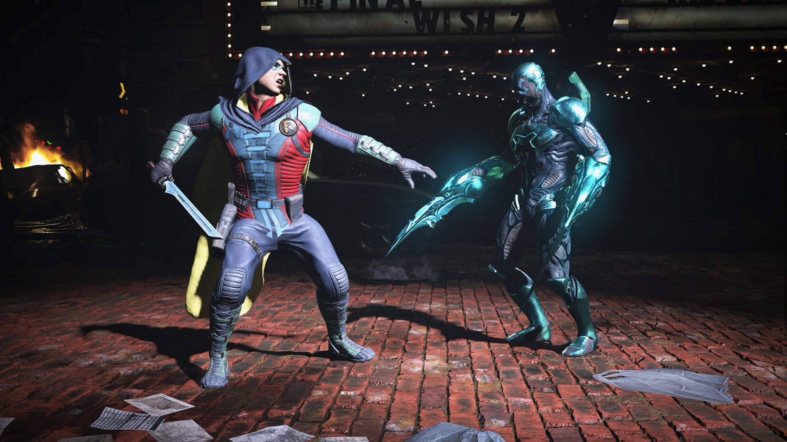
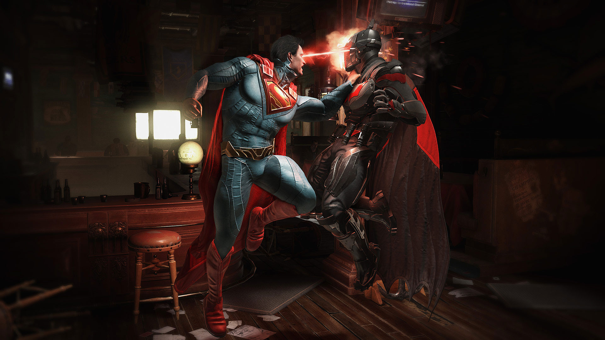

Fighters waren jarenlang een onbenaderbaar genre. Ze werden enkel gespeeld door competitieve spelers, die frames telden en subtiele prioriteitssystemen leerden om het tegen andere gamers op te nemen. Wie gewoon een leuke singleplayerervaring wilde, was bij vechtspellen aan het verkeerde adres.

NetherRealm Studios bracht daar verandering in met zijn reboot van Mortal Kombat, waarin een verhaalmodus cutscenes en gevechten naadloos aan elkaar verbindt. Een formule die het bedrijf vervolgde in Injustice, een vechtgame met superhelden en -schurken van DC Entertainment. En die game heeft nu een vervolg.

> [!NOTE]
>
> Deze review verscheen eerder op [Insidegamer](https://inside.gamer.nl/127820-injustice-2-review-alleen-vechten-was-nog-nooit-zo-leuk/?ref=gamepraat.nl).

Injustice 2 bevat dezelfde basis die we kennen van voorgaande NetherRealm-games. Ook hier kun je door een verhaal spelen, waarbij cutscenes zonder laadschermen overgaan in gevechten. Het verhaal sluit vrij nauw aan op het einde van de eerste Injustice, maar gelukkig legt de game tussen de regels door uit wat er eerder is gebeurd. Een vereiste, want de superheldenwereld van Injustice 2 kan wat verwarrend zijn. Superman en Batman staan sinds de eerste game recht tegenover elkaar, waardoor er een oorlog tussen superheldenteams is uitgebroken.

Het blijft een fantastische manier om een verhaal binnen een vechtgame te vertellen, al is de leercurve wat stijl. De game schotelt je steeds een nieuw speelbaar personage voor, maar zonder een tutorial om de combo’s en speciale aanvallen van dat spelfiguur uit te leggen. Ondertussen stijgt de moeilijkheidsgraad wel met ieder hoofdstuk, waardoor je onder steeds strengere condities moet leren om nieuwe personages te gebruiken.

## Een beetje Overwatch

Wie na het verhaal nog steeds solo wil spelen, kan de nieuwe Multiverse-modus induiken. Door een planeet aan te klikken krijg je een reeks gevechten voor je kiezen, vaak met afwijkende voorwaarden. Zo vecht je soms terwijl je personage om de tien seconden in slaap valt, of terwijl je tegenstanders langzaam hun levensbalk hervullen.

Aan het einde van missiereeksen krijg je soms schatkisten waarin je nieuwe skins, uitrusting en speciale aanvallen vindt. Daarmee kun je personages naar eigen smaak aanpassen, met ook betere statistieken voor in het multiversum. In de tussentijd levelt ook je gespeelde personage, waarna je rond level 20 op zoek kan naar epische bepantsering. Het is een leuk rpg-element binnen wat toch vooral een vechtspel is, waarmee je ook nog eens het uiterlijk van personages kunt uitrusten. Ieder stuk bekleding ziet er namelijk iets anders uit.

Die schatkisten hebben overigens een duidelijke inspiratiebron. De animatie waarmee ze worden geopend, is nagenoeg identiek aan hoe in Overwacht lootcrates worden geopend. Het opsparen en openen van die kistjes geeft ook dezelfde kick, alsof je met kerst je cadeautjes aan het uitpakken bent.

Wil je nog meer kisten om je personage uit te rusten, dan kun je ook aansluiten bij een guild. Daar werk je samen met andere spelers aan grotere doelen, zoals het uitvoeren van 600 superaanvallen op een dag. Lukt dit? Dan krijg je speciale guildkisten. Ondertussen klimt je guild ook op ranglijsten, waardoor je het tegen spelers kunt opnemen zonder dat je in versusgevechten tegenover mensen hoeft te staan.

Laat het duidelijk zijn: de hoeveelheid content voor solospelers in Injustice 2 is enorm. Die nadruk op alleen spelen is sinds de Mortal Kombat-reboot al belangrijk voor NetherRealm, en iets waar de ontwikkelaar flinke innovatie mee heeft gebracht. Sindsdien heeft zelfs Street Fighter V het concept van een verhaalmodus van de studio overgenomen.

## Gelikter

Het onderliggende vechtsysteem in Injustice 2 is licht aangepast sinds het vorige deel. Neem bijvoorbeeld Aquaman, die nu door kleine wijzigingen iets minder snel zijn supermeter opbouwt. Het zijn dit soort veranderingen die de game gebalanceerder moeten maken, terwijl er ook vechters zijn verwijderd en nieuwe toegevoegd. Zo zit Batgirl niet in dit vervolg, maar kun je wel met Robin spelen. De toevoeging van Firestorm, Captain Cold, Black Canary en Deadshot suggereert dat NetherRealm met één oog heeft gekeken naar de huidige tv-series van DC. Want hoewel deze personages niet héél groot zijn in de strips, spelen ze wel belangrijke rollen op tv.

Daarnaast zijn gevechten vooral iets gelikter. Heeft een personage één ronde verloren? Dan kan hij een showdown starten, waarbij hij tegen de tegenstander botst. Beide spelers moeten vervolgens een deel van hun superbalk afstaan – en degene die het meeste verbrandt, wint die kleine confrontatie en krijgt bijvoorbeeld 35 procent van zijn of haar levensbalk terug. Het is een gave manier om je comeback te maken als je net aan het verliezen bent.

Spelers kunnen simpeler knoppencombinaties inschakelen, of de controller zo instellen dat hij vergeeflijker is. Hierdoor worden foutieve inputs licht gecorrigeerd, waardoor de bedoelde aanval makkelijker naar buiten komt. Op papier heel gaaf, maar in de praktijk merken we dat de game hierdoor onze inputs soms ook foutief registreert. Ervaren spelers kunnen deze optie beter uitzetten.

[Bekijk ingesloten media](https://www.youtube.com/embed/edhS1U0Yusg)

Daarnaast staat de basis van de vorige Injustice nog steeds als een huis. Neem bijvoorbeeld hoe rondes worden gespeeld: de game springt niet naar een zwart scherm om vervolgens het tweede rondescherm neer te zetten. In plaats daarvan gaan personages verder vanaf dezelfde plekken, waardoor de drie rondes naadloos in elkaar overgaan.
