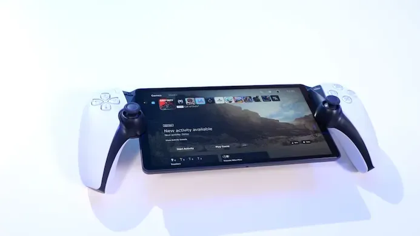
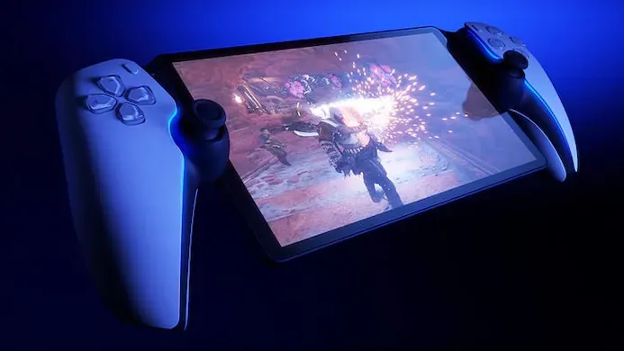
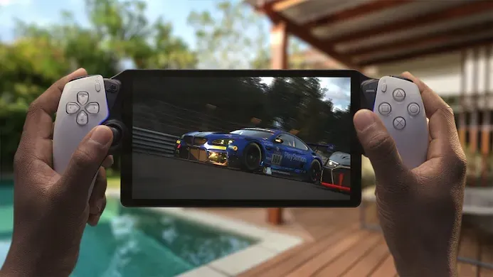
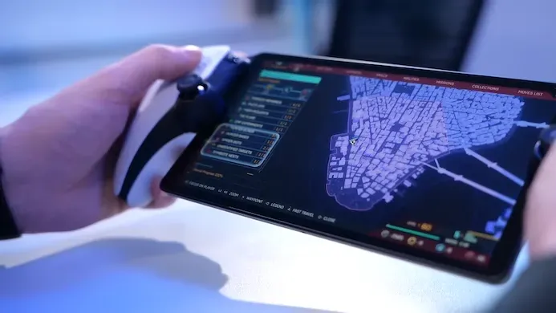
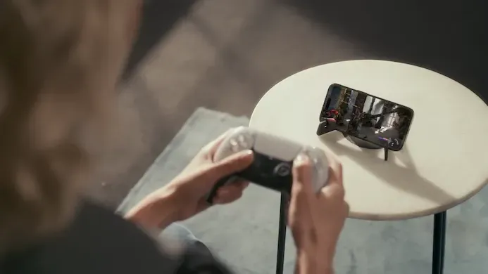

**Als Wii U-achtige controller doet de PlayStation Portal het prima. Kijk je er als handheld naar, dan krijg je wel erg weinig voor het relatief hoge bedrag.**

> [!NOTE]
>
> Deze recensie verscheen eerder op [Gamer.nl](https://gamer.nl/reviews/hardware/consoles/de-playstation-portal-had-veel-meer-kunnen-zijn/?ref=gamepraat.nl).

Met de Portal brengt PlayStation voor het eerst in ruim elf jaar een nieuwe handheld op de markt. Verwacht echter geen opvolger van de Vita: de Portal lijkt eerder op de gamepad die Nintendo ooit voor de Wii U maakte. Het apparaat is puur ontworpen om games vanaf de PlayStation 5 naartoe te streamen via wifi, zodat je bijvoorbeeld Spider-Man 2 kunt spelen terwijl je partner of kinderen de televisie benutten.

Vooropgesteld: dat streamen doet de Portal prima. Games zien er op het 1080p-scherm scherp uit en van vertraging is weinig sprake. De purist zal wel een klein beetje latency opmerken waardoor een competitieve online shooter niet aan te raden is, maar voor een avondje Spider-Man 2, Final Fantasy 7 Remake of Horizon leent het zich uitstekend. Het scherm heeft een frequentie van 60 hertz, ruim voldoende - streamen bij meer dan 60 frames per seconde wordt al snel riskant.

Voor traditioneel LCD ziet het scherm er ook mooi uit, met diepe zwartwaarden door ogenschijnlijk veel lokale dimpunten. Oled was leuk geweest, maar had de prijs van de handheld geheid nog verder omhoog gestuwd, dus deze keuze voelt logisch.

## Geen rechtstreekse verbinding

Wel jammer is dat voor Remote Play de Portal hetzelfde type verbinding gebruikt als bij de app voor je smartphone of tablet. Het apparaat verbindt via je router met je (bij voorkeur op ethernet aangesloten) console, wat betekent dat je een snelle router nodig hebt om goede prestaties te genereren.

Een gemiste kans, want er zijn tal van alternatieven te verzinnen die Sony bij een eigen apparaat had kunnen inzetten. We hadden graag gezien dat de Portal een rechtstreekse adhoc-verbinding met de console kon maken, zoals de Wii U dat vroeger ook deed. Of misschien had Sony de usb-c-poort kunnen gebruiken voor een bedrade aansluiting, om zo een nog betrouwbaardere connectie tussen console en Portal aan te bieden. Dan had Sony ook kunnen zeggen dat dit de ultieme manier was om stabiel je games remote te draaien.

## Moordende concurrentie

Omdat zulke directe verbindingsopties bij de Portal ontbreken, heeft het apparaat niet echt een 'unfair advantage' vergeleken met andere handhelds - en de concurrentie is moordend. Heb je een beetje een goede smartphone, dan koop je voor de helft van het geld een goede controller om rond je telefoon te klemmen, waarbij de Remote Play-app op je smartphone net zo goed werkt als Sony's eigen apparaat. Die smartphone heeft wellicht een iets kleiner scherm, maar dikke kans dat hij wel een oledscherm heeft.

Iets meer te besteden? Een Steam Deck van 370 euro streamt ook games via een Remote Play-app. En als je die koopt heb je naast PlayStation-games ineens ook toegang tot gigantisch veel pc-titels. Omdat Sony veel games naar pc port, kun je veel PlayStation-titels lokaal draaien.

## Goede controller, gierige audio

Wel heeft de Portal een streepje voor als het gaat om comfort. De console ziet er wat Frankenstein-achtig uit, alsof iemand twee controllerhelften aan een tablet heeft geplakt, maar het resultaat mag er zijn. Het voelt namelijk alsof je een DualSense-controller in je handen hebt. Enig verschil is dat de analoge sticks iets kleiner zijn, maar ze hebben alsnog iets meer travel dan wat je op een Nintendo Switch vindt.

Daar staat tegenover dat de Portal achterloopt qua draadloze audio. Een bluetooth-headset aansluiten is onmogelijk. Dat had een nobel streven kunnen zijn in een poging mogelijke draadloze storingen rond de gadget te beperken, maar de realiteit is gieriger: wie draadloze audio wil, moet een headset gebruiken die PlayStation Link ondersteunt. Dit protocol belooft lagere latency en lossless audio, maar bij gamestreaming voelen beiden als overbodige luxes - wie minimale latency en hoogste kwaliteit wil, speelt immers rechtstreeks op de televisie.

## Gesloten

De Portal voelt vooral als een gemiste kans. Had Sony het apparaat zijn eigen platform gemaakt waarop handheldgames afgespeeld konden worden, dan was dit in potentie een fantastische Vita-opvolger geweest. Een handheld die vele malen fijner in de hand ligt dan een Switch of een Steam Deck. We waren dan zelfs bereid geweest iets meer te betalen voor een extra krachtige chip - de Switch heeft bewezen dat een gamehandheld wonderen kan verrichten met een beetje een goede smartphoneprocessor.

In plaats daarvan is dit puur een streamingapparaat. Voor hooguit 150 euro een _no-brainer_, maar bij 220 euro schuurt hij qua prijs net te dicht langs net zulke valide alternatieven. Dat maakt het lastig de Portal aan te raden.

## Conclusie

Hardwaretechnisch doet de PlayStation Portal precies wat je verwacht: in perfecte netwerkomstandigheden worden games vanaf je PlayStation 5 naar het kleinere scherm gestreamd, waarbij je ze met de uitstekende besturing kunt spelen. Maar dat het apparaat alleen kan streamen, maakt hem inherent beperkt. Voor de helft van het geld heb je een apparaat dat nog veel meer kan.

> [!INFO] Details
>
> **PlayStation Portal**
>
> Beoordeling: ★★★☆☆
>
> **Pluspunten:** Mooi scherm, streamen werkt prima, ergonomisch heel fijn.
>
> **Minpunten:** Kan alleen maar streamen, duur voor wat het doet, geen rechtstreekse PS5-verbinding.
