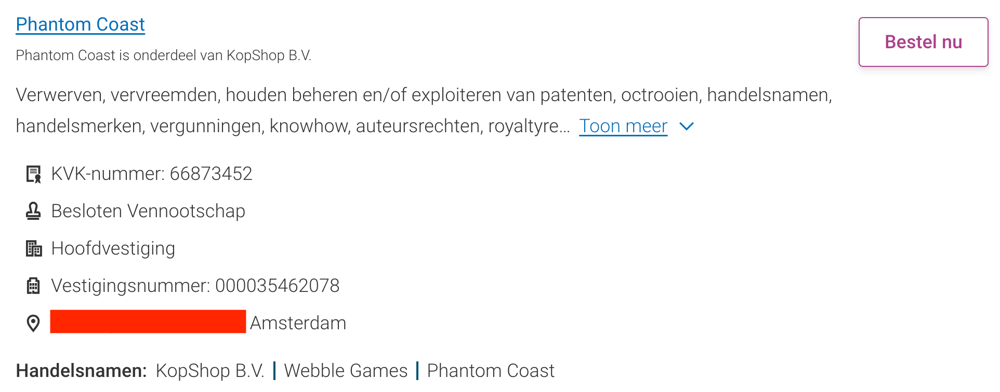
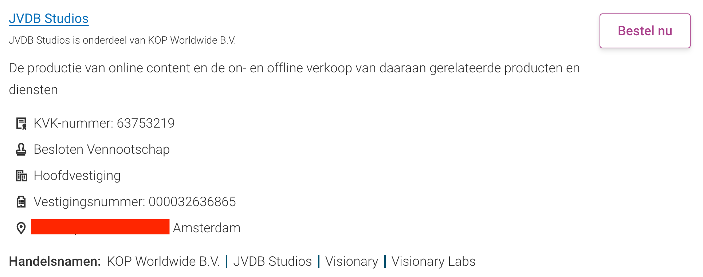

Afgelopen weekend publiceerde _de Volkskrant_ een opzienbarend verhaal over het bedrijf van YouTuber Jordi 'Kwebbelkop' van den Bussche, die zijn personeel veelvuldig publiek afbrandde en van wangedrag werd beschuldigd. Daarbij ging het vooral over zijn YouTube-personeel, maar had zijn gedrag ook invloed op zijn bedrijf waar hij nu een game mee ontwikkelt?

_Deze editie van Gamepraat telt 907 woorden en neemt vier minuten van je tijd in beslag. Vind je dit leuk om te lezen? Neem een betaald abonnement, doneer eenmalig iets op Petje Af of stuur de nieuwsbrief door naar een vriend! Dat helpt allemaal ontzettend._

De openbaringen waren onderdeel van een breder verhaal over het bedrijf van Van den Busche, vermoedelijk de grootste YouTuber die Nederland op dit moment heeft. Zijn kanaal telt ruim 15 miljoen abonnees en is onderdeel van een inmiddels groter bedrijf waarbij volgens de Volkskrant altijd wel tien mensen tegelijkertijd aan het werk zijn op de werkvloer.

[De Volkskrant beschrijft](https://www.volkskrant.nl/kijkverder/v/2024/op-youtube-is-alles-geoorloofd-voor-clicks-en-views-ook-als-het-gaat-om-kindercontent~v1027685/?ref=gamepraat.nl) dat de werksfeer grimmig werd toen het aantal views daalde. De YouTuber schold personeel uit en vernederde ze in het openbaar:

> _‘De sfeer sloeg toen compleet om, van een chille werkplek tot een hel’, zegt een van hen tegen de Volkskrant. ‘Bij elke kleine fout kon Jordi je opeens volledig de huid vol schelden.’ Vier andere ex-werknemers bevestigen dit, zij willen allen anoniem blijven uit angst voor repercussies in de (kleine) Nederlandse YouTubewereld._

> _Het gros van Van den Bussches uitbarstingen gaat volgens hen over views. Maar ook geldstress of relatieproblemen zou hij hebben afgereageerd op zijn werknemers. Ze vertellen hoe hij ze apart nam of ten overstaan van collega’s afbrandde: ‘Je bent niks waard’, ‘Als je nog één zo’n fout maakt, ben je weg’, ‘Ben je fucking dom ofzo?’ Voor de meeste werknemers was dit hun eerste baan, ze zijn gemiddeld zo’n 20 jaar oud en hopen zelf ook op een succesvolle YouTubecarrière._

De vraag waar ik na afloop mee achterbleef was: ging het er ook zo aan toe bij zijn gamebedrijf? De afgelopen maanden werd mijn mailbox bestookt door een PR-bureau ingehuurd door de YouTuber, om de komst van zijn eerste game getiteld _Helskate_ te promoten. Als hij bij zowel zijn YouTube-bedrijf als gamestudio aan het roer staat, gedraagt hij zich dan op beide plekken hetzelfde?

Van den Bussche zal het ons zelf vast niet vertellen: de YouTuber reageerde niet op vragen van _de Volkskrant_ en zijn PR-bureau negeerde deze week ook een interviewverzoek van mijn kant. Duik je in eerdere interviews die hij gaf, dan benadrukt Van den Bussche dat hij beide bedrijven wel echt als iets anders ziet. Hij zei bijvoorbeeld het volgende recent in een aflevering van Bonuslevel:

> _Kwebbelkop is een heel ander bedrijf dan Phantom Coast. Ik ben Jordi en de CEO van alle twee, maar Kwebbelkop en Phantom Coast zijn 'completely different'._

[Bekijk ingesloten media](https://www.youtube.com/embed/y3erR8x1Brw?start=1301&feature=oembed)

Daarmee lijkt hij het vooral te hebben over wat de bedrijven maken en welke toon ze proberen te zetten. Bedrijfsmatig zegt hij er weinig over, maar als je er dieper in duikt blijkt dat zijn gamestudio Phantom Coast en YouTube-bedrijf JVDB Studios diep met elkaar waren verweven. Bij de Kamer van Koophandel staan beide op hetzelfde postadres in Amsterdam geregistreerd, met ook ieder connecties met zijn KOP-bedrijven.

_Het adres is identiek, maar hieronder even weggelakt. Hoewel het publieke informatie is wil ik geen dox-gedrag in de hand werken._

Dan is er een kans dat medewerkers simpelweg op dezelfde locatie in verschillende ruimtes werken en de twee van elkaar gescheiden blijven, maar ook dat lijkt niet het geval. Een snelle rondgang op LinkedIn laat zien dat veel (oud-)personeel zegt te werken of hebben gewerkt voor zowel Phantom Coast als JVDB Studios. Een HR-medewerker van JVDB Studios die _de Volkskrant_ citeerde, bleek ook actief mee te werken aan het gameproject.

Beide bedrijven lijken dus nauw in elkaar vervlochten. Of dat betekent dat de YouTuber ook zijn gameontwikkelaars de huid vol schold? Ik heb nog geen ontwikkelaar gesproken die daar iets over durfde te vertellen, maar het lijkt me vreemd als hij zulk gedrag bij de ene groep medewerkers vertoonde en bij een andere groep zich consistent poeslief heeft gedragen.

## Elders gepubliceerd

-   Ik recenseerde voor NRC Handelsblad de nieuwe metroidvania [Ultros](https://www.nrc.nl/nieuws/2024/03/11/zaai-planten-en-ga-op-onderzoek-uit-niets-is-voor-niets-in-memorabele-game-ultros-a4192674?ref=gamepraat.nl), die het moet hebben van zijn trippy stijl en een leuke twist.
-   Akira Toriyama, één van mijn persoonlijke helden, is overleden. [Ik mocht een necrologie over hem schrijven](https://www.nrc.nl/nieuws/2024/03/08/het-kamehameha-van-de-verlegen-striptekenaar-akira-toriyama-1955-2024-ging-de-hele-wereld-over-a4192469?ref=gamepraat.nl#photo=MTMwMTc), wat een fijne uitlaatklep was om het nieuws te verwerken. Verder duidde ik zijn overlijden bij het NOS 20u Journaal - wat weer leidde tot een [gekke CDA-tweet](https://pu.nl/artikelen/nachtwacht/cda-almere-zet-zich-voor-lul-met-post-over-akira-toriyama/?ref=gamepraat.nl) die viraal ging.
-   Floris is met verlof, dus ik mocht de [Bright Podcast](https://www.bright.nl/nieuws/1186679/gaat-de-amsterdamse-afremmer-op-e-bikes-een-verschil-maken.html?ref=gamepraat.nl) deze week presenteren.
-   Voor AD testte ik [de nieuwe MacBook Air](https://www.ad.nl/tech/review-is-de-nieuwe-macbook-air-van-apple-zijn-geld-waard~a34151ba/?ref=gamepraat.nl) - hij draait Death Stranding!

## Verder interessant deze week

-   De oprichters van het Nederlandse KeokeN speelden deze week open kaart: ze hebben [hun vijf volgende games aangekondigd](https://twitter.com/KeokeN/status/1767913578487513512?ref=gamepraat.nl), in de hoop investeerders aan te trekken. Na 200 pitches zou dat ze voor deze games nog niet zijn gelukt.
-   Embracer heeft [zijn assets in Saber verkocht](https://www.eurogamer.net/embattled-publisher-embracer-sells-off-saber-assets-withdraws-from-russia?ref=gamepraat.nl) en trekt zich daarmee terug uit Rusland. Misschien wel de enige logische Embracer-verkoop in afgelopen maanden.
-   Laatst schreef ik al over hoe Balatro wegens gokzorgen uit de eShop werd gehaald. De ontwikkelaar heeft daar nu [een boekje over opengedaan](https://www.eurogamer.net/balatro-creator-speaks-out-on-gambling-rating-drama?ref=gamepraat.nl).

Tot volgende keer!
