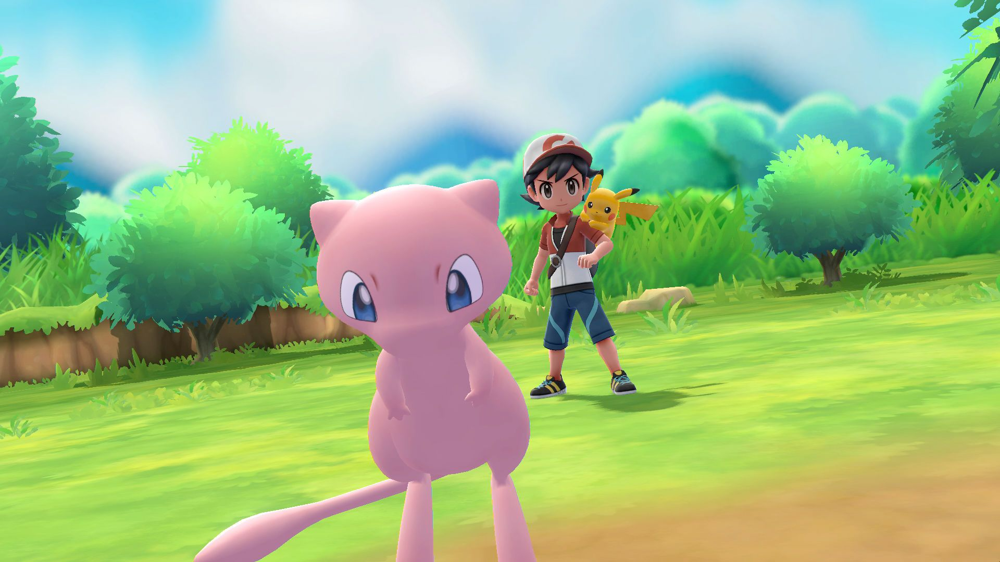
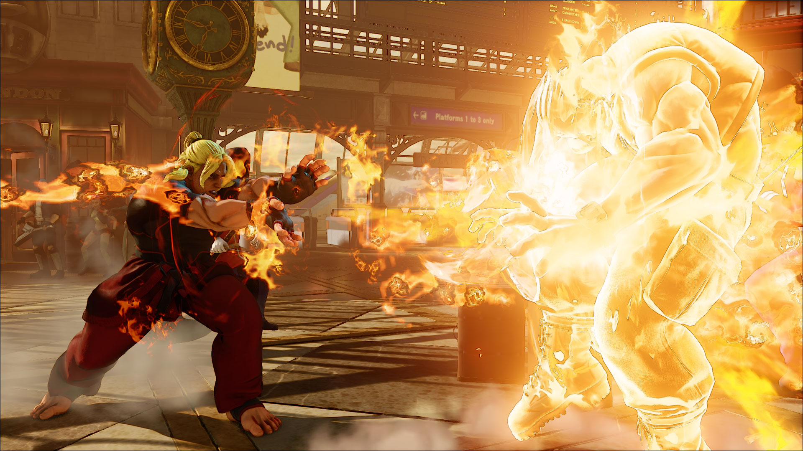

Al jarenlang bieden Pokémon-games een vertrouwd avontuur. Spelers reizen van stad naar stad, waar ze zich steeds weer moeten bewijzen in zogeheten Gym-gevechten. In de tussentijd breiden ze langzaamaan hun verzameling monsters uit, in een poging om ze “allemaal te vangen”.

Vraag je gamers om de wereld van Pokémon te omschrijven, dan krijg je meestal dezelfde antwoorden. Ze zullen vertellen over de kleurrijke spelwereld, gevuld met gekke huisjes voorzien van bolle daken. Of over de vreemde monsters. Die zijn vaak schattig, maar soms ook geïnspireerd door bizarre zaken zoals vuilniszakken en zandkastelen. Met iedere Pokémon-game is er steeds meer een eigen stijl ontstaan.

> [!NOTE]
>
> Dit artikel verscheen eerder [op Laadscherm](https://laadscherm.nl/sven-32-is-blind-maar-speelt-toch-alle-pokemon-games/?ref=gamepraat.nl).

Sven van de Wege (32), online bekend als [BlindWarriorSven](https://twitter.com/svenvandewege?ref=gamepraat.nl), merkt daar bij het spelen van de games niks van. Hij is al sinds zijn zesde blind door de gevolgen van kanker. Toch speelt hij fanatiek games, zonder dat hij kan zien wat er op het scherm gebeurt. “Ik heb nog nooit een Pokémon gezien”, vertelt hij in een mailwisseling. “Ik heb ook geen idee hoe bijvoorbeeld Pikachu of Bulbasaur eruitzien.” Hij heeft zichzelf echter geleerd om de spellen op een andere manier te spelen.

“Ik ben zelf een enorme Pokémon-fan. Inmiddels ben ik in staat om de oudere spellen, zoals Pokémon Yellow, Blue, Red, Silver, Gold, Leaf Green en Fire Red, te spelen met behulp van geluid.” In de spelwereld zelf is dat een kwestie van blijven rondlopen. Botst hij ergens tegenaan? Dan hoort hij een luide ‘oomph’ die duidelijk maakt dat de hoofdpersoon niet verder kan en dat hij een bocht moet maken. “Ieder veldje heeft ook zijn eigen muziek. Door te luisteren naar wanneer de muziek verandert, weet je of je bijvoorbeeld een stad binnenloopt of weer naar buiten gaat.”

Wordt Sven tijdens tijdens het rondlopen uitgedaagd door een trainer, dan speelt er een luide ‘pa-ting’ die het aanstaande gevecht voor hem aankondigt. De opzwepende muziek vult zijn oren, waarna hij de pokémon van zijn tegenstander het veld in hoort springen.

[Bekijk ingesloten media](https://www.youtube.com/embed/Bf-M_klaUPA?feature=oembed)

Het uit elkaar houden van die pokémon is al lastig als je ze kunt zien, maar voor Sven is het nog uitdagender. In de eerste Pokémon-game zitten 151 monsters, waarna er iedere paar jaar meer zijn toegevoegd. De teller staat inmiddels op 807 unieke pokémon.

Ieder monster dat in een gevecht naar voren springt heeft een eigen brul, die Sven heeft moeten leren onderscheiden van de andere kreten. In de oude tekenfilms van Pokémon was dat doodsimpel, omdat de monsters hun eigen namen zeiden. De strijdkreten in de games zijn alleen dierlijke geluiden, die flink worden weggefilterd door de ouderwetse geluidchips van de eerste Game Boys.

Sven weet precies waar hij tijdens gevechten moet zijn in de vele menu’s van de game. Hij zoekt op de website Bulbapedia welke aanvallen zijn pokémon eigenlijk kunnen, zodat hij weet dat hij de juiste optie indrukt. Hoort hij het ’tu-tu-tu-tuuuu’-geluidje als één van zijn beestjes een level omhoog is geschoten? Dan maakt hij een mentale notitie van het nieuwe level van zijn teamlid.

“Soms raak je wel eens de tel kwijt. Dan vraag ik me ineens af of mijn Snorlax nou level 40 of 41 is. Gelukkig zijn er op dat soort momenten dingetjes waar ik aan vast kan houden. Op level 42 leert Snorlax bijvoorbeeld een nieuwe aanval, waarbij de game net iets anders klinkt. Hoor ik dat, dan weet ik dat hij dat level net heeft bereikt.”

Volgens Sven doet een blinde speler er een stuk langer over om het einde van de game te bereiken. Daarnaast heeft hij op sommige momenten nog wel hulp nodig. “Een voorbeeldje is wanneer je in de achtste Gym in Pokémon Red, Blue of Yellow bent”, vertelt hij. “Je wordt daar steeds naar andere plekken getransporteerd, wat het lastig maakt om op het juiste pad te komen.” Toch zegt Sven dat een blinde speler zo’n tachtig tot negentig procent van de game zelfstandig door kan komen. “Zolang je maar geduldig bent, bereid bent om te puzzelen en dingen opzoekt op het internet.”

## Let’s Go

Toch is Sven nerveus voor de nieuwe, geplande Pokémon-games. Later dit jaar verschijnen Pokémon Let’s Go Pikachu en Let’s Go Eevee, twee remakes van de klassieker Pokémon Yellow die origineel voor de Game Boy verscheen. De games spelen zich in dezelfde wereld af als het origineel, dat weer een soort remaster van Pokémon Red en Blue was. Maar dit keer speelt de game zich af in een driedimensionale wereld.

Het is nog onduidelijk hoe toegankelijk beide titels zijn voor blinden of slechtzienden. Er is reden voor zorg: spelers moeten pokémon vangen zoals in Pokémon Go op smartphones, wat betekent dat Sven via de Switch-controllers een gooibeweging moet maken naar een virtueel monster. Hij kan echter niet zien waar een pokémon zich precies bevindt op het scherm.

Hij wil daarom graag in contact komen met Nintendo, om te helpen bij het toegankelijk maken van het spel. “Inmiddels heb ik een tweet naar Nintendo verstuurd. Ook heb ik een sollicitatieformulier ingevuld voor de Pokémon Company. Niet omdat ik een baan wil, maar om mijn verzoek duidelijk te maken.” Omdat het spel pas in november uitkomt, hoopt Sven nog aanpassingen te kunnen bewerkstelligen als dat nodig blijkt, bijvoorbeeld met betrekking tot het geluid van de game.

In een mailwisseling met het Nederlandse Nintendo-kantoor kreeg hij te horen dat er op het moment “geen mogelijkheden zijn voor het testen van het spel tijdens de ontwikkelingsfase.” Van de Pokémon Company of het hoofdkantoor van Nintendo heeft hij nog niks gehoord, maar hij blijft duimen. “Hopelijk komt er nog een bevredigender antwoord.”

## Street Fighter

Pokémon is trouwens niet de enige game waar Sven zijn tijd in steekt. Hij is al meerdere malen in het nieuws gekomen vanwege zijn prestaties op Street Fighter-toernooien. Sven wist in 2017 de top 30 beste spelers te bereiken in het Spaanse Sonic Boom-toernooi. Daarmee liet hij zien dat zijn beperking hem allesbehalve een minder goede speler maakt.

Hij besteedt op het moment een groot deel van zijn tijd aan het spelen en streamen van Street Fighter. Op die manier blijft hij gestaag aan zijn esports-carrière timmeren.
