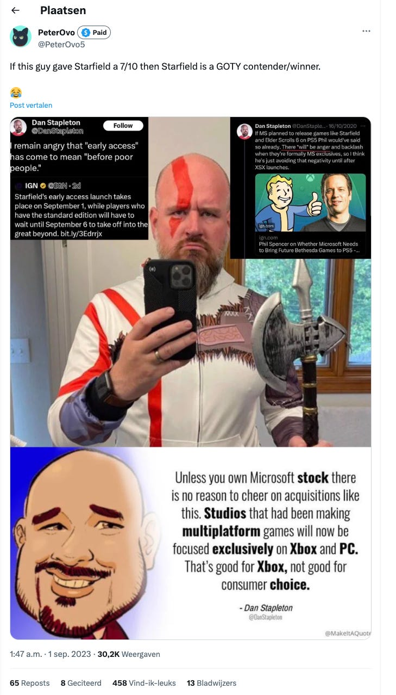

We hebben er in Nederland een succesverhaal bij. De kleine indiestudio Team Reptile uit Hilversum heeft een zodanig goed verkopende game, dat ze de afgelopen maand hoogstwaarschijnlijk miljoenen hebben verdiend.

Het staat haaks op wat ik [vorige week schreef over Ronimo Games](./de-laatste-dagen-van-ronimo-en-de), dat na lange tijd steggelen uiteindelijk failliet is gegaan. Succes is niet gegarandeerd voor Nederlandse gamemakers - maar wie geluk heeft, kan vanuit Nederland dus wel een miljoenenhit scoren.

Verder deze week: boze gamers onder recensies van Starfield en hoe Nederlands is Guerrilla nou echt? Deze editie van Gamepraat telt 1.074 woorden en neemt acht minuten van je tijd in beslag. Vind je dit tof? Abonneer hieronder om iedere week de nieuwsbrief te ontvangen!

[Subscribe](#/portal/signup)

## De miljoenen van Team Reptile

Afgelopen maand bracht Team Reptile zijn nieuwste game _Bomb Rush Cyberfunk_ uit. Een spirituele opvolger van _Jet Set Radio_ in alles behalve de naam - daar hebben ze immers de licentie niet voor in huis. Je skate door de stad New Amsterdam en spuit overal graffiti om territorium te claimen.

Exacte verkoopcijfers heeft de indiestudio niet gedeeld, maar uit vroege analyses blijkt dat de game het onwijs goed doet. [SteamDB](https://steamdb.info/app/1353230/charts/?ref=gamepraat.nl) schat dat de titel tussen de 120.000 en 330.000 keer is verkocht op het pc-gameplatform. Als je bedenkt dat de game 40 euro kost, is dat een ruwe omzet van tussen de 4,8 miljoen en 13,2 miljoen euro. En dat is alleen op pc: de game is ook te koop op Nintendo Switch, waarbij het lastiger is een analyse van verkoopcijfers te maken.

Dat is uiteraard niet het bedrag waar de gamestudio uiteindelijk mee naar huis zal gaan. Onderhoudskosten, licenties voor gebruikte software en andere zaken moeten nog van die omzet worden betaald. De investering om de game te maken moet wellicht ook nog worden terugverdiend.

Zelfs dan zal de game een bovengemiddeld groot succes zijn. Als je de meest conservatieve schatting van de omzet pakt en die halveert, dan heb je nog steeds 2,4 miljoen euro op de rekening. Bij een bedrijf dat hooguit zo'n tien man in dienst heeft. Het geeft Team Reptile de ruimte om waarschijnlijk nog jaren aan een volgende game te werken.

De vraag is nu hoe Team Reptile de komende jaren zal veranderen. Blijven ze een kleine indiestudio die tof ogende, artistieke games blijft bouwen? Of pakken ze het geld om te proberen iets groters van hun bedrijf te bouwen?

## Laten we stoppen met beweren dat Guerrilla niet 'echt' Nederlands is

Als het over Guerrilla Games gaat, is er altijd wel één iemand die beweert dat de studio niet 'echt' Nederlands is. Ze zijn in handen van het Japanse PlayStation en hebben zogenaamd alleen maar expats in dienst, waardoor ze hun Nederlandse roots kwijt zijn.

Om dat even te duiden heb ik even rondgekeken, waarbij ik het volgende vond:

-   De hoofdproducent van hun nieuwste game, _Forbidden West_, is Angie Smets, een Nederlander.
-   Diezelfde game heeft heeft zeven regisseurs (directors), waarvan vier uit Nederland komen.
-   Een voormalige medewerker [schrijft op Indeed](https://nl.indeed.com/cmp/Guerrilla-Games/reviews?ref=gamepraat.nl) dat ongeveer vijftig procent van het personeel expat is. De overige 50 procent is Nederlander.
-   Van de 416 medewerkers die Guerrilla op LinkedIn heeft vermeld als werkgever, wonen er 369 op dit moment in Nederland. Vooral in Amsterdam. Dat kunnen ook expats zijn, maar personeel werkt in elk geval voornamelijk vanuit het Amsterdamse kantoor.
-   In de top 15-lijst van meest afgeronde opleidingen van personeel staan 14 Nederlandse hogescholen. Hier zaten in elk geval 149 medewerkers. Gezien het enkel een top 15-lijst is, zullen er meer werknemers een Nederlandse studie hebben gedaan.

Kortom: het team dat leidinggeeft is grotendeels Nederlands, bij een bedrijf waar in elk geval de helft van het verdere personeel ook uit ons land komt. Dat is voor een gamebedrijf op de schaal van Guerrilla nog best veel, want ze moeten veel gespecialiseerd talent in huis halen. Dat is er niet altijd in Nederland.

Dat maakt ze wat mij betreft hartstikke Nederlands. Laten we dus ophouden het tegendeel te beweren.

## Gamers haten recensenten

Het is een trend die al langer in opmars is, maar bij _Starfield_ viel het nog eens extra op: veel gamers hebben een hekel aan recensenten. Reactievelden onder recensies zijn gevuld met wantrouwende gebruikers die het gegeven cijfer in twijfel trekken.

Afgelopen week was het Amerikaanse IGN aan de beurt, dat een 7 gaf aan _Starfield_. Volgens complottheorieën zat daar van alles achter: de schrijver zou een voorkeur hebben aan PlayStation-games en zich kritisch hebben uitgelaten over Bethesda - en daarom bevooroordeeld de recensie hebben geschreven. Al snel werden scores van anderstalige takken van IGN erbij gepakt om te bewijzen hoe fout de review was: IGN Japan en IGN Spanje gaven de game een 10, dus die 7 zou vast niet kloppen. Waarom de hoge scores zonder twijfel worden geaccepteerd en de iets lagere niet, wordt niet uitgelegd.

Ik zie dit vaak ook onder mijn eigen recensies gebeuren. Gamers die maandenlang uitkeken naar een grote nieuwe game, lijken te balen als ik vertel dat hij niet op ieder vlak perfect is. Eerdere teksten worden er bijgehaald om te bewijzen dat ik het medium niet snap en daarom geen mening mag verkondigen. Een kritische recensie wordt niet langer gezien als een waarschuwing voor potentiële kopers, maar als een aanval op een bedrijf waar gamers fan van zijn. Meningen van recensenten die afwijken van de norm worden afgeschilderd als verkeerd.

Zelden wordt stilgestaan bij de reden voor die afwijkende recensie. Een complot of persoonlijke vete zit er nooit achter: het is gewoon een afwijkende mening. Een kijk op een game die anders is dan die van anderen. Het is geen persoonlijke aanval op een ontwikkelaar, maar een analyse die je kunt lezen om een ander beeld te krijgen van de game dan je op andere sites leest.

Dat leek mij altijd voor de hand liggend, maar deze week werd het tegendeel weer eens bewezen.

## Verder interessant deze week

-   Bij Gamer [recenseerde ik](https://gamer.nl/reviews/games/playstation/sea-of-stars-is-een-geweldige-hommage/?ref=gamepraat.nl) [**Sea of Stars**](https://gamer.nl/reviews/games/playstation/sea-of-stars-is-een-geweldige-hommage/?ref=gamepraat.nl). Een mooie hommage aan oude jrpg's, waarbij het wat kneuterige schrijfwerk het enige echte kritiekpunt is.
-   Daarnaast schreef ik nog een [recensie van](https://www.bright.nl/nieuws/1150259/starfield-review-xbox-pc-gamepass-bethesda.html?ref=gamepraat.nl) [**Starfield**](https://www.bright.nl/nieuws/1150259/starfield-review-xbox-pc-gamepass-bethesda.html?ref=gamepraat.nl) [op Bright](https://www.bright.nl/nieuws/1150259/starfield-review-xbox-pc-gamepass-bethesda.html?ref=gamepraat.nl). Wees lief voor me!
-   **Jedi Survivor** heeft een update gekregen waardoor de game een stabiele 60 frames per seconde ondersteunt op consoles.
-   Koningin Máxima bezoekt volgende week Nederlandse gamebedrijven, waaronder Guerrilla Games.

Volgende week ben ik er weer, maar wellicht een paar dagen later. Ik zit dan namelijk voor een techklus in Cupertino. Tot snel!

[Subscribe now](#/portal/signup)
