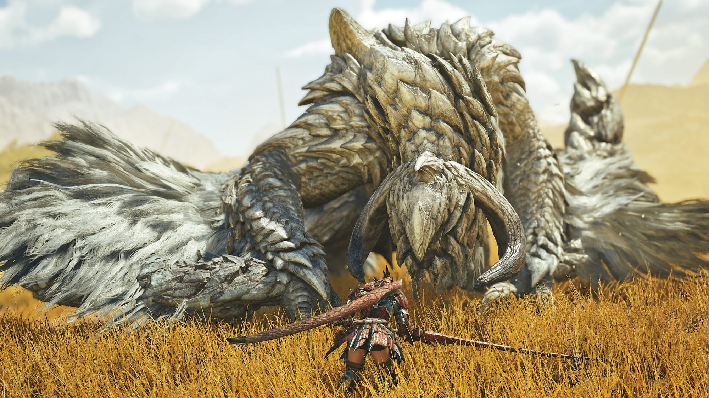

Met Monster Hunter World brak de ooit typische Japanse reeks door in het westen. Deze week verschijnt het nieuwste deel, dat vooral lessen van westerse games toepast om een nog breder publiek te bereiken.

Allereerst: hallo! Het is een tijdje geleden sinds de laatste editie van Gamepraat. Het was een wat gekke periode, maar komende tijd hoop ik weer frequent een nieuwsbrief te pennen over de belangrijkste hoogtepunten van de game-industrie. Ditmaal heb ik het vooral over _Monster Hunter Wilds_, wat misschien wel de belangrijkste game van de eerste helft van 2025 zal worden.

_Deze editie van Gamepraat telt 890 woorden en neemt vier minuten van je tijd in beslag. Vind je dit leuk om te lezen? Stuur de nieuwsbrief door naar een vriend! Dat helpt al ontzettend._

## Een doorbraak zo groot als Mario Odyssey

Monster Hunter was jarenlang een vooral Japanse franchise. Het land was geobsedeerd met handheldconsoles, waar het lokaal coöperatieve monsterjaagspel perfect voor bleek. Tieners speelden op hun 3DS of PSP in de kantines tijdens de pauze, volwassenen spraken af voor een biertje in de pub waar ze meteen een paar draken neerhaalden.

Met [_Monster Hunter World_](./monster-hunter-world-iceborne-review) wilde Capcom het westen bereiken. De anime-achtige stijl werd ingeruild voor een algemenere look en de franchise richtte zich op consoles in plaats van handhelds. Het bleek een gouden zet: op het moment van schrijven is World ruim [28 miljoen keer verkocht](https://www.capcom.co.jp/ir/english/data/html/explanation/2025/3rd/8.html?ref=gamepraat.nl). Dat is vergelijkbaar met bijvoorbeeld _Mario Odyssey_ (29 miljoen verscheepte units) dat een jaar eerder verscheen.

## Het oh zo toegankelijke Wilds

Afgelopen weken heb ik alvast _Monster Hunter Wilds_ mogen spelen, wat praktisch het vervolg van _World_ is. Capcom bracht in de tussentijd ook _Monster Hunter Rise_ uit, maar alleen _Wilds_ is net zo gericht op het westen en consolespelers als die vorige hitgame.

[Bekijk ingesloten media](https://www.youtube.com/embed/a_wNFT4j6qI?feature=oembed)

Vroegere _Monster Hunter_\-games waren simpel in opzet: je was in een dorp waar je missies accepteerde, waarna je naar een ander level werd getransporteerd om op monsters te jagen. Daarna ging je terug naar het dorp, werd beloond en maakte met die beloning nieuwe zwaarden, bogen en pantsers. Dat principe is bij _Wilds_ overhoop gegooid, in elk geval aan het begin van de game.

Wilds opent ditmaal met een meeslepend filmpje, waarna je als in _Uncharted_ door de wereld wordt geleid. Gaandeweg jaag je op gevaarlijke monsters die je tegenkomt en stuit je op plotwendingen. Dorpjes om je uitrusting te verbeteren kom je ook tegen, maar niet langer is één plek de primaire hub vanuit waar je steeds weer nieuwe missies accepteert.

## De les van Call of Duty

Het is een uitermate slimme zet om de laatste twijfelaars over de streep te trekken. _Monster Hunter_ is een franchise die voor buitenstaanders intimiderend kan overkomen: alles draait om het verslaan van gevaarlijke monsters en de compexe systemen die hier achter schuilen. Vorige games leerden je die principes met lappen tekst in onvriendelijke tutorials en door je met je kop tegen monsters te beuken tot je het doorhad. Zo niet in Wilds: deze game leidt je door een onderhoudend verhaaltje heen en leert je rustig hoe alles werkt.

Tenminste, in de beginuren van de game: traditiegetrouw bestaat _Monster Hunter_ uit zowel een low rank als een high rank. Dat laatste is een soort New Game+, een moeilijkere modus die draait om sterker worden en moeilijkere bazen verslaan. Wat dat betreft voelt _Wilds_ erg als _Call of Duty_: je speelt eerst door de verhaalcampagne heen, wat in dit geval de low rank-modus is. Ben je daar een beetje geland en nog steeds fanatiek? Dan kun je doorgaan naar de multiplayer om daar tientallen uren te besteden aan het halen van je prestige - of in _Monster Hunter's_ geval, het maken van de beste gear. Zo is er voor ieder wat wils.

## Verder interessant deze week

-   Afgelopen week verscheen ook **Avowed**, de nieuwste rpg van Microsoft-studio Obsidian. Het omschrijft zich het beste als Skyrim zonder alle fluff, net als The Outer Worlds eerder van dezelfde studio. Een rpg die niet meteen tientallen uren van je tijd opslokt is ook wel eens fijn.
-   Er is in Nederland **een massaclaim ingediend tegen PlayStation**. Volgens de aanklagende stichting betalen gamers teveel geld voor digitale aankopen in de PlayStation Store en hebben ze recht op compensatie. Zo'n zaak zien we eigenlijk nooit bij Nederlandse gamebedrijven. [Ik sprak erover](https://gamer.nl/achtergrond/achtergrond/achtergrond/nederlandse-massazaak-playstation-prijzen-is-nog-maar-het-begin/?ref=gamepraat.nl) met gamejurist René Otto en de aanklagers zelf. Die laatste zinspelen alvast naar een latere zaak tegen Nintendo.
-   Na massaontslagen en reorganisaties bij Microsofts gamedivisie was dit een zure voor getroffenen: de gamereus introduceert een AI die kan helpen games te bouwen **genaamd** [**Muse**](https://www.microsoft.com/en-us/research/blog/introducing-muse-our-first-generative-ai-model-designed-for-gameplay-ideation/?ref=gamepraat.nl).
-   Er is een game gebaseerd op de **Samurai Pizza Cats** in ontwikkeling bij het Nederlandse Blast Zero.

[Bekijk ingesloten media](https://www.youtube.com/embed/dgqr6mm6ZuI?feature=oembed)

-   Op 27 februari kondigt The Pokémon Company [hun nieuwe plannen aan](https://www.pokemon.com/us/pokemon-news/a-new-pokemon-presents-for-pokemon-day-on-february-27-2025?ref=gamepraat.nl) in een **Pokémon Presents**. Op gamegebied is dat interessant: na kritiek op Scarlet en Violet lijkt de ontwikkeling van het volgende grote deel langer de tijd te krijgen.
-   **De Nintendo Switch 2 zou in juni worden verkocht**, beweert een voormalige medewerker van de Amerikaanse retaildivisie van het bedrijf [in een podcast](https://www.youtube.com/watch?v=aTB3q4ib_0M&ab_channel=Kit%26Krysta&ref=gamepraat.nl).

Tot de volgende keer!
