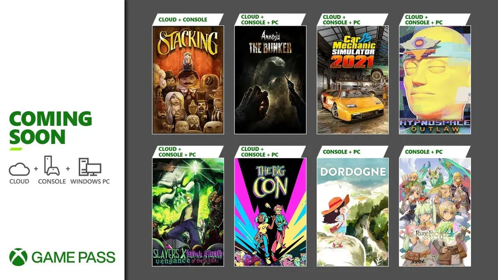
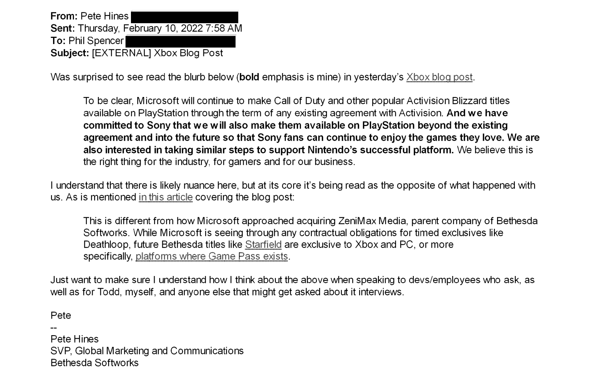
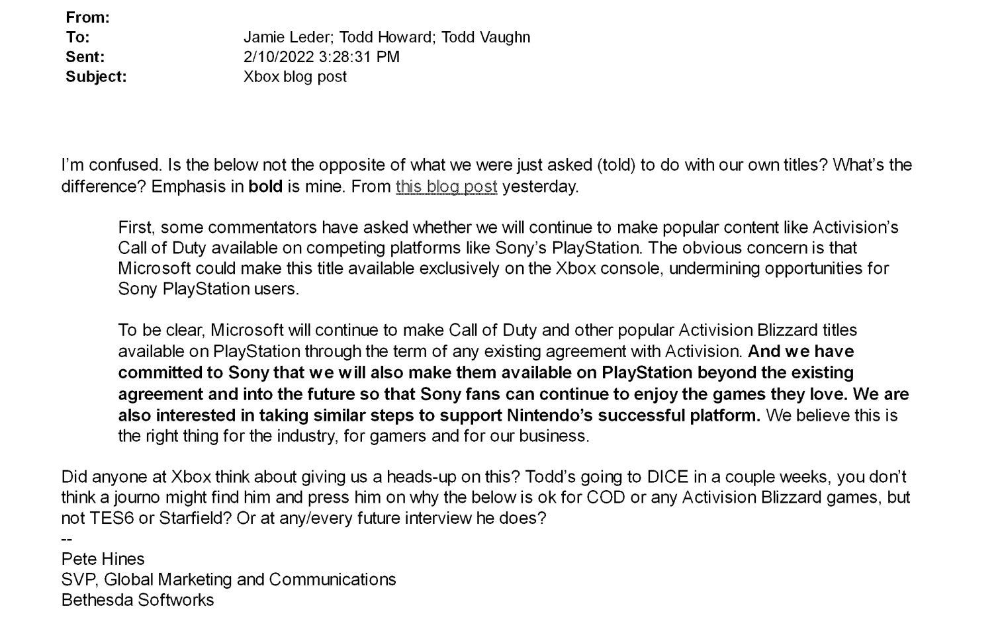
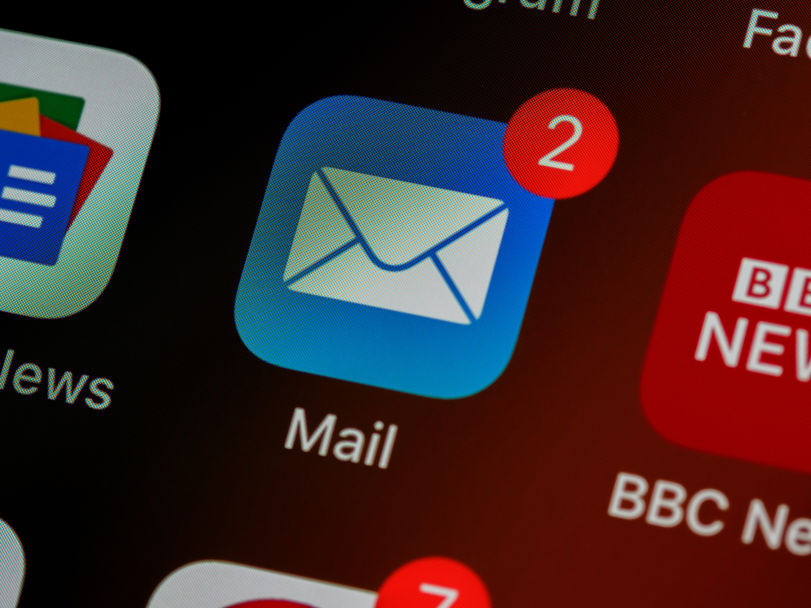

De rechtszaak tussen Microsoft en marktwaakhond FTC is in volle gang. Microsoft wil graag Activision-Blizzard overnemen, maar de FTC vreest dat de techreus daarmee een oneerlijk voordeel op de gamemarkt krijgt. Omdat de FTC alleen een overname mag blokkeren via de rechtbank, wordt de strijd daar nu voortgezet. De eerste rechtbankdagen zitten vol interessante opmerkingen van beide kanten - maar waar is toch die ene, mysterieuze e-mail van Phil Spencer waar iedereen het steeds over heeft?

Je zou denken dat een rechtszaak alleen spannend is tijdens zaken over moord en oplichting, maar de strijd tussen de gamegigant en waakhond zit vol smoking guns en onverwachte twists. Deze week zet ik drie dingen op rij die ik het meest fascinerend vond.

Deze editie van Gamepraat telt 1.078 woorden en neemt vijf minuten van je tijd in beslag. We trappen af!

[Subscribe](#/portal/signup)

## 1\. 'Uitgevers haten Game Pass'

Tijdens het verhoor van PlayStation-baas Jim Ryan ging het kort over Game Pass, de abonnementsdienst waarmee Microsoft Xbox-games aanbiedt. Een goede deal voor gamers, die voor een vast bedrag per maand tientallen games kunnen spelen. Ryan stelt dat de uitgevers van die games daar een hekel aan hebben.

> Ik heb met alle uitgevers gesproken. Ze zeggen unaniem Game Pass niet goed te vinden, omdat het waardeverminderend werkt.

De exacte deals tussen gamestudio's en Microsoft rond Game Pass zijn in nevelen gehuld, maar het is aannemelijk dat de verkoop van een losse download of schijf meer oplevert: een uitgever kan dan voor één game tot 80 euro vragen, terwijl ze in andere maanden bijvoorbeeld de speeltijd van een abonnee die tot 20 euro betaalt moeten delen.

Dat kan vooral voor grote uitgevers een probleem zijn. Zij bouwen jarenlang aan dure producties die zichzelf moeten terugverdienen, vaak in de eerste maanden dat het spel voor volle prijs in de winkels ligt. Ik kan me voorstellen dat bij die spellen Game Pass dan een risico is. Bij Game Pass kun je in theorie meer spelers verwachten, maar bij een dure titel waar miljoenen mensen op wachten heb je al een publiek. Die zijn dan veel meer waard dan die goedkope Game Pass-spelers.

### Denk aan de indies

Ryan heeft het specifiek over uitgevers. Daarmee houdt hij een tweede groep buiten beschouwing: kleinere indie-ontwikkelaars. Voor deze groep kan Game Pass juist veel waarde meebrengen. Deze spellen hoeven niet tientallen miljoenen euro's binnen te halen om uit de kosten te komen. Bovendien kan Game Pass helpen om games met minder groot marketingbudget onder de aandacht te krijgen van meer mensen.

Dat uitgevers Game Pass haten geloof ik wat dat betreft meteen. Maar of dat het meteen een slechte deal voor de gehele gamesector maakt? Daar heb ik mijn twijfels over.

## 2\. Het ongenoegen van Bethesda

De overname van Activision door Microsoft staat veel in het teken van exclusiviteit. PlayStation zei te vrezen voor een toekomst waarin _Call of Duty_ niet langer naar hun console komt, waarna Microsoft plechtig beloofde de spellen multiplatform te houden. _Call of Duty_ zou onder de vlag van Microsoft zelfs naar de Nintendo Switch komen, om de reeks nog platform-agnostischer te maken.

Die belofte zorgde voor spanning binnen de muren van Microsoft, blijkt nu uit interne e-mails. Bethesda-marketingbaas Pete Hines mailde kort na die gemaakte belofte met Xbox-topman Phil Spencer, om te vragen waarom dit bij _Call of Duty_ gebeurt en niet bij Bethesda-games. Immers: _Starfield_ werd na de overname van Bethesda wél een exclusieve Xbox-game.

Overigens ook grappig: onderstaande e-mail verstuurde Hines naar Spencer, om beleefd te vragen hoe het zat.

Maar de mail hieronder verzond diezelfde Hines naar zijn collega's bij Bethesda:

Daarin zegt hij min of meer hetzelfde, maar is hij zichtbaar gefrustreerder. Het is duidelijk dat hij geen blad voor de mond neemt bij zijn Bethesda-club, terwijl Spencer een baas is met wie hij beleefd moet communiceren:

Vooral deze zin zegt denk ik veel over hoe Microsoft met Bethesda is omgegaan. Hines schrijft:

> Ik ben verward. Is dit niet het omgekeerde van wat ons is gevraagd (verteld) om te doen?

Kennelijk is exclusiviteit alleen een probleem als je een marktleider opkoopt.

## 3\. De vermiste e-mail van Phil Spencer

Een belangrijk vraagstuk tijdens de grote FTC-zaak: hoe bezorgd was PlayStation nou echt? Eerder stelden vertegenwoordigers van het bedrijf dat een exclusieve _Call of Duty_ voor grote problemen kan zorgen en het marktaandeel van de PlayStation kan decimeren. Maar toen Microsoft de overname aangekondigde, had PlayStation-baas een interne e-mail verstuurd waarin hij zich helemaal geen zorgen leek te maken over die exclusiviteit. Hij verwacht dat de gamereeks sowieso voor de PlayStation blijft verschijnen.

Tijdens een ondervragingsronde zei Ryan zich pas echt zorgen te zijn gaan maken toen hij een e-mail ontving van Xbox-topman Phil Spencer. Hij zei daarvoor enkel gefrustreerd te zijn door de overname, maar zich er aan te hebben overgegeven. Maar na het lezen van die ene, cruciale mail gingen er bij Ryan 'alarmbellen rinkelen' en vreesde hij voor machtsmisbruik door de concurrent.

Wat er precies in die e-mail staat? Dat weten we niet. Vermoedelijk is het bericht als bewijs ingediend, maar daar kan hij volledig zijn gecensureerd voor de buitenwereld. Dat gebeurt bij bewijs dat onnodige problemen kan veroorzaken, bijvoorbeeld als er gevoelige bedrijfsgeheimen in staan.

Het is duidelijk dat Ryan liever niet teveel prijsgeeft aan de buitenwereld. Zijn getuigenis werd in videovorm getoond tijdens de rechtszaak, waarbij flinke delen werden weggeknipt. De video duurde 70 minuten, maar volgens de klok onderin beeld gingen er uren voorbij voordat de ondervraging voorbij was. Waarschijnlijk heeft een spervuur aan verzoeken door zijn advocatenteam ervoor gezorgd dat alleen de meest ongevoelige passages aan de buitenwereld worden getoond - en dat de rechter en advocaten zich intern mogen buigen over de rest.

## Kleine dingetjes

-   De PS6 en volgende Xbox worden rond 2028 verwacht, denkt Microsoft. Het zou betekenen dat de huidige generatie consoles nog vijf jaar duurt. Dat is langer dan de vorige generatie, maar dat is ook logisch: door de chipcrisis tijdens de coronapandemie zijn minder apparaten gemaakt en is de verkoop feitelijk vertraagd.
-   _Elder Scrolls 6_ is nog vijf jaar weg - daarmee zit er straks 17 jaar tussen _Skyrim_ en het nieuwe deel. Als je een kind kreeg bij het verschijnen van _Skyrim,_ staat die bij _Elder Scrolls 6_ bijna op het punt het huis uit te gaan.
-   Microsoft kocht Bethesda omdat PlayStation van _Starfield_ een exclusive probeerde te maken.

Volgende week ben ik er weer. Tot dan!

[Subscribe now](#/portal/signup)
