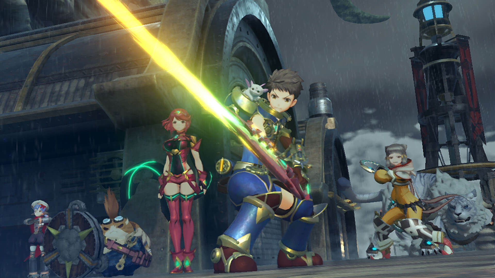
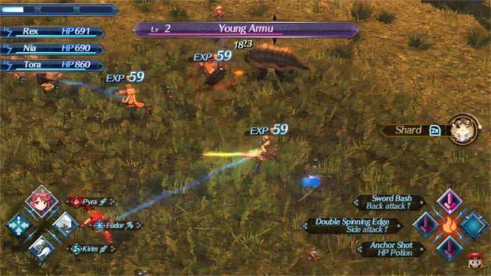
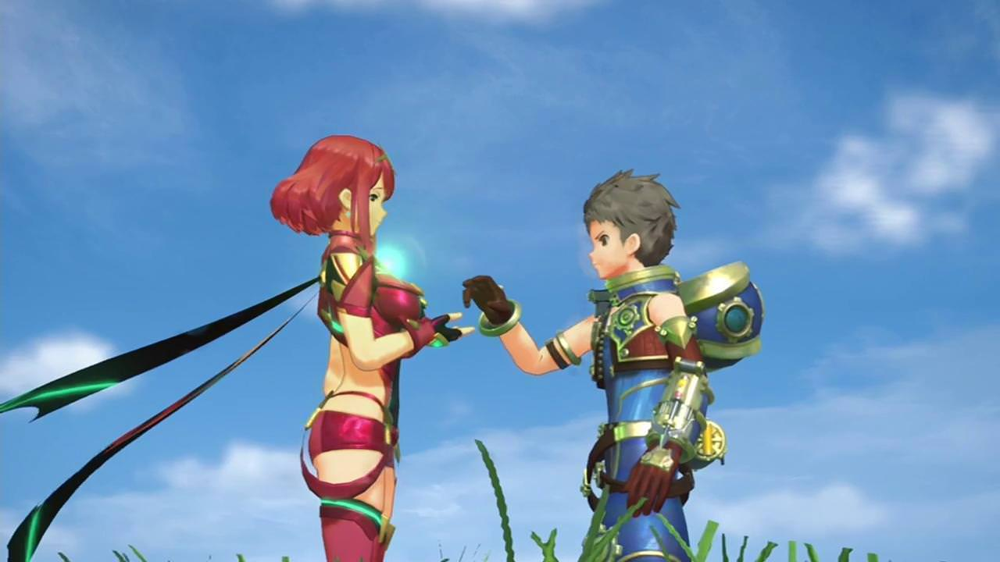
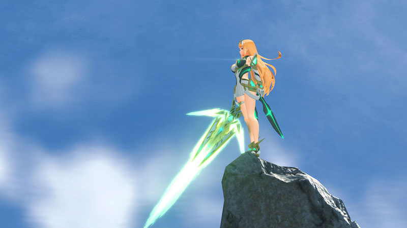
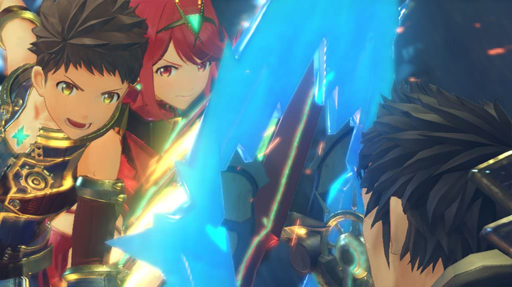

Onze eerdere reviews over de twee vorig Xenoblade-games openden ongeveer hetzelfde. We waren bedroefd dat de games op Nintendo-spelcomputers uitkwamen waar tegen die tijd niemand meer naar omkeek. Gelukkig is dat bij Xenoblade Chronicles 2 wel anders. De game komt in het eerste jaar van de Nintendo Switch uit, terwijl de nieuwe spelcomputer een onverwacht groot succes is. Dit ondergeschoven kindje van een serie krijgt daarom eindelijk zijn verdiende aandacht – maar weet het vervolg het niveau van het eerste deel te behalen?

> [!NOTE]
>
> Deze review verscheen eerder op [Insidegamer](https://inside.gamer.nl/130416-xenoblade-chronicles-2-review-blades-en-porno/?ref=gamepraat.nl).

Na bij Xenoblade Chronicles X een zijstapje te hebben gemaakt naar pure sciencefiction en meer nadruk op mmo-achtige systemen, keert Xenoblade Chronicles 2 terug naar een verhaalgedreven spelprincipe in een steampunk-achtige fantasiewereld. De wereld bestaat wederom uit een leegte gevuld met gigantische titanen waarop mensen en dieren leven.

Krijgers in de wereld van Xenoblade gebruiken zogeheten Blades. Deze onsterfelijke wezens binden hun ziel aan die van een mens, om zo hun kracht en wapens beschikbaar te stellen. En laat hoofdrolspeler Rex nou net een legendarische Blade genaamd de Aegis bemachtigen.

Bovenstaande dient als excuus voor Rex om zijn grote rpg-epos te starten. Naarmate hij van titaan naar titaan reist ontrafelt hij de mysteries achter de verdwijnende titanen, leert hij meer over zijn Blade en kent de mystieke spelwereld steeds minder geheimen voor hem. Het exacte verhaal zullen we niet spoilen.

## Goede anime

Wel kunnen we zeggen dat Xenoblade Chronicles 2 veel van de clichés van Japanse rollenspellen en animatieseries volgt, maar deze ook eer aan doet. Reken op last-minute reddingsacties van onverwachte personages en betogen over vriendschap. Maar een combinatie van goede animatie, schrijfwerk en muziek zorgt ervoor dat zelfs deze stereotypes kunnen leiden tot kippenvelmomentjes; Xenoblade voelt als een goede, moderne shounen-animeserie.

Dat is overigens niet te danken aan de lokalisatie. Hoewel de Britse cast stemacteurs de wereld net als bij voorgaande games van extra charme voorziet, is hier duidelijk sprake van haastwerk. In veel scènes sluiten lipbewegingen niet goed aan op wat er wordt gezegd – en vaak lijken stemacteurs op onnatuurlijke momenten te pauzeren in een poging het toch te laten passen. Daar komt bij dat de acteur van Rex in actiescènes gewoonweg verveeld lijkt. Jammer, want het stemwerk van de eerste Xenoblade is een hoogtepuntje. We vermoeden dat Nintendo daarom op 1 december ook de Japanse stemmen in gratis DLC beschikbaar stelt.

## Mmorpg

Xenoblade Chronicles 2 leidt je met een verhaal van tientallen uren door zijn spelwereld, maar verwacht niet een lineaire game. In zo’n beetje ieder gebied waar je terechtkomt zijn zijmissies en ander afleidingen die je aansporen om de wereld verder te verkennen. Het is erg makkelijk om een dag lang in Xenoblade te vertoeven zonder dat je ook maar iets in het verhaal doet, zonder je ooit te vervelen.

Wat dat betreft lijkt de game soms een beetje op een mmorpg, iets dat je ook terugziet in het gevechtssysteem. Je hebt tijdens gevechten drie aanvallen tot je beschikking, die na gebruik voor een paar seconden niet te selecteren zijn. Sommige van deze aanvallen doen extra schade vanaf de zij- of achterkant.

Dat gevechtssysteem klinkt simpel, maar het krijgt naarmate je speelt steeds meer diepgang. Na een uur of vijf wordt het mogelijk om combo’s uit te voeren, waarbij je teamgenoten aanvallen van elementen aan elkaar rijgen om meer schade te doen. Zit je vijftien uur in de game, dan hoor je hoe vijanden op hun rug geslagen kunnen worden met een speciale aanvalscombinatie.

Hoewel diepgaand, zijn veel van deze spelsystemen ook wat verwarrend. Daarbij doet de game ook vrij weinig om uit te leggen hoe het eigenlijk allemaal werkt en op elkaar aansluit. Er zijn verspreid door de spelwereld wel een paar ‘informanten’ die je korte tutorialteksten geven, maar deze leggen slechts flarden uit – en vragen bizar genoeg geld van je personage. Je zult sommige onderdelen simpelweg niet helemaal leren doorgronden.

Daar komt bij dat de game wel héél veel menu’s heeft. Je kunt bijvoorbeeld niet simpelweg de kaart bekijken van je huidige locatie, maar moet eerst door drie schermen klikken om je huidige gebied te zien. Bovendien hebben personages en Blades allemaal meerdere statistieken om te levellen, waardoor het bijhouden van je team soms wat als boekhouden aanvoelt.

## Porno

Gevechten worden gevarieerder naarmate je meer Blades bemachtigt. Ieder personage in je team kan er drie hebben, waartussen geschakeld kan worden met drie zijden op de richtingstoets van de controller. Zo kun je een tank-Blade gebruiken om klappen te incasseren, om later te schakelen naar een genezer om jezelf weer op te lappen.

Die Blades krijg je via een systeem dat vooral doet denken aan mobiele games. Naarmate je speelt bemachtig je kristallen, die je kunt openen om een willekeurige Blade aan je arsenaal toe te voegen. Dat voelt wat als het gacha-systeem van games zoals Fire Emblem Heroes en lootboxen in andere recente games, met één wezenlijk verschil: je kunt niet echt geld betalen voor meer kristallen.

In de meeste gevallen zul je variaties op een viertal Blades oproepen, met andere wapens en elementen. Met een beetje geluk bemachtig je echter een zeldzame Blade met een uniek ontwerp en bijzondere vaardigheden. Helaas is het ontwerp van het merendeel van deze Blades echter gênant te noemen.

Monolith heeft de zeldzame Blades laten ontwerpen door notabele Japanse tekenaars. Leuk nieuws voor fans van anime en manga, maar er is duidelijk een thema bij al deze personages. Nagenoeg iedere artiest heeft een vrouw met amper kleding en een pornolijf ontworpen. De omhooggetrokken g-string van Rex zijn eerste Blade is al wat ongemakkelijk om te zien, maar naarmate de game vordert heb je een leger aan G-cups achter je aan lopen.

Die designs voelen respectloos naar de spelers. Monolith lijkt ons te zien als een stelletje geile pubers die niks liever willen dan een stel polygonentieten. Dat terwijl eerdere games wél een diepe wereld laten zien zonder terug te vallen op lompe seks.

## Levend

De Blade-pornosterren voelen ook totaal niet op hun plaats in de wereld van Xenoblade, die juist heel genuanceerd en levendig aanvoelt. Uiteraard heb je de eerder genoemde zijmissies, die je met simpele opdrachten alle uithoeken van de wereld laten opzoeken. Maar de game weet spelers ook goed aan te sporen om buiten die queesten de bewoners van de Titanen te leren kennen.

Ieder gebied in het spel heeft een sterwaardering. Hoe hoger het aantal sterren, hoe meer je in de steden van een titaan kunt kopen. Je kunt die score verhogen door missies te doen, maar ook door met personages met een ster boven het hoofd te praten. Soms hebben die personages een leuke upgrade of tip voor een baasgevecht, maar vaak dienen die optionele gesprekken maar voor één ding: het uitbouwen van de wereld. Je hoort geruchten, leert kleine personages kennen en ziet een digitale wereld langzaam tot leven komen.

Zit je een beetje diep in de vele dialogen en optionele uithoekjes van de wereld, dan lijkt Xenoblade zijn vele menu’s te ontstijgen. Je begint je te bekommeren om het weeshuis om de hoek of de taveerne op het plein. Op dat moment weet je dat Monolith een echte wereld heeft gemaakt.
