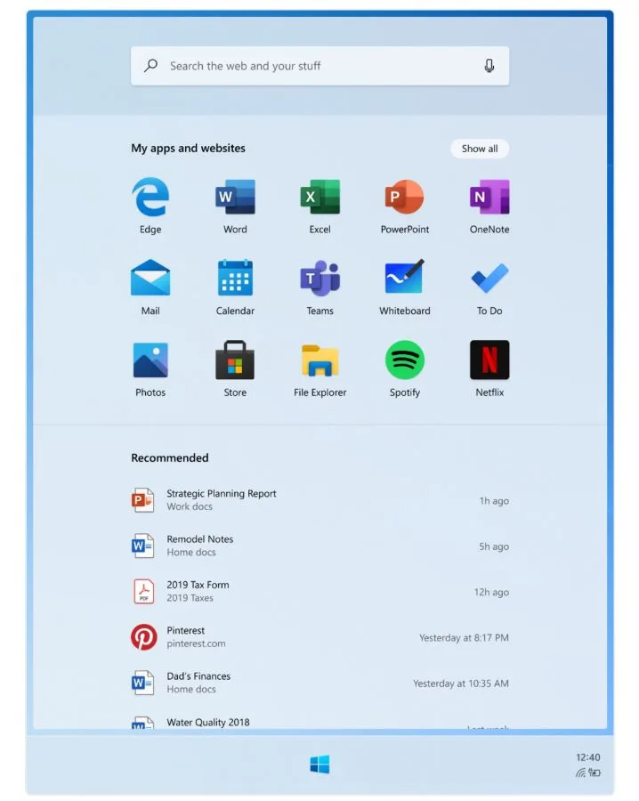
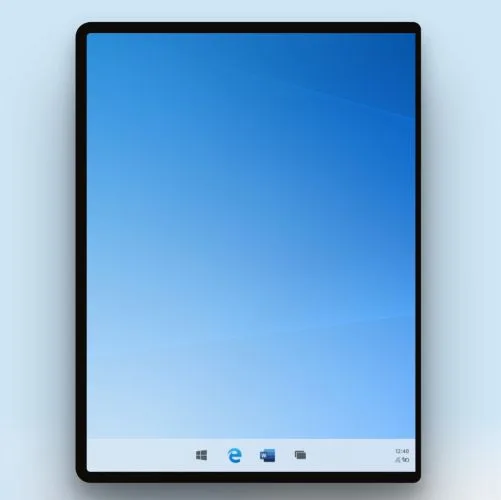
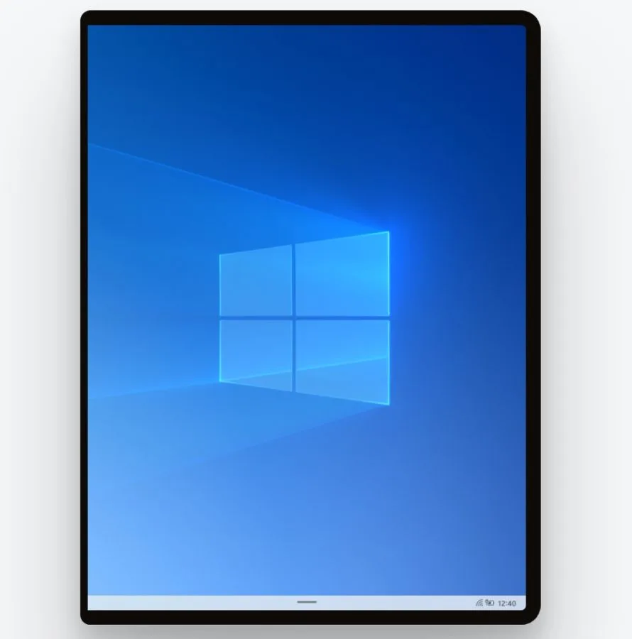

**Twee schermen**

> [!NOTE]
> Dit artikel verscheen eerder op [Bright](https://www.bright.nl/nieuws/1124212/beelden-van-windows-10x-op-surface-neo-gelekt.html).

De beelden werden ontdekt door Twitter-gebruiker [WalkingCat](https://twitter.com/h0x0d/status/1187772076867932163), op een Microsoft-site die per ongeluk al online stond. Inmiddels is de pagina offline gehaald, maar niet voordat we de beelden konden downloaden.

Omdat de [Surface Neo](https://www.bright.nl/nieuws/artikel/4871571/eerste-indruk-microsoft-gaat-dual-screen) twee schermen heeft, moest de interface van Windows ook in tweeën worden gesplitst. Windows 10X kiest hierdoor voor een compleet andere aanpak dan in het traditionele Windows 10.

Dat is onder andere te zien in het menu van de startknop, die het volledige beeld van één van de schermen opvult. Hier staan de apps en bezochte sites, met daaronder bestanden die je wellicht wil openen.

Het bureaublad is ook ingericht voor een verticaler scherm, met onderin plek voor de knoppen van de menubalk. Die staan nu gecentreerd in beeld.

Bij een vergrendelde Surface Neo is onderin een streep te zien. Vermoedelijk kun je die omhoog vegen om het apparaat te ontgrendelen.

Microsoft brengt naast de Surface Neo ook een telefoon met dubbel scherm uit, genaamd de [Surface Duo](https://www.bright.nl/nieuws/artikel/4871571/eerste-indruk-microsoft-gaat-dual-screen). Die zal echter niet op Windows 10X draaien, maar op een aangepaste versie van Android.

We moeten nog even wachten tot de Surface Neo en Windows 10X uit worden gebracht: beide staan gepland voor het einde van 2020.

[Bekijk ingesloten media](https://www.youtube.com/embed/wLsionOOybQ?autoplay=1&modestbranding=1)

## Eerste indruk: de Surface Neo en Duo

**[Volg Bright op YouTube](https://bit.ly/brighttv) voor meer tech-video's**
