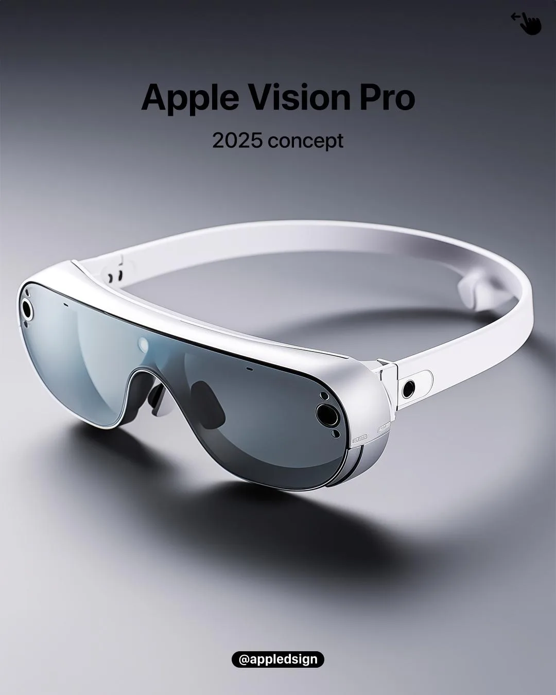
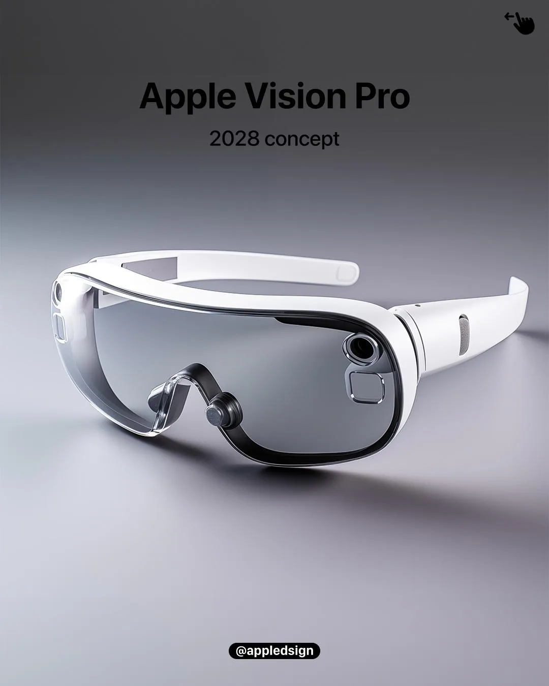
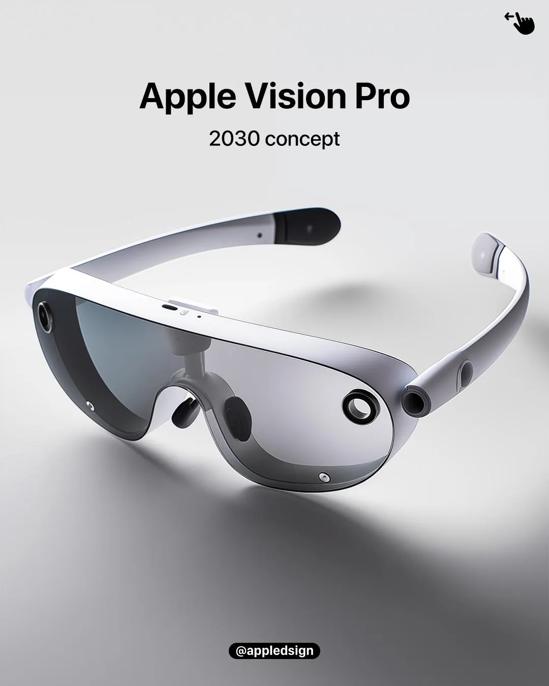
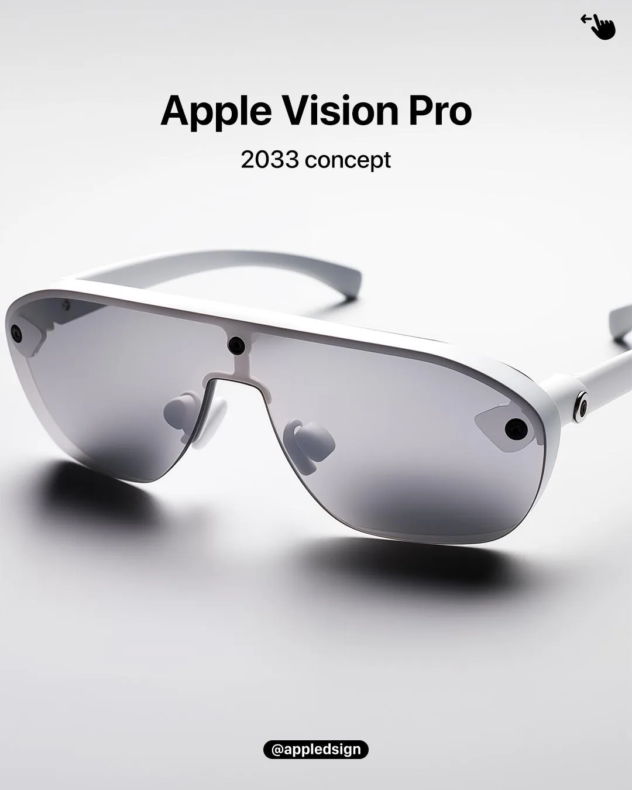
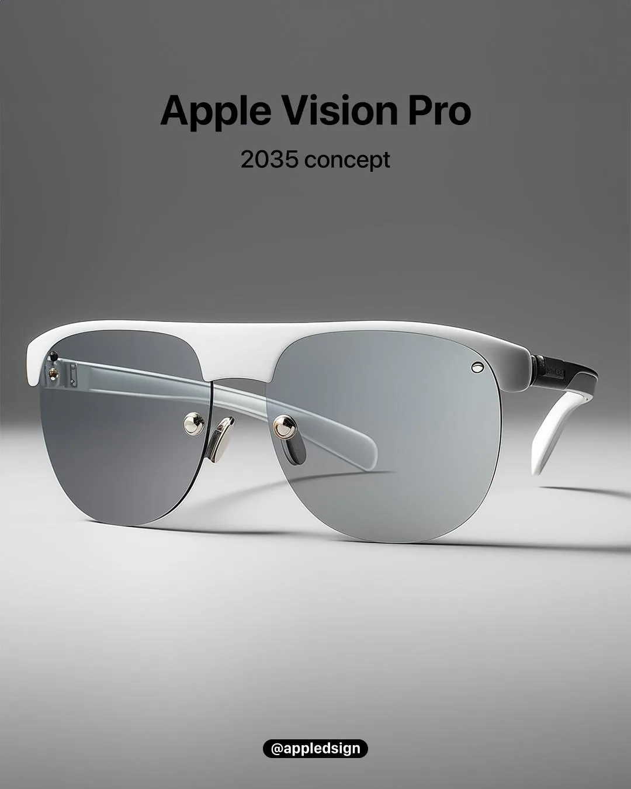

Apple heeft zelf nog niks verklapt over een Apple [Vision Pro](https://www.bright.nl/onderwerpen/apple%20vision%20pro) 2 of andere headsets, maar dat hield grafisch ontwerper en bekende Instagrammer [Niels van Straaten](https://www.instagram.com/appledsign/) niet tegen om er op los te fantaseren.

> [!NOTE]
> Dit artikel verscheen eerder op [Bright](https://www.bright.nl/nieuws/1184672/blikvanger-zo-kan-de-apple-vision-pro-van-de-toekomst-er-uitzien.html).

Met zijn concepten blikt hij steeds een paar jaar vooruit. Te beginnen met 2025: hij voorziet dat Apple dan een significant kleinere bril introduceert. Hij is alsnog dikker dan een gewone bril op sterkte, maar het ontwerp ziet er al veel comfortabeler uit.

Drie jaar later zou de Apple [Vision Pro](https://www.bright.nl/onderwerpen/apple%20vision%20pro) 3 een nog gangbaarder ontwerp krijgen. Met grotere glazen om alles op te laten zien, maar een ontwerp licht genoeg om met gewone brillenpoten op je neus te blijven. Het jaar daarop zou de bril een herontwerp krijgen met een strakkere aluminium vormgeving.

De jaren daarop zijn we al bijna bij het gedroomde ontwerp: de bril in 2033 heeft nog een iets dikker frame bovenop, maar het concept voor 2035 lijkt als twee druppels op een moderne bril. Een ontwerp waar je zonder gedoe een hele dag mee rondloopt - mits de batterij het tegen die tijd toelaat.

Het is hopen dat Apple ook echt zo snel stappen kan zetten. Het bedrijf liet met de iPad 2 al eens zien dat ze een apparaat in korte tijd veel dunner kunnen maken, maar bij andere gadgets gaat het minder hard. Ingewijden denken in elk geval dat Apple ergens in 2026 al een gewone, compacte bril met simpelere functies uit de doeken zal doen.
