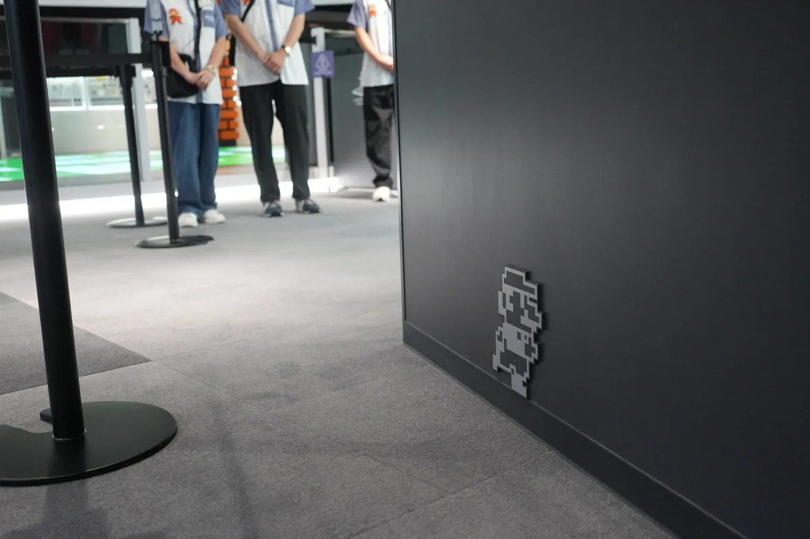
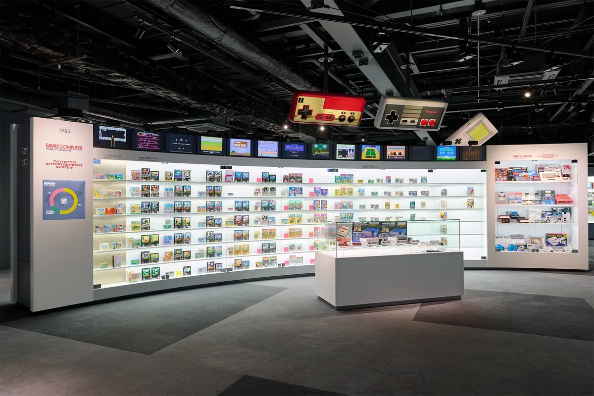
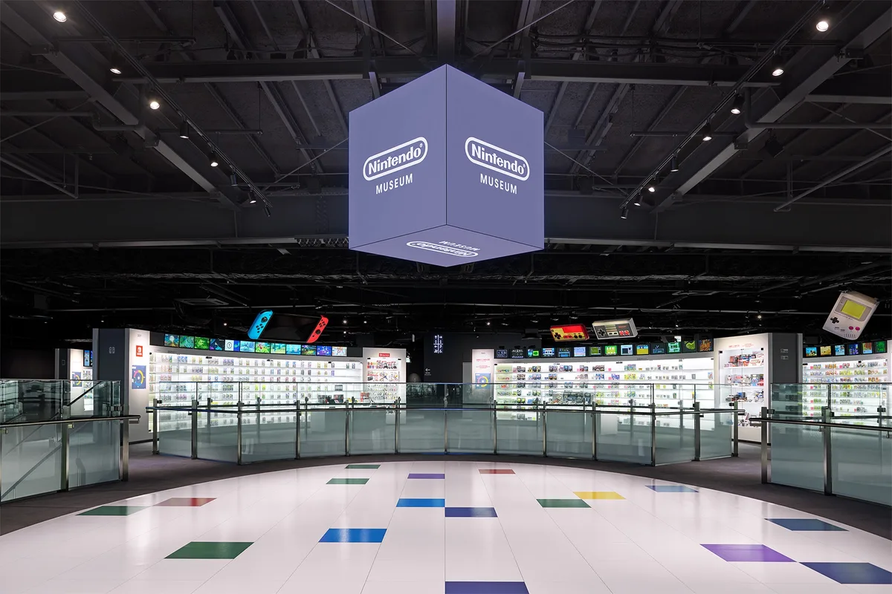
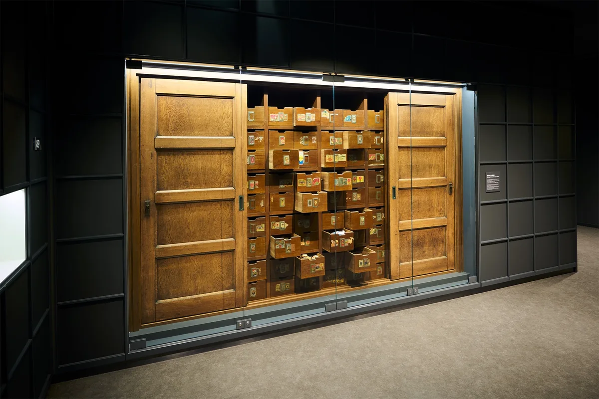
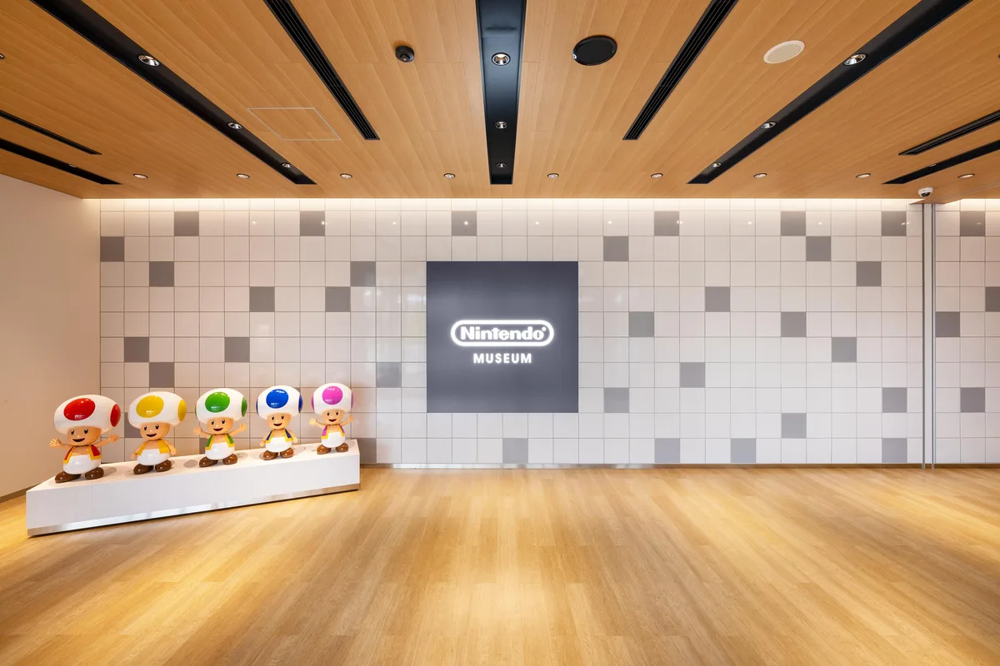

Zonder Nintendo hadden we nu geen games meer. Zo'n veertig jaar geleden was de bubbel gebarsten en werden [games](https://www.bright.nl/onderwerpen/games) ineens nog maar amper verkocht, totdat ineens het Japanse Nintendo zijn eerste specomputer introduceerde. De Nintendo [Entertainment](https://www.bright.nl/onderwerpen/entertainment) System bracht de gamesmarkt eigenhandig weer tot leven, waarna Nintendo decennialang de drijvende kracht achter de gehele industrie bleef.

> [!NOTE]
> Dit artikel verscheen eerder op [Bright](https://www.bright.nl/nieuws/1227967/bright-bezocht-het-nieuwe-nintendo-museum-vooral-tof-voor-de-grootste-fans.html).

Dat alleen al is goede reden voor een museum. Het is een plek waar Nintendo zijn rijke geschiedenis kan etaleren, die veel verder reikt dan de jaren 80: al in 1889 begon het bedrijf met de verkoop van onder meer bordspellen, speelkaarten en zelfs kinderwagens.

Deze geschiedenis staat uitgestald op de bovenverdieping van het museum, vlakbij het station van een oud industrieterrein in Nintendo's geboortestad Kioto. Op 2 oktober gaan de deuren open voor het grote publiek, ik mocht als eerste Nederlander alvast naar binnen voor [Bright](https://www.bright.nl/personen/bright).

Het pand is gebouwd op de oude plek van hun speelkaartenfabriek en bestaat nu uit twee verdiepingen. Het zit vol met kleine easter eggs: de kluisjes bij de entree zijn grote cartridges, de paraplu-houders zijn met Game Boys gemarkeerd. De eenzame drankautomaat nabij de entree is verkleed als Kirby, waardoor hij sprekend lijkt op een transformatie uit Kirby's meest recente game. Op hoekjes van het pand staan minuscuul kleine Mariootjes, terwijl door het hele pand kleine Pikmin-wezentjes zijn verstopt.

## Zelfs de flops uitgestald

Op de bovenste verdieping zit het traditionele museum: grote, gebogen kasten zijn gewijd aan iedere oude spelcomputer van het bedrijf, met doosjes van hun eerste uitgaven en oude, opengemaakte hardware. Zowel de succesverhalen als de flops komen aan bod: zo staat ook de Virtual Boy, Nintendo's VR-bril die na een jaar van de markt werd gehaald na hoofdpijn- en misselijkheidsklachten van klanten, trots uitgestald in zijn eigen hoekje. Wie goed zoekt, vindt in een klein hoekje van de museumruimte zelfs de geflopte Mario-film uit 1993.

Twee dingen vallen vooral op bij een rondje over de bovenste verdieping. Ten eerste: de collectie van de NES, Nintendo's eerste echt grote succesverhaal, is waarschijnlijk recent nog door het bedrijf bijeen geraapt. Sommige doosjes zijn gekreukt en gescheurd, of ontbreken volledig. Het schetst eigenlijk een mooi beeld van het Nintendo uit de jaren '80: ook zij konden toen niet voorspellen dat ze zo groot zouden worden en hebben dus geen eigen collectie aangelegd. Die hebben ze al die jaren later bij verzamelaars zelf weer bij elkaar moeten kopen.

## Vooral je eigen herinneringen

Het tweede dat opvalt is het gebrek aan uitleg in het museum. Er hangen hier en daar wel oude tijdschrift-pagina's om het tijdperk van een console mooi te illustreren, maar nergens zijn begeleidende tekstpanelen opgehangen om extra duiding te geven. Volgens Nintendo moet vooral 'jouw eigen ervaring centraal staan' als je het museum bezoekt. Voor een gamer werkt dat uitstekend: wie een beetje Nintendo-kennis heeft, krijgt meteen warme gevoelens bij het zien van hun eerste Game Boy of het doosje van die ene Pokémon-game die je als kind kocht.

Daar staat tegenover dat het museum wat verwarrend kan zijn voor meereizende niet-gamers. Heb je geen kennis van de materie, dan zie je een grote kamer vol speldoosjes en oude gameconsoles, zonder uitleg waarom ze bijzonder waren. Je moet er kennelijk bij zijn geweest.

## Oeroude prototypes

Ergens voelt het alsof je een retro-gamewinkel in Japan bezoekt, maar dan met een volledigere collectie. Het betekent dat je geen onwijs grote verrassingen tegen het lijf loopt, wat voor de meest fanatieke fan best jammer is: zelf had ik gehoopt op bijvoorbeeld een paar videomuren met interviews met Nintendo's oudste designteam, met inzichten die we nooit eerder ergens hebben gehoord.

De uitzondering op de regel is een klein hoekje met daarin een paar gave prototypes. Daar ligt bijvoorbeeld een experimentele Nintendo DS, met twee schermen naast elkaar in plaats van bovenop elkaar geplaatst. En een vroege versie van de GameCube, nog gemarkeerd met de codenaam 'Dolphin', waarvan je het handvat iets wegheeft van het hendel van een oude koelbox. De prototypehoek was absoluut mijn favoriete hoekje van het museum, die ze wat mij betreft nog een stuk groter en uitgebreider kunnen maken. Om te zien wat we bedoelen moet je overigens zelf naar Japan, want foto's mochten we daar zelf niet maken.

## Geschiedenis om te voelen

De buitenste wand van de bovenruimte is gewijd aan Nintendo's oudste geschiedenis, beginnend met 1889. Het is een leuk kijkje naar de oudste dagen van het bedrijf, waarbij je bijvoorbeeld leert hoe ze ooit groot zijn geworden met de verkoop van bordspellen voor [Disney](https://www.bright.nl/onderwerpen/disney). Je voelt dat ze in het begin echt nog zoekende waren en langzamerhand meer gadgets en de voorgangers van games begonnen te maken.

Het illustreert ook wat de sterkste kant van het museum is: het is een plek waar je vooral de geschiedenis kunt zien. Er staan wellicht geen geschiedenistekstjes naast de kasten, maar ergens voelt het wel bijzonder om voor de originele oude archiefkast van het eerste Nintendo-kantoor te staan. Je voelt het belang van alles dat er ligt, ongeacht of het je wordt uitgelegd.

## Kleine spelletjes, grote controllers

Op de begane grond van het pand vind je de spelruimte waar je wat interactieve activiteiten vindt. Met de oude Zapper-pistolen voor de NES en Super NES kun je schieten op een gigantisch groot scherm, in een kleine Japanse huiskamer mag je honkballen met een ballenwerper die het bedrijf in de jaren '70 maakte. Ook kun je met een gigantisch grote gamecontroller oude klassiekers spelen met twee spelers. Allemaal geinige spelletjes die een idee geven van wat oude Nintendo-ideeën, al was geen van deze activiteiten wereldschokkend.

Het verdere museum is, nou ja, een museum. Aan het einde van de tour kom je uit in de museumwinkel, waar je exclusieve merchandise voor de locatie zoals t-shirts, mokken en sleutelhangers kunt vinden. Hoogtepunt zijn de shirts gewijd aan specifieke gameconsoles. Die waren tijdens ons bezoek nog niet verkrijgbaar, maar Nintendo verzekert dat ze bij de officiële opening op 2 oktober in de schappen liggen. Het museumrestaurant is op zijn beurt tam in zijn uitvoering: je koopt er hamburgers en ijs. Het Nintendo-stempel is hier wat minder voelbaar, met enkel een groot glas-in-lood-portret van Link en Zelda in het midden van de ruimte. Een plekje van rust tussen alle Nintendo-prikkels door.

## Leuk voor erbij

Laat ik direct zijn: je vindt in dit museum geen wereldschokkende kijk in Nintendo's geschiedenis. Het is vooral een tour door je eigen nostalgie. Waarschijnlijk zul je voor alleen dit museum niet een vakantie naar Japan boeken, maar voor een bredere trip is het wel een bezoekje waard. De prijs is er namelijk ook naar: voor 20 euro ben je al binnen en ga je met een voldoende voldaan gevoel naar huis.

Het museum opent op 2 oktober en verwacht per dag tussen de 1.500 en 2.000 bezoekers. Dat wordt vast een schok voor de huidige bezoekers van het oude industrieterrein, dat komende jaren vast transformeert in een drukke toeristenlocatie.

Meer [nieuws over Nintendo](https://www.bright.nl/organisaties/nintendo) en mis niets met onze [Bright-app](https://www.bright.nl/pagina/app).
