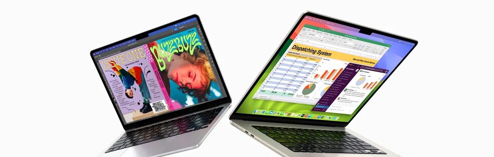

[Volgens Apple](https://www.apple.com/nl/macbook-air/) is de M3-chip in de Air tot 60 procent sneller dan de M1-chip in de MacBook Air uit 2020. De accu moet het 18 uur lang volhouden bij gemiddeld gebruik en de wifi is tweemaal sneller dan in de vorige MacBook Air.

> [!NOTE]
> Dit artikel verscheen eerder op [Bright](https://www.bright.nl/nieuws/1184667/daar-is-ie-dan-de-nieuwe-macbook-air-met-m3-processor.html).

De nieuwe MacBook Air is te koop met een scherm van 13 inch of 15 inch. Deze formaten heeft de eerdere MacBook Air met M2-chip ook, maar toen werd het 15 inch-model pas later onthuld. Ditmaal zijn beide groottes tegelijkertijd te koop.

De laptop is vanaf vandaag te bestellen. Koop je hem snel genoeg, dan krijg je hem al op vrijdag 8 maart binnen. De 13 inch-laptop gaat voor 1.299 euro over de toonbank, terwijl het grotere 15 inch-model je minstens 1.599 kost. Vind je een iets oudere laptop ook oké, dan kun je vanaf vandaag ook de 13 inch MacBook Air met M2-chip kopen voor minder: deze kost voortaan 1.199 euro.

## Waar blijven de iPads?

Recent lekte al naar buiten dat Apple de nieuwe MacBook Air via een persbericht wereldkundig zou worden gemaakt. Volgens diezelfde bronnen zou er ook twee nieuwe iPads op de planning staan, maar daar heeft het bedrijf op het moment van schrijven nog niks over verklapt.
