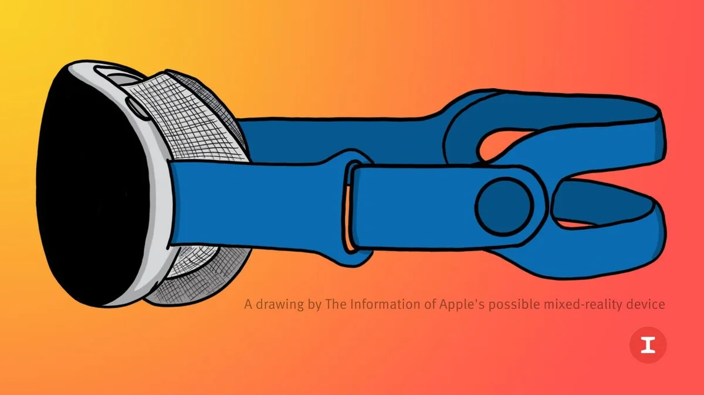

Techreus Apple zou in het diepste geheim werken aan een slimme bril die zowel virtual reality als augmented reality moet bieden. We zetten alle gelekte informatie over de gadget op een rij.

> [!NOTE]
> Dit artikel verscheen eerder op [AD](https://www.ad.nl/tech/de-apple-glasses-komen-eraan-dit-weten-we-over-apples-slimme-bril~a29aec1ac/).

,,Ik ben heel enthousiast over augmented reality”, zei Apple-directeur Tim Cook vorig jaar nog in een [interview](https://www.youtube.com/watch?v=UU6MtPwT_5c) met youtuber iJustine. ,,Ik denk dat het een van die technologieën is waarbij we achteraf zullen afvragen hoe we ooit zonder konden leven.”

Al sinds 2016 is Cook enthousiast over augmented reality (AR), een technologie waarbij je virtuele objecten bovenop de echte wereld kan laten zien. iPhones en iPads kunnen hier al gebruik van maken via de camera-app, maar een slimme bril moet AR pas echt onmisbaar maken. Dan zie je bij het gebruik van een navigatie-app bijvoorbeeld pijlen op de straat, of je kijkt naar een hologram van iemand met wie je videobelt.

Steeds meer techbedrijven werken aan zulke slimme brillen. Facebook-moederbedrijf Meta kocht jaren geleden het bedrijf Oculus, gespecialiseerd in virtual reality (VR), dat nu ook aan een AR-headset werkt. Tegelijkertijd hebben Microsoft, Google en Magic Leap AR-brillen speciaal voor de zakelijke markt, die bijvoorbeeld 3D-maquettes op een tafel kunnen projecteren.

De afgelopen maanden duiken ook steeds meer geruchten op over Apples eigen bril. Officieel heeft de techreus nog niks aangekondigd, maar gezien het enthousiasme van Cook lijkt de komst hiervan een publiek geheim. Het lijkt een kwestie van tijd tot die Apple-bril komt.

## Apple-bril werkt met virtual reality én augmented reality

Techgiganten werken op het moment aan twee type brillen. Je hebt de AR-headsets, die virtuele objecten bovenop de echte wereld tonen, maar daarnaast ook virtualrealitybrillen die jou volledig afsluiten van de wereld. Hierin speel je vervolgens een game die je volledige blikveld inneemt.

Volgens ingewijden zal Apples bril met zowel VR als AR werken. Vermoedelijk bedekt de bril je ogen, maar kunnen ingebouwde camera’s vervolgens de echte wereld laten zien. Daar gebruikt Apple volgens de doorgaans goed geïnformeerde analist Ming-chi Kuo maar liefst vijftien ingebouwde camera’s voor.

## Ziet er uit als een grote Apple Watch

Er zijn nog geen beelden uit Apples fabrieken gelekt, maar bronnen van techsite [_The Information_](https://www.theinformation.com/articles/apples-ar-vr-headset-will-need-connection-to-other-device-such-as-iphone) denken al te weten hoe de headset er uit zal zien. Het is in feite een grote Apple Watch: de voorzijde is een relatief compact, gebogen aluminium blok met twee schermen aan de binnenzijde, dat aan je hoofd blijft hangen met een band die lijkt op een Apple Watch-sportbandje.

Tegen je gezicht zit een stoffen kussen gedrukt dat lijkt op de kussens op Apples AirPods Max-koptelefoon.

Volgens een lek ziet de Apple-bril er zo uit. © The Information

## Krachtige chip en schermen van hoge resolutie

Bronnen denken dat de Apple-bril een krachtige chip krijgt, waarmee hij wellicht zelfstandig games en apps kan draaien. Dat zou hem vergelijkbaar maken met de Oculus Quest 2-bril van Meta, die ook zonder tussenkomst van een smartphone werkt. Wellicht dat Apple die chip zelf ontwerpt: dat doet het bedrijf inmiddels bij al zijn producten.

De schermen krijgen een hoge resolutie, maar het is onduidelijk hoe hoog die precies komt te liggen. Op het moment ligt de hoogste resolutie bij virtualrealitybrillen op ruim meer dan 2000 bij 2000 pixels per oog.

## Kan wel tot 2000 dollar kosten

De Apple-bril wordt geen goedkope gadget: de techreus zou niet rekenen op een hit zoals bij de iPhone, maar wil een duurder niche-product maken om alvast in de toekomst van VR en AR te investeren.

Analist Ming-chi Kuo rekent op een prijskaartje van rond de duizend dollar, wat in Nederland wel eens kan neerkomen op rond de duizend euro. Dat is flink duurder dan huidige marktleider Meta, die zijn Quest 2-headset verkoopt voor 350 euro.

De prijs zou zelfs nog hoger kunnen liggen: volgens _Bloomberg_ worden brillen getest die voor zelfs 2000 euro in de winkels kunnen liggen. Het is nog de vraag waar Apple uiteindelijk precies voor zal kiezen.

## Verschijnt hopelijk in 2022, maar wellicht pas later

Apple zou mikken op een onthulling van zijn headset in 2022. Tijdens de grote ontwikkelaarsconferentie van het bedrijf in juni zou hij voor het eerst worden getoond, zodat appmakers alvast hun software voor de gadget kunnen maken. Hij zou dan iets later in het jaar worden verkocht.

[_Bloomberg_](https://www.bloomberg.com/news/articles/2022-01-14/apple-s-hotly-anticipated-headset-risks-being-delayed-until-2023) ving echter op dat Apple deze datum wellicht niet gaat halen. De onthulling kan wel eens worden uitgesteld naar eind 2022 of zelfs nog later, waarna de verkoop op zijn vroegst in 2023 begint.
