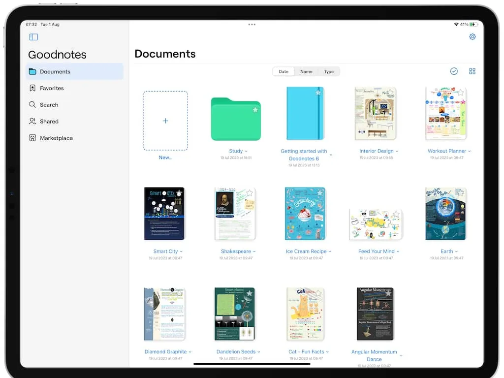
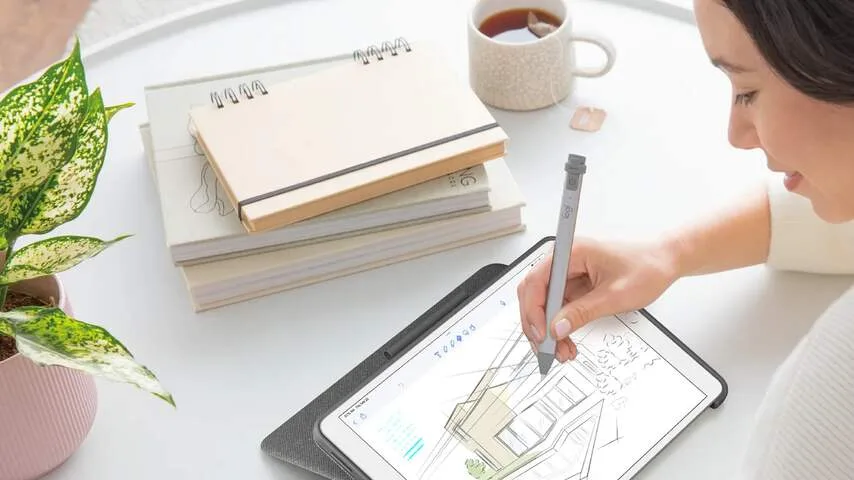
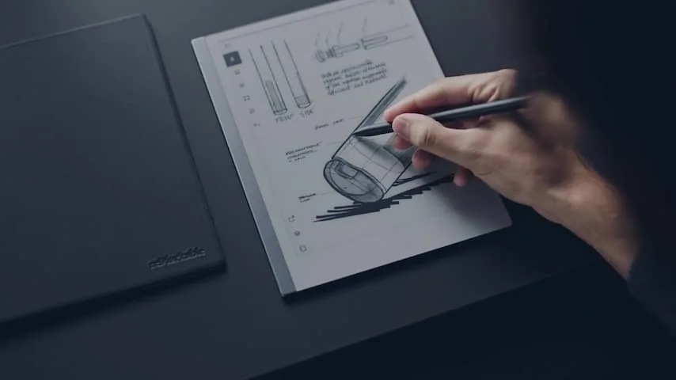

Er zijn veel apps voor handgeschreven notities. Sommige daarvan worden standaard met je tablet meegeleverd. Apples Notities-app laat je bijvoorbeeld met de hand schrijven en bevat genoeg functies voor de basisgebruiker.

> [!NOTE]
> Dit artikel verscheen eerder op [NU.nl](https://www.nu.nl/slimmer-leven/6302382/de-beste-apps-voor-handgeschreven-notities.html).

De drie apps hieronder zijn voor tabletbezitters die meer willen: ze herkennen je handschrift, voeren handgeschreven rekensommen uit en hebben allerlei alternatief 'papier' om op te werken. Het zijn de beste apps voor handgeschreven notities, maar je moet wel betalen om er alles uit te halen.

## GoodNotes 6

_De beste apps voor handgeschreven notities — Beeld: GoodNotes_

GoodNotes is misschien wel de populairste app voor handgeschreven notities op een tablet en is beschikbaar voor iPads, Android-tablets en ook Windows-tablets. Je kunt je handgeschreven notities delen met anderen, zodat je bijvoorbeeld met klasgenoten samen aan notulen kunt werken. Ook heeft de app uitgebreide ondersteuning voor flashkaarten, waarmee je je notities kunt gebruiken om te studeren voor een toets.

De app heeft een zogeheten Marketplace, waarop iedereen eigen templates kan aanbieden. Die zijn er zowel gratis als tegen een kleine betaling. Eigenlijk zijn dat digitale boekjes: je koopt er bepaalde soorten agenda's om in te werken.

GoodNotes is gratis, maar dan kun je slechts een paar notitieboeken maken. Voor alle functionaliteiten moet je betalen: 11 euro per jaar of eenmalig een bedrag van 33 euro. Voor dat geld ontgrendel je ook een AI-tool die je handschrift omzet naar gewone tekens, zodat je krabbels zijn te doorzoeken zoals een digitaal document.

## Notability

_De beste apps voor handgeschreven notities — Beeld: Notability_

De grote concurrent van GoodNotes. De apps lijken erg op elkaar, maar Notability heeft een paar kleine verschillen: de werkbalk aan de zijkant heeft bijvoorbeeld meer functies. Leuk is de optie om handgeschreven rekensommen te laten checken door AI.

Net als GoodNotes is Notability gratis te downloaden, maar moet je betalen om de app onbeperkt te gebruiken. Gratis gebruikers kunnen bijvoorbeeld maar een beperkt aantal bewerkingen in hun notities aanbrengen en kunnen hun notities niet synchroniseren naar de cloud.

Een abonnement voor Notability is iets duurder: 18 euro per jaar. Een optie om eenmalig iets meer te betalen heeft deze app niet. Ook beschikt Notability niet over een Android-versie, waardoor je er alleen op iPads gebruik van kunt maken.

## Remarkable 2

_De beste apps voor handgeschreven notities — Beeld: Remarkable_

Verreweg de duurste optie op deze lijst steekt iets anders in elkaar: de Remarkable 2 is een zelfstandige tablet, speciaal gemaakt om alleen maar handgeschreven notities mee te maken. Hij heeft geen traditioneel computerscherm, maar maakt gebruik van e-ink, dat ook in e-readers zit. Hierdoor lijkt het alsof je schrijfsels op echt papier staan. Schrijven voelt op de Remarkable ook natuurlijker dan op het glazen display van een tablet.

Notities worden gesynchroniseerd via wifi en een app en zijn doorzoekbaar. Daar staat tegenover dat dit verreweg de duurste optie in dit artikel is, aangezien je een losse tablet moet aanschaffen. De Remarkable 2 kost 349 euro, en dan moet je er ook nog een stylus bij kopen.
