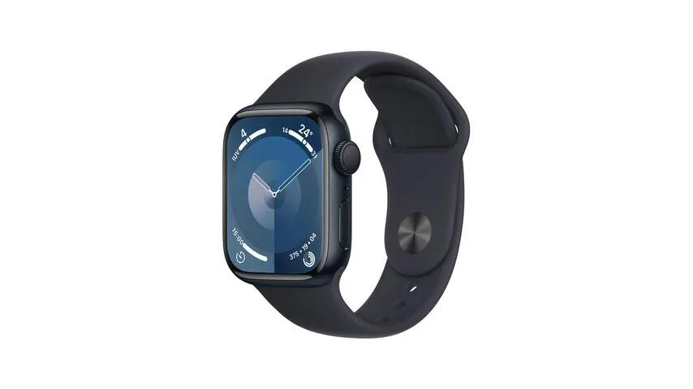
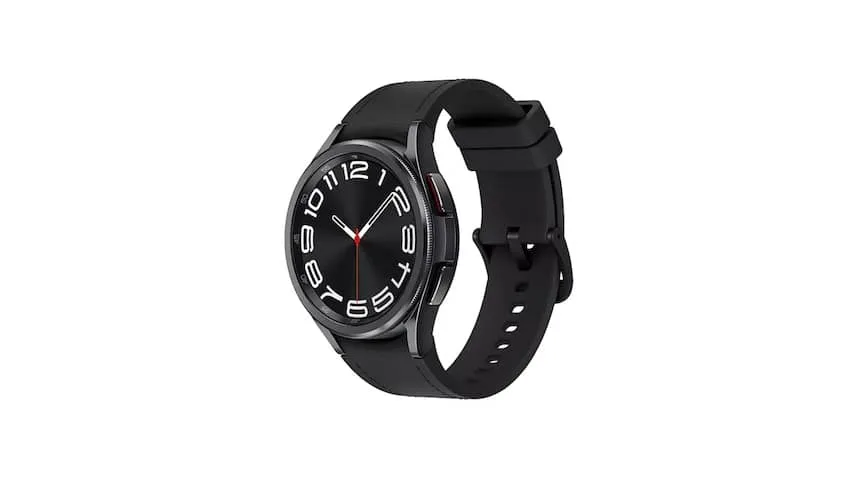

_Dit verhaal is een ingekorte versie van een [uitgebreide vergelijking die op Tweakers](https://tweakers.net/best-buy-guide/smartwatches/beste-allround-smartwatch) verscheen._

> [!NOTE]
> Dit artikel verscheen eerder op [NU.nl](https://www.nu.nl/slimmer-leven/6320990/de-beste-smartwatches-van-dit-moment.html).

We maken in dit artikel een specifiek onderscheid tussen horloges voor iPhone en voor Android. Dat heeft grotendeels met de software te maken: een Apple Watch werkt bijvoorbeeld alleen in combinatie met een Apple-telefoon.

## Beste koop voor iPhone: Apple Watch Series 9

_De beste smartwatches van dit moment — Beeld: Apple_

Dit is de recentste 'gewone' Apple Watch. Hij is er in twee maten en met en zonder 4G-internet. Dat laatste heb je alleen nodig als je online wil zijn zonder smartphone in de buurt.

De smartwatch heeft een snelle processor en een helder beeldscherm, dat altijd aanstaat en de tijd laat zien. Apple belooft dat je het horloge achttien uur op een dag kunt gebruiken, maar als je de speciale bespaarstand activeert, kun je dat oprekken naar dertig uur.

De Apple Watch Ultra heeft een langere accuduur, helderder scherm en een stevigere behuizing, wat het op papier het beste horloge maakt. Maar hij is ook vrij duur, terwijl je de Series 9 voor een redelijke 400 euro al kunt vinden. Dat maakt het voor ons nog steeds de algemene aanrader.

## Beste smartwatch voor Android: Samsung Galaxy Watch 6 Classic

_De beste smartwatches van dit moment — Beeld: Samsung_

Op Android-gebied is de Galaxy Watch 6 Classic van Samsung op dit moment onze aanrader. Hij is al een jaar te koop, waardoor de prijs flink is gedaald naar zo'n 230 euro. Dat maakt het ook een interessantere optie dan de nieuwere maar duurdere Galaxy Watch 7 of de Galaxy Watch Ultra.

Het is een prima allround-horloge met een groot, helder scherm. Bediening werkt snel en intuïtief en de gezondheids- en sportfuncties zijn uitgebreid. Samsung heeft bovendien een goede reputatie als het aankomt op software-updates, waardoor je nog jaren aan nieuwe updates kunt verwachten.

Ook de accu is dik in orde: bij onze tests hield hij het op één lading ruim anderhalve dag vol.
