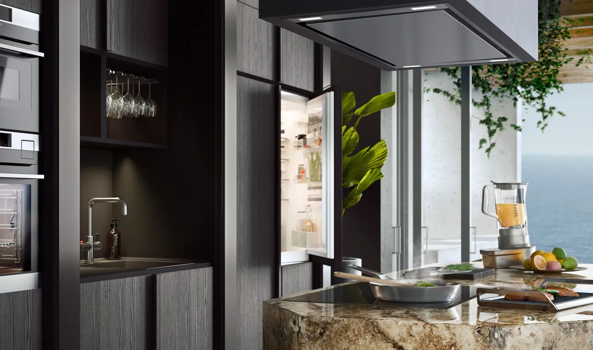
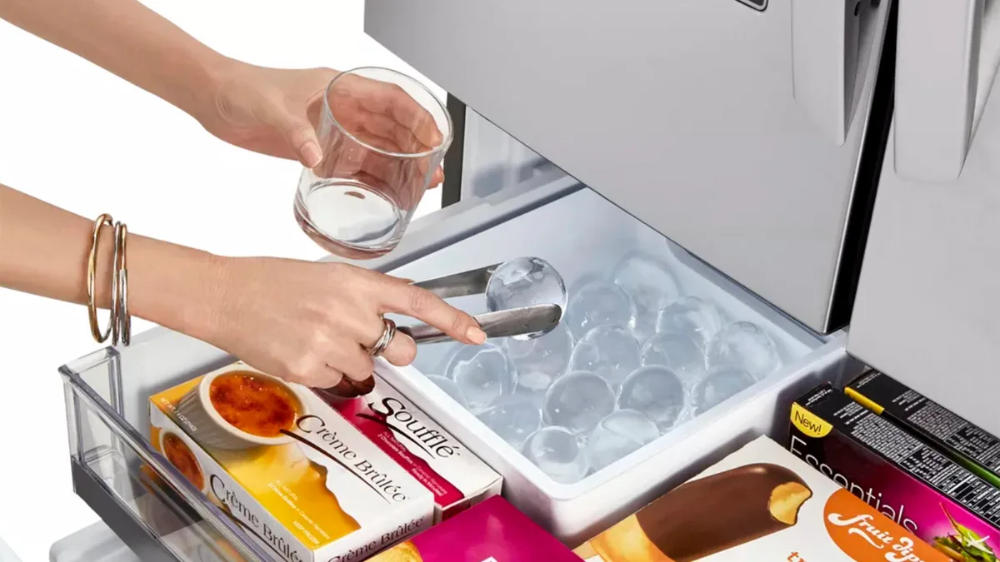
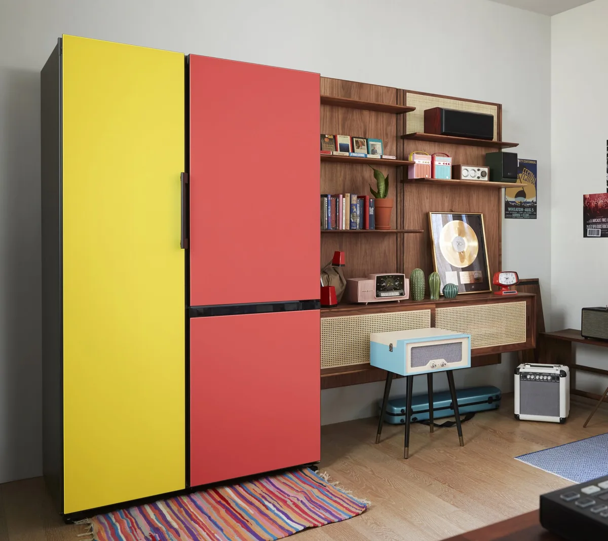

**Cool**

> [!NOTE]
> Dit artikel verscheen eerder op [Bright](https://www.bright.nl/nieuws/1123602/de-bijzonderste-koelkasten-op-technologiebeurs-ifa.html).

## AEG: koelkast met biertimer

AEG-fabrikant Electrolux heeft op IFA zijn eerste koelkast met de zogeheten MultiChill-functie getoond. In de deur van de koelkast zit een speciaal vak dat extra koel gemaakt kan worden, om bijvoorbeeld een flesje bier snel op temperatuur te krijgen. Koppel een smartphone-app aan de koelkast en je krijgt een bericht wanneer je drankje de gewenste temperatuur heeft bereikt - en dus nog niet is bevroren.

De koelkast heeft ook een camera in de binnenkant zitten, die foto's maakt van wat je allemaal koel hebt gezet. Zo kun je in de supermarkt zien wat je op voorraad hebt. Daarnaast gaat AEG de Santo RCB73831TY aanbieden - een koelkast die ook aan de binnenkant van roestvrijstaal is gemaakt.

## Bosch: foto's op koelkastdeuren

Bosch biedt al een tijdje de mogelijkheid om de Vario Style-koelkasten naar eigen smaak aan te passen, door een anders gekleurde deur te kopen. Vanaf 2020 gooit de fabrikant er een schepje bovenop door je een foto op de deuren te laten afdrukken. Dat kan een eigen familiefoto zijn, of een gestileerde plaat van grafisch ontwerper Simone Hutsch.

De Bosch-koeklkasten bieden daarnaast ook de mogelijkheid om de inhoud via een camera te bekijken. De bijbehorende app werkt met kunstamtige intelligentie, waardoor je automatisch meldingen krijgt als een populair product bijna op is. Daarnaast krijg je aanrader over hoe je de koelkast slimmer kan dichtbouwen.

> 

## LG: Perfect ronde ijsblokjes

We [schreven](https://www.bright.nl/nieuws/artikel/4829671/lg-koelkast-ronde-ijsklontjes-ijsbolletjes-bolletjes-vriezer) eind augustus al eens over de nieuwste koelkast van LG van maar liefst 4.000 euro. De belangrijkste functie: hij kan perfect ronde ijsblokjes invriezen. Die moeten een stuk beter koelen en minder smeltwater in je glas achterlaten. De koelkast van LG doet er 24 uur over om drie ballen te maken, waardoor het water langzaam en precies invriest en de vorm perfect blijft.

Ook LG laat koelkastbezitters naar binnen kijken met een camera, die op een schermpje aan de buitenkant bekeken kan worden. Daarnaast kan de koelkast aan slimme assistenten worden gekoppeld en vertelt de app zelfs wanneer je de koelkast verkeerd gebruikt.

## Samsung: Nieuwe designkoelkasten

De slimme koelkast van Samsung hoeven we inmiddels niet meer te bespreken: het bedrijf liet jaren geleden al zijn koelkast met touchscreen voor boodschappen en ingebouwde camera zien. Dit jaar introduceert de Koreaanse techgigant met zijn Bespoke-reeks weer wat nieuws. Deze speciale designkoelkasten kun je, net als die van Bosch, naar je eigen smaak aanpassen.

In het geval van Samsung gaat het specifiek om koelkasten die er in bestaande keukens uitzien als inbouwkoelkasten. Het bedrijf biedt modellen met één tot vier deuren, afhankelijk van de ruimte in de keuken.

## Volg de updates

Volg Bright op [Facebook](https://www.facebook.com/Bright.nl/), [Twitter](https://twitter.com/bright) en [Instagram](https://www.instagram.com/bright_nl) voor alle updates over de IFA. De beurs start officieel op vrijdag, maar de fabrikanten doen de meeste aankondigingen al in de dagen ervoor.

Later deze week zie je onze video's met allerlei nieuwe gadgets op het [Bright YouTube-kanaal](https://bit.ly/brighttv).
